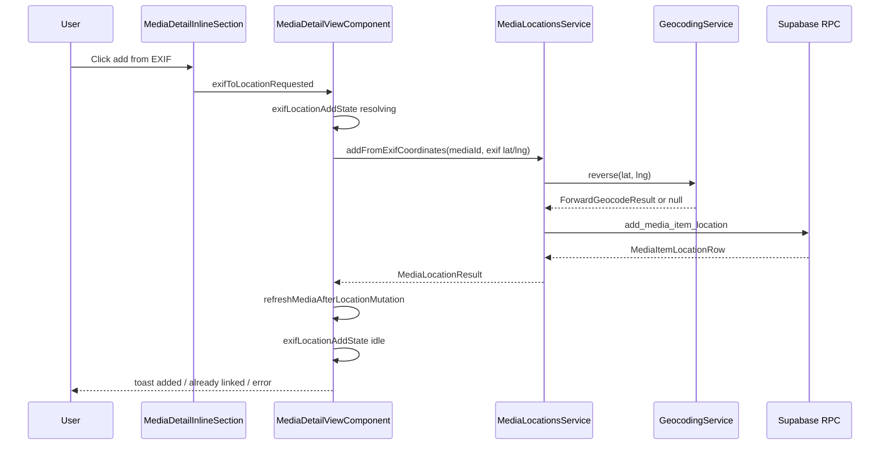
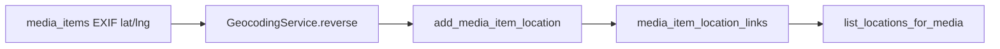

# Media Detail — Inline Section (Details block)

> **Parent:** [media-detail-view.md](media-detail-view.md)  
> **Sibling:** [media-detail-inline-editing.md](media-detail-inline-editing.md) (field-edit patterns)  
> **Location target:** [media-detail-location-section.md](media-detail-location-section.md)  
> **Service:** [media-locations-service.md](../../service/media-locations/media-locations-service.md)

## What It Is

Read-mostly **Details** rows under the quick-info chips: file type, **EXIF coordinates**, original filename, captured date, projects, and uploaded timestamp. Owns the **EXIF → location** affordance: reverse-geocode `media_items.exif_latitude` / `exif_longitude` and append a row in the Location section via `MediaLocationsService`.

Orchestration (geocode + RPC + list reload) lives in `MediaDetailViewComponent`; this component emits intent and renders row-level FSM.

## What It Looks Like

Standard five-slot `detail-row` grid (see `_detail-row-slots.scss`). EXIF row uses `photo_camera` icon, label "EXIF coordinates", monospace degree value on the right.

When EXIF GPS exists, **slot `l1`** shows a square ghost icon button (`add_location`, same rail as Captured/Projects edit). Slot `l2` stays a spacer. Full phrase **"Add as address to locations"** is exposed via `title` and `aria-label` (`workspace.imageDetail.action.addExifToLocations*`). Icon reveals on row hover/focus-within. While resolving, icon switches to `progress_activity` and the button is disabled.

When EXIF GPS is absent, `l2` stays an empty spacer; no button.

## Where It Lives

- **Code:** `apps/web/src/app/shared/workspace-pane/media-detail/media-detail-inline-section/`
- **Parent template:** `media-detail-view.component.html` (above Location section)
- **Appears when:** Media detail is open and `isImageLike()` is true

## Interaction emphasis

Dropdown picker rows (`.media-detail-inline-section__option--selected`) use [`state-visuals.md`](../../../design/state-visuals.md) § Interaction emphasis (selected ink at rest, primary on hover). **Tag chips** (`.projects-picker__chip`, file-type surfaces) keep domain colors — not this contract.

## Visual Behavior Contract

### Ownership matrix

| Behavior | Visual geometry owner | Stacking context owner | Interaction hit-area owner | Selector(s) | Layer | Test oracle |
| --- | --- | --- | --- | --- | --- | --- |
| EXIF row layout | `.detail-row` (EXIF branch) | `.detail-row` | `.detail-row__center` | `.detail-row--readonly` | content | mono coords right-aligned |
| Add-from-EXIF control | `.detail-row-action--l2` | `.detail-row` | `.detail-row-action--l2` button | `add_location` icon | actions | click starts resolve |
| Resolving emphasis | `.detail-row-action--l2` | `.detail-row` | same button | `progress_activity` icon | actions | disabled + busy |
| Original-folder row layout | `.detail-row` (path branch) | `.detail-row` | `.detail-row__center` | `.detail-row--path-location-add` | content | path truncates, title shows full |
| Original-file-name row layout | `.detail-row` (path branch) | `.detail-row` | `.detail-row__center` | `.detail-row--path-location-add` | content | name truncates, title shows full |
| Add-from-path control | `.detail-row-action--l1` | `.detail-row` | `.detail-row-action--l1` button | `add_location` icon | actions | click emits the row's source |
| Path resolving emphasis | `.detail-row-action--l1` | `.detail-row` | same button | `progress_activity` icon | actions | disabled + busy |

### Ownership triad (EXIF add control)

| Behavior | Geometry | State | Visual | Same element? |
| --- | --- | --- | --- | --- |
| Add icon button | `.detail-row-action--l2` | `[attr.data-state]` on EXIF `.detail-row` | `.detail-row-action--l2` | ✅ |

### Pseudo-CSS (EXIF row)

```css
.detail-row--exif-location-add[data-state='resolving'] .detail-row-action--l2:is(button) { pointer-events: none; }
.detail-row--exif-location-add[data-state='hidden'] .detail-row-action--l2 { visibility: hidden; }
```

### Ownership triad (path add control)

| Behavior | Geometry | State | Visual | Same element? |
| --- | --- | --- | --- | --- |
| Add icon button | `.detail-row-action--l1` | `[attr.data-state]` on the path `.detail-row` | `.detail-row-action--l1` | ✅ |

### Pseudo-CSS (path rows)

```css
.detail-row--path-location-add[data-state='resolving'] .detail-row-action--l1:is(button) { pointer-events: none; }
.detail-row--path-location-add[data-state='hidden'] .detail-row-action--l1 { visibility: hidden; }
```

> **Slot correction, 2026-09-20.** The EXIF tables above say `--l2`; the component has always
> rendered that button in `--l1` (`media-detail-inline-section.component.html`). The path rows use
> `--l1` for the same reason — it is the slot adjacent to the row centre — and the EXIF rows above
> are left as written rather than silently edited, per the append-not-rewrite rule. Treat `--l1` as
> the authority for both.

## Actions

| # | User action | System response | Triggers |
| --- | --- | --- | --- |
| 1 | Clicks **Add as address to locations** on EXIF row | Parent reverse-geocodes EXIF lat/lng, then `add_media_item_location` (or links deduped row) | `exifToLocationRequested` output |
| 2 | EXIF GPS missing | No button; row read-only | — |
| 3 | Click while parent `saving()` or row `resolving` | Ignored (disabled) | — |
| 4 | Geocode succeeds | Location list reload; success toast `location.toast.added` | parent handler |
| 5 | Geocode fails | Still creates/links location with EXIF coords; address fields null or coord fallback label | `addFromExifCoordinates` partial path |
| 6 | Deduped location already linked | Idempotent link; toast `location.picker.already_linked` when parent detects duplicate link | compare returned `location.id` to list |
| 7 | Clicks **Add as location** on the Original folder row | Parent plans and runs bulk resolution on a selection of one, source `folder` | `pathToLocationRequested` output, payload `'folder'` |
| 8 | Clicks **Add as location** on the Original file name row | Same, source `filename` | `pathToLocationRequested` output, payload `'filename'` |
| 9 | Item already has a location (`resolved` / `gps`) | No add button on either path row | `pathLocationAddStateFor` → `hidden` |
| 10 | Row has no text (no `relative_path`, no `original_filename`) | No add button on that row | `pathLocationAddStateFor` → `hidden` |
| 11 | The chosen source carries no readable address | Nothing written; toast `…toast.pathLocationNoAddress` | planner reports `no_address_in_source` |
| 12 | Click while the other path row is resolving | Ignored — one run per item at a time | parent guard on `pathLocationAddResolving` |

## EXIF → location FSM

Normative state enum: `ExifLocationAddState = 'hidden' | 'idle' | 'resolving'`.

Host: EXIF `.detail-row` exposes `[attr.data-state]="exifLocationAddState()"`.

| State | Visual | Allowed transitions |
| --- | --- | --- |
| `hidden` | No add button (`l2` spacer) | → `idle` when `hasExifCoordinates` |
| `idle` | Compact add button enabled (unless parent saving) | → `resolving` on click |
| `resolving` | Button disabled; busy indicator | → `idle` on terminal success or error |

### Transition map (TypeScript authority)

```ts
const EXIF_LOCATION_ADD_TRANSITIONS: Record<ExifLocationAddState, ExifLocationAddState[]> = {
  hidden: ['idle'],
  idle: ['resolving'],
  resolving: ['idle'],
};
```

Parent owns transition calls; child displays `exifLocationAddState` input derived from parent signal during async work.

### Transition choreography

| Edge | Duration token | Notes |
| --- | --- | --- |
| `idle` → `resolving` | instant | disable button |
| `resolving` → `idle` | instant | re-enable after RPC + reload |

## Path → location FSM

Normative state enum: `PathLocationAddState = 'hidden' | 'idle' | 'resolving'`.

**Deliberately the same three states as the EXIF FSM.** One row action that adds a location should
not behave differently depending on which evidence it reads, so a failure toasts and returns to
`idle` rather than introducing a fourth state that reports the same outcome a second way.

Host: each path `.detail-row` exposes `[attr.data-state]` from its own state input
(`folderLocationAddState` / `filenameLocationAddState`).

| State | Visual | Allowed transitions |
| --- | --- | --- |
| `hidden` | No add button (`l1` spacer) | → `idle` when the row has text **and** the item has no location |
| `idle` | Compact add button enabled (unless parent saving) | → `resolving` on click |
| `resolving` | Button disabled; busy indicator | → `idle` on terminal success or error |

### Transition map (TypeScript authority)

```ts
const PATH_LOCATION_ADD_TRANSITIONS: Record<PathLocationAddState, PathLocationAddState[]> = {
  hidden: ['idle'],
  idle: ['resolving'],
  resolving: ['idle'],
};
```

### Visibility derivation (normative)

`pathLocationAddStateFor({ evidenceLabel, locationStatus, resolving })`, in this order:

1. `evidenceLabel` empty or whitespace → `hidden`.
2. `isBulkEligibleStatus(locationStatus)` false → `hidden`. **The same predicate bulk resolution
   uses** — duplicating the status list here is how the two would come to disagree about
   `unresolvable`.
3. `resolving` → `resolving`, else `idle`.

`hidden` outranks `resolving` on purpose: once the run has written a location, row 9 applies
immediately, even before the in-flight flag clears. The other order would briefly re-offer an
action that overwrites what the run just wrote.

**What this FSM does not decide.** Whether the chosen source actually yields an address is
`planBulkResolution`'s job. Pre-hiding the action on that basis would be a second evidence
derivation in the UI, and the two would drift.

### Transition choreography

| Edge | Duration token | Notes |
| --- | --- | --- |
| `idle` → `resolving` | instant | disable both path rows' buttons |
| `resolving` → `idle` | instant | re-enable after the run + reload |

## Component hierarchy

```
MediaDetailInlineSection
└── detail-section "Details"
    ├── Type row (readonly)
    ├── EXIF row [image-like only]
    │   ├── l2: Add as address to locations (FSM)
    │   └── center: icon + label + mono coords
    ├── Original filename (readonly)
    ├── Captured (editable)
    ├── Projects (editable)
    └── Uploaded (readonly)
```

## Wiring


```mermaid
sequenceDiagram
  participant User
  participant Inline as MediaDetailInlineSection
  participant View as MediaDetailViewComponent
  participant MLS as MediaLocationsService
  participant Geo as GeocodingService
  participant DB as Supabase RPC

  User->>Inline: Click add from EXIF
  Inline->>View: exifToLocationRequested
  View->>View: exifLocationAddState resolving
  View->>MLS: addFromExifCoordinates(mediaId, exif lat/lng)
  MLS->>Geo: reverse(lat, lng)
  Geo-->>MLS: ForwardGeocodeResult or null
  MLS->>DB: add_media_item_location
  DB-->>MLS: MediaItemLocationRow
  MLS-->>View: MediaLocationResult
  View->>View: refreshMediaAfterLocationMutation
  View->>View: exifLocationAddState idle
  View-->>User: toast added / already linked / error
```

## Data requirements

| Source | Fields | Use |
| --- | --- | --- |
| `media_items` | `exif_latitude`, `exif_longitude` | Reverse-geocode input only (immutable EXIF) |
| `MediaLocationsService.addFromExifCoordinates` | — | New facade: reverse + `addLocation` / `addFromGeocodeSuggestion` |
| `list_locations_for_media` | — | Post-mutation reload (parent exit criterion) |


```mermaid
flowchart LR
  EXIF[media_items EXIF lat/lng] --> Rev[GeocodingService.reverse]
  Rev --> Add[add_media_item_location]
  Add --> Link[media_item_location_links]
  Link --> List[list_locations_for_media]
```

## State (component inputs/outputs)

| Name | Type | Default | Controls |
| --- | --- | --- | --- |
| `exifLocationAddState` | `ExifLocationAddState` | `hidden` | `[attr.data-state]` on EXIF row |
| `saving` | `boolean` | `false` | Disables add button in `idle` |
| `hasExifCoordinates` | computed | false | `hidden` vs `idle` |
| `exifToLocationRequested` | output | — | Parent starts pipeline |
| `folderLocationAddState` | `PathLocationAddState` | `hidden` | `[attr.data-state]` on the Original folder row |
| `filenameLocationAddState` | `PathLocationAddState` | `hidden` | `[attr.data-state]` on the Original file name row |
| `pathToLocationRequested` | `output<PathLocationAddSource>` | — | Parent runs bulk resolution on one item |

## File map

| File | Purpose |
| --- | --- |
| `media-detail-inline-section.component.ts/html/scss` | EXIF row + FSM display |
| `media-detail-view.component.ts` | Handler + `exifLocationAddState` signal |
| `media-locations.service.ts` | `addFromExifCoordinates` |
| `media-detail-path-location-add.state.ts` | Path FSM + `pathLocationAddStateFor` |
| `core/media-location-bulk/bulk-resolution.service.ts` | The engine the single-item action runs on a selection of one |
| `_detail-row-slots.scss` | Shared square action rail (no EXIF-specific modifier) |
| `translation-workbench.csv` | i18n keys |

## i18n keys

| Key | English fallback |
| --- | --- |
| `workspace.imageDetail.action.addExifToLocations` | Add as address to locations |
| `workspace.imageDetail.action.addExifToLocations.aria` | Add reverse-geocoded address from EXIF coordinates to locations |
| `workspace.imageDetail.toast.exifLocationAdded` | Location added from EXIF coordinates |
| `workspace.imageDetail.toast.exifLocationGeocodeFailed` | Address could not be resolved; location saved with GPS coordinates only |
| `workspace.imageDetail.action.addFolderToLocations` | Add as location |
| `workspace.imageDetail.action.addFolderToLocations.aria` | Resolve a location from this folder path and add it |
| `workspace.imageDetail.action.addFilenameToLocations` | Add as location |
| `workspace.imageDetail.action.addFilenameToLocations.aria` | Resolve a location from this file name and add it |
| `workspace.imageDetail.toast.pathLocationAdded` | Location added |
| `workspace.imageDetail.toast.pathLocationNoAddress` | No address could be read from this path |
| `workspace.imageDetail.toast.pathLocationAlreadyResolved` | This item already has a location |
| `workspace.imageDetail.toast.pathLocationFailed` | Location could not be resolved from this path |

## Acceptance criteria

- [ ] EXIF row shows `add_location` icon in `l2` when `exif_latitude` and `exif_longitude` are set
- [ ] Click runs reverse geocode on EXIF coords (not corrected/display coords)
- [ ] Success appends a location row and refreshes list + merged `media()` display fields
- [ ] `resolving` disables the button until the parent handler finishes
- [ ] Reverse geocode failure still persists a location with EXIF lat/lng
- [ ] Already-linked deduped location shows `location.picker.already_linked` toast
- [ ] FSM transition map matches `EXIF_LOCATION_ADD_TRANSITIONS`
- [ ] Stable-state comments in TS/HTML/SCSS reference this spec
- [x] Path rows show `add_location` in `l1` only when the row has text **and** the item is unlocated
- [x] `resolved` / `gps` hide both path add buttons (no silent overwrite)
- [x] `unresolvable` and `partial` still offer the action
- [x] `hidden` outranks `resolving` when the item gains a location mid-run
- [x] Path FSM transition map matches `PATH_LOCATION_ADD_TRANSITIONS`
- [ ] A single-item run and a bulk run over the same folder write the same location — **not yet
      verified against a live database**; the engine is shared by construction, which is an argument,
      not a measurement
