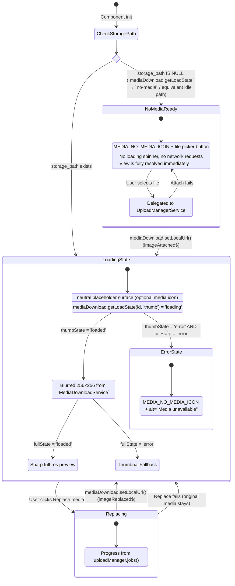
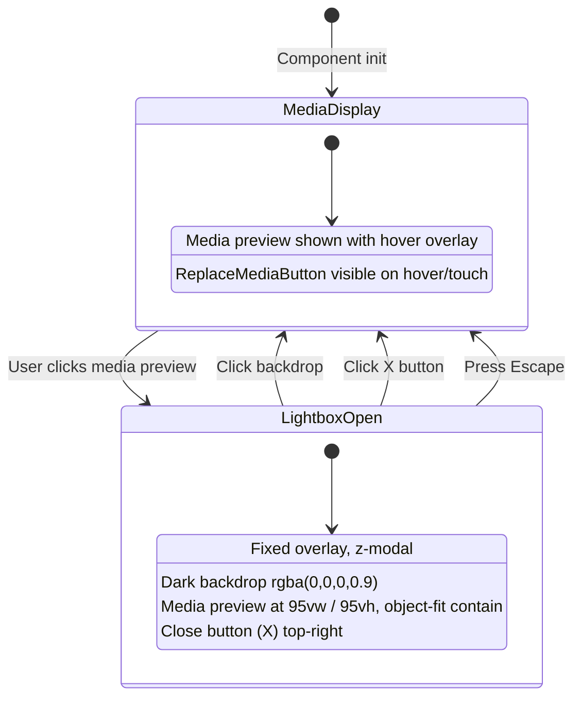
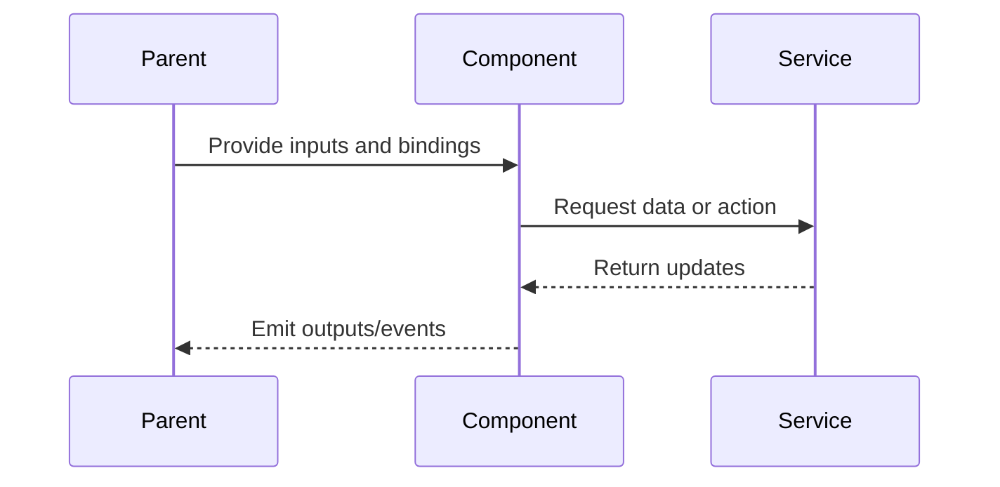

# Media Detail — Media Viewer

> **Parent spec:** [media-detail-view](media-detail-view.md)
> **Architecture parent:** [media-download-service](../../service/media-download-service/media-download-service.md)
> **Media loading service (runtime class):** `apps/web/src/app/core/media-download/media-download.service.ts` (`MediaDownloadService`; signing/cache via `SignedUrlCacheAdapter` → `SupabaseStorageAdapter`)
> **Media loading use cases:** [use-cases/media-loading.md](../../../use-cases/media-loading.md)
> **Media editing use cases:** [use-cases/image-editing.md](../../../use-cases/image-editing.md) (IE-10)

## Terminology (symbols and product language)

| Symbol | Role |
| --- | --- |
| `hasPhoto`, `imageReady`, `isImageLoading` | **Viewer inputs** — legacy names; prose: **media** present / ready / loading. |
| `imageReplaced$`, `imageAttached$` | **`UploadManagerService`** streams — ids refer to **media items**; see [symbol rename backlog](../../../backlog/media-photo-symbol-rename-roadmap.md). |
| `mediaDownload` | Injected **`MediaDownloadService`** (parent/detail wiring); facade delegates signing/cache to **`SignedUrlCacheAdapter`** (via **`SupabaseStorageAdapter`**). |
| `MediaLoadState`, `'no-media'`, `'loaded'`, … | Per-tier load signals from **`getLoadState`** (`media-download.types.ts`); canonical **no storage path** value is **`'no-media'`** (not legacy `'no-photo'`). |
| `MEDIA_PLACEHOLDER_ICON`, `MEDIA_NO_MEDIA_ICON` | Canonical placeholder / broken-media glyphs exported from **`MediaDownloadService`** module. |

## What It Is Handles progressive media loading (placeholder → thumbnail/preview → full-res), lightbox enlargement, and media replacement/upload for records without a media file. For document-like media and sufficiently large viewer slots, it can render generated first-page thumbnails through the same progressive pipeline before deterministic fallback. Delegates all signed-URL generation and load-state tracking to `MediaDownloadService`; delegates file uploads to `UploadManagerService`.
It uses the same `MediaDownloadService` cache namespace as map markers and `/media` tiles, so previously loaded media can be shown immediately without surface-local reload logic.

## What It Looks Like

A rounded-corner media surface (`--radius-lg`) centered with side margins (`--spacing-4`). Fixed to approximately **1/3 of viewport height** (`max-height: 33vh`), 4:3 aspect ratio. On hover, a subtle `--color-primary` ring appears. A replace-media edit-icon button sits in the **top-right corner**, overlaid with a semi-transparent dark scrim (`rgba(0,0,0,0.5)`), visible on hover (desktop) or always (touch). When `storage_path IS NULL`, an upload prompt/placeholder is shown instead.

## Where It Lives

- **Parent**: `MediaDetailViewComponent` — placed in MediaColumn (wide layout) or top of SingleColumnLayout (narrow)
- **Appears when**: Media detail view is open

## Actions

| #   | User Action                                             | System Response                                                                                                                                                                             | Triggers                        |
| --- | ------------------------------------------------------- | ------------------------------------------------------------------------------------------------------------------------------------------------------------------------------------------- | ------------------------------- |
| 1   | Clicks media preview                                    | Opens full-screen lightbox overlay (dark backdrop, `rgba(0,0,0,0.9)`). Media preview at `95vw / 95vh`, `object-fit: contain`. Close button (X) top-right.                                   | Lightbox opens                  |
| 2   | Clicks lightbox backdrop / X                            | Closes lightbox                                                                                                                                                                             | Lightbox closes                 |
| 3   | Presses Escape in lightbox                              | Closes lightbox                                                                                                                                                                             | Lightbox closes                 |
| 4   | Clicks replace-media button                             | Opens file picker; delegates to `uploadManager.replaceFile(mediaId, file)`                                                                                                                  | `replacing` → true              |
| 5   | Replace upload succeeds                                 | `imageReplaced$` fires → `UploadManagerService` calls `mediaDownload.setLocalUrl(mediaId, blobUrl)` → all surfaces see new media instantly → service re-signs on next access                    | `replacing` → false             |
| 6   | Replace upload fails                                    | Inline error below media surface; no DB/storage changes                                                                                                                                     | `replaceError` set              |
| 7   | Clicks upload button (no media)                         | Opens file picker; delegates to `uploadManager.attachFile(mediaId, file)`                                                                                                                   | Attach pipeline starts          |
| 8   | Attach upload succeeds                                  | `imageAttached$` fires → `UploadManagerService` calls `mediaDownload.setLocalUrl(mediaId, blobUrl)` → switches from upload placeholder to media display                                         | Media display shown             |
| 9   | Right-clicks detail thumbnail                           | Opens the same detail context action menu as the header 3-dot trigger                                                                                                                       | Detail context menu             |
| 10  | Same media was loaded by marker or `/media`             | Detail viewer reuses cached URL tier immediately (warm preview or sharp), then upgrades in background when needed                                                                           | Shared `MediaDownloadService` cache |
| 11  | Opens document detail with generated first-page preview | Viewer requests signed preview URL from `document_preview_path` through `MediaDownloadService`, shows preview when available, then keeps cache/tier-upgrade behavior consistent across surfaces | Document preview pipeline       |

## Component Hierarchy

```
MediaViewer                                ← object-fit: contain, background: #111
├── [not loaded] Placeholder               ← neutral surface placeholder
├── [tier 2] ThumbnailPreview              ← 256×256 signed URL (blurred via CSS filter)
├── [tier 3] FullResPreview                ← original res, crossfades over thumbnail
├── [hover / touch] ReplaceMediaButton     ← edit icon, scrim overlay, top-right
├── [no storage_path] UploadPrompt         ← Placeholder with file picker button
└── [lightbox open] LightboxOverlay        ← fixed, dark backdrop, z-modal
    ├── FullResPreview                     ← 95vw / 95vh, object-fit: contain
    └── CloseButton (X)                    ← top-right
```

## State Machine

Load-state tracking is delegated to `MediaDownloadService`. The component reads `mediaDownload.getLoadState(mediaId, size)` signals and maps them to visual tiers.



### No-Media Fast Path

When `storage_path IS NULL`, the MediaViewer **immediately** enters the `NoMediaReady` state:

- No CSS loading placeholder is shown
- No signed URL requests are made
- No loading spinner or "Loading…" text appears
- The upload prompt is the **final resolved state** — not a loading intermediate
- The parent detail-view loading signal is `false` as soon as the record fetch completes

This prevents records without media from appearing stuck in a perpetual loading state.

## Progressive Media Loading

Tier narrative, sequence diagrams, and PL references: **[media-detail-media-viewer.progressive-loading.supplement.md](./media-detail-media-viewer.progressive-loading.supplement.md)**.

## MediaViewer Sizing

| Layout | Rule                                                                                                    |
| ------ | ------------------------------------------------------------------------------------------------------- |
| Wide   | `height: 100%`, `max-height: calc(100vh - 60px)`, `object-fit: contain`, `background: #111` (letterbox) |
| Narrow | `width: 100%`, `max-height: 55vw`, `object-fit: contain`                                                |

## Lightbox



## State

| Name                      | Type                     | Default | Controls                                                                           |
| ------------------------- | ------------------------ | ------- | ---------------------------------------------------------------------------------- |
| `thumbState`              | `Signal<MediaLoadState>` | —       | Read from `mediaDownload.getLoadState(mediaId, 'thumb')` — drives placeholder/thumb    |
| `fullState`               | `Signal<MediaLoadState>` | —       | Read from `mediaDownload.getLoadState(mediaId, 'full')` — drives full-res crossfade    |
| `lightboxOpen`            | `boolean`                | `false` | Whether lightbox overlay is visible                                                |
| `replacing`               | `boolean`                | `false` | Whether a replace operation is in progress                                         |
| `replaceError`            | `string \| null`         | `null`  | Error message if replace failed                                                    |
| `documentPreviewEligible` | `boolean`                | `false` | Whether viewer slot size and file type allow first-page document preview rendering |

> **Removed:** `fullResLoaded`, `thumbLoaded`, `heroSrc` — replaced by `MediaLoadState` signals from `MediaDownloadService`. The component no longer manages signed URLs or loading booleans directly.

## Wiring

### Wiring Flow (Mermaid)



- Injects `MediaDownloadService` — calls `getSignedUrl(path, 'thumb')`, `getSignedUrl(path, 'full')`, `preload(url)`, and reads `getLoadState(mediaId, size)` signals. **Does not call Supabase Storage directly.**
- For document-like media with generated first-page preview, resolves `document_preview_path` first and signs through the same `MediaDownloadService` tier/cache flow used by other media paths.
- Uses `MEDIA_NO_MEDIA_ICON` as canonical error/no-media visual and may use `MEDIA_PLACEHOLDER_ICON` as optional loading glyph; neutral media placeholder remains valid baseline.
- Injects `UploadManagerService` — calls `replaceFile()` or `attachFile()`. Does **not** manage upload lifecycle directly.
- Injects `UploadService` for file validation (`validateFile()`) and MIME type constants.
- Subscribes to `imageReplaced$` / `imageAttached$` to detect state transitions — signed URL refresh is handled by `MediaDownloadService` (via `setLocalUrl` / `revokeLocalUrl`).
- Injects `WorkspaceViewService` to update the grid cache after Replace media.

## Acceptance Criteria

### MediaDownloadService Integration

- [x] All signed-URL generation delegated to `MediaDownloadService` — component never calls `supabase.client.storage.from('media').createSignedUrl` directly
- [x] Tier 2 thumbnail obtained via `mediaDownload.getSignedUrl(thumbPath, 'thumb')` with `{ width: 256, height: 256, resize: 'cover' }` transform
- [x] Tier 3 full-res obtained via `mediaDownload.getSignedUrl(storagePath, 'full')` with no transform
- [x] Full-res preloaded via `mediaDownload.preload(fullUrl)` before crossfade
- [x] Component reads `mediaDownload.getLoadState(mediaId, 'thumb')` and `mediaDownload.getLoadState(mediaId, 'full')` signals — no local `thumbLoaded` / `fullResLoaded` booleans
- [ ] Cache namespace is shared with map markers and `/media` items so the same media identity resolves to the same cached URL set across surfaces.
- [ ] For document-like media with `document_preview_path`, signed URL generation and load-state resolution use the same `MediaDownloadService` flow (tier, cache, staleness, re-signing).
- [x] When `storage_path IS NULL`: `mediaDownload.getLoadState()` returns `'no-media'` → upload prompt shown immediately, no signed URL requests
- [x] Loading/idle placeholder supports neutral media surface baseline; optional `MEDIA_PLACEHOLDER_ICON` usage is allowed for consistency where needed
- [x] Uses `MEDIA_NO_MEDIA_ICON` from `MediaDownloadService` for error/no-media state (crossed-out image, 0.55 opacity)
- [ ] Placeholder visuals are identical across media detail viewer, thumbnail cards, and map markers

### Progressive Loading

- [x] When `storage_path IS NULL`: parent view `loading` resolves to `false` as soon as record fetch completes
- [x] When `storage_path` exists: neutral media placeholder shown immediately (spinner-free)
- [x] Tier 2 thumbnail (256×256 transform) loads and replaces placeholder with slight blur
- [x] Full-res preview loads and crossfades over blurred thumbnail
- [x] If full-res fails (`fullState = 'error'`), Tier 2 thumbnail stays visible
- [x] If both tiers fail, `MEDIA_NO_MEDIA_ICON` shown with `alt="Media unavailable"`
- [x] Component forwards measured viewer slot size in `rem` to orchestrator for adaptive tier selection
- [ ] For document-like media with eligible viewer size, generated first-page preview is used before icon fallback when `document_preview_path` exists.

### Upload Integration

- [x] Edit icon overlay on hero media preview opens file picker
- [x] File validated before upload (size + MIME type via `UploadService.validateFile()`)
- [x] Delegates to `UploadManagerService.replaceFile(mediaId, file)` — does not manage upload lifecycle directly
- [x] Spinner/progress shown by reading job state from `uploadManager.jobs()` signal
- [x] On `imageReplaced$`: `UploadManagerService` calls `mediaDownload.setLocalUrl(mediaId, blobUrl)` → all surfaces update instantly
- [x] On `imageAttached$`: `UploadManagerService` calls `mediaDownload.setLocalUrl(mediaId, blobUrl)` → component transitions from upload prompt to media preview
- [x] `localObjectUrl` freed via `mediaDownload.revokeLocalUrl()` after signed URL takes over — no memory leaks
- [x] Upload survives component destruction (user can navigate away mid-replace)

### General

- [x] Lightbox opens on media-preview click with dark backdrop
- [x] Lightbox closes on X, backdrop click, or Escape

