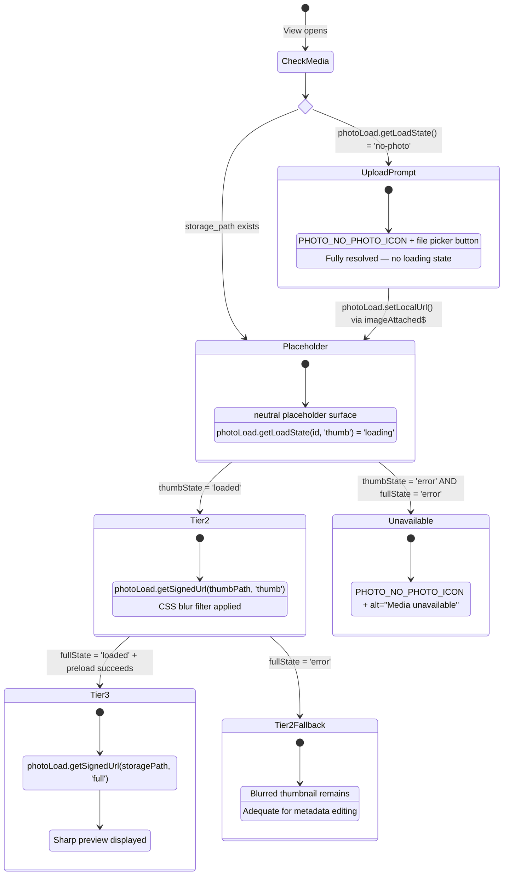
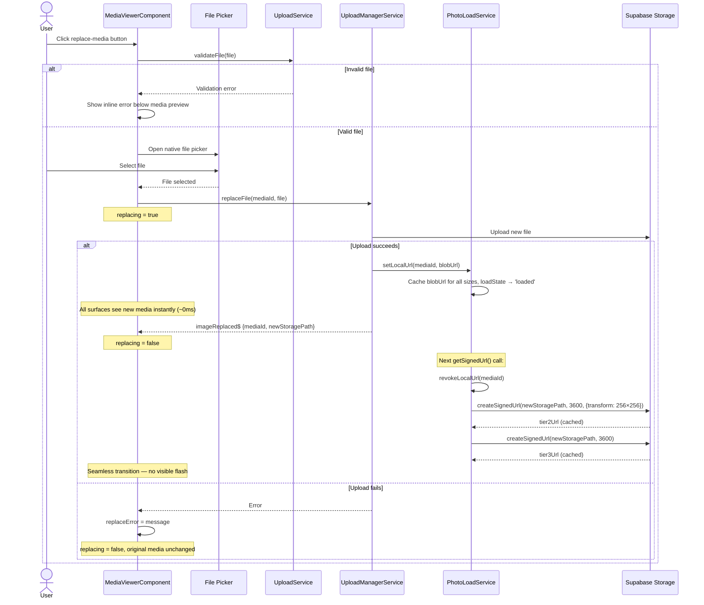
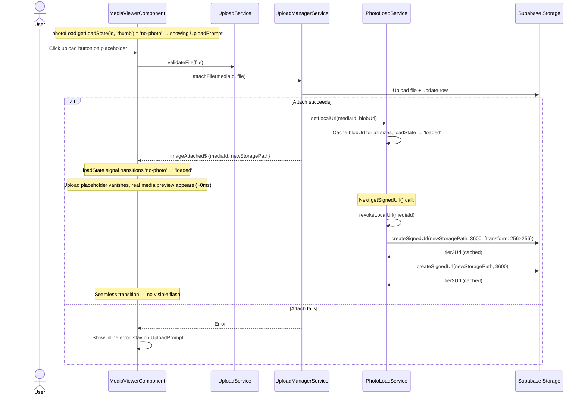

# media detail media viewer.progressive loading.supplement

> Parent: [`media-detail-media-viewer.md`](./media-detail-media-viewer.md)

## Progressive Media Loading

Three-tier strategy to show content as fast as possible, fully delegated to `PhotoLoadService`. **Only invoked when `storage_path` exists.** When `storage_path IS NULL`, `photoLoad.getLoadState()` returns `'no-photo'` immediately and the component shows the upload prompt (see [No-Media Fast Path](#no-media-fast-path) above).

Adaptive tier policy: the component measures the active viewer slot, converts dimensions to `rem`, and forwards them to `MediaOrchestratorService.selectRequestedTierForSlot(...)` to derive the requested tier for this render cycle. Service logic remains UI-agnostic and must not access DOM directly.

1. **Check** → `photoLoad.getLoadState(mediaId, 'thumb')` returns `'no-photo'` → skip to upload prompt
2. **Warm cache lookup** → `photoLoad.getBestCachedUrl(mediaId, requestedTier)`; if found, render immediately as warm preview
3. **View opens with media and no cache hit** → neutral CSS placeholder shown (no network)
4. **Tier 2** → `photoLoad.getSignedUrl(thumbPath, 'thumb')` → service returns cached or freshly signed URL
5. Thumbnail `` loads → replaces placeholder with slight blur filter
6. **Tier 3** → `photoLoad.getSignedUrl(storagePath, 'full')` → service returns full-res URL
7. `photoLoad.preload(fullUrl)` → hidden preload → crossfade swaps it in
8. If Tier 3 fails (`fullState = 'error'`), Tier 2 remains visible (adequate quality for metadata editing)
9. If both fail, `PHOTO_NO_PHOTO_ICON` shown with `alt="Media unavailable"`

### Signed URL Strategy (via PhotoLoadService)

The component never calls Supabase Storage directly. All signing is delegated to `PhotoLoadService`:

- **Document preview path:** for eligible document-like media, viewer resolves `document_preview_path` first (when present) and signs via `photoLoad.getSignedUrl(document_preview_path, tier)` using the same cache namespace as other media
- **Tier 2:** `photoLoad.getSignedUrl(thumbnail_path ?? storage_path, 'thumb')` → service applies `{ width: 256, height: 256, resize: 'cover' }` transform
- **Tier 3:** `photoLoad.getSignedUrl(storage_path, 'full')` → service returns original resolution (no transform)
- **Preload:** `photoLoad.preload(fullUrl)` → hidden `Image()` element confirms download before crossfade
- **Caching:** Service handles cache lookup, staleness (50 min threshold), and re-signing — component does not manage URL expiry

### Replace Media — Loading Restart

When `imageReplaced$` fires:

1. `UploadManagerService` calls `photoLoad.setLocalUrl(mediaId, blobUrl)` → blob URL injected into service cache at all sizes → all surfaces see the new media instantly (~0ms)
2. Component reads `photoLoad.getLoadState(mediaId, 'thumb')` / `photoLoad.getLoadState(mediaId, 'full')` — both show `'loaded'` (blob URL)
3. On next access, `photoLoad.invalidate(mediaId)` clears blob → service re-signs Tier 2 and Tier 3 from new `storagePath`
4. `photoLoad.revokeLocalUrl(mediaId)` frees the `ObjectURL` memory
5. Seamless transition — no visible flash between blob and signed URL

### Attach Media — Placeholder to Media

When `imageAttached$` fires:

1. `UploadManagerService` calls `photoLoad.setLocalUrl(mediaId, blobUrl)` → blob URL injected at all sizes, `loadState` → `'loaded'`
2. Component detects state transition from `'no-photo'` → `'loaded'` → switches from upload prompt to media display
3. All surfaces see the new media instantly via the service's shared cache
4. On next access, service re-signs from new `storagePath` and calls `revokeLocalUrl()` to free memory

> See [PL-7 / PL-8](../../../use-cases/media-loading.md#pl-7-replace-photo--loading-state-reset) for detailed sequence diagrams.

