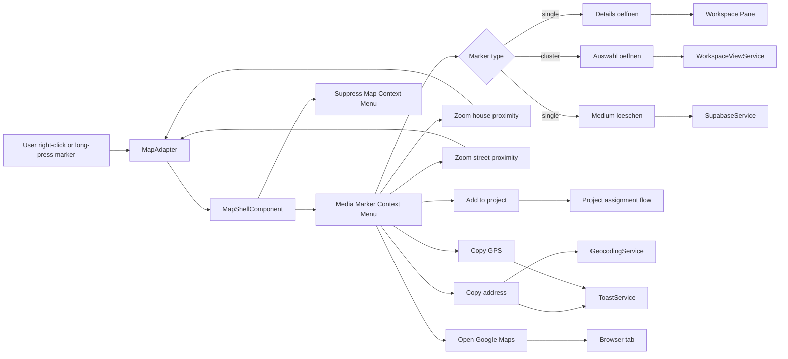
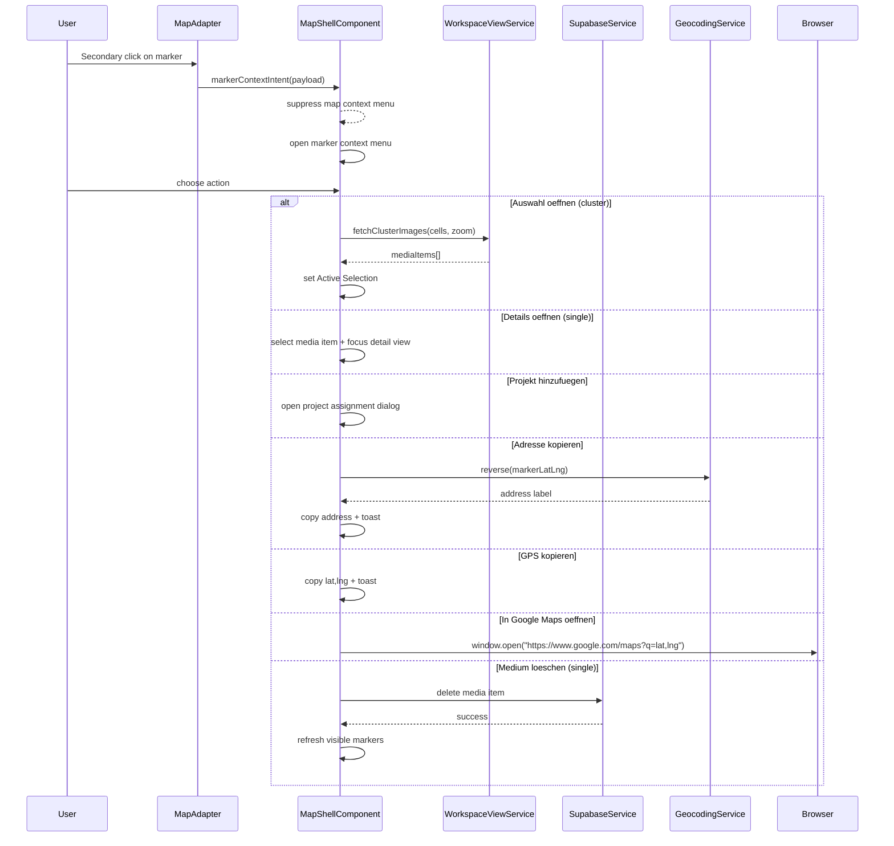

# Media Marker Context Menu

> **Use cases:** [use-cases/media-marker-context-menu.md](../../../use-cases/media-marker-context-menu.md)
> **System spec:** [map-secondary-click-system](map-secondary-click-system.md)

## What It Is

A contextual action menu opened on a media marker (single item or cluster) via right-click on desktop or long-press on touch. It enables marker-scoped actions without navigating away from the map.

Primary use cases are: quick inspection (`Details oeffnen` / `Auswahl oeffnen`), fast focus zoom (`house` / `street` proximity), project assignment (`Projekt hinzufuegen`), utility copy/open actions (`Adresse`, `GPS`, `Google Maps`), and destructive cleanup (`Medium loeschen` for single-item markers only).

## What It Looks Like

Desktop uses a compact popover anchored to the marker hit zone. Mobile uses a bottom action sheet with the same action order. The surface follows the shared dropdown shell: `--color-bg-elevated`, `1px` border (`--color-border`), `--elevation-dropdown`, `--radius-lg`. Action rows use `.dd-item` primitives with `2.75rem` (44px) minimum row height and `0.8125rem` labels. Destructive rows use `.dd-item--danger`.

For cluster markers, the menu header shows a compact summary (for example: `12 media items here`) and hides single-item-only actions. For single markers, the header can include thumbnail + capture time preview when available.

## Where It Lives

- **Route**: Global within map route `/`
- **Parent**: Map Zone (`MapShellComponent`) / marker overlay layer
- **Appears when**: Secondary click or long-press is performed on a marker target

## Actions & Interactions

| #   | User Action                                       | Section     | System Response                                         | Triggers                                             |
| --- | ------------------------------------------------- | ----------- | ------------------------------------------------------- | ---------------------------------------------------- |
| 1   | Right-clicks single marker (desktop)              | primary     | Opens marker context menu anchored to marker            | marker target hit-test                               |
| 2   | Long-presses single marker (mobile)               | primary     | Opens action-sheet marker menu                          | touch long-press recognizer                          |
| 3   | Selects `Details oeffnen` (single)                | primary     | Opens Workspace Pane and focuses media detail           | selection + detail routing state                     |
| 4   | Selects `Auswahl oeffnen` (cluster)               | primary     | Loads cluster media items into Active Selection         | `WorkspaceViewService.fetchClusterImages(...)`       |
| 5   | Selects `Hierhin zoomen (Hausnaehe)`              | primary     | Centers marker and zooms to building-level context      | `MapAdapter.setView(markerLatLng, 19)`               |
| 6   | Selects `Hierhin zoomen (Strassennaehe)`          | primary     | Centers marker and zooms to street-level context        | `MapAdapter.setView(markerLatLng, 17)`               |
| 7   | Selects `Projekt hinzufuegen...`                  | primary     | Opens project assignment flow for selected marker media | project assignment UI                                |
| 8   | Selects `Adresse kopieren`                        | secondary   | Resolves marker address and copies to clipboard         | `GeocodingService.reverse()` + clipboard             |
| 9   | Selects `GPS kopieren`                            | secondary   | Copies marker lat/lng and shows success toast           | clipboard + toast                                    |
| 10  | Selects `In Google Maps oeffnen`                  | secondary   | Opens a new browser tab at marker coordinates           | `window.open(https://www.google.com/maps?q=lat,lng)` |
| 11  | Selects `Medium loeschen` (single only)           | destructive | Opens confirmation, then deletes media item on confirm  | delete flow                                          |
| 12  | Clicks outside / presses Escape / taps backdrop   | secondary   | Closes menu without side effects                        | dismiss handler                                      |
| 13  | Starts drag instead of long-press hold completion | primary     | Cancels menu and continues map gesture                  | gesture arbitration                                  |

## Component Hierarchy

```
MediaMarkerContextMenuHost (owned by MapShellComponent)
├── [desktop] MarkerContextPopover                   ← anchored to marker screen point
│   ├── MarkerContextHeader                          ← thumbnail/count summary
│   └── .dd-items
│       ├── .dd-item "Details oeffnen" (single)
│       ├── .dd-item "Auswahl oeffnen" (cluster)
│       ├── .dd-item "Hierhin zoomen (Hausnaehe)"
│       ├── .dd-item "Hierhin zoomen (Strassennaehe)"
│       ├── .dd-item "Projekt hinzufuegen..."
│       ├── .dd-item "Adresse kopieren"
│       ├── .dd-item "GPS kopieren"
│       ├── .dd-item "In Google Maps oeffnen"
│       ├── .dd-divider
│       └── .dd-item.dd-item--danger "Medium loeschen" (single only)
├── [mobile] MarkerContextActionSheet                ← same actions as popover, touch-safe
└── MarkerContextBackdrop                            ← outside click/tap close
```

## Data Requirements

### Data Flow (Mermaid)



| Field                | Source                                    | Type                                  |
| -------------------- | ----------------------------------------- | ------------------------------------- |
| `markerKey`          | Marker event payload                      | `string`                              |
| `markerType`         | Marker visual state                       | `'single' \| 'cluster'`               |
| `anchorLatLng`       | Marker coordinates                        | `{ lat: number; lng: number }`        |
| `anchorScreen`       | Marker container point                    | `{ x: number; y: number }`            |
| `clusterSourceCells` | Cluster merge metadata (if cluster)       | `Array<{ lat: number; lng: number }>` |
| `mediaIds`           | Single marker id or cluster lookup result | `string[]`                            |

## State

| Name                      | TypeScript Type                                                                                                    | Default | Controls                                  |
| ------------------------- | ------------------------------------------------------------------------------------------------------------------ | ------- | ----------------------------------------- |
| `markerContextOpen`       | `boolean`                                                                                                          | `false` | Menu visibility                           |
| `markerContextPayload`    | `{ markerKey: string; markerType: 'single' \| 'cluster'; lat: number; lng: number; x: number; y: number } \| null` | `null`  | Action availability and anchoring         |
| `markerContextSource`     | `'mouse' \| 'touch' \| null`                                                                                       | `null`  | Popover vs action-sheet variant           |
| `markerContextBusyAction` | `'delete' \| 'open-selection' \| 'project' \| 'copy-address' \| null`                                              | `null`  | Disables duplicate taps while action runs |

## File Map

| File                                                               | Purpose                                                  |
| ------------------------------------------------------------------ | -------------------------------------------------------- |
| `apps/web/src/app/features/map/map-shell/map-shell.component.ts`   | Manage marker-context state and action dispatch          |
| `apps/web/src/app/features/map/map-shell/map-shell.component.html` | Render marker context popover/action-sheet               |
| `apps/web/src/app/features/map/map-shell/map-shell.component.scss` | Positioning and responsive styles for marker menu        |
| `apps/web/src/app/core/map/map-adapter.ts`                         | Add marker-context intent event contract                 |
| `apps/web/src/app/core/map/leaflet-map.adapter.ts`                 | Emit normalized marker secondary-click/long-press events |
| `docs/specs/ui/media-marker/media-marker.md`                  | Cross-reference marker menu behavior from marker spec    |
| `docs/specs/component/map-context-menu.md`                 | Define precedence between map and marker context menus   |

## Wiring

### Wiring Flow (Mermaid)



- Marker context menu has higher priority than map context menu when the pointer target is a marker.
- Action availability is type-dependent (`single` vs `cluster`).
- The menu should close immediately after a successful action dispatch.

## Acceptance Criteria

- [ ] Right-click on a single marker opens marker context menu at marker position.
- [ ] Long-press on a single marker opens the mobile action-sheet variant.
- [ ] Cluster marker menu shows `Auswahl oeffnen` and hides single-only actions.
- [ ] `Details oeffnen` focuses the selected media item in the Workspace Pane.
- [ ] `Hierhin zoomen (Hausnaehe)` centers marker and zooms to building-level context.
- [ ] `Hierhin zoomen (Strassennaehe)` centers marker and zooms to street-level context.
- [ ] `Projekt hinzufuegen...` opens project assignment flow for marker media set.
- [ ] `Adresse kopieren` copies a resolved address for marker coordinates.
- [ ] `GPS kopieren` copies coordinates and shows success feedback.
- [ ] `In Google Maps oeffnen` opens a new tab with marker coordinates.
- [ ] `Medium loeschen` appears only for single markers and requires confirmation.
- [ ] Clicking outside, backdrop tap, and Escape close the menu.
- [ ] Marker menu wins over map menu when right-click target is a marker.
