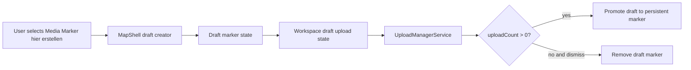
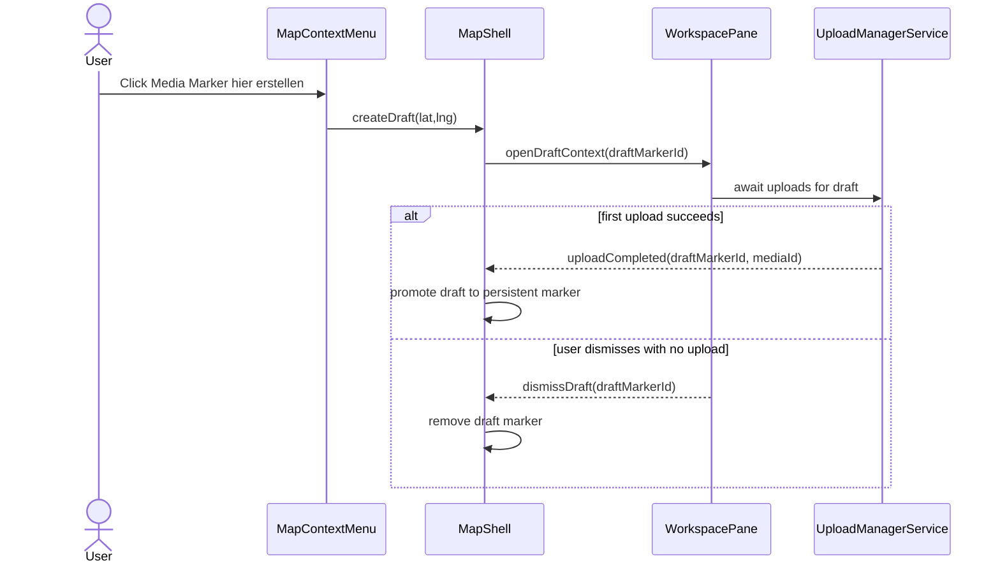

# Media Marker Draft Flow

## What It Is

A map-to-workspace creation flow started from the Map Context Menu action Media Marker hier erstellen. It creates an ephemeral marker draft at the clicked coordinates so users can immediately upload media in Workspace context.

If no media is uploaded and the draft session is dismissed (for example by left-clicking the map), the draft is discarded and the marker disappears.

## What It Looks Like

The draft marker uses the same marker geometry as Media Marker but with a draft visual state (muted body, subtle dashed outline, and optional plus badge) so it is clearly temporary. When selected, Workspace Pane opens in the same shell as standard marker flows (`.ui-container`, `--color-bg-surface`) and lands in an upload-ready state.

The upload intake uses existing Upload Panel visual language and supports all currently allowed media types (photo, video, PDF, and office documents). While upload count is zero, the marker keeps draft styling. After first successful upload, draft styling is removed and the marker becomes a persistent media marker.

## Where It Lives

- **Route**: Global within map route `/`
- **Parent**: Triggered from Map Context Menu in `MapShellComponent`
- **Appears when**: user selects Media Marker hier erstellen on an empty map location

## Actions & Interactions

| #   | User Action                                        | System Response                                                              | Triggers                               |
| --- | -------------------------------------------------- | ---------------------------------------------------------------------------- | -------------------------------------- |
| 1   | Opens map context menu on empty map                | Shows Media Marker hier erstellen action                                     | map secondary-click/long-press         |
| 2   | Selects Media Marker hier erstellen                | Creates ephemeral draft marker and opens Workspace Pane in upload-ready mode | draft creation handler                 |
| 3   | Uploads first media file                           | Promotes draft marker to persistent marker                                   | upload completion event                |
| 4   | Uploads additional media files                     | Keeps marker persistent and appends media to same marker context             | upload manager pipeline                |
| 5   | Dismisses draft session with uploadCount = 0       | Closes draft workspace context and removes draft marker                      | map left-click / pane dismiss / escape |
| 6   | Dismisses session after uploadCount > 0            | Marker remains on map and workspace closes normally                          | standard pane close flow               |
| 7   | Right-click-drags instead of selecting menu action | Does not create draft; radius selection behavior continues                   | gesture arbitration                    |

## Component Hierarchy

```
MapShellComponent
├── Map Context Menu
│   └── Action: Media Marker hier erstellen
├── DraftMarkerLayer
│   └── DraftMediaMarker (ephemeral, uploadCount-aware visual state)
└── WorkspacePaneComponent
    ├── PaneHeader
    └── DraftUploadState
        └── Upload intake entry point (all allowed media types)
```

## Data Requirements

| Field             | Source                                | Type                                        |
| ----------------- | ------------------------------------- | ------------------------------------------- |
| `draftMarkerId`   | Client-side UUID at draft creation    | `string`                                    |
| `lat`, `lng`      | Map context anchor                    | `number`                                    |
| `uploadCount`     | Upload manager events scoped to draft | `number`                                    |
| `firstUploadedId` | Upload completion payload             | `string \| null`                            |
| `mediaType`       | Upload manager classification         | `'image' \| 'video' \| 'pdf' \| 'document'` |

### Data Flow (Mermaid)



## State

| Name                 | TypeScript Type                                                               | Default | What it controls                                       |
| -------------------- | ----------------------------------------------------------------------------- | ------- | ------------------------------------------------------ |
| `draftMediaMarker`   | `{ markerId: string; lat: number; lng: number; uploadCount: number } \| null` | `null`  | Existence and identity of active draft marker          |
| `draftWorkspaceOpen` | `boolean`                                                                     | `false` | Whether workspace is currently in draft upload context |
| `draftBusy`          | `boolean`                                                                     | `false` | Prevents duplicate create/persist/remove actions       |
| `draftPersisted`     | `boolean`                                                                     | `false` | Whether first upload already promoted the marker       |

## File Map

| File                                                                       | Purpose                                                              |
| -------------------------------------------------------------------------- | -------------------------------------------------------------------- |
| `apps/web/src/app/features/map/map-shell/map-shell.component.ts`           | Create/remove/promote draft marker state and wire events             |
| `apps/web/src/app/features/map/map-shell/map-shell.component.html`         | Render draft marker state and bind workspace draft context           |
| `apps/web/src/app/features/map/map-shell/map-shell.component.scss`         | Draft marker visual state styles                                     |
| `apps/web/src/app/features/map/workspace-pane/workspace-pane.component.ts` | Accept and manage draft workspace context                            |
| `apps/web/src/app/core/upload/upload-manager.service.ts`                   | Emit upload completion payload used for draft promotion              |
| `docs/use-cases/map-context-menu.md`                                       | Interaction scenarios for draft creation and cancel/persist outcomes |

## Wiring

### Wiring Flow (Mermaid)



- Draft lifecycle ownership stays in `MapShellComponent`.
- Workspace is responsible for draft session UX, not for marker persistence.
- Upload manager is the only source of truth for upload completion.

## Acceptance Criteria

- [ ] Media Marker hier erstellen creates exactly one draft marker at clicked coordinates.
- [ ] Draft marker opens Workspace Pane in upload-ready mode.
- [ ] Draft accepts all currently allowed media types from upload intake.
- [ ] First successful upload promotes marker to persistent state.
- [ ] Dismissing draft session with zero uploads removes marker immediately.
- [ ] Dismissing after first upload keeps marker visible.
- [ ] Right-click drag threshold behavior never creates a draft marker accidentally.
