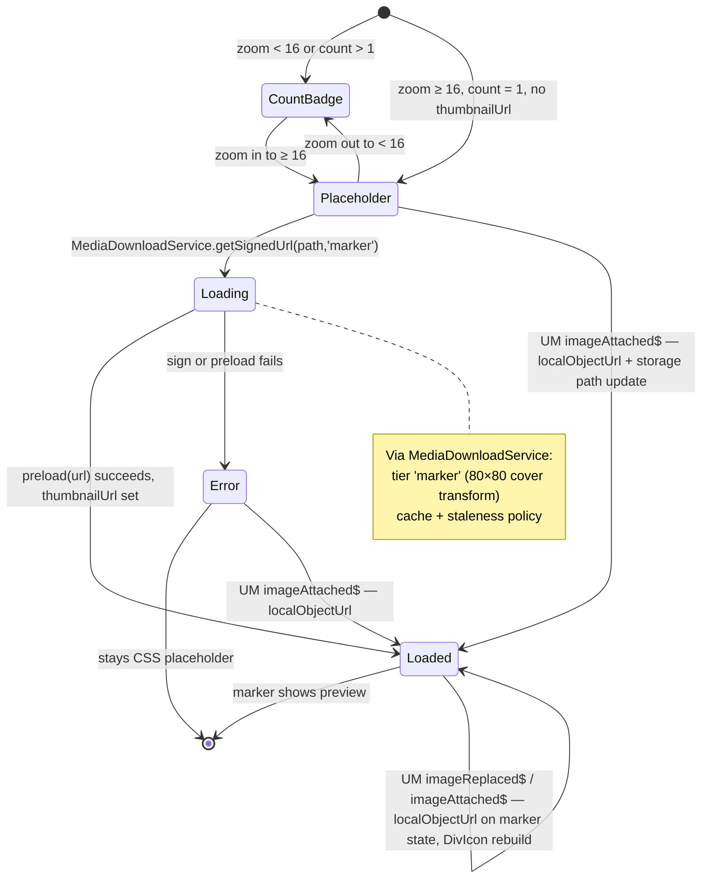
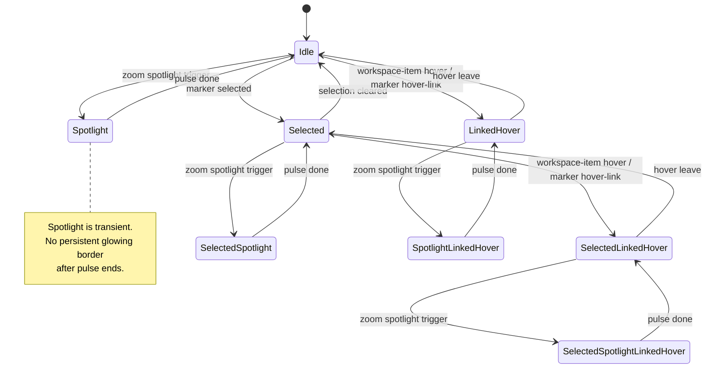
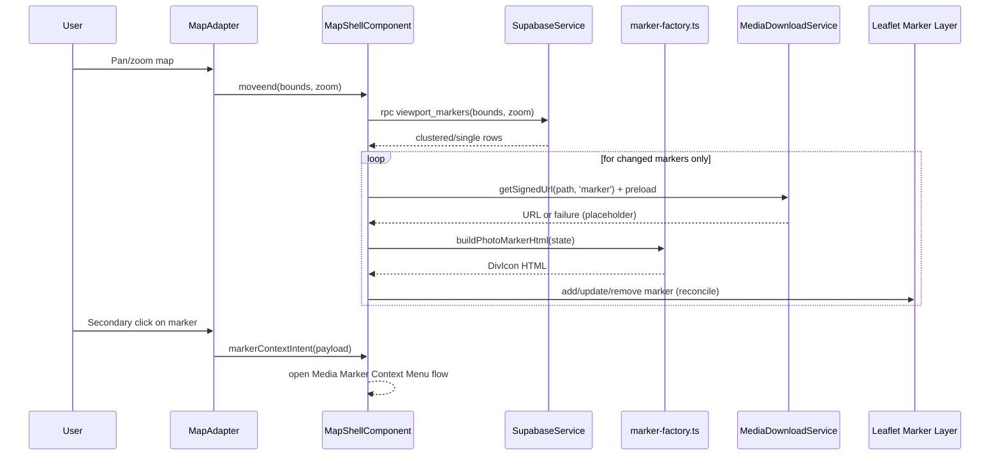

# Media Marker

> **Blueprint:** [implementation-blueprints/media-marker.md](../../../implementation-blueprints/media-marker.md)
> **Media delivery:** [media-download-service](../../service/media-download-service/media-download-service.md) — `MediaDownloadService` (marker tier, shared signed-URL + tier cache across map, workspace, detail, `/media`). Low-level signing may use the `SignedUrlCache` adapter; the facade is `MediaDownloadService`.

## Terminology (symbols and product language)

The domain is **media** (`media_items`). The following **implementation symbols** include `photo` or `image` in their names (Map Shell, `UploadManagerService`, SCSS). In product copy and this spec, say **media** / **media marker**; quote symbols when describing code paths.

| Symbol | Role |
| --- | --- |
| `photoPanelOpen` | **Workspace Pane** visibility on the map route (`MapShellComponent` signal). |
| `handlePhotoMarkerClick`, `buildPhotoMarkerHtml`, `refreshPhotoMarker`, `lazyLoadThumbnail` | Click handling, DivIcon HTML, and thumbnail scheduling for **media markers**. |
| `uploadedPhotoMarkers`, `refreshAllPhotoMarkers` | Map Shell maps/routines for on-map markers (symbol names unchanged). |
| `.map-photo-marker*`, `--photo-marker-body-size` | **Media marker** styling: BEM namespace and size token as implemented in SCSS (renaming selectors is a separate refactor). |
| `imageReplaced$`, `imageAttached$`, `imageUploaded$`, `event.imageId` | **UploadManagerService** streams and payload fields; ids refer to **media items** (compatibility field `image_id` where the schema still uses it). |
| `ImageUploadedEvent` | **Media** upload completed on the map (TypeScript type name; optimistic marker path). |

In prose, reserve **camera still** / **raster thumbnail** when the meaning is capture or pixels; use **`image/` MIME** or **quoted column names** when citing technical details. Default to **media** everywhere else.

## What It Is

Map pins for **one media item** or a **cluster** of nearby items. Leaflet `DivIcon` HTML from `marker-factory.ts` (not Angular), centered on GPS, with selection/correction/upload reflected via CSS. Pin previews are resolved through **`MediaDownloadService`**: tier cache by media identity (raster thumbnails for still frames and video previews where applicable; document previews where the pipeline supports them), reducing redundant downloads across surfaces.

## What It Looks Like

The marker body geometry is derived from the shared media token system. The size token is **`--photo-marker-body-size`** (SCSS name today) `calc(var(--ui-item-media-size-default) * 1.25)` (40px), with `--ui-item-media-size-default` seeded from the shared UI item token in `styles.scss`. Single markers render a thumbnail inside a square body with `border-radius: var(--radius-md)`, a 2px white outline, and a persistent shadow for readability on light and dark tiles. **The marker body is centered exactly on the GPS coordinate** — `iconAnchor` is set to half the `iconSize` (`[20, 20]`), so the center of the hit zone sits directly on the location point. There is no pointer tail. Cluster markers are anchored at the centroid of their grid cell. Cluster markers reuse the same body geometry but with `width: auto; min-width: --photo-marker-body-size` to accommodate the count label without overflow: white background, black text (`0.875rem` bold), with counts capped at a maximum display of `999+`. The count text turns orange (`--color-clay`) when the marker is selected. Selected markers add a clear accent ring and a slight scale lift, while zoom-level classes (`.map-photo-marker--zoom-far`, `.map-photo-marker--zoom-mid`, `.map-photo-marker--zoom-near`) slightly adjust visual prominence without changing the underlying marker structure. Newly added markers fade in quickly (about `220ms`) when they enter the layer. During cluster split (large marker to smaller markers), newly created child markers originate from the previous parent-cluster centroid and glide to their new positions so the motion reads as one continuous split. When clustering reconciliation repositions a surviving marker, its map position transitions smoothly to the new coordinate (approximately `220ms`, ease-out) instead of popping to the new location. On desktop, the Direction Cone appears on hover when bearing data exists; on touch devices, the same affordance appears on long press.

## Where It Lives

- **Route**: Global within the Map Shell at `/`
- **Parent**: Map Zone via Leaflet DivIcon rendering in the map layer
- **Appears when**: Media items are loaded for the current viewport or newly uploaded onto the current map

## Actions & Interactions

| #   | User Action                                      | System Response                                                                                                                                                | Triggers                                       |
| --- | ------------------------------------------------ | -------------------------------------------------------------------------------------------------------------------------------------------------------------- | ---------------------------------------------- |
| 1   | Clicks single marker                             | Adds media to Active Selection, opens Workspace Pane                                                                                                           | `setSelectedMarker`, **`photoPanelOpen.set(true)`** |
| 2   | Ctrl+clicks marker (desktop)                     | Adds media to Active Selection without clearing previous selection                                                                                             | Multi-select                                   |
| 2b  | Long-press + tap marker (mobile)                 | Mobile equivalent of Ctrl+click multi-select                                                                                                                   | Multi-select                                   |
| 3   | Clicks cluster marker                            | Loads all media in the cluster into Active Selection, opens Workspace Pane                                                                          | `SelectionService`, **`photoPanelOpen.set(true)`** |
| 4   | Hovers single marker (desktop)                   | Shows Direction Cone (if bearing available)                                                                                                                    | CSS `:hover`                                   |
| 5   | Long-presses single marker (touch)               | Shows Direction Cone (if bearing available)                                                                                                                    | Touch fallback                                 |
| 6   | Right-clicks marker (desktop)                    | Opens context menu (view detail, edit location, manage projects)                                                                                               | Context menu                                   |
| 6b  | Long-press marker (mobile)                       | Mobile equivalent of right-click context menu                                                                                                                  | Context menu                                   |
| 7   | Drags marker in correction mode                  | Moves marker to new position, stores corrected coordinates                                                                                                     | Correction flow                                |
| 8   | Detail view requests zoom to media               | Map recenters at detail zoom, then marker spotlight runs after marker DOM is ready; if single marker is clustered, nearest cluster receives spotlight fallback | Deferred spotlight lifecycle in Map Shell      |
| 9   | Hovers matching item in Workspace Pane           | Marker enters linked-hover highlight (secondary emphasis) while hover is active                                                                                | Cross-surface hover link                       |
| 10  | Hovers marker on map                             | Matching Workspace Pane item enters linked-hover state                                                                                                         | Cross-surface hover link                       |
| 11  | Same media opens in Workspace Detail or `/media` | Marker thumbnail URL reused when already resolved for that media id/tier (`MediaDownloadService` cache namespace); no redundant signing purely due to route/surface switch                       | Shared delivery cache                |

## Component Hierarchy

```
MediaMarker (DivIcon root; Leaflet/marker-factory may still label types PhotoMarker)
├── MarkerHitZone                                ← 2.5rem × 2.5rem touch target, centered on GPS coordinate (no tail)
│   ├── MarkerBody                               ← square body (32px) sized by `--photo-marker-body-size`, rounded with `--radius-md`
│   │   ├── [single + loaded] Thumbnail preview   ← signed URL (marker tier / transform), `` + object-fit when content is raster
│   │   ├── [single + not loaded] Placeholder    ← CSS gradient + icon (SVG mask), no  tag
│   │   └── [cluster] CountLabel                 ← count (max display: 999+) at 0.875rem bold; white body auto-widens, black text, orange when selected
│   ├── [corrected] CorrectionDot                ← 8px circle, `--color-accent`, top-right corner
│   ├── [uploading] PendingRing                  ← pulsing ring, `--color-warning`
│   └── [bearing + hover-or-long-press] DirectionCone ← 30° semi-transparent directional wedge
└── [selected] SelectedRing                      ← accent outline + slight scale lift
```

## Thumbnail Loading & Placeholders

> **Full use cases:** [use-cases/media-loading.md](../../../use-cases/media-loading.md)

Single-item markers at near zoom (≥ 16) show a real preview thumbnail in the marker body when available. Thumbnails are **lazy-loaded** per visible marker: `MapShellComponent` calls **`MediaDownloadService.getSignedUrl(thumbnailSourcePath, 'marker')`**, then **`preload(url)`** before rebuilding the DivIcon. That path uses the service’s **tier cache** so the same media identity does not re-download across map, workspace, grid, and detail (`resolvePreview` / orchestration contract in [media-download-service](../../service/media-download-service/media-download-service.md)). **`invalidateStale(50 * 60 * 1000)`** runs before refreshing visible markers so expired signed URLs are cleared consistently.

When signing fails or storage is missing, the marker stays on the **CSS placeholder** (no broken ``).

This delivery cache is shared **by media id** with other surfaces, so already resolved previews can be reused immediately.

### Loading States

Implementation keeps the `.map-photo-marker*` selector namespace; behavior below is for **media markers**.

| State      | Visual                                                              | CSS selector                                  | Trigger                                                                              |
| ---------- | ------------------------------------------------------------------- | --------------------------------------------- | ------------------------------------------------------------------------------------ |
| Not loaded | Count badge (clusters) or CSS placeholder (single, no thumbnailUrl) | `.map-photo-marker--count` or `--placeholder` | Initial render                                                                       |
| Loading    | CSS placeholder with subtle pulse animation                         | `.map-photo-marker--placeholder.is-loading`   | `lazyLoadThumbnail` in flight (`thumbnailLoading`)                                  |
| Loaded     | `` with `object-fit: cover`                                     | `.map-photo-marker--single`                   | `thumbnailUrl` set after `getSignedUrl` + `preload` succeed                            |
| Error      | CSS placeholder (permanent, no retry)                               | `.map-photo-marker--placeholder`              | Signing failed or preload failed — URL not applied                                   |
| Optimistic | Local `blob:` URL from upload (**UploadManagerService** `imageReplaced$` / `imageAttached$`) | `.map-photo-marker--single`                   | Event `localObjectUrl` applied to marker state — no network round-trip               |

### Thumbnail Loading Flow



> **Replace / attach:** On `imageReplaced$` / `imageAttached$`, `MapShellComponent` applies **`event.localObjectUrl`** to the marker’s `thumbnailUrl` and refreshes the icon — instant swap without waiting for signing. On the next viewport cycle, normal **`getSignedUrl`** + **`preload`** resumes from storage; revoke old `blob:` URLs when superseded. See [PL-7 / PL-8](../../../use-cases/media-loading.md#pl-7-replace-photo--loading-state-reset).

### Placeholder Design

The placeholder is a pure-CSS element — no network request, no `` tag. `marker-factory.ts` emits `.map-photo-marker__placeholder-icon` on a neutral gradient (`--color-bg-subtle` → `--color-bg-muted`), matching marker body geometry for consistent sizing with grid/detail placeholders.

### Signed URL Strategy (via MediaDownloadService)

The Map Shell does **not** call Supabase Storage directly for marker previews. It uses **`MediaDownloadService`**:

- **Tier `marker`:** `getSignedUrl(storagePath, 'marker')` — transform pipeline matches the marker slot (e.g. 80×80 cover for **raster** objects; document-like types follow `MediaDownloadService` / orchestrator policy).
- **Caching:** Tier cache + staleness handling live in the service; Map Shell keeps marker-local `thumbnailUrl` / `thumbnailLoading` / `signedAt` only for render state, not a parallel URL registry.
- **Preload:** `preload(signedUrl)` before DivIcon rebuild when using signed HTTP URLs.
- **Staleness:** `invalidateStale(STALE_THRESHOLD_MS)` during thumbnail refresh passes (e.g. after `moveend` scheduling).
- **Per-marker scheduling:** Visible single markers in bounds are processed in `maybeLoadThumbnails()` — batch signing is owned by **`MediaDownloadService`**, not duplicated on the shell.

> **Removed from Map Shell:** Direct `createSignedUrl` calls and duplicate staleness bookkeeping superseded by `MediaDownloadService`.

## Data

| Field           | Source                                           | Type                               |
| --------------- | ------------------------------------------------ | ---------------------------------- |
| Media rows      | Viewport query via `SupabaseService` / RPC       | `media_items` (and compat fields)  |
| Cluster groups  | Server-side `ST_SnapToGrid` (zoom ≤ 14)          | `{ lat, lng, count }[]`            |
| Thumbnails      | `MediaDownloadService` signed URLs, tier `marker` | `string` (URL) on marker state     |
| Placeholder     | CSS-only, no data source                         | —                                  |
| Selection state | Map/workspace selection service or shell state   | `string[]` / marker key state      |
| Bearing data    | EXIF-derived `direction` column                  | `number \| null`                   |
| Corrected flag  | `latitude`/`longitude` ≠ EXIF originals          | `boolean`                          |

## State

Markers are stateless DOM elements. State is held in services or the map shell and reflected through CSS classes on the marker HTML.

| Name                   | Type                       | Default | Controls                                                                                                                                                                                                                                                                                                                  |
| ---------------------- | -------------------------- | ------- | ------------------------------------------------------------------------------------------------------------------------------------------------------------------------------------------------------------------------------------------------------------------------------------------------------------------------- |
| `selectedMarkerKey`    | `string \| null`           | `null`  | Which single marker renders the selected ring                                                                                                                                                                                                                                                                             |
| `markerZoomLevel`      | `'far' \| 'mid' \| 'near'` | `'mid'` | Which zoom modifier class is applied                                                                                                                                                                                                                                                                                      |
| `isCorrected`          | `boolean`                  | `false` | Whether the correction dot renders                                                                                                                                                                                                                                                                                        |
| `isUploading`          | `boolean`                  | `false` | Whether the pending ring renders. Driven by `UploadManagerService.jobPhaseChanged$`: set to `true` when a job targeting this marker's coordinates enters `uploading` phase; reset to `false` when the job reaches `complete` or `error`. During batch uploads, multiple markers may show the pending ring simultaneously. |
| `bearing`              | `number \| null`           | `null`  | Whether the Direction Cone can render                                                                                                                                                                                                                                                                                     |
| `linkedHoverMarkerKey` | `string \| null`           | `null`  | Secondary cross-surface highlight from Workspace Pane hover (or map hover reflection)                                                                                                                                                                                                                                     |
| `spotlightMarkerKey`   | `string \| null`           | `null`  | Transient zoom spotlight target; emits one outgoing ring animation, then returns to previous visual state                                                                                                                                                                                                                 |

### Marker Visual Priority

1. Base marker (`none`)
2. Selected marker (`selected`) — persistent
3. Linked hover (`linked-hover`) — while pointer is over corresponding item/marker
4. Spotlight (`spotlight`) — one-shot emphasis pulse for zoom-to-location

`spotlight` can be layered on top of `selected` so already selected markers can still receive extra emphasis.

### Marker Interaction State Machine



Viewport lifecycle, clustering, upload-driven updates, and performance rules: **[media-marker.viewport-and-clustering.supplement.md](./media-marker.viewport-and-clustering.supplement.md)**.

## Settings

- **Map Marker Motion**: toggles marker fade-in and centroid glide transitions during cluster reconciliation (`Off` or `Smooth`).

## File Map

| File                                                               | Purpose                                                                        |
| ------------------------------------------------------------------ | ------------------------------------------------------------------------------ |
| `apps/web/src/app/core/map/marker-factory.ts`                      | Generates marker HTML and marker class variants for single and cluster markers |
| `apps/web/src/app/features/map/map-shell/map-shell.component.ts`   | Applies marker state, click behavior, and Leaflet marker updates               |
| `apps/web/src/app/features/map/map-shell/map-shell.component.scss` | Defines token-driven marker geometry and state styles                          |
| `apps/web/src/styles.scss`                                         | Defines shared marker sizing variables derived from the UI media token system  |

## Wiring

### Wiring Flow (Mermaid)



- The Map Shell creates Leaflet markers and delegates DivIcon HTML generation to `marker-factory.ts`.
- Marker sizing variables are declared in `styles.scss` so marker geometry derives from shared design tokens instead of hardcoded body sizes.
- The Map Shell listens to `moveend`, debounces **350 ms**, then issues a viewport query. On response, it reconciles the marker set (add/remove/update) rather than rebuilding all markers.
- Freshly uploaded markers (**`ImageUploadedEvent`** in code; payload describes **media**) are placed optimistically and reconciled on the next viewport query.
- **Marker preview URLs** come from **`MediaDownloadService`**: `getSignedUrl(path, 'marker')`, `preload(url)`, and `invalidateStale(...)` for staleness — the shell does **not** call `supabase.client.storage...createSignedUrl` directly. Caching and tier policy are centralized in that service (see [media-download-service](../../service/media-download-service/media-download-service.md)).
- Placeholder visuals are the CSS placeholder layer in `marker-factory.ts` (`.map-photo-marker__placeholder-icon`), not a one-off inline icon.
- The Map Shell passes `corrected` and `uploading` flags to `buildPhotoMarkerHtml()` when building or refreshing marker icons. `corrected` is derived from comparing current coordinates to EXIF originals. `uploading` is set during the upload lifecycle and cleared on completion or error.
- The Map Shell includes the `direction` column in the initial-load and viewport queries so that bearing-based direction cones render for all markers, not only freshly uploaded ones.
- Marker click handling opens the Workspace Pane for both single markers and cluster markers. Single marker click selects one media item; cluster marker click fetches all media IDs for the cluster cell, populates Active Selection with those IDs, and signals the Workspace Pane to open. The map never zooms or re-centers on cluster click.
- Zoom-to-location intent from Media Detail View recenters map at detail zoom and starts a deferred spotlight. Spotlight starts only when marker DOM is render-ready; pending requests are re-flushed after viewport marker reconciliation.
- If the exact media marker is unavailable due to clustering, spotlight falls back to the nearest eligible cluster marker.
- Cross-surface hover-link wiring is bidirectional: Workspace Pane hover highlights marker; map marker hover highlights the matching workspace item.
- Hover direction cones are driven by CSS `:hover` on desktop. Touch long-press direction cones require a Leaflet pointer-event listener (~500 ms threshold) that toggles a `data-long-pressed` attribute or class.
- The Map Shell subscribes to `UploadManagerService.imageReplaced$` and `imageAttached$` and applies **`event.localObjectUrl`** to the marker’s thumbnail state, then **`refreshPhotoMarker`** — no round-trip through the download service for that instant path.
- The Map Shell maintains a `markersByMediaId` secondary index (`Map<string, L.Marker>`) for O(1) lookups when applying upload manager events. This index is populated during marker creation and cleaned up during marker removal.

## Acceptance Criteria

### Marker Rendering

- [x] Never shows default Leaflet blue pin — `marker-factory.ts` uses `L.divIcon()` with custom HTML
- [x] Marker geometry derives from `--ui-item-media-size-default` — `styles.scss` defines `--photo-marker-body-size: var(--ui-item-media-size-default)` (32px)
- [x] Single markers show thumbnail — `marker-factory.ts` renders `` for `count === 1` with thumbnail URL
- [x] Cluster markers show count badge — white auto-width body, `0.875rem` bold black text; counts > 999 display as "999+"; text turns `--color-clay` (orange) when `--selected`
- [x] Cluster markers reuse the same base geometry as single markers — both share `.map-photo-marker__body` sizing
- [x] All markers have 2px white outline + drop shadow — `map-shell.component.scss` applies `border: 2px solid var(--color-bg-surface)` + `box-shadow`
- [x] Marker body center is the GPS coordinate — no tail; `iconAnchor: [20, 20]` centers the `[40, 40]` hit zone on the location point; cluster markers are anchored at grid cell centroid
- [x] Readable on both light and dark map tiles — full dark-mode token coverage in `styles.scss`

### Selection & Interaction

- [x] Click selects media and opens Workspace Pane — **`handlePhotoMarkerClick()`** calls `setSelectedMarker()` + **`photoPanelOpen.set(true)`**
- [x] Selected markers have a clear visual state — `.map-photo-marker--selected` applies accent ring + `scale(1.05)`
- [ ] Linked hover state exists as a secondary emphasis independent from selection (`linked-hover` class/signal)
- [ ] Zoom spotlight is transient: one outgoing pulse only, no persistent glow when pulse completes
- [ ] Zoom spotlight executes after render-ready (marker exists, visible, map movement settled)
- [ ] If target media is clustered, nearest cluster marker receives spotlight fallback
- [ ] Hovering a workspace item highlights the corresponding map marker
- [ ] Hovering a map marker highlights the corresponding workspace item
- [ ] Ctrl+click adds to Active Selection without clearing previous selection (blocked — requires `SelectionService`)
- [ ] Long-press + tap provides mobile equivalent of multi-select (blocked — requires `SelectionService`)
- [ ] Right-click opens context menu (view detail, edit location, manage projects) — see `media-marker/media-marker-context-menu.md`
- [ ] Long-press opens context menu on mobile — see `media-marker/media-marker-context-menu.md`
- [ ] Drag marker in correction mode to update coordinates (blocked — requires correction mode handler)

### Viewport-Driven Loading

- [x] Markers load based on current viewport bounds, not once at init — `moveend` + 350 ms debounce triggers viewport query
- [x] Previous in-flight viewport query is aborted when a new one starts (`AbortController`)
- [x] Query bounds expand by 10% on each edge for pre-fetch buffer
- [x] Marker set is reconciled (add/remove/update) on each viewport response — existing markers are reused, not rebuilt
- [x] Markers that leave the viewport are removed from the map
- [x] Newly uploaded markers persist optimistically until the next viewport query reconciles them
- [ ] Max 2000 markers on the map at any time; server returns clusters beyond this cap (server-side enforcement)

### Clustering

- [x] Cluster click never zooms — `map.setView()` is NOT called on cluster click
- [ ] Cluster click fetches all media IDs within the cluster cell and populates Active Selection (blocked — requires `SelectionService`)
- [x] Cluster click opens the Workspace Pane with Active Selection tab active
- [x] Zoom modifier classes adjust prominence without changing marker structure — `.map-photo-marker--zoom-far/mid/near` CSS classes applied
- [x] Client-side clustering via coordinate rounding to 7 decimal places (`toMarkerKey()`) + pixel-distance overlap merge — interim implementation
- [ ] Server-side clustering via `ST_SnapToGrid` with zoom-dependent grid cell size (server-side, not yet wired)
- [ ] Cluster grid cell size adapts to zoom level (large cells at low zoom, small cells at high zoom) (server-side)
- [ ] Clusters expand into individual markers when user zooms past the cluster's grid threshold (server-side)
- [x] Collision offsets prevent overlapping marker bodies when nearby but not clustered — `mergeOverlappingClusters()` pixel-distance merge
- [x] When clustering reconciliation shifts a surviving marker to a new centroid, it transitions smoothly to the new position (about 220 ms ease-out) instead of remove/add popping
- [x] Newly created and reused/re-keyed markers fade in on reconciliation (about 220 ms), while reduced-motion users get no fade animation
- [x] On cluster split, child markers visually emerge from the previous parent-cluster centroid before settling at their final positions

### Performance

- [x] No marker DOM work during zoom animation — all updates fire on `moveend` only (`zoomAnimating` flag)
- [x] DivIcon HTML is not regenerated when rendered state has not changed (`refreshPhotoMarker` dirty-checks via `lastRendered` snapshot)
- [x] Viewport-query-driven reconciliation (`handleMoveEnd` debounce) is the source of truth; ad-hoc `refreshAllPhotoMarkers()` on `zoomend` is not the primary path
- [x] Thumbnail requests use **`MediaDownloadService.getSignedUrl`** + **`preload`** per marker in `lazyLoadThumbnail` / `maybeLoadThumbnails` — not raw Storage SDK calls on the shell

### Thumbnail Loading & Placeholders

- [x] Single markers at near zoom show CSS placeholder (`.map-photo-marker__placeholder-icon`) while thumbnail URL is loading
- [x] Placeholder uses gradient background + CSS icon span — no `` tag
- [x] Placeholder matches marker body geometry exactly (same border-radius, dimensions)
- [ ] Thumbnail signing delegated to **`MediaDownloadService`** via `getSignedUrl(path, 'marker')` — Map Shell does not call `createSignedUrl` directly
- [ ] Service applies tier **`marker`** transform policy (80×80 cover for raster thumbnails where applicable)
- [x] Error from signing (file missing) leaves CSS placeholder visible — no broken `` icon
- [x] Replace/attach flows apply **`event.localObjectUrl`** on marker state — instant `` via blob URL; signing resumes on later viewport passes
- [ ] Signed URL **tier cache** owned by **`MediaDownloadService`** — shell tracks render-only `thumbnailUrl` / `thumbnailLoading` / `signedAt`
- [ ] Marker cache entries align **by media id** with Workspace Pane detail and `/media` consumers (`MediaDownloadService` namespace).
- [ ] Staleness: **`invalidateStale(STALE_THRESHOLD_MS)`** during thumbnail refresh (aligned with `maybeLoadThumbnails`)
- [ ] **`preload(signedUrl)`** before DivIcon rebuild when using HTTPS URLs
- [x] On `imageReplaced$`: **`localObjectUrl`** on event applied to marker — DivIcon rebuild
- [x] On `imageAttached$`: **`localObjectUrl`** — placeholder → real thumbnail
- [ ] Revoke superseded `blob:` URLs when replacing thumbnail URL on marker state

### State Affordances

- [x] Correction dot visible only for corrected markers — `corrected` flag passed from `map-shell.component.ts` to `buildPhotoMarkerHtml()`
- [ ] Pending upload ring pulses during upload — requires `uploadStarted` event from UploadPanel (blocked — UploadPanel only emits after success)
- [x] Direction cone appears on hover when bearing data exists — CSS `:hover` rule works; bearing comes from upload completion payload / DB (`ImageUploadedEvent` type in code where applicable)
- [x] Direction cone appears on long press when bearing data exists on touch devices — `pointerdown` 500 ms timer toggles `.map-photo-marker--long-pressed`; CSS shows cone for that class
- [x] Direction cone rendered for database-loaded markers — `direction` column included in initial load query
- [x] Direction cone rotates to reflect actual bearing — inline `transform:rotate(bearing-90deg)` set in `buildPhotoMarkerHtml()`

### Reactive Updates from Upload Manager

- [x] `markersByMediaId` secondary index maintained for O(1) marker lookups by media UUID
- [x] `MapShellComponent` subscribes to `UploadManagerService.imageReplaced$` — applies **`localObjectUrl`** to marker state, `refreshPhotoMarker`
- [x] `MapShellComponent` subscribes to `UploadManagerService.imageAttached$` — **`localObjectUrl`** + storage path, `refreshPhotoMarker`
- [x] Marker thumbnail uses blob URL from replace/attach **event** for instant display; **`getSignedUrl`** + **`preload`** on subsequent viewport refresh
- [ ] Correction mode drag updates `corrected` flag, shows correction dot, and updates `markerKey` mapping — handled by MapShell directly, not through Upload Manager
- [ ] Coordinate change from correction mode updates the `markerKey` mapping (remove old key, insert new key)
- [x] Upload Manager events and correction mode edits do not trigger a viewport query — changes are applied locally and reconciled on the next natural `moveend`

