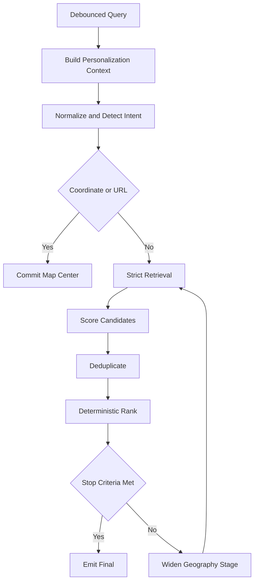
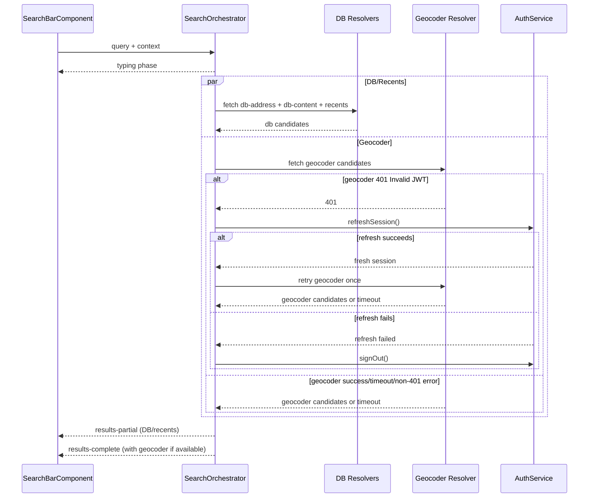
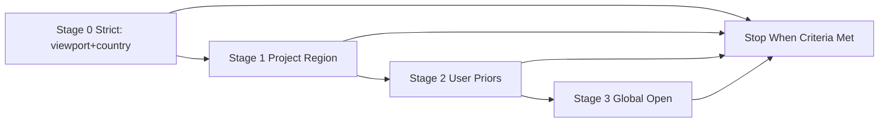
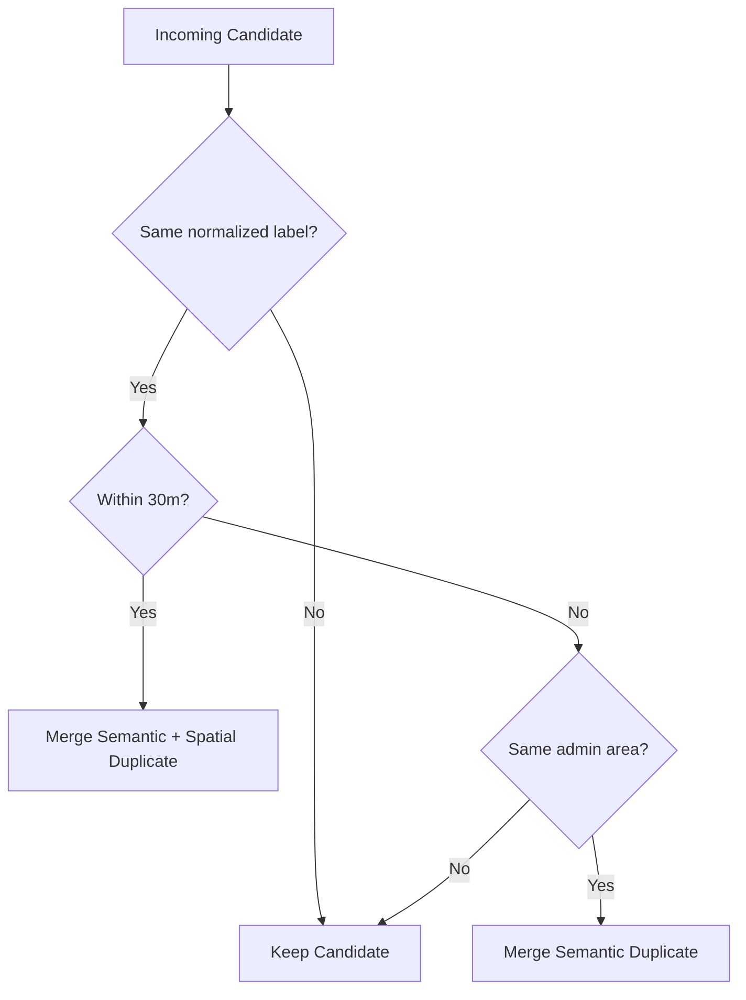
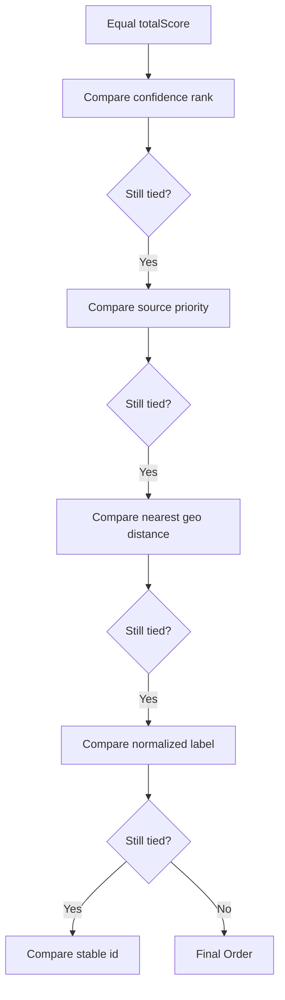
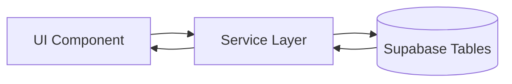
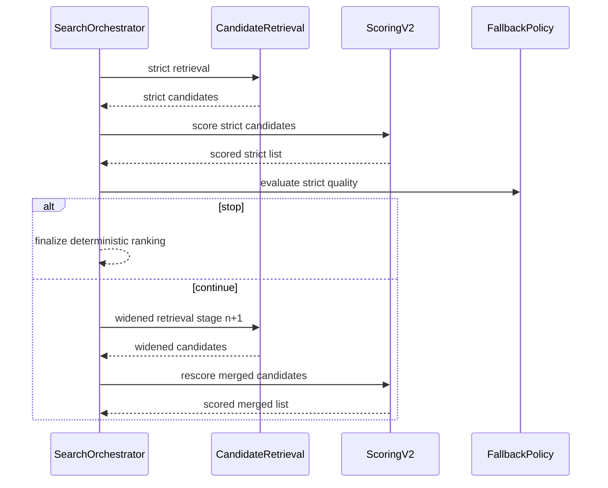
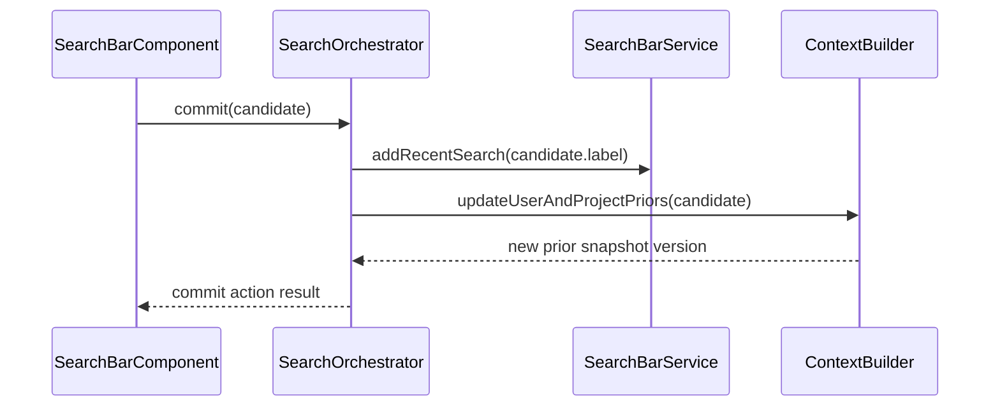

# Search Bar - Data And Service V2

> **Parent spec:** [search-bar](search-bar.md)
> **Query behavior contract:** [search-bar-query-behavior](search-bar-query-behavior.md)

## What It Is

This spec defines the v2 data-flow and service architecture for personalized geosearch. It establishes strict boundaries for normalization, candidate retrieval, scoring, deduplication, fallback escalation, explanation labeling, and deterministic output ordering.

## What It Looks Like

Search remains progressive and non-blocking: typing feedback first, DB and recents second, geocoder append third. Ranking is personalized by active marker geography, active project geography, current user geography, and viewport geography. Irrelevant global candidates are strongly de-prioritized for short ambiguous prefixes unless user intent explicitly widens geography.

## Where It Lives

- **Parent**: `SearchBarComponent` orchestration contract
- **Core pipeline**: `SearchOrchestratorService` and search-core collaborators
- **Context source**: `MapShellComponent` + workspace/user state providers

## Actions

| #   | Trigger                     | System Response                                                | Phase              |
| --- | --------------------------- | -------------------------------------------------------------- | ------------------ |
| 1   | Debounced query             | Build context snapshot and run strict stage                    | `typing`           |
| 2   | Strict retrieval returns    | Emit partial ranked DB/recents output                          | `results-partial`  |
| 3   | Geocoder returns or fails   | Append geocoder results or preserve partial                    | `results-complete` |
| 3a  | Geocoder returns `401` once | Refresh auth session, retry geocoder once                      | `results-complete` |
| 3b  | Retry still `401`           | Sign out, redirect to login, preserve partial until route swap | `results-complete` |
| 4   | Strict quality insufficient | Escalate fallback widening stage                               | `results-complete` |
| 5   | Commit candidate            | Persist recency and update priors                              | commit path        |

### Pipeline Overview



### Progressive Rendering Timeline



### Fallback Widening Order



### Dedup Decision Tree



### Ranking Tie-Break Chain



## Component Hierarchy

```
Search Data Orchestration V2
├── SearchOrchestratorService
│   ├── TypingPhaseEmitter
│   ├── PartialPhaseEmitter
│   ├── CompletePhaseEmitter
│   └── StableOrderingReducer
├── SearchContextBuilderService
│   ├── ActiveMarkerContextBuilder
│   ├── ActiveProjectContextBuilder
│   ├── UserLocationContextBuilder
│   ├── ViewportContextBuilder
│   └── PriorsBuilder
├── SearchCandidateRetrievalService
│   ├── DbAddressRetriever
│   ├── DbContentRetriever
│   ├── GeocoderRetriever
│   └── RecentRetriever
├── SearchScoringServiceV2
│   ├── TextRelevanceScorer
│   ├── GeoPersonalizationScorer
│   ├── PriorScorer
│   └── AntiNoisePenaltyScorer
├── SearchDedupServiceV2
│   ├── SpatialDeduper
│   └── SemanticDeduper
└── SearchExplanationServiceV2
    ├── ConfidenceLabeler
    └── ExplanationTagBuilder
```

## Data

### Data Flow (Mermaid)



### SearchQueryContextV2 Contract

```typescript
export interface SearchQueryContextV2 {
  organizationId?: string;
  activeProjectId?: string;
  activeMarkerCentroid?: { lat: number; lng: number };
  activeProjectCentroid?: { lat: number; lng: number };
  viewportBounds?: { north: number; east: number; south: number; west: number };
  currentLocation?: { lat: number; lng: number };
  countryCodes?: string[];
  userLocationPriors?: Array<{
    key: string;
    lat: number;
    lng: number;
    weight: number;
  }>;
  projectLocationPriors?: Array<{
    key: string;
    lat: number;
    lng: number;
    weight: number;
  }>;
  recencySignals?: {
    last24hWeight?: number;
    last30dWeight?: number;
    last180dWeight?: number;
  };
  activeFilterCount?: number;
  commandMode?: boolean;
  selectedGroupId?: string;
}
```

### Candidate Schema Additions

| Field                | Type                          | Purpose                        |
| -------------------- | ----------------------------- | ------------------------------ |
| `stableId`           | `string`                      | Final deterministic tie-break  |
| `textScore`          | `number`                      | Query match quality            |
| `geoScore`           | `number`                      | Personalized geo relevance     |
| `projectScore`       | `number`                      | Active project affinity        |
| `recencyScore`       | `number`                      | Recency prior contribution     |
| `sourceUtilityScore` | `number`                      | Source reliability utility     |
| `qualityScore`       | `number`                      | Candidate quality prior        |
| `noisePenalty`       | `number`                      | Short-prefix noise suppression |
| `totalScore`         | `number`                      | Final ranking score            |
| `confidenceLabel`    | `'high' \| 'medium' \| 'low'` | Confidence bucket              |
| `explanationTags`    | `string[]`                    | Human-readable ranking reasons |

## State

| Name                       | Type                                  | Default     | Controls                                |
| -------------------------- | ------------------------------------- | ----------- | --------------------------------------- |
| `phase`                    | `'typing' \| 'partial' \| 'complete'` | `'typing'`  | Progressive rendering stage             |
| `geoStatus`                | `'loading' \| 'loaded' \| 'error'`    | `'loading'` | Geocoder visibility                     |
| `geoAuthRecoveryAttempted` | `boolean`                             | `false`     | Single geocoder auth-refresh retry gate |
| `fallbackStage`            | `0 \| 1 \| 2 \| 3`                    | `0`         | Widening stage                          |
| `contextVersion`           | `number`                              | `0`         | Snapshot freshness                      |
| `stableRankingFingerprint` | `string`                              | `''`        | Stability assertions                    |
| `cacheTtlMs`               | `number`                              | `300000`    | Search cache lifetime                   |

## File Map

| File                                                           | Purpose                                                 |
| -------------------------------------------------------------- | ------------------------------------------------------- |
| `docs/element-specs/search-bar/search-bar-data-and-service.md` | Data and service contract for v2 personalized geosearch |

## Wiring

### Injected Services

- `SearchOrchestratorService` owns phase emission and final ordering.
- `SearchBarService` handles recents persistence and retrieval adapters.
- `GeocodingService` proxies all external geocoder access via edge function.
- `AuthService` performs session refresh and controlled sign-out when geocoder returns persistent `401`.
- `MapShellComponent` supplies live context signals via query context snapshot.

### Inputs / Outputs

None.

### Subscriptions

- Query stream: debounced stage entry.
- Context stream: re-score on context changes.
- Geocoder stream: cancellable (`switchMap`) and merged non-blockingly.

### Supabase Calls

- `media_items` table: address candidate retrieval.
- `projects` and share-set membership context (`share_sets`, `share_set_items`): content candidate retrieval.
- Edge function `geocode`: forward geocoder retrieval with bias params.
- Supabase Auth: `refreshSession()` on first geocoder `401`, then single retry.
- Supabase Auth: `signOut()` when retry also returns `401` or refresh fails.

### Sequence: Strict Then Widened Retrieval



### Sequence: Commit And Priors Update



## Ranking Formula Contract

Final score:

$$
S(c)=100\cdot\left(0.42T+0.30G+0.10P+0.08R+0.06U+0.04Q\right)-N
$$

Geo sub-score:

$$
G=0.30g_{marker}+0.30g_{project}+0.20g_{user}+0.20g_{viewport}
$$

Distance transform:

$$
g_x=\exp(-d_x/\tau_x)
$$

Recommended decays:

- $\tau_{marker}=1500$
- $\tau_{project}=5000$
- $\tau_{user}=8000$

Neutral defaults when signal missing:

- Missing geo signal contribution = `0.5`
- Missing priors contribution = `0.5`
- Missing context never blocks result generation

Short-prefix anti-noise penalty:

$$
N=
\begin{cases}
28,& 3\le |q|\le 6,\ prefix\_only,\ country\ mismatch,\ far\ global\\
14,& 3\le |q|\le 6,\ prefix\_only,\ far\ global\\
0,& otherwise
\end{cases}
$$

## Fallback Policy Contract

Continue if any is true:

1. No candidates in strict stage.
2. Top1 confidence is `low`.
3. Top1 text score < `0.70`.
4. Query length 3 to 6 and all top3 are flagged global-noise.

Stop if any is true:

1. Top1 confidence is `high`.
2. Top1 confidence is `medium` with margin >= `6` and at least one local explanation tag.
3. Latency ceiling reached.

Widening order (fixed):

1. Viewport + country constrained
2. Project regional
3. User priors
4. Global open

Suggestion row rule:

- Show only when correction confidence >= `0.85` and top1 score lift >= `10` points.

## Metrics And Quality Gates

| Metric                     | Definition                                                                         | Gate     |
| -------------------------- | ---------------------------------------------------------------------------------- | -------- |
| Top1 local relevance       | Ambiguous prefix queries where top1 is local-context candidate                     | >= 92%   |
| Top3 local relevance       | Ambiguous prefix queries with >= 2 local-context candidates in top3 when available | >= 95%   |
| Global noise suppression   | Ambiguous prefix top3 containing global-noise candidates                           | <= 5%    |
| Strict-stage latency p95   | End-to-end strict stage                                                            | <= 250ms |
| Complete-stage latency p95 | End-to-end complete stage                                                          | <= 900ms |
| Ranking stability          | Identical query+context with identical top3 order                                  | >= 95%   |

## Acceptance Criteria

### Architecture Boundaries

- [ ] Normalization, retrieval, scoring, deduplication, fallback policy, and explanation are defined as separate service boundaries.
- [ ] Component layer contains no direct scoring or fallback logic.
- [x] Geocoder access remains proxy-only via service adapters.

### Context And Personalization

- [x] Context includes active marker geography, active project geography, current location geography, and viewport geography.
- [ ] Context includes user and project location priors with recency decay windows.
- [x] Missing context signals use neutral defaults and do not throw.

### Scoring, Dedup, And Determinism

- [ ] Final ranking uses explicit weighted scoring terms and anti-noise penalty.
- [ ] Dedup uses semantic and spatial checks, with deterministic representative selection.
- [ ] Deterministic tie-break chain is applied exactly as specified.
- [ ] Global fallback candidates include explicit explanation labels.

### Fallback And Suggestions

- [x] Strict stage is always executed before widening stages.
- [ ] Widening proceeds only in the specified order and stops at first valid stage.
- [ ] Suggestion row appears only when confidence and score-lift thresholds are met.

### Progressive UX And Performance

- [x] Typing/partial/complete phases remain non-blocking.
- [x] Geocoder timeout or error never suppresses DB partial output.
- [ ] Geocoder `401` triggers exactly one silent auth refresh and exactly one retry (no retry loop).
- [ ] Geocoder `401` with failed refresh or failed retry triggers controlled sign-out without requiring manual storage clearing.
- [ ] Latency and stability quality gates pass before full rollout.

## Rollout Plan Contract

1. `search_v2_shadow`: compute v2 scores in shadow mode.
2. `search_v2_rank_10pct`: enable ranked output for canary users.
3. `search_v2_prefix_guard`: apply v2 logic for ambiguous prefixes first.
4. `search_v2_full`: full v2 rollout.
5. Remove v1 path only after 14 consecutive days of gate compliance.
