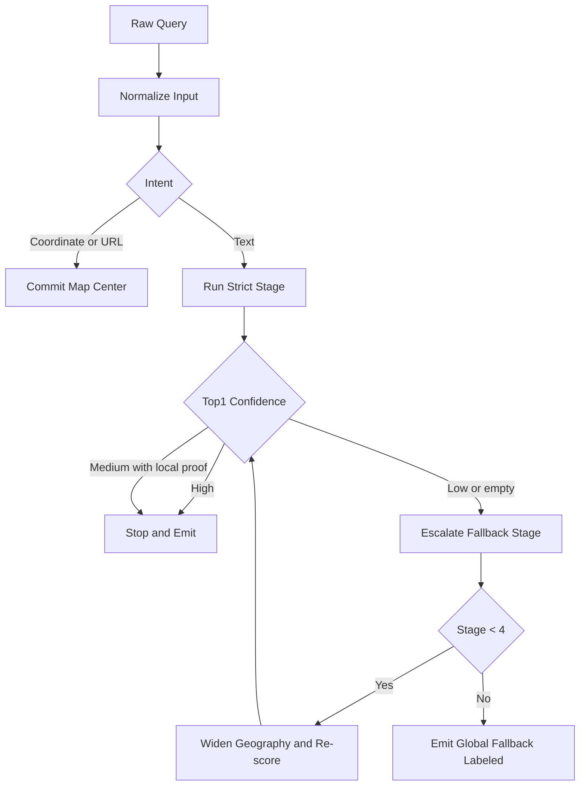
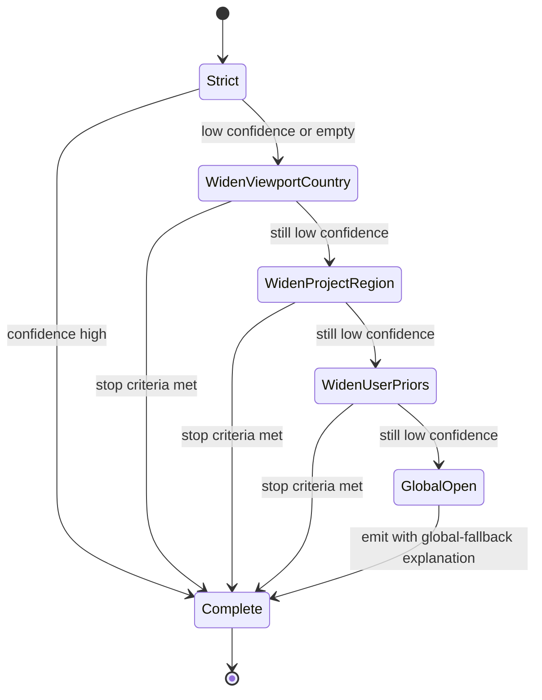
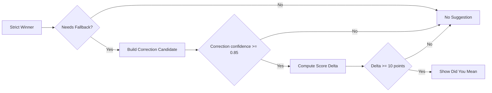
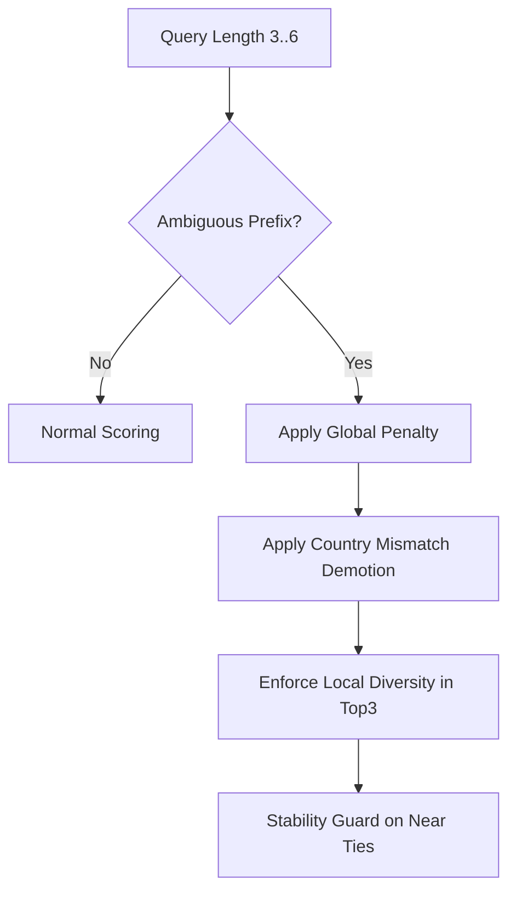
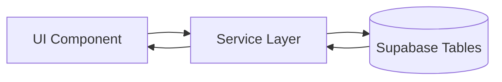
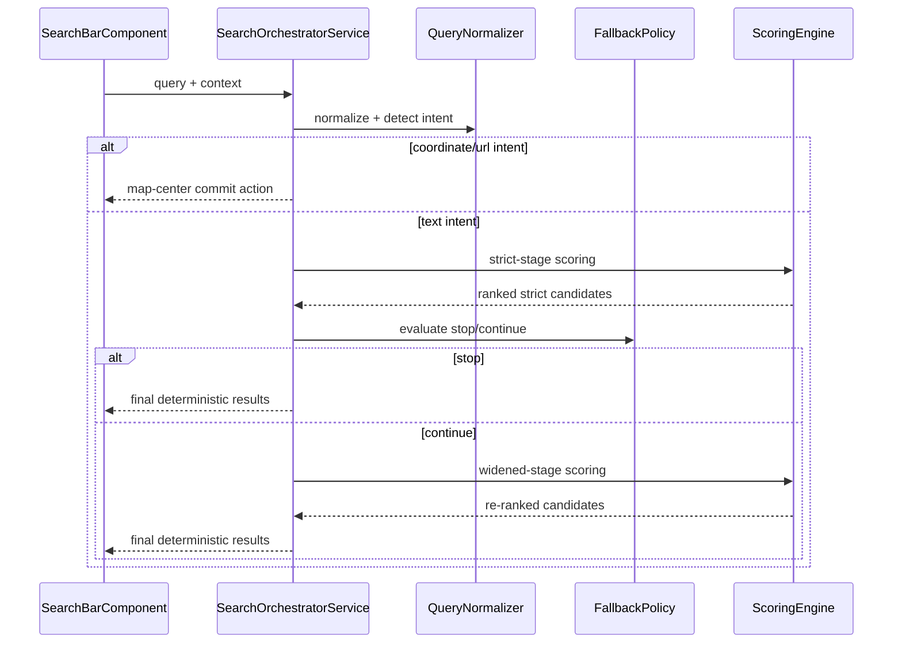
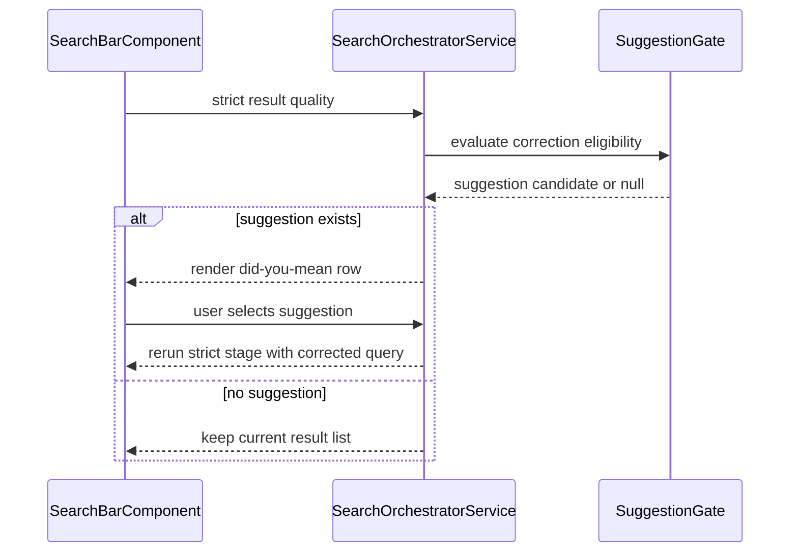

# Search Bar - Query Behavior V2

> **Parent spec:** [search-bar](search-bar.md)
> **Data/service contract:** [search-bar-data-and-service](search-bar-data-and-service.md)
> **Use cases:** [use-cases/search-bar.md](../../../use-cases/search-bar.md)

## What It Is

This spec defines the Search Bar query behavior contract from raw input to deterministic ranked output. It governs normalization, intent detection, fallback escalation, ambiguity guards, correction suggestions, confidence labels, and explanation labels.

## What It Looks Like

The Search Bar keeps the existing UI structure and progressive feel while adding strict behavioral guarantees. For short ambiguous prefixes (for example: `Wilhe`), local results tied to the active work context must outrank unrelated global lookalikes unless user intent clearly requests global scope. Results can display confidence labels and short explanation labels (for example: "Near active project", "In viewport", "Global fallback"). Correction suggestions appear only when improvement is meaningful and measurable.

## Where It Lives

- **Parent**: `SearchBarComponent` behavior contract
- **Applies to**: Query parsing and candidate ordering logic used by `SearchOrchestratorService`
- **Appears when**: User focuses search, types input, accepts ghost completion, or commits search results

## Actions

| #   | User Action                           | System Response                                      | Trigger                  |
| --- | ------------------------------------- | ---------------------------------------------------- | ------------------------ |
| 1   | Types any query text                  | Normalize query, classify intent, run strict stage   | Debounced input          |
| 2   | Types 3 to 6 char ambiguous prefix    | Enable anti-noise guards and local-priority scoring  | Ambiguity class = `high` |
| 3   | Presses `Tab` while ghost text exists | Accept ghost text and rerun strict stage             | `tab-accept` event       |
| 4   | Presses `Tab` without ghost text      | Keep default browser focus behavior                  | Browser default          |
| 5   | Pastes coordinates or map URL         | Short-circuit text search and commit map-center path | `intent=coordinate/url`  |
| 6   | Strict stage has low confidence       | Escalate fallback to next widening stage             | Fallback policy          |
| 7   | Strict stage has high confidence      | Stop widening, emit final ranking                    | Fallback policy          |
| 8   | Candidate correction has strong lift  | Show "Did you mean" suggestion row                   | Suggestion policy        |
| 9   | Commits candidate                     | Persist recency + priors, keep filters intact        | Commit event             |

### Query Decision Flow



### Fallback Escalation State Machine



### Suggestion Gate Flow



### Prefix Anti-Noise Guard Flow



## Component Hierarchy

```
SearchBar Query Layer
├── QueryNormalizer
│   ├── DiacriticNormalizer
│   ├── TokenCanonicalizer
│   ├── SuffixNormalizer
│   └── WhitespaceCollapser
├── IntentDetector
│   ├── CoordinateDetector
│   ├── MapUrlDetector
│   └── TextIntentClassifier
├── AmbiguityGuard
│   ├── PrefixAmbiguityClassifier
│   ├── GlobalNoisePenaltyGate
│   └── LocalDiversityGate
├── FallbackPolicyEngine
│   ├── ContinueStopEvaluator
│   ├── GeographyWideningPlanner
│   └── SuggestionGate
└── ExplanationLayer
    ├── ConfidenceLabeler
    └── ExplanationTagBuilder
```

## Data

### Data Flow (Mermaid)



| Field                 | Source                      | Type                                           |
| --------------------- | --------------------------- | ---------------------------------------------- |
| `normalizedQuery`     | Query normalization stage   | `string`                                       |
| `intent`              | Intent detector             | `'coordinate' \| 'url' \| 'text' \| 'command'` |
| `ambiguityClass`      | Prefix ambiguity classifier | `'low' \| 'medium' \| 'high'`                  |
| `fallbackStage`       | Fallback policy             | `0 \| 1 \| 2 \| 3 \| 4`                        |
| `topConfidence`       | Confidence labeler          | `'high' \| 'medium' \| 'low'`                  |
| `explanationTags`     | Explanation builder         | `string[]`                                     |
| `suggestionCandidate` | Suggestion gate             | `string \| null`                               |

## State

| Name                  | Type                                           | Default  | Controls                    |
| --------------------- | ---------------------------------------------- | -------- | --------------------------- |
| `normalizedQuery`     | `string`                                       | `''`     | Canonical matching input    |
| `intent`              | `'coordinate' \| 'url' \| 'text' \| 'command'` | `'text'` | Query execution path        |
| `ambiguityClass`      | `'low' \| 'medium' \| 'high'`                  | `'low'`  | Ambiguity guard behavior    |
| `fallbackStage`       | `0 \| 1 \| 2 \| 3 \| 4`                        | `0`      | Geography widening stage    |
| `topConfidence`       | `'high' \| 'medium' \| 'low'`                  | `'low'`  | Stop/continue decisions     |
| `suggestionCandidate` | `string \| null`                               | `null`   | Did-you-mean row visibility |

## File Map

| File                                                         | Purpose                                               |
| ------------------------------------------------------------ | ----------------------------------------------------- |
| `docs/element-specs/search-bar/search-bar-query-behavior.md` | Query behavior contract for v2 personalized geosearch |

## Wiring

### Injected Services

- `SearchOrchestratorService` owns stage progression and final deterministic ordering.
- `SearchBarService` provides local recents/ghost primitives and persistence responsibilities.
- `GeocodingService` remains behind service adapters only.

### Inputs / Outputs

None.

### Subscriptions

- Query stream: triggers normalization + intent detection + strict stage.
- Context stream: updates personalization signals and re-scores deterministically.
- Commit stream: updates recency and priors.

### Sequence: Query To Final Result



### Sequence: Suggestion Selection



## Acceptance Criteria

### Core Query Behavior

- [ ] Query normalization is deterministic and idempotent for identical input.
- [ ] Intent detection short-circuits coordinate/map URL input before text retrieval.
- [ ] Query behavior never depends on a hardcoded city.
- [x] Missing personalization signals degrade to neutral behavior, never failure.

### Fallback And Corrections

- [x] Fallback widening starts only after strict stage confidence evaluation.
- [ ] Fallback widening order is exactly: viewport+country -> project-region -> user-priors -> global.
- [ ] Fallback stops immediately when stop criteria are met.
- [ ] Did-you-mean appears only when correction confidence and score-lift thresholds pass.

### Prefix Ambiguity And Noise Suppression

- [ ] For ambiguous prefixes length 3 to 6, local-context candidates outrank unrelated global candidates when local candidates exist.
- [ ] Country mismatch demotion is applied during non-global stages.
- [x] Global fallback candidates are clearly explanation-labeled.
- [ ] Top3 stability guard prevents reorder jitter for near ties below configured delta.

### Determinism And Labels

- [ ] Every candidate has a confidence label (`high`, `medium`, `low`).
- [ ] Every candidate has explanation tags from scoring factors.
- [x] Deterministic tie-break order is applied consistently across repeated identical queries.
- [ ] Search commits do not clear active filters unless explicitly requested by user.

## Scoring Inputs (Behavior Contract)

The scoring formula is owned by [search-bar-data-and-service](search-bar-data-and-service.md), but this behavior layer requires these inputs to be consumed by confidence and explanation generation:

1. Text relevance
2. Geo relevance (marker/project/user/viewport)
3. Project affinity
4. Recency priors
5. Source utility
6. Result quality prior
7. Anti-noise penalty

## Tie-Break Contract

When scores are equal, apply this deterministic chain:

1. Higher confidence label rank
2. Higher source priority rank
3. Shorter geo distance to nearest personalization centroid
4. Lexicographic `normalizedLabel`
5. Stable candidate id
