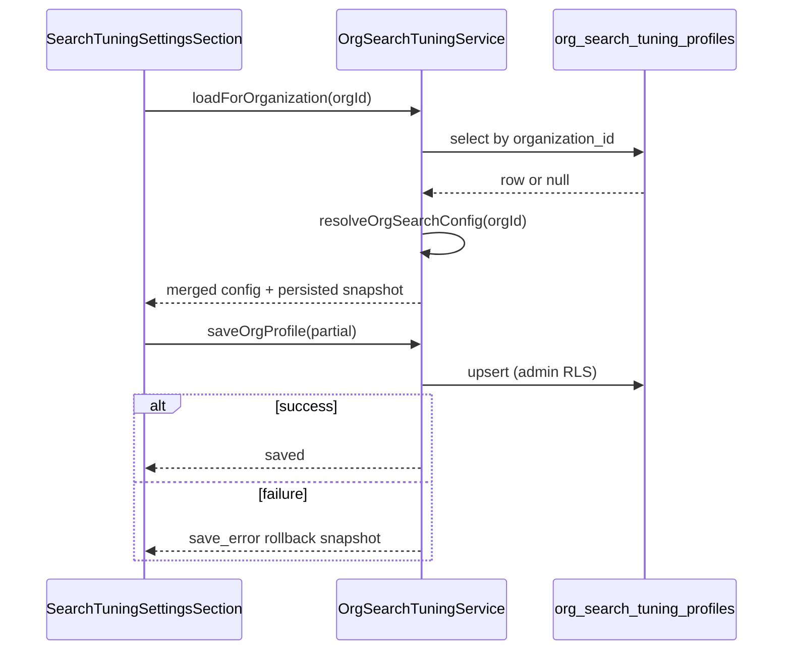

# Search Tuning Settings (Org Admin)

> **Facade / runtime search:** [search-bar-service](../../service/search/search-bar-service.md)  
> **Algorithm reference:** [search-algorithm-addresses-and-places](../../service/location-resolver/search-algorithm-addresses-and-places.md)  
> **Settings registry extension:** [settings-section-registry.md](../settings-overlay/settings-section-registry.md)

## What It Is

Org-level search tuning for address/place ranking. **One profile per organization.** All org members consume the merged config via `resolveOrgSearchConfig(orgId)`; only org **admins** may edit.

**Out of scope:** User-level overrides. Do not reintroduce without a separate architectural decision.

## What It Looks Like

Admin-only section in Settings Overlay (org settings context): Basic mode (curated controls, follow-up spec) and Advanced mode (full parameter groups with warning banner). Sticky actions: Discard unsaved changes, Reset to system defaults (confirmed), Save.

Non-admin members: section **absent** (not read-only, not locked).

## Where It Lives

- **UI:** `SearchTuningSettingsSection` via settings section registry (`visibility: admin-only`).
- **Persistence:** `org_search_tuning_profiles` (Supabase).
- **Runtime:** `OrgSearchTuningService` → `orgSearchConfig` signal.

## Data Model

| Column | Type | Notes |
| --- | --- | --- |
| `organization_id` | uuid PK, FK `organizations` | One row per org |
| `settings_version` | int | Schema version (start at `1`) |
| `values_json` | jsonb | Versioned partial overrides only |
| `updated_at` | timestamptz | |
| `updated_by` | uuid | Last admin who saved |

**RLS** (see [security-boundaries.md](../../../security-boundaries.md), `user_org_id()`, `is_admin()`):

| Operation | Policy |
| --- | --- |
| SELECT | `organization_id = user_org_id()` |
| INSERT/UPDATE/DELETE | `organization_id = user_org_id() AND is_admin()` |

No cross-org access.

### values_json schema (settings_version = 1)

Must be a JSONB **object** (not array/scalar). Allowed top-level keys only:

- `orchestrator`
- `resolver`
- `scoring`
- `query`
- `provider`

Unknown keys on read: ignored + warning log. Unknown keys on write: rejected.

## Merge Contract

`resolveOrgSearchConfig(orgId): SearchTuningConfig`

1. Start from immutable system defaults (`SEARCH_TUNING_SYSTEM_DEFAULTS`).
2. If org row exists, deep-merge `values_json` over defaults key-by-key.
3. Missing keys in `values_json` → filled from defaults silently (no write-back).
4. No org row → full defaults; **do not** auto-create row on read.
5. Downstream code must **never** read raw `values_json`; only merged `SearchTuningConfig`.

## OrgSearchTuningService

| Method / property | Access | Purpose |
| --- | --- | --- |
| `orgSearchConfig` | readonly signal | Merged config for current org |
| `loadForOrganization(orgId)` | internal/bootstrap | Load + merge |
| `saveOrgProfile(partial)` | admin only | Upsert overrides |
| `resetToDefaults()` | admin only | Delete org row (Revert B) |

**Contract violation:** any user-scoped method or write from non-admin UI.

## Revert Actions (Distinct FSM)

| Action | i18n | Scope | Confirmation |
| --- | --- | --- | --- |
| Discard unsaved changes | `settings.search_tuning.action.discard_changes` | Current edit session → last persisted org values | No |
| Reset to system defaults | `settings.search_tuning.action.reset_to_defaults` | Deletes org customization permanently | Yes — `settings.search_tuning.confirm.reset_to_defaults` |

Save FSM: `idle` → `dirty` → `saving` → `saved` | `save_error`. Failed save rolls back to last persisted snapshot.

## Actions

| # | User Action | System Response |
| --- | --- | --- |
| 1 | Admin opens Search Tuning | Load org row or defaults; render editor |
| 2 | Admin edits value | Draft dirty; preview uses draft (no global mutation) |
| 3 | Discard | Revert A — restore persisted org values |
| 4 | Reset to defaults (confirm) | Revert B — delete org row |
| 5 | Save | Validate schema/ranges; upsert; refresh `orgSearchConfig` |



## Component Hierarchy

```text
SearchTuningSettingsSection
├── SectionHeader (settings.search_tuning.section.*)
├── ModeToggle (basic | advanced)
├── AdvancedWarning (settings.search_tuning.advanced_mode.warning)
├── TuningForm (grouped by orchestrator/resolver/scoring/query/provider)
├── PreviewCard (optional)
└── StickyActionBar
   ├── DiscardButton (Revert A)
   ├── ResetToDefaultsButton (Revert B + confirm)
   └── SaveButton
```

## File Map

| File | Purpose |
| --- | --- |
| `apps/web/src/app/core/search/org-search-tuning.service.ts` | Load/merge/save/reset |
| `apps/web/src/app/core/search/search-tuning.types.ts` | `SearchTuningConfig`, schema types |
| `apps/web/src/app/core/search/search-tuning.defaults.ts` | System defaults |
| `apps/web/src/app/core/search/resolve-org-search-config.ts` | Pure merge function |
| `apps/web/src/app/features/settings-overlay/sections/search-tuning-settings-section.component.*` | Admin UI |
| `supabase/migrations/*_org_search_tuning_profiles.sql` | Table + RLS |

## Acceptance Criteria

- [ ] No `UserPreferencesService` or user-scoped tuning persistence in this feature.
- [ ] Non-admins never see Search Tuning in settings rail.
- [ ] Admins can save, discard, and reset-to-defaults as distinct actions.
- [ ] All search/geocoder callsites use merged config from `OrgSearchTuningService`.
- [ ] Cross-org isolation enforced by RLS + `user_org_id()`.

## Distance radii (must read)

Org Search Tuning exposes **one** distance control in the UI (kilometers). Upload uses **two separate meter radii** in code. Full matrix: [search-tuning.distance-radii-contract.md](../../service/search/search-tuning.distance-radii-contract.md).

| User-facing control | Stored key | Unit in UI | Purpose |
| --- | --- | --- | --- |
| Max distance for internet results (km) | `resolver.contextDistanceMaxMeters` | km (stored as m) | Drop unrealistic **Internet + upload geocode** hits too far from **search anchor** (photo GPS → map → project). |
| *(not in this overlay today)* | `exifAssistRadiusMeters` | m (upload config) | Fine-tune **which** geocode candidate matches EXIF among close scores. |
| *(not in this overlay today)* | `sourceAgreementRadiusMeters` | m (upload config) | **Text geocode vs EXIF** agree or source-conflict tray. |

## Settings

- **Search Tuning**: org-level geocoder/search filters, weights, penalties, orchestrator timing, provider limits.
- **Max distance for internet results (km)**: `contextDistanceMaxMeters`; realism cap from search anchor — also normative for upload forward-geocode far-hit rejection ([distance radii contract](../../service/search/search-tuning.distance-radii-contract.md)).
