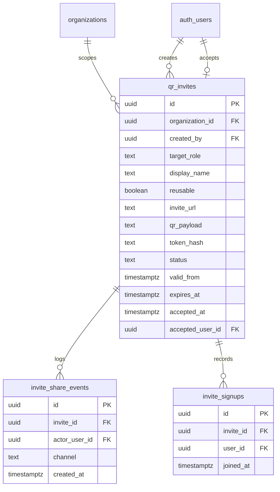

# QR Invite Flow — Data Model

Parent: [qr-invite-flow.md](./qr-invite-flow.md)

## One-shot row shape

`reusable=false`, `display_name` null, `valid_from` null, `expires_at` default `now() + 7 days`.

Reusable rows, `invite_signups`, and 365-day cap: [colleagues-invites-workspace](../colleagues/colleagues-invites-workspace.md).

