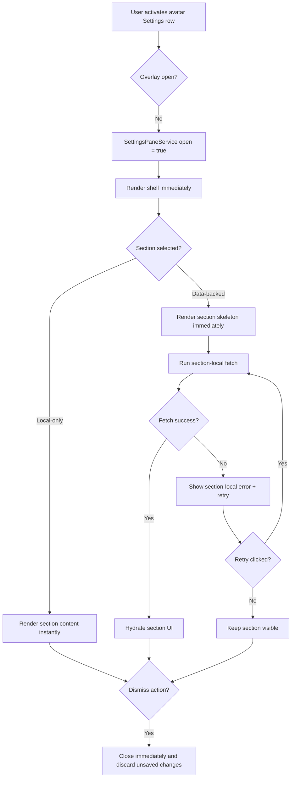
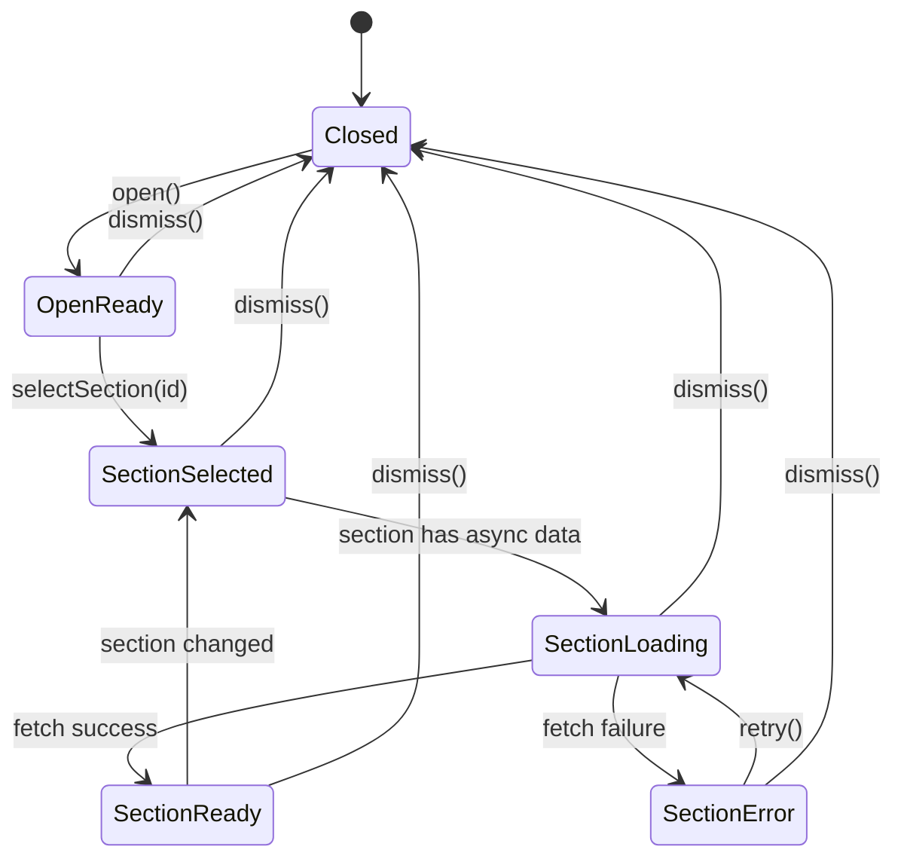
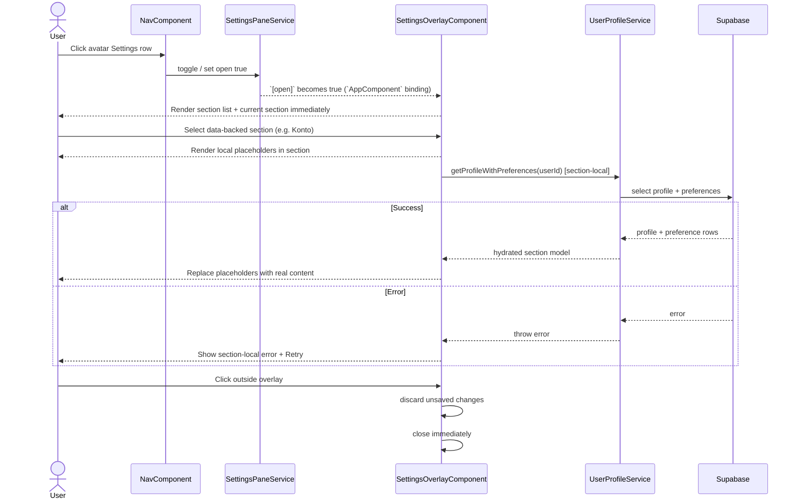

# Settings Overlay

## What It Is

A floating, sidenav-anchored settings panel that opens from the bottom avatar row (Settings) and lets users view and edit profile and preference sections without route navigation.

## What It Looks Like

A two-column, iPad-Settings-style surface appears to the right of the sidebar with a token-based gap. The panel has no entrance animation and opens instantly. A vertical hairline on the **rail** (`border-inline-end`) separates the section list from the detail column (no separate flex “lead” strip). **Rail width:** Phase 7 **Batch 34** removed global **`--overlay-rail-left-*`** bridge rows; shipped **`settings-overlay.component.scss`** defines **`:host`** custom properties (**`--settings-overlay-left-ratio`** `0.38`, **`--settings-overlay-left-width`** as **`clamp(14rem, calc(var(--settings-overlay-width) * var(--settings-overlay-left-ratio)), 17rem)`**, **`--settings-overlay-right-width`** as the remainder). Do **not** spec new work against removed **`--overlay-rail-*`** names. The panel stays vertically centered to the sidebar host and repositions fluidly when the sidebar rail expands or collapses.

**Agent token rule:** Do **not** add **`--shell-*`** or **`--shell-settings-overlay-left`**. **Panel** horizontal offset is **`.settings-overlay`** `left` in component SCSS (spacing + collapsed nav rail literal — same value as **`app-nav`** **`--sidebar-width-collapsed`**; siblings do not share `:host` vars). **In-panel rail column** width is **`var(--settings-overlay-left-width)`** only. Normative decision tree: [`docs/design/shell-layout-tokens.md`](../../../design/shell-layout-tokens.md).

**Code reality:** The shell is a fixed pane next to the nav (see `app.component.html`), not a CDK `OverlayRef`. The dismiss control lives in-flow on the rail toolbar. The detail column is an inline-size **container**: below a width threshold, label/control rows stack to a single column so segmented controls do not overflow when copy widens (e.g. after locale change).

**Detail typography:** Section titles stay on the global `h3` baseline (no per-component heading metric overrides). Intro copy under each `h3` is secondary body (sm, normal weight, reading line-height, muted). Toggle row titles and `hlmLabel` field labels share one **row title** treatment (sm, medium weight, foreground) so list-style switches and segmented fields match—mirroring grouped settings / list-detail guidance (Apple HIG *Lists and tables*, Material settings / preference patterns).

**Embedded panes:** Account and Invite Management (and any future embedded body) must follow [settings-detail-embedded-layout.md](./settings-detail-embedded-layout.md) so rail switches do not change card chrome or hierarchy.

**Detail surface (inline + TOC):** Inline preference sections use **one** flat body on the detail column surface (`.settings-overlay__detail-body` / `.settings-overlay__detail-group`) with **top rules between groups** — not a per-section bordered inner card. A **table-of-contents** row (`.settings-overlay__detail-toc`) may appear under the section lead when **`SETTINGS_SECTION_ANCHORS`** defines anchors for that section; TOC entries are `type="button"` and scroll to stable element ids `settings-{sectionId}-{subsectionSlug}`. Deep links use the same slugs via `SettingsPaneService.subsectionRequest` / `/settings/:section/:subsection` (see [settings-routes.md](../../page/settings-routes.md)). Anchor metadata lives only in [`settings-section-anchors.const.ts`](../../../../apps/web/src/app/features/settings-overlay/settings-section-anchors.const.ts), **not** on the rail `SettingsSection` model. **Invite:** TOC is suppressed while the invite section reports **`panelMode === 'error'`**. **Scroll timing:** subsection navigation uses **`afterNextRender`** plus reactive reads on **account `loading`** and **invite `panelMode`**; optional short **rAF** retry only mitigates paint races. **Sticky TOC** in the detail column is an explicit future enhancement, not part of the shipped contract.

## Interaction emphasis

Left **section rail** rows and detail **TOC chips** follow [`state-visuals.md`](../../../design/state-visuals.md) § Interaction emphasis and [`interaction-emphasis-ink-contract.md`](../../system/interaction-emphasis-ink-contract.md):

| Surface | Selected / active | Hover (non-active) | Child slots |
| ------- | ----------------- | ------------------ | ----------- |
| `.settings-overlay__section-item--active` | `--interaction-selected-ink` + 10% mix | — | media icon inherits selected ink |
| `.settings-overlay__section-item--active:hover` | — | `--brand-gold` + gold wash (same as idle hover) | media + chevron inherit host |
| `.settings-overlay__section-item` (idle) | — | `--brand-gold` + gold wash | media + chevron + label **inherit** — no child `primary` override |
| `.settings-overlay__detail-toc-item` | — | gold quiet hover | label inherits |

Segmented controls (`hlmToggleGroup`) inherit global toggle-group CVA (selected ink when on).

## Where It Lives

- **Route / URL:** Optional `/settings` and `/settings/:section/:subsection` paths (see [settings-routes.md](../../page/settings-routes.md)) sync **`SettingsPaneService`** (`openFromRoute`) with the same overlay shell rendered from **`AppComponent`** (`ss-settings-overlay` sibling of **`app-nav`**). **Open** is also toggled from the nav avatar row without requiring a URL change.
- **Parent**: `AppComponent` template (`apps/web/src/app/app.component.html`) — **`ss-settings-overlay`** is a sibling of **`app-nav`** when the nav chrome is shown. **Open state** is driven by **`SettingsPaneService`** (Nav’s Settings row toggles the same signal the app binds to **`[open]`**).
- **Appears when**: User activates the bottom avatar settings row in the sidenav (or equivalent open action on the service).

## Actions

| #   | User Action                                | System Response                                                                                 | Triggers                           |
| --- | ------------------------------------------ | ----------------------------------------------------------------------------------------------- | ---------------------------------- |
| 1   | Clicks avatar Settings row                 | Opens overlay instantly, anchors to sidenav right edge + spacing token `md`                     | `NavComponent` overlay open action |
| 2   | Overlay opens                              | Renders section shell immediately; no global blocking loading screen                            | overlay open signal                |
| 3   | Selects any local-only section             | Section content appears immediately                                                             | `selectedSectionId` signal update  |
| 4   | Selects data-backed section (`Konto`)      | Section frame renders immediately; inner controls show placeholders/spinner until data resolves | section-local data request         |
| 5   | Section-local fetch fails                  | Shows error/retry only inside that section, not for whole overlay                               | section component error state      |
| 6   | Selects section in left list               | Right detail area switches to selected section component; subsection deep-link target is cleared when changing section via `setSelectedSection` | `selectedSectionId` signal update  |
| 6a  | Clicks a TOC chip in the detail column     | Scrolls the matching anchor into view and replays the subsection highlight                                    | `scrollToDetailAnchor`             |
| 6b  | Opens `/settings/:section/:subsection`     | Overlay opens on **section**; **subsection** scroll/highlight runs when the overlay is visible                 | `AppComponent` → `openFromRoute`   |
| 7   | Selects `Konto` section                    | Renders identity, email/password management, password-recovery action, 2FA, and session actions | account section selection          |
| 7a  | Selects `Shortcuts` section                | Renders categorized shortcut reference table with implementation status                         | shortcuts section selection        |
| 8   | Clicks outside panel or presses Escape     | Closes overlay immediately and discards unsaved local edits                                     | Backdrop click / Escape key        |
| 9   | Sidenav width changes (collapsed/expanded) | Overlay position recalculates with matching transition timing                                   | sidebar expansion signal           |



## Component Hierarchy

```text
ss-settings-overlay (@if open)
└── section.settings-overlay (fixed pane; z-index 500 per component SCSS)
    └── div.settings-overlay__shell
        ├── aside.settings-overlay__sections (rail)
        │   ├── div.settings-overlay__sections-toolbar (in-flow close)
        │   ├── header.settings-overlay__sections-header
        │   └── div.settings-overlay__section-list → button.settings-overlay__section-item × N
        └── div.settings-overlay__detail
            └── @switch(selectedSectionId) bodies
                ├── Inline: .settings-overlay__detail-section
                │   ├── .settings-overlay__detail-lead
                │   ├── .settings-overlay__detail-toc (optional)
                │   └── .settings-overlay__detail-body → .settings-overlay__detail-group …
                ├── app-account (embedded) — optional TOC above
                └── ss-invite-management-section — optional TOC above
```

**Dismiss:** backdrop / Escape handling is owned by the overlay + app shell wiring (not a CDK **`OverlayRef`** — the shipped template is an **`@if (open())`** block with fixed positioning; see `settings-overlay.component.ts` / `app.component.html`).

## Data

| Field             | Source                                           | Type                                         |
| ----------------- | ------------------------------------------------ | -------------------------------------------- | ----- |
| currentUserId     | `AuthService.user()?.id`                         | `string                                      | null` |
| profile           | `UserProfileService.getProfileWithPreferences()` | `UserProfileDto`                             |
| sectionRegistry   | `SETTINGS_SECTION_REGISTRY` token                | `ReadonlyArray<SettingsSectionRegistration>` |
| selectedSectionId | overlay-local signal                             | `string`                                     |
| loadError         | section-local signal (optional)                  | `string                                      | null` |

## State

| Name              | Type                      | Default                 | Controls                        |
| ----------------- | ------------------------- | ----------------------- | ------------------------------- | ------------------------------------ |
| isOpen            | `boolean`                 | `false`                 | Overlay lifecycle               |
| selectedSectionId | `string`                  | first registry entry id | Active section component        |
| profile           | `UserProfileDto           | null`                   | `null`                          | Section detail data                  |
| pendingWriteModel | `Record<string, unknown>` | `{}`                    | Unsaved local edits per section |
| lastError         | `string                   | null`                   | `null`                          | Error UI copy and retry availability |



## File Map

| File                                                                                                | Purpose                                                           |
| --------------------------------------------------------------------------------------------------- | ----------------------------------------------------------------- |
| `apps/web/src/app/features/settings-overlay/settings-overlay.component.ts`                          | Overlay shell: **`open` input**, **`openChange`**, section selection, settings model, dismiss handling |
| `apps/web/src/app/features/settings-overlay/sections/theme-settings-section.component.ts`           | Theme section implementation                                      |
| `apps/web/src/app/features/settings-overlay/sections/language-locale-settings-section.component.ts` | Language/locale section implementation                            |
| `apps/web/src/app/features/settings-overlay/settings-overlay.component.spec.ts`                     | Overlay behavior tests (open/load/error/retry/dismiss/reposition) |

## Wiring

### Injected Services

- `AuthService`: resolves authenticated user context for profile fetches.
- `UserProfileService`: loads and persists profile and preference payloads.
- `SettingsPaneService`: global open/close signal shared with **`AppComponent`** and **`NavComponent`** (no CDK **`Overlay`** for this surface — positioning is fixed CSS in **`settings-overlay.component.scss`**).
- None beyond the above for feature-domain data services unless a section registers its own.

### Inputs / Outputs

- **Inputs**: `open` (boolean; bound from **`AppComponent`** ← **`SettingsPaneService`**).
- **Outputs**: `openChange` — closes or syncs dismiss with **`SettingsPaneService`**.

### Subscriptions

- On width transitions that affect the fixed **`left`** offset, the shell should stay aligned with nav geometry (implementation uses layout tokens + **`transform`** on **`.settings-overlay`** — verify after nav changes).
- Subscribe to backdrop click and Escape key events to trigger immediate dismiss (see component implementation).
- Subscribe to profile load Observable per open cycle; canceled/disposed on dismiss.

### Supabase Calls

- None — delegated to `UserProfileService`.
- `UserProfileService` performs profile/preference reads and writes through Supabase-backed data access.



## Acceptance Criteria

- [ ] Overlay opens from the avatar Settings row without route navigation ( **`SettingsPaneService`** toggles **`[open]`** on **`ss-settings-overlay`** in **`app.component.html`** ).
- [ ] Overlay uses **fixed** positioning and token-driven **`left` / `transform`** from **`settings-overlay.component.scss`** — **not** Angular CDK **`FlexibleConnectedPositionStrategy`** (historical spec text; do not reintroduce CDK positioning for this shell).
- [ ] Overlay uses token spacing between sidenav rail and panel (see **`calc(var(--spacing-3) + …)`** in component SCSS).
- [ ] Overlay is vertically centered (**`top: 50%`** + **`translateY(-50%)`**) relative to the viewport while **`left`** tracks nav width assumptions.
- [ ] Overlay has no entrance animation and appears instantly.
- [ ] When sidenav width changes, the fixed **`left`** offset still reads correctly against nav geometry (spot-check collapsed vs expanded).
- [ ] Overlay detail area renders immediately on open without global blocking loading screen.
- [ ] Data-backed sections use section-local loading/error/retry UI (no full-overlay lock).
- [ ] Click-outside/Escape dismiss closes immediately and discards unsaved changes.
- [ ] Section list is registry-driven and supports adding new sections without shell edits.
- [ ] Language/Locale section integration is present and wired; detailed language behavior is defined in `language-locale-settings.md`.
- [ ] Language switch button labels in Settings always remain native (`English`, `Deutsch`, `Italiano`) and do not change with active UI language.
- [ ] `Konto` section exposes profile identity, email/password management, password recovery, 2FA management, and logout, and does not render a local `Close settings` action.
- [ ] **Detail TOC** appears when **`SETTINGS_SECTION_ANCHORS`** lists anchors for the active section; buttons scroll + highlight without nesting interactive elements.
- [ ] **Subsection slugs** in URLs match anchor `subsectionSlug` values in `SETTINGS_SECTION_ANCHORS` / stable DOM ids (`settings-{section}-{slug}`).

## Settings

- **Theme**: active theme mode and persistence behavior.
- **Notifications**: preference defaults for in-app feedback and alerts.
- **Language / Locale**: UI language and regional formatting defaults; language switch labels stay native (`English`, `Deutsch`, `Italiano`) regardless of active UI language.
- **Search Tuning**: address/place search filters, ranking weights, penalties, and retry behavior.
- **Account & Session**: profile identity, email/password security, password recovery, 2FA setup/management, and session termination controls.
- **Roles & Permissions**: role-based capability visibility and access constraints.
- **Data & Storage**: data retention/export/cache/storage defaults.
- **QR Invite Preferences**: default role, auto-generation behavior, expiration policy, and allowed share channels for QR invites.
- **Invite Management**: invite creation, acceptance, revocation defaults and controls.
- **Custom Properties**: organization metadata key configuration defaults.
- **Map Preferences**: map tile and map-behavior defaults.
- **Workspace Sort Defaults**: default sorting and ordering preferences.
- **Interaction & Shortcuts**: grouped keyboard shortcut reference by category, including implementation status visibility.
