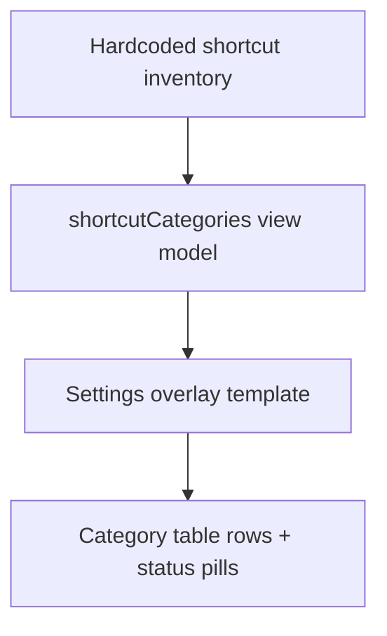
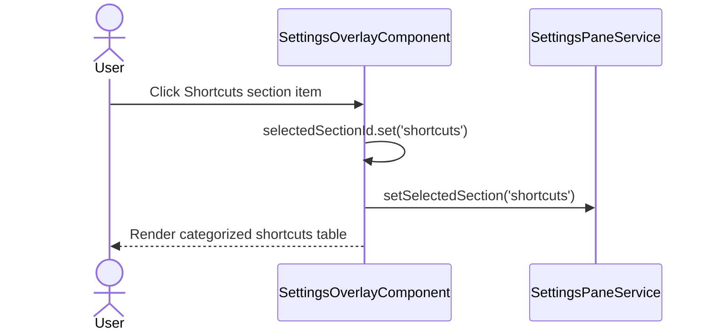

# Shortcut Reference Settings

## What It Is

A dedicated section inside the settings overlay that shows all app shortcuts in one place. Users can quickly scan key combinations by category and see which shortcuts are already implemented versus currently specified.

## What It Looks Like

Inside the existing settings detail column, the section renders as a compact card (`.ui-container`) with a short intro and grouped tables. Each category has a heading and a dense table with four columns: shortcut, action, scope, status. Status pills use semantic token colors (`--color-success` for implemented, `--color-warning` for spec-only) and keep contrast consistent in light and dark themes. Table cells use small but readable typography (`0.8125rem` body) and horizontal scrolling on small viewports.

## Where It Lives

- **Route**: Global overlay on map shell; no route segment.
- **Parent**: `SettingsOverlayComponent` in `apps/web/src/app/features/settings-overlay/settings-overlay.component.ts`.
- **Appears when**: User selects the `Shortcuts` section in the left settings navigation.

## Actions

| #   | User Action                         | System Response                                                               | Triggers                               |
| --- | ----------------------------------- | ----------------------------------------------------------------------------- | -------------------------------------- |
| 1   | Opens settings overlay              | Section list includes `Shortcuts` item                                        | `SettingsOverlayComponent.sectionList` |
| 2   | Selects `Shortcuts` in section list | Detail panel switches to shortcut reference card                              | `selectedSectionId = 'shortcuts'`      |
| 3   | Views category table                | Rows render grouped by category in stable display order                       | `shortcutCategories` source data       |
| 4   | Scans status column                 | Implemented rows show success styling; spec-only rows show warning styling    | `shortcut.status` value                |
| 5   | Opens overlay on mobile width       | Tables stay readable via horizontal overflow container and no clipped content | responsive table wrapper               |

## Component Hierarchy

```text
SettingsOverlayComponent
├── SettingsSectionListColumn (.ui-item list)
│   └── SettingsSectionListItem × N
│       └── ShortcutsListItem [id='shortcuts']
└── SettingsSectionDetailColumn
    └── [selectedSectionId === 'shortcuts'] ShortcutReferenceCard (.ui-container)
        ├── ShortcutReferenceHeader
        │   ├── Title
        │   └── Description
        └── ShortcutCategoryBlock × N
            ├── CategoryTitle
            └── ShortcutTableWrapper (horizontal overflow)
                └── ShortcutTable
                    ├── HeaderRow
                    └── DataRow × N
                        ├── ShortcutKeysCell
                        ├── ActionCell
                        ├── ScopeCell
                        └── StatusCell (pill)
```

```mermaid
flowchart LR
    Nav[Settings section list] -->|selectSection('shortcuts')| Overlay[SettingsOverlayComponent]
    Overlay -->|switch case| ShortcutCard[Shortcut reference detail card]
    ShortcutCard --> Categories[Grouped category tables]
```

## Data

| Field                                 | Source                                       | Type                              |
| ------------------------------------- | -------------------------------------------- | --------------------------------- | ------------ |
| `shortcutCategories`                  | local constant in `SettingsOverlayComponent` | `ReadonlyArray<ShortcutCategory>` |
| `shortcutCategories[].items[].keys`   | local constant                               | `string`                          |
| `shortcutCategories[].items[].action` | local constant                               | `string`                          |
| `shortcutCategories[].items[].scope`  | local constant                               | `string`                          |
| `shortcutCategories[].items[].status` | local constant                               | `'implemented'                    | 'spec-only'` |



## State

| Name                 | Type                              | Default         | Controls                                      |
| -------------------- | --------------------------------- | --------------- | --------------------------------------------- |
| `selectedSectionId`  | `string`                          | `'general'`     | Whether shortcut reference section is visible |
| `shortcutCategories` | `ReadonlyArray<ShortcutCategory>` | static constant | Table category/row content                    |

## File Map

| File                                                                         | Purpose                                             |
| ---------------------------------------------------------------------------- | --------------------------------------------------- |
| `docs/specs/ui/settings-overlay/shortcut-reference-settings.md`                          | Contract for settings shortcut reference section    |
| `apps/web/src/app/features/settings-overlay/settings-overlay.component.ts`   | Adds section metadata and shortcut category dataset |
| `apps/web/src/app/features/settings-overlay/settings-overlay.component.html` | Renders shortcuts section and grouped table UI      |
| `apps/web/src/app/features/settings-overlay/settings-overlay.component.scss` | Styles table layout and status pills                |

## Wiring

- Add `shortcuts` entry to `sectionList` in `SettingsOverlayComponent`.
- Extend section selection routing in `selectSection` so `shortcuts` persists through `SettingsPaneService`.
- Extend `SettingsPaneService` section id union to include `shortcuts`.
- Add an `@case ('shortcuts')` block in `settings-overlay.component.html` for table rendering.



## Acceptance Criteria

- [ ] Settings section list includes a `Shortcuts` entry with icon and subtitle.
- [ ] Selecting `Shortcuts` renders a grouped shortcut table in the detail column.
- [ ] Table includes columns for Shortcut, Action, Scope, and Status.
- [ ] Rows are grouped by category and rendered in stable order.
- [ ] Status styling clearly distinguishes implemented and spec-only rows.
- [ ] Table remains readable on narrow widths via horizontal overflow handling.
- [ ] Existing settings sections continue to render unchanged.

## Settings

- **Interaction & Shortcuts**: grouped keyboard shortcut reference by category, including implementation status visibility.
