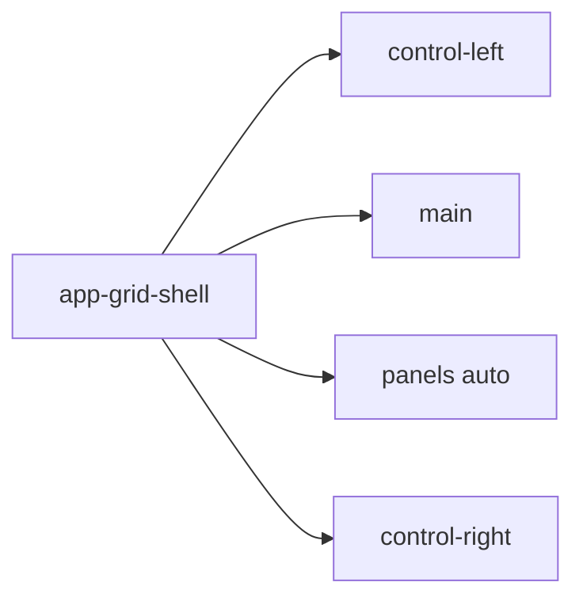
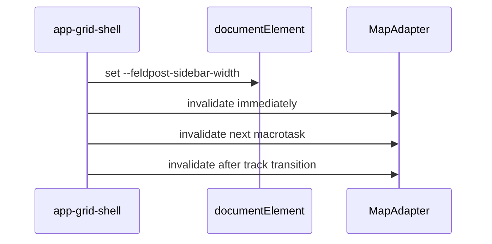

# Grid shell

## What It Is

The authenticated page grid. Its host owns every track width. The left control area, the main canvas, the panel column, and the right control area are the four tracks.

## What It Looks Like

Four columns in one grid when a panel is open: `auto 1fr auto auto`. The gutter is `gap: var(--spacing-3)` and `padding: var(--spacing-3)` on this host — space **between** boxes on the desk, not the inset inside a panel surface. Panel content inset is owned solely by [`shell-panel-surface.md`](./shell-panel-surface.md) (`--spacing-3` on header and body). Action containers, panel boxes, and the canvas share that same gap and one radius, `shell-box` (`var(--container-radius-panel)`). When no panel is open the template is `auto 1fr auto` and the panel column is not a grid item, so one gap remains between the canvas and the right rail. The left and right tracks size to their content. The canvas takes the remaining width (`1fr`). Rail tracks stay transparent. The main canvas is a `shell-box`: the rounded page slot for every left-rail route. Panel surfaces use the same mixin. `@mixin shell-box` in `apps/web/src/styles/_frosted-chrome.scss` wraps `@mixin panel` and `border-radius: var(--container-radius-panel)`. No `--shell-*` custom property.

**Desk elevation (implemented):** track gaps and padding expose **L0 desk** — a darker step behind transparent rails and frosted boxes — see [shell-surface-elevation.md](./shell-surface-elevation.md). Tokens: `--layout-desk-background` on `app-grid-shell` `:host` (light + sandstone stepped; dark equals `--background`).

**One row, one bottom edge** (owner, 2026-09-23). The canvas box and the panel column share the grid row (`minmax(0, 1fr)`). Their bottom edges line up inside the host padding. The panel box is height-capped to that row (`max-height: 100%` on `app-shell-panel-column`). The column stays `overflow: visible` so `--layout-box-shadow` paints into the gutter, the same as the canvas. The box border does not hang below the map.

## Where It Lives

- **Route:** every authenticated route.
- **Parent:** `AuthenticatedAppLayoutComponent`.
- **Appears when:** the authenticated layout is shown. Tablet keeps four tracks. Mobile is unspecified.

## Actions

| # | User Action | System Response | Triggers |
| --- | --- | --- | --- |
| 1 | Opens or closes a panel | Panel track width changes | Map invalidation |
| 2 | Drags column divider (canvas ↔ panel) | Panel column px width updates; canvas `1fr` reflows | [shell-panel-resize.md](./shell-panel-resize.md) |
| 3 | Resizes the viewport | Tracks reflow; panel width clamped | Map invalidation when the canvas width changes |

## Component Hierarchy

```text
app-authenticated-app-layout
└── app-grid-shell
    ├── app-shell-control-area [left]
    ├── app-shell-main-canvas
    ├── app-shell-column-divider          ← when panel open; see shell-panel-resize.md
    ├── app-shell-panel-column
    └── app-shell-control-area [right]
```



## Data

| Source | Contract | Operation |
| --- | --- | --- |
| Grid host | `--feldpost-sidebar-width` on `document.documentElement` | Write the left-track width |
| Settings overlay | reads `--feldpost-sidebar-width` | Unchanged until the overlay is retired |
| `ShellLayoutService` | open panel ids | Read, to size the panel track |
| `ShellPanelColumnResizeService` | `panelColumnWidthPx` | Read/write while panel open — [shell-panel-resize.md](./shell-panel-resize.md) |

The grid host is the only writer of `--feldpost-sidebar-width`. The flex spacer in the authenticated layout is not part of this shell.

## State

| Name | Type | Default | Effect |
| --- | --- | --- | --- |
| `leftTrackWidth` | string | measured | Written to `--feldpost-sidebar-width` |
| `panelColumnWidthPx` | number | 400 (stored default; clamped ≥480px on paint) | Explicit panel track width when any panel open — persisted |

The panel track uses explicit px width (`panelColumnWidthPx`) while any panel is open; when closed the column is not a grid item. See [shell-panel-resize.md](./shell-panel-resize.md).

## File Map

| File | Purpose |
| --- | --- |
| `layout/shell/grid-shell.component.ts` | Grid host |
| `layout/shell/grid-shell.component.html` | Four tracks |
| `layout/shell/grid-shell.component.scss` | `grid-template-columns` |
| `apps/web/src/styles/_frosted-chrome.scss` | `shell-box` mixin |

## Wiring

`AuthenticatedAppLayoutComponent` projects the router outlet into `app-shell-main-canvas`. On a left-track width change, and on a panel-track width change, the host invalidates the Leaflet map three times: immediately, on the next macrotask, and after the track transition (`var(--motion-duration-standard)`).



## Visual Behavior Contract

| Behavior | Visual Geometry Owner | Stacking Context Owner | Interaction Hit-Area Owner | Selector(s) | Layer | Test Oracle |
| --- | --- | --- | --- | --- | --- | --- |
| Four tracks | `app-grid-shell` | `app-grid-shell` | child slots | `:host` | content `0` | columns match the template |
| Track gutter | `app-grid-shell` | `app-grid-shell` | none | `:host` | content `0` | `gap` and `padding` are `--spacing-3` |
| Desk background (L0) | `app-grid-shell` | `app-grid-shell` | none | `:host` | content `0` | darker than page in light — [shell-surface-elevation.md](./shell-surface-elevation.md) |
| Closed panel track | `app-grid-shell` | `app-grid-shell` | `app-shell-panel-column` | `:host[data-panels='closed']` | content `0` | template is `auto 1fr auto` |
| Shared bottom edge | `app-grid-shell` | `app-grid-shell` | none | canvas + panel column | content `0` | box bottoms match; shadow may paint into the gutter |

Geometry, state, and visuals for the tracks sit on `app-grid-shell`. Children do not set `grid-template-columns`.

## Acceptance Criteria

- [ ] Open panels use `auto 1fr auto auto`. A closed panel column uses `auto 1fr auto`. Neither uses a `--shell-*` max.
- [ ] `gap` and `padding` are `var(--spacing-3)`. Child tracks do not add margin for that gutter.
- [ ] No component other than `app-grid-shell` writes `--feldpost-sidebar-width`.
- [ ] A panel open and close with the map visible leaves no grey tile band.
- [ ] `shell-box` uses `@mixin panel` and `var(--container-radius-panel)` only.
- [ ] With a panel open, the canvas box and the panel column end on the same bottom edge. No panel box hangs into the desk padding under the map.
