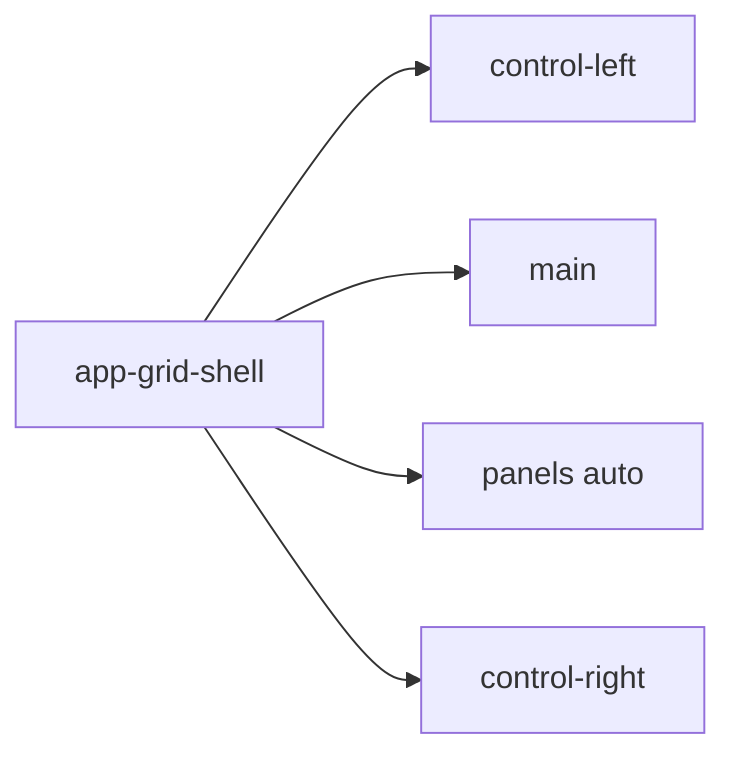
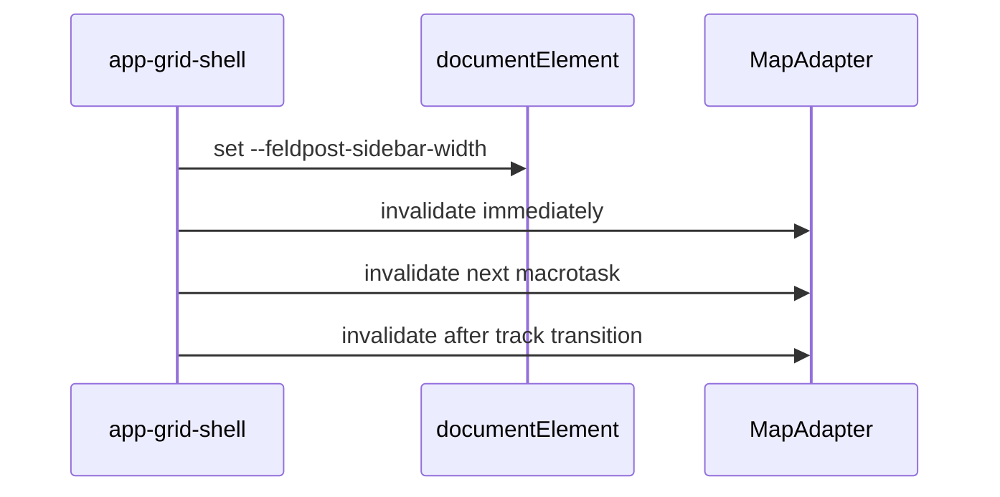

# Grid shell

## What It Is

The authenticated page grid. Its host owns every track width. The left control area, the main canvas, the panel column, and the right control area are the four tracks.

## What It Looks Like

Four columns in one grid. The left and right tracks size to their content. The canvas takes the remaining width (`1fr`). The panel column is an `auto` track and contributes no width when no panel is open. Track backgrounds are transparent. Containers inside the rails and panel surfaces share one surface: `@mixin shell-box` in `apps/web/src/styles/_frosted-chrome.scss`, which wraps `@mixin panel` and `border-radius: var(--container-radius-panel)`. No `--shell-*` custom property.

## Where It Lives

- **Route:** every authenticated route.
- **Parent:** `AuthenticatedAppLayoutComponent`.
- **Appears when:** the authenticated layout is shown. Tablet keeps four tracks. Mobile is unspecified.

## Actions

| # | User Action | System Response | Triggers |
| --- | --- | --- | --- |
| 1 | Opens or closes a panel | Panel track width changes | Map invalidation |
| 2 | Resizes the viewport | Tracks reflow | Map invalidation when the canvas width changes |

## Component Hierarchy

```text
app-authenticated-app-layout
└── app-grid-shell
    ├── app-shell-control-area [left]
    ├── app-shell-main-canvas
    ├── app-shell-panel-column
    └── app-shell-control-area [right]
```



## Data

| Source | Contract | Operation |
| --- | --- | --- |
| Grid host | `--feldpost-sidebar-width` on `document.documentElement` | Write the left-track width |
| Settings overlay | reads `--feldpost-sidebar-width` | Unchanged until the overlay is retired |
| `ShellLayoutService` | open panel ids | Read, to size the panel track |

The grid host is the only writer of `--feldpost-sidebar-width`. The flex spacer in the authenticated layout is not part of this shell.

## State

| Name | Type | Default | Effect |
| --- | --- | --- | --- |
| `leftTrackWidth` | string | measured | Written to `--feldpost-sidebar-width` |

The panel track has no empty-state class. An `auto` track is zero when the column has no open panel.

## File Map

| File | Purpose |
| --- | --- |
| `layout/shell/grid-shell.component.ts` | Grid host <!-- planned --> |
| `layout/shell/grid-shell.component.html` | Four tracks <!-- planned --> |
| `layout/shell/grid-shell.component.scss` | `grid-template-columns` <!-- planned --> |
| `apps/web/src/styles/_frosted-chrome.scss` | `shell-box` mixin |

## Wiring

`AuthenticatedAppLayoutComponent` projects the router outlet into `app-shell-main-canvas`. On a left-track width change, and on a panel-track width change, the host invalidates the Leaflet map three times: immediately, on the next macrotask, and after the track transition (`var(--motion-duration-standard)`).



## Visual Behavior Contract

| Behavior | Visual Geometry Owner | Stacking Context Owner | Interaction Hit-Area Owner | Selector(s) | Layer | Test Oracle |
| --- | --- | --- | --- | --- | --- | --- |
| Four tracks | `app-grid-shell` | `app-grid-shell` | child slots | `:host` | content `0` | columns match the template |
| Panel track width | `app-grid-shell` | `app-grid-shell` | `app-shell-panel-column` | `:host` | content `0` | empty stack is `0` width |

Geometry, state, and visuals for the tracks sit on `app-grid-shell`. Children do not set `grid-template-columns`.

## Acceptance Criteria

- [ ] `grid-template-columns` is `auto 1fr auto auto` with the panel track `auto`, not a `--shell-*` max.
- [ ] No component other than `app-grid-shell` writes `--feldpost-sidebar-width`.
- [ ] A panel open and close with the map visible leaves no grey tile band.
- [ ] `shell-box` uses `@mixin panel` and `var(--container-radius-panel)` only.
