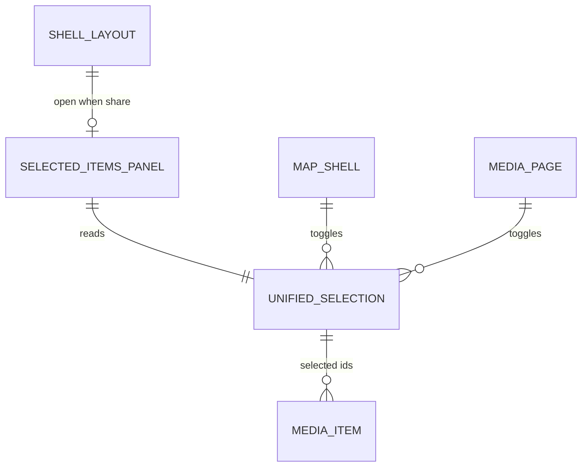
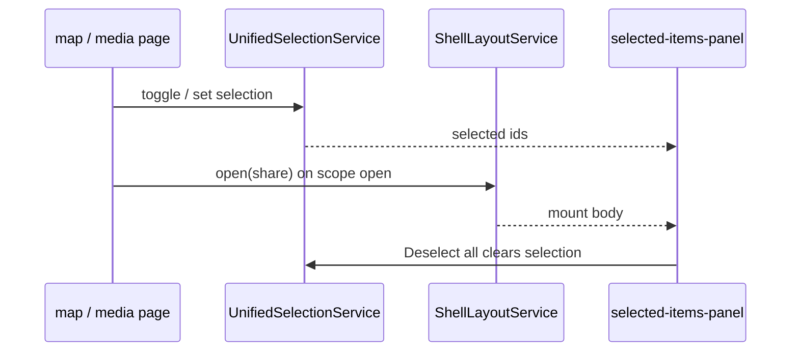

# Selected items panel

> **Internal panel id:** `share` (`ShellLayoutService`)  
> **Product name:** Share (`shell.panel.share.title`, de: Teilen)  
> **Owner decision:** [STUDY-015 §14.7](../../../study/015-shell-grid-layout-change-plan.md) — unified selection; this panel **mirrors** map/`/media` selection, it does not hold a second one.  
> **Replaces (grid shell):** Workspace Pane **Media** tab + drag-divider column. Upload tab already moved to `upload` panel (§14.6).

## What It Is

The right-rail **Share** surface in the panel column. Shows the current unified media selection (grid, toolbar filters) and inline media detail when one item is focused. Selecting happens on the canvas. This panel mirrors that selection. Opens from the right-rail share icon and from selection-driven flows that today open the Workspace Pane.

## What It Looks Like

- **Chrome:** `app-shell-panel-surface` with `panelId="share"` — frosted `shell-box`, title **Share**, close control.
- **Body:** full-height column inside the panel surface body:
  - **Detail mode:** `MediaDetailViewComponent` — full body height; **no** shell footer; **no** body divider. Shell surface title row hidden (detail header owns chrome). Requires panel width ≥ **480px** or panel-embedded layout override — see [shell-panel-resize.md](./shell-panel-resize.md) § Detail mode.
  - **Grid mode:** `WorkspaceToolbarComponent` + `ItemGridComponent` with projected domain items.
  - **Deselect:** one quiet `hlmBtn` `ghost` `xs` on the toolbar, visible when `selectedMediaIds.size > 0`. Label **Deselect all**. Calls `UnifiedSelectionService.clearSelection()`. No export, share, or select-all bar.
  - **Stack split:** when **another** panel stack is open (e.g. Upload + Tips), vertical space is split by the **stack divider** in `app-shell-panel-column` — see [shell-panel-resize.md](./shell-panel-resize.md) § Stack divider. **Not** inside this panel.
- **Width:** panel column uses an explicit px width while open (stored default **400px**, clamped to **≥480px** on paint for detail layout), drag-resizable via `app-shell-column-divider` between canvas and panel column — see [shell-panel-resize.md](./shell-panel-resize.md).
- **No tabs:** Upload and Projects are **not** in this panel. Upload is `upload` panel only; Projects is canvas `/projects`.

## Where It Lives

| Layer | Location |
| --- | --- |
| Shell host | `authenticated-app-layout.component.html` — `data-panel-id="share"` slot |
| Body component | `apps/web/src/app/layout/shell/selected-items-panel/` |
| State | `ShellLayoutService` open stack + unified selection module (see [unified-selection.md](./unified-selection.md)) |
| Right rail | `shell-control.types.ts` — `id: 'share'`, icon `share` |

## Actions

| # | User action | System response | Triggers |
| --- | --- | --- | --- |
| 1 | Clicks right-rail share icon | Toggles `share` only. Other open panels stay | `ShellLayoutService.setOpen('share', !open)` |
| 2 | Selects media on map or `/media` | Selection updates; panel may auto-open (see auto-open rules) | unified selection store |
| 3 | Clicks close on panel surface | `ShellLayoutService.close('share')` | panel unmounts |
| 4 | Clicks item in grid | Opens inline detail for that media id | `detailMediaId` set |
| 5 | Closes detail | Returns to grid mode | `detailMediaId` cleared |
| 6 | Uses toolbar filter/sort/group | Scoped grid updates; selection kept by id | existing workspace toolbar |
| 7 | Clicks **Deselect all** | Clears the canvas selection | `WorkspaceSelectionService.clearSelection()` |
| 8 | Selection becomes empty | Deselect control hides; panel may stay open showing empty state | `selectedMediaIds` empty |
| 9 | Opens share URL with media set | Resolves token; selection becomes resolved ids; panel opens | share restore flow |
| 10 | Grid shell **off** | Legacy Workspace Pane still handles these flows | `shellGridLayout === false` |

### Auto-open rules (grid shell on)

| Condition | Behavior |
| --- | --- |
| First item added to selection (0 → 1) | Open `share` panel if closed |
| Marker/cluster click that adds scope | Open `share` panel; grid shows scoped items |
| Detail requested from map/upload | Open `share` panel; enter detail mode |
| User closed panel manually | Do **not** re-open until next explicit open trigger (selection change alone does not fight user dismiss) |

## Component Hierarchy

```text
app-shell-panel-surface [panelId=share]
├── header (title + collapse; no second app-pane-header)
└── app-selected-items-panel
    ├── @if detailMediaId
    │   └── app-media-detail-view [shellPanelEmbedded=true]
    └── @else
        ├── .selected-items-panel__body
        │   ├── app-workspace-toolbar
        │   │   └── @if selection.size > 0
        │   │       └── Deselect all (`hlmBtn` ghost xs)
        │   └── app-workspace-selected-items-grid
        └── no footer
```

## Data

| Source | Contract | Operation |
| --- | --- | --- |
| `UnifiedSelectionService` | `selectedMediaIds: ReadonlySet<string>` | Read/write selection |
| `WorkspacePaneObserverAdapter` | detail id, route context, active scope | Read (interim); migrate to selection module |
| `MediaDownloadService` | delivery cache | Read (ZIP/export) |
| `ShellLayoutService` | `share` open state | Read/write panel |
| `I18nService` | `shell.panel.share.title` | Title |



## State

| Name | Type | Default | Effect |
| --- | --- | --- | --- |
| `panelOpen` | per `share` id | `closed` | Body mounted in panel column |
| `detailMediaId` | `string \| null` | `null` | Grid vs detail layout |
| `selection` | `Set<string>` | empty | Grid selection + Deselect all visibility |

Panel open/closed: `ShellLayoutService` FSM (`closed` ↔ `open`). Detail and selection are orthogonal to panel FSM.

## File Map

| File | Purpose |
| --- | --- |
| `layout/shell/selected-items-panel/selected-items-panel.component.ts` | Panel body orchestration + body resize observer |
| `layout/shell/selected-items-panel/selected-items-panel.component.html` | Grid/detail composition |
| `layout/shell/selected-items-panel/selected-items-panel.component.scss` | Panel body geometry only |
| `core/unified-selection/unified-selection.service.ts` | Single selection store |
| `core/unified-selection/unified-selection.types.ts` | Scope + mirror contract |
| `authenticated-app-layout.component.html` | Project body into `share` surface |

Reused unchanged (composition only):

- `shared/workspace-pane/workspace-toolbar/`
- `shared/workspace-pane/selected-items/`
- `shared/workspace-pane/media-detail/`

## Wiring



## Interaction emphasis

| Surface | Rest | Hover / active |
| --- | --- | --- |
| Panel close | Muted ink | Primary ink + action hover |
| Grid tiles | Item grid contract | Same as workspace today |
| Deselect all | muted ghost | gold quiet emphasis on hover |

## Visual Behavior Contract

| Behavior | Visual Geometry Owner | Stacking Context Owner | Interaction Hit-Area Owner | Selector(s) | Layer | Test Oracle |
| --- | --- | --- | --- | --- | --- | --- |
| Panel box | `app-shell-panel-surface` | surface | close + body | `:host` | content `0` | `shell-box` |
| Body column | `app-selected-items-panel` | selected-items-panel | scroll region | `.selected-items-panel`, `.selected-items-panel__body` | content `0` | fills surface body |
| Toolbar | `app-workspace-toolbar` | toolbar host | controls | toolbar selectors | content `0` | unchanged from workspace |
| Grid | `app-workspace-selected-items-grid` | grid host | tiles | item-grid contract | content `0` | unchanged |
| Deselect all | `hlmBtn` host | toolbar host | the button | toolbar ghost `xs` | content `0` | visible only when selection is non-empty |

## Migration from Workspace Pane

| Workspace Pane (legacy) | Selected items panel (grid shell) |
| --- | --- |
| `app-workspace-pane` + drag divider | `share` panel column track |
| `photoPanelOpen` signal | `ShellLayoutService.isOpen('share')` |
| Media tab | This panel (only grid content) |
| Upload tab | `upload` panel — **deleted** from workspace |
| Projects tab | Canvas `/projects` — **not** in panel |
| Independent workspace selection | **Removed** — [unified-selection.md](./unified-selection.md) |
| Resizable width via divider | `app-shell-column-divider` + persisted `panelColumnWidthPx` ([shell-panel-resize.md](./shell-panel-resize.md)) |
| Single scroll column | Stack divider in `app-shell-panel-column` when top + bottom stacks open ([shell-panel-resize.md](./shell-panel-resize.md)) |

**Deletion gate (PR 7):** remove `app-workspace-pane`, `app-drag-divider`, and `photoPanelOpen` path only when grid flag is default-on and this panel passes LIVE CHECK.

## Acceptance Criteria

- [x] `share` surface renders `app-selected-items-panel`, not a placeholder paragraph.
- [x] No Upload or Projects tab in this panel.
- [x] Selection in panel grid mirrors map/`/media` selection (no second independent set).
- [x] Toolbar shows one quiet **Deselect all** button when the selection is non-empty, and no bottom export bar.
- [x] Column divider resizes canvas ↔ panel width within clamps; preference persists ([shell-panel-resize.md](./shell-panel-resize.md)).
- [x] Detail view opens inside panel body, same as workspace pane today.
- [x] With `shellGridLayout` on, marker/cluster open flows mount this panel instead of `app-workspace-pane`.
- [x] With `shellGridLayout` off, legacy workspace pane unchanged.
- [ ] Red-test-first: test proving independent workspace-only selection is impossible when flag on.
