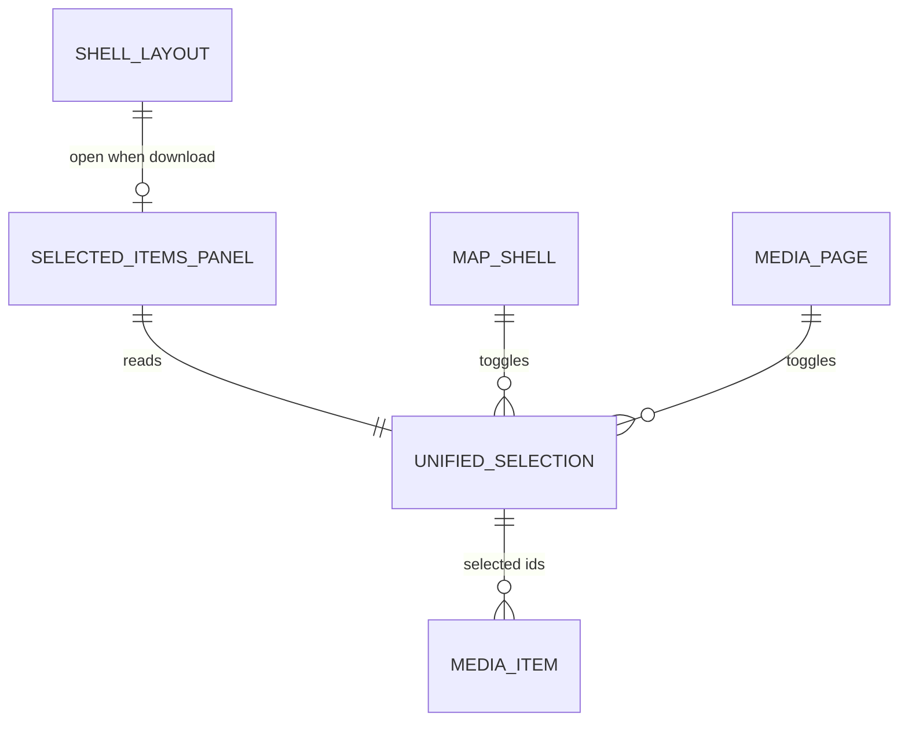

# Selected items panel

> **Internal panel id:** `download` (`ShellLayoutService`)  
> **Product name:** Selected items (`shell.panel.download.title`)  
> **Owner decision:** [STUDY-015 §14.7](../../../study/015-shell-grid-layout-change-plan.md) — unified selection; this panel **mirrors** map/`/media` selection, it does not hold a second one.  
> **Replaces (grid shell):** Workspace Pane **Media** tab + drag-divider column. Upload tab already moved to `upload` panel (§14.6).

## What It Is

The right-rail **Selected items** surface in the panel column. Shows the current unified media selection (grid, toolbar filters, bulk actions footer) and inline media detail when one item is focused. Opens from the right-rail download icon and from selection-driven flows that today open the Workspace Pane.

## What It Looks Like

- **Chrome:** `app-shell-panel-surface` with `panelId="download"` — frosted `shell-box`, title **Selected items**, close control.
- **Body:** full-height column inside the panel surface body:
  - **Detail mode:** `MediaDetailViewComponent` (same contract as workspace pane today).
  - **Grid mode:** `WorkspaceToolbarComponent` + `ItemGridComponent` with projected domain items.
  - **Footer:** `WorkspacePaneFooterComponent` when `selectedMediaIds.size > 0` (selection bar / export actions).
- **Width:** panel column `auto` track — no `--shell-panel-column-max`; width follows panel surface intrinsic sizing (same order of magnitude as today's workspace pane default, not the drag-divider resize model).
- **No tabs:** Upload and Projects are **not** in this panel. Upload is `upload` panel only; Projects is canvas `/projects`.

## Where It Lives

| Layer | Location |
| --- | --- |
| Shell host | `authenticated-app-layout.component.html` — `data-panel-id="download"` slot |
| Body component | `apps/web/src/app/layout/shell/selected-items-panel/` (new; extracts from workspace pane) |
| State | `ShellLayoutService` open stack + unified selection module (see [unified-selection.md](./unified-selection.md)) |
| Right rail | `shell-control.types.ts` — `id: 'download'`, icon `download` |

## Actions

| # | User action | System response | Triggers |
| --- | --- | --- | --- |
| 1 | Clicks right-rail download icon | Toggles `download` panel open/closed | `ShellLayoutService.setOpen('download', !open)` |
| 2 | Selects media on map or `/media` | Selection updates; panel may auto-open (see auto-open rules) | unified selection store |
| 3 | Clicks close on panel surface | `ShellLayoutService.close('download')` | panel unmounts |
| 4 | Clicks item in grid | Opens inline detail for that media id | `detailMediaId` set |
| 5 | Closes detail | Returns to grid mode | `detailMediaId` cleared |
| 6 | Uses toolbar filter/sort/group | Scoped grid updates; selection kept by id | existing workspace toolbar |
| 7 | Uses footer bulk actions | Same as [workspace-actions-bar.md](../workspace/workspace-actions-bar.md) | `WorkspacePaneFooterComponent` |
| 8 | Clears all selection | Footer hides; panel may stay open showing empty state | `selectedMediaIds` empty |
| 9 | Opens share URL with media set | Resolves token; selection becomes resolved ids; panel opens | share restore flow |
| 10 | Grid shell **off** | Legacy Workspace Pane still handles these flows | `shellGridLayout === false` |

### Auto-open rules (grid shell on)

| Condition | Behavior |
| --- | --- |
| First item added to selection (0 → 1) | Open `download` panel if closed |
| Marker/cluster click that adds scope | Open `download` panel; grid shows scoped items |
| Detail requested from map/upload | Open `download` panel; enter detail mode |
| User closed panel manually | Do **not** re-open until next explicit open trigger (selection change alone does not fight user dismiss) |

## Component Hierarchy

```text
app-shell-panel-surface [panelId=download]
└── app-selected-items-panel
    ├── app-pane-header (title + close delegates to surface)
    ├── @if detailMediaId
    │   └── app-media-detail-view
    └── @else
        ├── app-workspace-toolbar
        ├── app-item-grid (+ projected items)
        └── @if selection.size > 0
            └── app-workspace-pane-footer
```

## Data

| Source | Contract | Operation |
| --- | --- | --- |
| `UnifiedSelectionService` | `selectedMediaIds: ReadonlySet<string>` | Read/write selection |
| `WorkspacePaneObserverAdapter` | detail id, route context, active scope | Read (interim); migrate to selection module |
| `MediaDownloadService` | delivery cache | Read (ZIP/export) |
| `ShellLayoutService` | `download` open state | Read/write panel |
| `I18nService` | `shell.panel.download.title` | Title |



## State

| Name | Type | Default | Effect |
| --- | --- | --- | --- |
| `panelOpen` | per `download` id | `closed` | Body mounted in panel column |
| `detailMediaId` | `string \| null` | `null` | Grid vs detail layout |
| `selection` | `Set<string>` | empty | Grid selection + footer visibility |

Panel open/closed: `ShellLayoutService` FSM (`closed` ↔ `open`). Detail and selection are orthogonal to panel FSM.

## File Map

| File | Purpose |
| --- | --- |
| `layout/shell/selected-items-panel.component.ts` | Panel body orchestration |
| `layout/shell/selected-items-panel.component.html` | Grid/detail/footer composition |
| `layout/shell/selected-items-panel.component.scss` | Panel body geometry only |
| `core/unified-selection/unified-selection.service.ts` | Single selection store (new) |
| `core/unified-selection/unified-selection.types.ts` | Scope + mirror contract |
| `authenticated-app-layout.component.html` | Project body into `download` surface |

Reused unchanged (composition only):

- `shared/workspace-pane/workspace-toolbar/`
- `shared/workspace-pane/selected-items/`
- `shared/workspace-pane/footer/workspace-pane-footer/`
- `shared/workspace-pane/media-detail/`

## Wiring


## Interaction emphasis

| Surface | Rest | Hover / active |
| --- | --- | --- |
| Panel close | Muted ink | Primary ink + action hover |
| Grid tiles | Item grid contract | Same as workspace today |
| Footer actions | [workspace-actions-bar.md](../workspace/workspace-actions-bar.md) | unchanged |

## Visual Behavior Contract

| Behavior | Visual Geometry Owner | Stacking Context Owner | Interaction Hit-Area Owner | Selector(s) | Layer | Test Oracle |
| --- | --- | --- | --- | --- | --- | --- |
| Panel box | `app-shell-panel-surface` | surface | close + body | `:host` | content `0` | `shell-box` |
| Body column | `app-selected-items-panel` | selected-items-panel | scroll region | `.selected-items-panel` | content `0` | fills surface body |
| Toolbar | `app-workspace-toolbar` | toolbar host | controls | toolbar selectors | content `0` | unchanged from workspace |
| Grid | `app-item-grid` | item-grid host | tiles | item-grid contract | content `0` | unchanged |
| Footer | `app-workspace-pane-footer` | footer host | footer buttons | footer selectors | content `100` | pinned bottom of body |

## Migration from Workspace Pane

| Workspace Pane (legacy) | Selected items panel (grid shell) |
| --- | --- |
| `app-workspace-pane` + drag divider | `download` panel column track |
| `photoPanelOpen` signal | `ShellLayoutService.isOpen('download')` |
| Media tab | This panel (only grid content) |
| Upload tab | `upload` panel — **deleted** from workspace |
| Projects tab | Canvas `/projects` — **not** in panel |
| Independent workspace selection | **Removed** — [unified-selection.md](./unified-selection.md) |
| Resizable width via divider | Panel column width (no divider) |

**Deletion gate (PR 7):** remove `app-workspace-pane`, `app-drag-divider`, and `photoPanelOpen` path only when grid flag is default-on and this panel passes LIVE CHECK.

## Acceptance Criteria

- [ ] `download` surface renders `app-selected-items-panel`, not a placeholder paragraph.
- [ ] No Upload or Projects tab in this panel.
- [ ] Selection in panel grid mirrors map/`/media` selection (no second independent set).
- [ ] Footer bulk actions match workspace footer behavior (export, share, delete).
- [ ] Detail view opens inside panel body, same as workspace pane today.
- [ ] With `shellGridLayout` on, marker/cluster open flows mount this panel instead of `app-workspace-pane`.
- [ ] With `shellGridLayout` off, legacy workspace pane unchanged.
- [ ] Red-test-first: test proving independent workspace-only selection is impossible when flag on.
