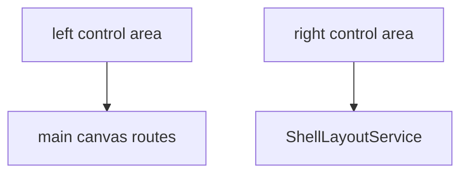

# Control area

## What It Is

A backgroundless rail column. The left rail changes the main canvas. The right rail opens and closes panels. Options come from a static list in this window.

## What It Looks Like

A vertical flex column with no background, no border, and no padding. The grid's `gap` and `padding` are the only gutter. The logo, on the left rail only, sits in its own `app-shell-control-container`. It is the control that opens the overview. A flex leftover separates the top groups from the bottom groups. On the left it sits above the last container. On the right it sits above the history container, so history and help share the bottom. That leftover is not a token. Where two containers are stacked, the gap is `var(--spacing-3)`, the same as the grid gap. The leftover is the space above the bottom group, not that gap. Both rails paint above the middle tracks (`z-index: 200`) so a hover label can sit on the page without widening the track.

## Where It Lives

- **Parent:** `app-grid-shell`, first track (`side="left"`) or fourth track (`side="right"`).
- **Appears when:** the grid shell is shown.

## Actions

| # | User Action | System Response | Triggers |
| --- | --- | --- | --- |
| 1 | Activates a left-rail canvas option | Canvas route changes | existing router links |
| 2 | Activates a right-rail panel option | `ShellLayoutService.setOpen` toggles **that id only**. Other open panels stay | [shell-layout.md](../../service/shell-layout/shell-layout.md) |
| 3 | Activates `+` | Canvas shows the widget directory | route `/widgets` |
| 4 | Activates the logo | Canvas shows the overview | [widget-overview.md](../../page/widget-overview.md) |

## Component Hierarchy

```text
app-shell-control-area
├── app-shell-control-container [logo, left only, opens the overview]
├── app-shell-control-container [top group]
├── leftover spacer
└── app-shell-control-container [bottom group]
```

Left static list: logo, map, projects, media, `+` (inert), account, settings. Where a widget sits is [shell-widget-placement.md](shell-widget-placement.md). That contract is not in the static list in this window. Right rail, three containers. Container 1 stays at the top: upload, selected items, shared media. The leftover sits above container 2, so container 2 and container 3 are bottom aligned. The gap between those two is `var(--spacing-3)`. Container 2: undo, activity history, redo (inert until a history product exists). Container 3: theme, tips, help (top to bottom). The theme option sits above tips in the same container. It cycles light, dark, and sandstone through `ThemeService`, the same as the classic nav utility control, including the three indicator dots under the icon. Account and settings navigate to the settings URL. The surface fills `app-shell-main-canvas`. The rail marks `account` when that section is open, and `settings` for every other open section.

## Data

| Source | Contract | Operation |
| --- | --- | --- |
| Static array on this component | option id, icon, kind | Read |
| `ShellLayoutService` | open panel ids | Read for `data-open` on panel options |

The array is not an installed-widget query.

## State

| Name | Type | Default | Effect |
| --- | --- | --- | --- |
| `side` | `'left' \| 'right'` | input | Which list renders |
| `options` | readonly array | static | Rendered options |

No visual-state boolean inputs. Open panels are read from `ShellLayoutService`.

## File Map

| File | Purpose |
| --- | --- |
| `layout/shell/shell-control-area.component.ts` | Static lists |
| `layout/shell/shell-control-area.component.html` | Groups |
| `layout/shell/shell-control-area.component.scss` | Column flex |

## Wiring



## Visual Behavior Contract

| Behavior | Visual Geometry Owner | Stacking Context Owner | Interaction Hit-Area Owner | Selector(s) | Layer | Test Oracle |
| --- | --- | --- | --- | --- | --- | --- |
| Rail column | `app-shell-control-area` | `app-shell-control-area` | child options | `:host` | content `0` | no background |
| Leftover space | `app-shell-control-area` | same | none | `:host` | content `0` | `space-between` |

`:host` is a grid child: `min-width: 0` and `min-height: 0`.

## Acceptance Criteria

- [ ] The host background is transparent.
- [ ] Left and right options render from one array per side, not copied buttons.
- [ ] `+` opens `/widgets`.
- [ ] The space between groups is `space-between`, not a spacing token on an empty element.
