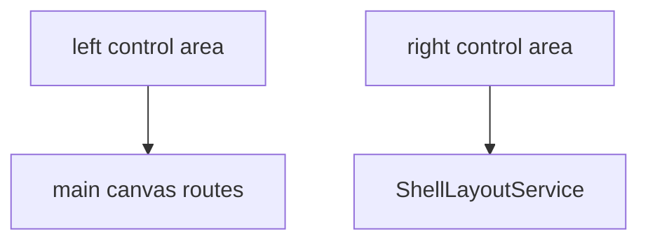

# Control area

## What It Is

A backgroundless rail column. The left rail changes the main canvas. The right rail opens and closes panels. Options come from a static list in this window.

## What It Looks Like

A vertical flex column with no background, no border, and no padding. The grid's `gap` and `padding` are the only gutter. The logo, on the left rail only, sits in its own `app-shell-control-container`. It is not a button. A flex leftover separates the top groups from the last group. That leftover is not a token. The gap between stacked containers is `var(--spacing-3)`, the same as the grid gap. Both rails paint above the middle tracks (`z-index: 200`) so a hover label can sit on the page without widening the track.

## Where It Lives

- **Parent:** `app-grid-shell`, first track (`side="left"`) or fourth track (`side="right"`).
- **Appears when:** the grid shell is shown.

## Actions

| # | User Action | System Response | Triggers |
| --- | --- | --- | --- |
| 1 | Activates a left-rail canvas option | Canvas route changes | existing router links |
| 2 | Activates a right-rail panel option | `ShellLayoutService.setOpen` flips that panel | [shell-layout.md](../../service/shell-layout/shell-layout.md) |
| 3 | Activates `+` | No navigation | inert until the widget page exists |

## Component Hierarchy

```text
app-shell-control-area
├── app-shell-control-container [logo, left only, not a button]
├── app-shell-control-container [top group]
├── leftover spacer
└── app-shell-control-container [bottom group]
```

Left static list: logo, map, projects, media, `+` (inert), account, settings. Right static list, three containers: notifications, upload, download, shared media; undo, change history, redo (inert until a history product exists); tips, help. The leftover sits before the last container. Account and settings keep today's routes and the settings overlay.

## Data

| Source | Contract | Operation |
| --- | --- | --- |
| Static array on this component | option id, icon, kind | Read |
| `ShellLayoutService` | open panel ids | Read for `data-open` on panel options |

The array is not an installed-widget query.

## State

| Name | Type | Default | Effect |
| --- | --- | --- | --- |
| `side` | `'left' \| 'right'` | input | Which list renders |
| `options` | readonly array | static | Rendered options |

No visual-state boolean inputs. Open panels are read from `ShellLayoutService`.

## File Map

| File | Purpose |
| --- | --- |
| `layout/shell/shell-control-area.component.ts` | Static lists |
| `layout/shell/shell-control-area.component.html` | Groups |
| `layout/shell/shell-control-area.component.scss` | Column flex |

## Wiring



## Visual Behavior Contract

| Behavior | Visual Geometry Owner | Stacking Context Owner | Interaction Hit-Area Owner | Selector(s) | Layer | Test Oracle |
| --- | --- | --- | --- | --- | --- | --- |
| Rail column | `app-shell-control-area` | `app-shell-control-area` | child options | `:host` | content `0` | no background |
| Leftover space | `app-shell-control-area` | same | none | `:host` | content `0` | `space-between` |

`:host` is a grid child: `min-width: 0` and `min-height: 0`.

## Acceptance Criteria

- [ ] The host background is transparent.
- [ ] Left and right options render from one array per side, not copied buttons.
- [ ] `+` does not navigate.
- [ ] The space between groups is `space-between`, not a spacing token on an empty element.
