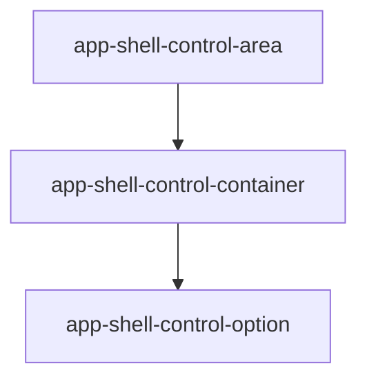

# Control container

## What It Is

A frosted box that groups control options inside a control area. The column outside it stays backgroundless.

## What It Looks Like

`@include shell-box` from `apps/web/src/styles/_frosted-chrome.scss`: `@mixin panel` plus `border-radius: var(--container-radius-panel)`. Options stack vertically with `gap: var(--spacing-1)`. The box does not stretch to fill leftover rail space.

## Where It Lives

- **Parent:** `app-shell-control-area`.
- **Appears when:** its group has at least one option.

## Actions

| # | User Action | System Response | Triggers |
| --- | --- | --- | --- |
| 1 | None on the box | Options handle clicks | child options |

## Component Hierarchy

```text
app-shell-control-container
└── app-shell-control-option [repeat]
```

## Data

| Source | Contract | Operation |
| --- | --- | --- |
| Parent | projected options | Project |

## State

| Name | Type | Default | Effect |
| --- | --- | --- | --- |
| none | — | — | No FSM |

## File Map

| File | Purpose |
| --- | --- |
| `layout/shell/shell-control-container.component.ts` | Box host <!-- planned --> |
| `layout/shell/shell-control-container.component.html` | Projection <!-- planned --> |
| `layout/shell/shell-control-container.component.scss` | `shell-box` <!-- planned --> |

## Wiring

The control area projects one container for the top group and one for the bottom group.



## Visual Behavior Contract

| Behavior | Visual Geometry Owner | Stacking Context Owner | Interaction Hit-Area Owner | Selector(s) | Layer | Test Oracle |
| --- | --- | --- | --- | --- | --- | --- |
| Frosted box | `app-shell-control-container` | `app-shell-control-container` | child options | `:host` | content `0` | `shell-box` only |

Geometry, frost, radius, and shadow are on `:host`. Children do not repeat the box.

## Acceptance Criteria

- [ ] `:host` includes `shell-box` and no second background rule.
- [ ] The container does not paint the rail's leftover space.
- [ ] Radius is `var(--container-radius-panel)`.
