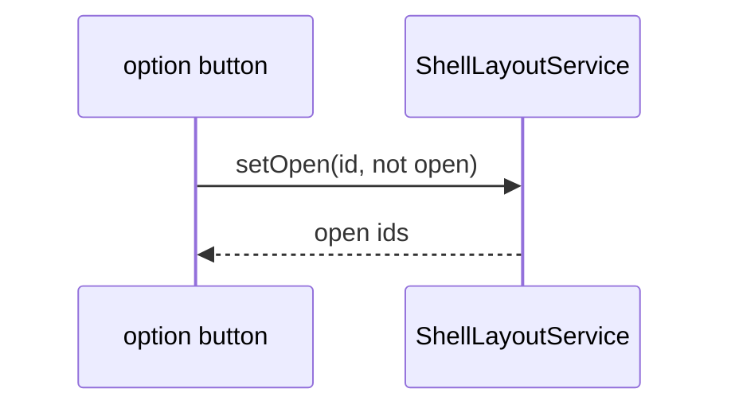

# Control option

## What It Is

A `var(--shell-control-option-size)` icon button in a control container. A hover label overlays beside it and does not change track size.

## What It Looks Like

Circle hit target, `2.75rem` by `2.75rem` (`--shell-control-option-size`), icon centered. Hover ink is `--brand-gold` on `--action-hover`. Not an `hlmBtn` variant. Custom `app-shell-control-option` with class `shell-control-option__button`. The label is a pill (`var(--radius-full)`) on plane `200`, positioned beside the button. It does not participate in the rail's flex size. Canvas option uses the current route for emphasis. Panel option uses the open state from `ShellLayoutService`.

## Where It Lives

- **Parent:** `app-shell-control-container`.
- **Appears when:** the parent list includes the option.

## Actions

| # | User Action | System Response | Triggers |
| --- | --- | --- | --- |
| 1 | Click a canvas option | Router navigates | `routerLink` |
| 2 | Click a panel option | `setOpen(id, !open)` | `ShellLayoutService` |
| 3 | Pointer rests 1s | Label becomes visible | hover |
| 4 | Pointer leaves | Label hides | hover |
| 5 | Click `+` | Nothing | inert |

## Component Hierarchy

```text
app-shell-control-option
├── button or anchor
└── span.shell-control-option__label
```

## Data

| Source | Contract | Operation |
| --- | --- | --- |
| Input `option` | id, icon, label key, kind | Read |
| `I18nService` | `t(key, fallback)` | Label text |
| `ShellLayoutService` | open ids | `data-open` |

## State

| Name | Type | Default | Effect |
| --- | --- | --- | --- |
| `label` | `'hidden' \| 'shown'` | `hidden` | Label opacity |

Transitions: `hidden → shown` after the pointer rests; `shown → hidden` when the pointer leaves. Any other transition stays on the current state. The 1s rest is a token added in `_typography-baseline.scss` when this component is implemented, not a raw duration in component SCSS.

## File Map

| File | Purpose |
| --- | --- |
| `layout/shell/shell-control-option.component.ts` | Click and label state |
| `layout/shell/shell-control-option.component.html` | Button and label |
| `layout/shell/shell-control-option.component.scss` | Target and overlay label |
| `layout/shell/shell-control-option-state.ts` | Transition guard |

## Wiring



## Interaction emphasis

- Canonical: `docs/design/state-visuals.md` § Interaction emphasis
- [ ] This component implements the contract

## Visual Behavior Contract

| Behavior | Visual Geometry Owner | Stacking Context Owner | Interaction Hit-Area Owner | Selector(s) | Layer | Test Oracle |
| --- | --- | --- | --- | --- | --- | --- |
| Hit target | button | `app-shell-control-option` | button | `button` | content `0` | `--shell-control-option-size` square |
| Hover label | label span | `app-shell-control-option` | none | `.shell-control-option__label` | `200` | rail width unchanged |

The label is `position: absolute` against the option host. Showing it does not change the button's box.

## Acceptance Criteria

- [ ] The button is `--shell-control-option-size` square.
- [ ] Showing the label does not change the grid track widths.
- [ ] Copy uses `t(key, fallback)` with an English fallback.
- [ ] `+` has no `routerLink` and no panel id.
