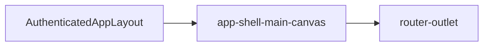

# Main canvas

## What It Is

The generic content track of the grid shell. It shows whatever route or widget is current. The map is one tenant, not the owner of the shell.

## What It Looks Like

A transparent region that fills the `1fr` track. It has no chrome of its own. Content brings its own surface. The track stretches to the grid row height.

## Where It Lives

- **Parent:** `app-grid-shell`, second track.
- **Appears when:** the grid shell is shown.

## Actions

| # | User Action | System Response | Triggers |
| --- | --- | --- | --- |
| 1 | Navigates to a canvas route | Projected content swaps | router outlet |
| 2 | Pans the map | Map handles the gesture | content, not this host |

## Component Hierarchy

```text
app-shell-main-canvas
└── ng-content / router-outlet
```

## Data

| Source | Contract | Operation |
| --- | --- | --- |
| Parent layout | routed component | Project |

This component does not read panel state or rail lists.

## State

| Name | Type | Default | Effect |
| --- | --- | --- | --- |
| none | — | — | Content owns its own state |

## File Map

| File | Purpose |
| --- | --- |
| `layout/shell/shell-main-canvas.component.ts` | Slot host <!-- planned --> |
| `layout/shell/shell-main-canvas.component.html` | Projection <!-- planned --> |
| `layout/shell/shell-main-canvas.component.scss` | Fill the track <!-- planned --> |

## Wiring

`AuthenticatedAppLayoutComponent` places the existing router outlet and map host here. This component does not choose the route.



## Visual Behavior Contract

| Behavior | Visual Geometry Owner | Stacking Context Owner | Interaction Hit-Area Owner | Selector(s) | Layer | Test Oracle |
| --- | --- | --- | --- | --- | --- | --- |
| Fill track | `app-shell-main-canvas` | `app-shell-main-canvas` | projected content | `:host` | content `0` | host is `min-width: 0` and `min-height: 0` |

`:host` is a grid child and declares `min-width: 0` and `min-height: 0`. No background, border, or radius on this host.

## Acceptance Criteria

- [ ] The host has no background and no border.
- [ ] The map can mount inside the canvas without the canvas importing Leaflet.
- [ ] `:host` sets `min-width: 0` and `min-height: 0`.
