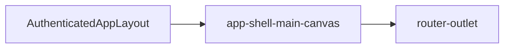

# Main canvas

## What It Is

The generic content track of the grid shell. It shows whatever route or widget is current. The map is one tenant, not the owner of the shell.

## What It Looks Like

A rounded page box in the `1fr` track. Every left-rail page (map, projects, media, and later pages) renders inside this one box. `@include shell-box` supplies the frost, the border, and `border-radius: var(--container-radius-panel)`. The grid host owns the gutter (`gap` and `padding`). This host has no margin. `overflow: hidden` clips the page to that radius.

**Page documents are left-aligned** (owner, 2026-09-23 — [STUDY-015 §16](../../../study/015-shell-grid-layout-change-plan.md)). Title, toolbar, and grids start at the left content edge of this box. The host does not center the page (`margin-inline: auto` / a centered max-width column on the page root is forbidden).

**Media fills the width** (owner, 2026-09-23). `/media` has no inner rail, so its title, toolbar, and grid use the canvas width inside the inset. **Projects keeps its list** on the left; the dashboard uses the width beside that list. The **map** fills the box.

## Where It Lives

- **Parent:** `app-grid-shell`, second track.
- **Appears when:** the grid shell is shown.

## Actions

| # | User Action | System Response | Triggers |
| --- | --- | --- | --- |
| 1 | Navigates to a canvas route | Projected content swaps | router outlet |
| 2 | Pans the map | Map handles the gesture | content, not this host |

## Component Hierarchy

```text
app-shell-main-canvas
└── ng-content / router-outlet
```

## Data

| Source | Contract | Operation |
| --- | --- | --- |
| Parent layout | routed component | Project |

This component does not read panel state or rail lists.

## State

| Name | Type | Default | Effect |
| --- | --- | --- | --- |
| none | — | — | Content owns its own state |

## File Map

| File | Purpose |
| --- | --- |
| `layout/shell/shell-main-canvas.component.ts` | Slot host |
| `layout/shell/shell-main-canvas.component.html` | Projection |
| `layout/shell/shell-main-canvas.component.scss` | Rounded page box |

## Wiring

`AuthenticatedAppLayoutComponent` places the existing router outlet and map host here. This component does not choose the route.



## Visual Behavior Contract

| Behavior | Visual Geometry Owner | Stacking Context Owner | Interaction Hit-Area Owner | Selector(s) | Layer | Test Oracle |
| --- | --- | --- | --- | --- | --- | --- |
| Page box | `app-shell-main-canvas` | `app-shell-main-canvas` | projected page | `:host` | content `0` | `shell-box`, radius `--container-radius-panel`, no margin |
| Page document alignment | projected page | canvas | page | page root inside `:host` | content `0` | Media fills the width; Projects list stays left; map fills the box |

`:host` is a grid child and declares `min-width: 0` and `min-height: 0`. The projected page does not paint its own outer radius.

## Acceptance Criteria

- [x] `:host` includes `shell-box` and clips its page with `overflow: hidden`.
- [x] Radius is `var(--container-radius-panel)`.
- [x] The host has no margin. The gutter is the grid's `gap` and `padding`.
- [x] Map, projects, and media all mount in this box. The canvas does not import Leaflet.
- [x] `:host` sets `min-width: 0` and `min-height: 0`.
- [x] Media and Projects content starts at the left edge of the box. Media uses the canvas width. The Projects list stays on the left. The map still fills the box.
