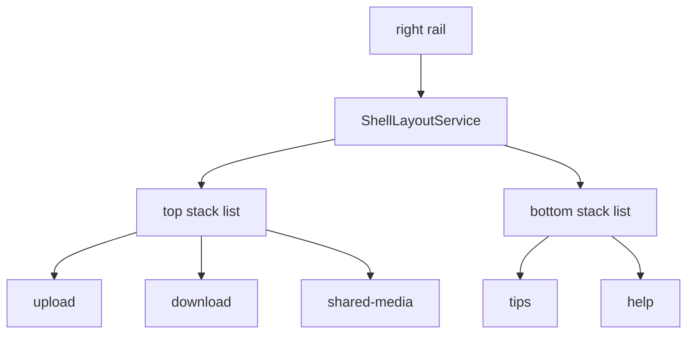
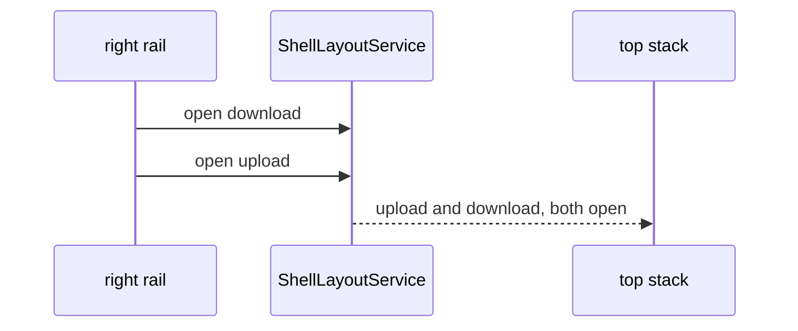

# Panel column

## What It Is

The third grid track. It stacks panels opened from the **right rail**, aligned to match rail container groups: **top stack** (actions) and **bottom stack** (help). Each stack holds every open id in that group. It has no background of its own. Whether an id is open is owned by [shell-layout.md](../../service/shell-layout/shell-layout.md): opening one id does not close another. User scenarios: [UC-022](../../../use-cases/UC-022-panel-stacks.md).

## What It Looks Like

A vertical flex column filling the grid row height. `max-height: 100%` keeps a panel box on the canvas bottom. The column `overflow` stays `visible` so the `shell-box` shadow paints into the gutter. Surfaces inside one stack use `gap: var(--spacing-3)`, the same gutter as the grid, in ascending `order` (first opened at the head of that stack).

| Stack | Panel ids | Rail source | Alignment |
| --- | --- | --- | --- |
| Top | `upload`, `download`, `shared-media` | Actions container | Top of column |
| Bottom | `tips`, `help` | Help container | Bottom of column when alone |

**One surface in a stack.** That surface may grow up to the stack max and scroll inside its body. A filled lone top stack ends on the canvas bottom.

**Two or more surfaces in a stack.** Every open surface stays mounted. None uses `max-height: 100%` and none uses `min-height: 0` in a way that can shrink it to nothing. Each keeps at least its header. The stack (`overflow: auto`) scrolls when the sum exceeds the stack's height. There is no divider between siblings. The only divider is between the top stack and the bottom stack.

When **both** stacks are open **and** their natural heights overflow the column, a **stack divider** splits the height — see [shell-panel-resize.md](./shell-panel-resize.md). Natural height of a stack is the sum of its surfaces plus the gaps between them. When both fit, a flex spacer sits between them: top stack at the head, bottom stack at the foot, no divider. A lone top stack has no spacer under it, so when that stack is filled its box ends on the canvas bottom. A lone bottom stack keeps the spacer above it.

When nothing is open this host is `display: none`, so it is not a grid item and the shell `gap` is not doubled. Width when open follows `--shell-panel-column-width`.

## Where It Lives

- **Parent:** `app-grid-shell`, third track.
- **Appears when:** the grid shell is shown. The track is present in the template even when empty.

## Actions

| # | User Action | System Response | Triggers |
| --- | --- | --- | --- |
| 1 | Opens a top-rail panel | Surface mounts in the top stack. Other open ids stay | `ShellLayoutService` |
| 2 | Opens a bottom-rail panel | Surface mounts in the bottom stack. Other open ids stay | `ShellLayoutService` |
| 3 | Opens a second panel in the same stack | Both surfaces stay, gap `--spacing-3`. The stack scrolls if they overflow | `order` |
| 4 | Opens panels in both stacks | Divider appears **only if** combined natural height overflows column | measured overflow |
| 5 | Drags stack divider | Top/bottom max-heights update | [shell-panel-resize.md](./shell-panel-resize.md) |
| 6 | Closes the last panel | Track hidden | grid `auto` |

## Component Hierarchy

```text
app-shell-panel-column
├── .shell-panel-column__top          ← scrolls when two or more surfaces overflow
│   ├── app-shell-panel-surface [upload]
│   ├── app-shell-panel-surface [download]
│   └── app-shell-panel-surface [shared-media]
├── app-shell-panel-body-divider      ← both stacks open and they overflow
├── .shell-panel-column__spacer       ← bottom stack open, and they do not overflow
└── .shell-panel-column__bottom       ← scrolls when two or more surfaces overflow
    ├── app-shell-panel-surface [tips]
    └── app-shell-panel-surface [help]
```

A surface is in the tree only while its id is open. Order inside a stack follows `order`, not the tree order above.





## Data

| Source | Contract | Operation |
| --- | --- | --- |
| `ShellLayoutService` | open panels | Read |
| `ShellPanelStackResizeService` | `topStackExtentPx` when split | Read/write |

## State

| Name | Type | Default | Effect |
| --- | --- | --- | --- |
| `openPanels` | computed list | `[]` | Which surfaces mount |
| `data-stack-split` | host attr | absent | Both stacks open and they overflow |

## File Map

| File | Purpose |
| --- | --- |
| `layout/shell/shell-panel-column.component.ts` | Stack orchestration + resize observer |
| `layout/shell/shell-panel-column.component.html` | Top/bottom stacks + divider |
| `layout/shell/shell-panel-column.component.scss` | Flex alignment |

## Visual Behavior Contract

| Behavior | Visual Geometry Owner | Stacking Context Owner | Interaction Hit-Area Owner | Selector(s) | Layer | Test Oracle |
| --- | --- | --- | --- | --- | --- | --- |
| Column flex | `app-shell-panel-column` | panel column | child stacks | `:host` | content `0` | height 100%, overflow visible, shadow paints, bottom matches canvas |
| Top stack | `.shell-panel-column__top` | panel column | stack scroll when multi | top stack | content `0` | top-aligned; siblings stay visible |
| Bottom stack | `.shell-panel-column__bottom` | panel column | stack scroll when multi | bottom stack | content `0` | bottom-aligned when alone |
| Stack divider | `app-shell-panel-body-divider` | divider host | hit zone | `.shell-panel-body-divider__hit-zone` | content `1` | only when both stacks overflow the column |

`:host` is a grid child: `min-width: 0` and `min-height: 0`. No background.

## Acceptance Criteria

- [ ] Upload and Help open together show a stack divider only when their natural heights overflow the column. When they fit, Help sits at the foot and there is no divider.
- [ ] Upload and Download open together. Both stay mounted. Gap is `--spacing-3`. Opening the second does not unmount the first.
- [ ] Tips and Help open together in the bottom stack. Same rule.
- [ ] With two or more surfaces in one stack, that stack scrolls and no surface is shrunk to 0 height.
- [ ] With one surface in a stack, that surface may fill up to the stack max and scroll inside its body.
- [ ] The column's bottom edge matches the canvas. A panel box does not hang below the map. Its `shell-box` shadow is visible.
- [ ] Upload alone: panel top-aligned when shorter than the column. When the top stack is filled, its bottom edge matches the canvas.
- [ ] Tips alone: panel bottom-aligned; empty space above.
- [ ] Closing the last panel leaves no reserved column width.
