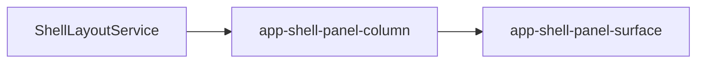

# Panel column

## What It Is

The third grid track. It stacks the panels the right rail has opened. It has no background of its own.

## What It Looks Like

A vertical stack of panel surfaces with `gap: var(--spacing-2)`. The track scrolls when the stack is taller than the viewport. When nothing is open this host is `display: none`, so it is not a grid item and the shell `gap` is not doubled. Width when open follows the open surfaces, not a `--shell-*` maximum.

## Where It Lives

- **Parent:** `app-grid-shell`, third track.
- **Appears when:** the grid shell is shown. The track is present in the template even when empty.

## Actions

| # | User Action | System Response | Triggers |
| --- | --- | --- | --- |
| 1 | Opens a second panel | Both surfaces stack | `ShellLayoutService` |
| 2 | Closes the last panel | Track width becomes zero | grid `auto` |

## Component Hierarchy

```text
app-shell-panel-column
└── app-shell-panel-surface [for each open panel, by order]
```

## Data

| Source | Contract | Operation |
| --- | --- | --- |
| `ShellLayoutService` | open panels sorted by `order` | Read |

## State

| Name | Type | Default | Effect |
| --- | --- | --- | --- |
| `openPanels` | computed list | `[]` | Which surfaces mount |

This host does not keep a second copy of open state.

## File Map

| File | Purpose |
| --- | --- |
| `layout/shell/shell-panel-column.component.ts` | Reads the stack |
| `layout/shell/shell-panel-column.component.html` | Stack |
| `layout/shell/shell-panel-column.component.scss` | Scroll and gap |

## Wiring



## Visual Behavior Contract

| Behavior | Visual Geometry Owner | Stacking Context Owner | Interaction Hit-Area Owner | Selector(s) | Layer | Test Oracle |
| --- | --- | --- | --- | --- | --- | --- |
| Stack | `app-shell-panel-column` | `app-shell-panel-column` | child surfaces | `:host` | content `0` | empty host has no min-width |
| Scroll | `app-shell-panel-column` | same | same | `:host` | content `0` | overflow scrolls |

`:host` is a grid child: `min-width: 0` and `min-height: 0`. No background.

## Acceptance Criteria

- [ ] Upload and Help can be open together.
- [ ] Closing the last panel leaves no reserved column width.
- [ ] The column does not set `grid-template-columns`.
