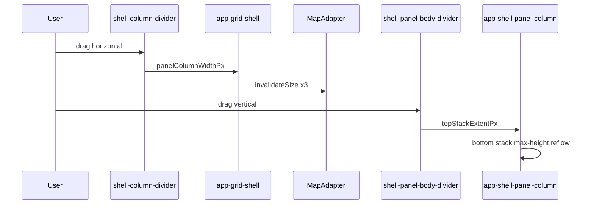

# Shell panel resize (grid shell)

> **Owner decision:** User feedback 2026-09-23 — canvas and panel column must be drag-resizable; when **both** top- and bottom-aligned panel stacks are open in the column, a divider splits vertical space between them (mirrors right-rail top/bottom containers).  
> **Correction 2026-09-23:** The divider is **between panel stacks** in `app-shell-panel-column`, **not** inside a panel body (e.g. not between grid and footer in Selected items).
> **Replaces (conceptually):** legacy `app-drag-divider` beside `app-workspace-pane` ([drag-divider.md](../../component/workspace/drag-divider.md)).  
> **Change class:** Standard — new geometry on existing shell; reuse divider interaction patterns, not legacy flex host wiring.

## What It Is

Two independent resize axes for the grid shell when the panel column is open:

1. **Column divider (vertical drag)** — between **main canvas** and **panel column**. User drags to change how much width the map/page vs. the panel stack gets.
2. **Stack divider (horizontal drag)** — inside **`app-shell-panel-column`** between top and bottom stacks. Appears **only when both stacks are open and their natural heights overflow** the column; otherwise a flex spacer pins the bottom stack to the column foot.

Both dividers reuse the quiet grip affordance from the legacy workspace divider. Neither divider changes rail track widths.

## What It Looks Like

### Column divider (canvas ↔ panels)

- Thin vertical separator in the grid **gap lane** between `app-shell-main-canvas` and `app-shell-panel-column`.
- Same visual language as [drag-divider.md](../../component/workspace/drag-divider.md): 2px bar at rest, 44px hit zone, pill grip on hover/drag, `col-resize` cursor.
- Panel column width is explicit px (not `auto` content intrinsic) while at least one panel is open.
- Canvas track remains `1fr` and absorbs the remainder.

### Stack divider (top stack ↔ bottom stack)

- Thin horizontal separator **inside `app-shell-panel-column`**, between the top panel group and the bottom panel group.
- Same grip pattern as column divider, rotated: 2px bar, 44px hit zone height, `row-resize` cursor, pill grip centered on the bar.
- **Top stack** (actions rail): every open id among `upload`, `download`, `shared-media` — **top-aligned**. Sibling overflow scrolls inside the stack ([shell-panel-column.md](./shell-panel-column.md)).
- **Bottom stack** (help rail): every open id among `tips`, `help` — **bottom-aligned** (flex spacer above).
- When only the bottom stack is open, a flex **spacer** above it pins that stack to the **column foot**. A lone filled top stack has no spacer under it and ends on the canvas bottom.
- When both stacks fit at natural height, **no divider** — spacer between them; bottom stack **bottom-aligned**.
- When both stacks **overflow** the column, divider appears and splits height (persisted `topStackExtentPx`).

### When dividers are hidden

| Divider | Hidden when |
| --- | --- |
| Column | No panel open (`data-panels='closed'`) |
| Column | Viewport `< 48rem` (mobile — TBD snap sheet; out of scope for v1) |
| Stack | Only one stack open, **or** both stacks open and natural heights fit in column |

### Detail mode in panel column (resolved — step 7c)

| Fix | Shipped |
| --- | --- |
| Panel min width | **480px** (`SHELL_PANEL_COLUMN_MIN_WIDTH_PX`); stored default **400px** is clamped on first paint via `resolveInitialShellPanelColumnWidthPx` |
| Layout override | `[shellPanelEmbedded]="true"` on `app-media-detail-view` — medium flex column, no narrow `position: fixed; inset: 0` overlay |
| Shell chrome | `app-shell-panel-surface` title row hidden when `detailMediaId` is set (detail header owns chrome) |

Detail LIVE CHECK is **unblocked** at panel widths ≥480px.

## Where It Lives

| Layer | Location |
| --- | --- |
| Column divider host | `app-grid-shell` or `authenticated-app-layout` between canvas and panel column tracks |
| Column width state | `ShellPanelColumnResizeService` (new) or extension of layout host — persists preference |
| Stack divider | `app-shell-panel-column` between top and bottom stacks |
| Stack split state | `ShellPanelStackResizeService` — persists top-stack height |

## Actions

### Column divider (canvas ↔ panel column)

| # | User action | System response | Triggers |
| --- | --- | --- | --- |
| 1 | Hovers column divider | Grip fades in (80ms) | CSS `:hover` |
| 2 | Drags column divider | Panel column width updates live, canvas `1fr` reflows | `panelColumnWidthPx` |
| 3 | Releases drag | Width persisted; map invalidates (3× per [grid-shell.md](./grid-shell.md)) | localStorage + map layout |
| 4 | Double-clicks column divider | Reset to stored default (**400px** constant; clamped ≥480px on apply) | `widthChange` |
| 5 | Drags below snap threshold | Optional: snap-close panel column (same spirit as workspace snap-close) | `ShellLayoutService.close` all? **TBD v1:** clamp only, no snap-close in v1 |

**Clamps (column):**

| Bound | Value | Rationale |
| --- | --- | --- |
| Panel min | 25% viewport **or 480px, whichever is larger** | Detail view requires `medium` layout (no narrow fixed overlay) |
| Panel max | 75% viewport | Same as legacy workspace pane |
| Canvas min | ~320px | Legacy map minimum |

### Stack divider (top stack ↔ bottom stack)

| # | User action | System response | Triggers |
| --- | --- | --- | --- |
| 1 | Hovers stack divider | Grip fades in | CSS `:hover` |
| 2 | Drags stack divider | Top stack max-height updates; bottom stack gets remainder | `topStackExtentPx` |
| 3 | Releases drag | Preference persisted | `feldpost.ui.shell.panelStackTopExtent` |
| 4 | Double-clicks stack divider | Reset to 50% default split | default ratio constant |

**Clamps (stack):**

| Bound | Value | Rationale |
| --- | --- | --- |
| Top stack min | **128px** (`SHELL_PANEL_STACK_MIN_PX`) | At least one panel chrome readable |
| Bottom stack min | **128px** | Same |
| Default split | 50% column height | Balanced when both stacks open |

## Component Hierarchy

```text
app-grid-shell
├── app-shell-control-area [left]
├── app-shell-main-canvas          ← 1fr track
├── app-shell-column-divider       ← canvas ↔ column width
├── app-shell-panel-column         ← explicit width px when open
│   ├── .shell-panel-column__top   ← every open top id, in order
│   ├── app-shell-panel-body-divider  ← stack split (when both stacks overflow)
│   └── .shell-panel-column__bottom ← every open bottom id, in order
└── app-shell-control-area [right]
```

## Data

| Field | Type | Persisted | Notes |
| --- | --- | --- | --- |
| `panelColumnWidthPx` | `number` | yes (`feldpost.ui.shell.panelColumnWidth`) | Applies while any panel open |
| `topStackExtentPx` | `number` | yes (`feldpost.ui.shell.panelStackTopExtent`) | Top stack max-height when both stacks open |

Legacy key `sitesnap.settings.layout.workspacePaneWidth` may be **read once** on first grid-shell open for migration, then superseded by the new key.

## State

| Name | Transitions | Terminal |
| --- | --- | --- |
| `columnDragging` | rest ↔ drag | rest |
| `stackDragging` | rest ↔ drag | rest |
| `panelColumnWidthPx` | drag, double-click reset, viewport clamp | clamped rest |
| `topStackExtentPx` | stack drag, double-click reset, viewport clamp | clamped rest |

**Idempotency:** drag release at same width is a no-op. Reset to default when already default is a no-op.

## File Map

| File | Purpose |
| --- | --- |
| `layout/shell/shell-column-divider/` | Horizontal divider component |
| `layout/shell/shell-panel-body-divider/` | Horizontal stack divider component |
| `core/shell-layout/shell-panel-column-resize.service.ts` | Width state + persistence + clamp helpers |
| `core/shell-layout/shell-panel-stack-resize.service.ts` | Top-stack height when both stacks open |
| `layout/shell/grid-shell.component.ts` | Applies panel track width |
| `layout/shell/shell-panel-column/` | Top/bottom stacks + stack divider |

Reuse (composition, not duplicate HTML):

- Grip/hit-zone SCSS patterns from `drag-divider.component.scss`
- Map invalidation hooks from `authenticated-app-layout` / grid-shell wiring table

## Wiring



## Visual Behavior Contract

| Behavior | Visual Geometry Owner | Stacking Context Owner | Interaction Hit-Area Owner | Selector(s) | Layer | Test Oracle |
| --- | --- | --- | --- | --- | --- | --- |
| Column divider bar | `app-shell-column-divider` | divider host | hit zone | `.shell-column-divider__hit-zone` | content `0` | 2px bar, 44px hit |
| Column grip | divider host | divider host | hit zone | `.shell-column-divider__grip` | content `1` | visible on hover |
| Stack divider bar | `app-shell-panel-body-divider` | divider host | hit zone | `.shell-panel-body-divider__hit-zone` | content `0` | 2px bar, 44px hit |
| Top stack | `.shell-panel-column__top` | panel column | scroll | flex child | content `0` | top-aligned; max-height when split |
| Bottom stack | `.shell-panel-column__bottom` | panel column | scroll | flex child | content `0` | bottom-aligned when alone |

## Migration from legacy drag divider

| Legacy | Grid shell resize |
| --- | --- |
| `app-drag-divider` in flex row | `app-shell-column-divider` in grid gap |
| `MapShellState.workspacePaneWidth` | `ShellPanelColumnResizeService.panelColumnWidthPx` |
| `photoPanelOpen` gates divider | `ShellLayoutService.openPanels().length > 0` |
| Workspace pane flex width | Panel column explicit px width |
| Single scroll column | Top/bottom stacks mirror right-rail alignment |

**PR 7 gate:** delete `app-drag-divider` only after column divider passes LIVE CHECK and flag default is on.

## Acceptance Criteria

- [ ] With `shellGridLayout` on and a panel open, user can drag canvas ↔ panel width; map recenters without grey tile band.
- [ ] Panel width persists across reload within clamp bounds.
- [ ] With both stacks open **and** overflowing, the stack divider splits column height; preference persists. When both fit, there is no divider.
- [ ] Upload alone opens top-aligned; Tips alone opens bottom-aligned.
- [ ] Stack divider hidden when only one stack is open **or** when both fit without overflow.
- [ ] Bottom stack bottom-aligned when alone or when both fit (Help/Tips at column foot).
- [ ] Dividers hidden when panel column closed.
- [ ] Keyboard + ARIA match [drag-divider.md](../../component/workspace/drag-divider.md) separator contract (orientation-specific).
- [ ] Legacy `shellGridLayout` off: existing workspace drag divider unchanged.

## LIVE CHECK (resize)

1. Open download panel → drag column divider → map reflows, panel wider/narrower, no tile gap.
2. Reload → panel width restored.
3. Open Upload **and** Help on a tall window → no stack divider; Help at the column foot. Shorten the window until they overflow → divider appears → drag → stacks resize.
4. Double-click column divider → default width.
5. Flag off → legacy workspace divider still works; no column divider in grid.
