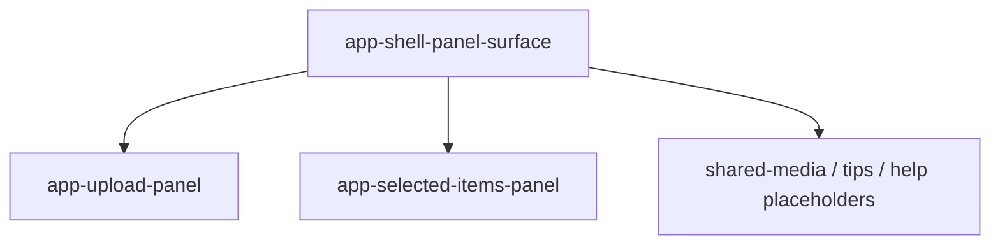

# Panel surface

## What It Is

One frosted panel in the panel column. Ids are `upload`, `download`, `shared-media`, `tips`, and `help`.

## What It Looks Like

`@include shell-box`, the same mixin as a control container. A title row and a projected body.

**Content inset (one step):** header and body each use `padding: var(--spacing-3)` on all sides (`calc(0.25rem * 3)`). That is the only horizontal inset between the box edge and projected content. Toolbar, selected-items grid, and upload panel **must not** add a second inline padding when mounted here — they use `:host-context(app-shell-panel-surface)` to drop their workspace-pane outer inset. Row-level padding inside lists stays on the child components.

The collapse control is a `2.75rem` circle inside the header padding, so its top and inline edges sit `--spacing-3` from the box — the same inset as the title. Negative margin must not pull it into the corner. Hover and focus use `--brand-gold` on `--action-hover`. The title is the global `h2`: Source Sans 3 at weight 600. Detail embed (`hideHeader`, body `--detail`) uses `padding: 0` on the body so `app-media-detail-view` owns its own chrome.

| `panelId` | Body | Spec |
| --- | --- | --- |
| `upload` | `UploadPanelComponent` (not `app-upload-shell`) | upload panel wiring in layout |
| `download` | `SelectedItemsPanelComponent` | [selected-items-panel.md](./selected-items-panel.md) |
| `shared-media` | Placeholder until product exists | — |
| `tips` | Placeholder until product exists | — |
| `help` | Placeholder until product exists | — |

## Where It Lives

- **Parent:** `app-shell-panel-column`, one instance per open panel. Siblings in the same stack stay mounted — [shell-panel-column.md](./shell-panel-column.md).
- **Appears when:** that panel id is open.

## Actions

| # | User Action | System Response | Triggers |
| --- | --- | --- | --- |
| 1 | Clicks the surface collapse control (`right_panel_close`) | `ShellLayoutService.close(id)` | panel column shrinks shut to the right |
| 2 | Uses the upload body | Existing upload behavior | `UploadPanelComponent` |

## Component Hierarchy

```text
app-shell-panel-surface
├── header
│   ├── title
│   └── collapse button (right_panel_close)
└── body (projected)
    ├── app-upload-panel [id upload]
    ├── app-selected-items-panel [id download]
    ├── placeholder [id shared-media, tips, help]
```

## Data

| Source | Contract | Operation |
| --- | --- | --- |
| Input `panelId` | `ShellPanelId` | Read |
| `I18nService` | title key | Read |

## State

| Name | Type | Default | Effect |
| --- | --- | --- | --- |
| `panelId` | input | required | Which body mounts |

Open/closed is owned by `ShellLayoutService`, not this surface.

## File Map

| File | Purpose |
| --- | --- |
| `layout/shell/shell-panel-surface.component.ts` | Body switch |
| `layout/shell/shell-panel-surface.component.html` | Header and body |
| `layout/shell/shell-panel-surface.component.scss` | `shell-box` |

## Wiring

The workspace pane Upload tab is not a second host for upload. Upload has one home: `upload` surface. Selected items has one home: `download` surface ([selected-items-panel.md](./selected-items-panel.md)).



## Visual Behavior Contract

| Behavior | Visual Geometry Owner | Stacking Context Owner | Interaction Hit-Area Owner | Selector(s) | Layer | Test Oracle |
| --- | --- | --- | --- | --- | --- | --- |
| Panel box | `app-shell-panel-surface` | `app-shell-panel-surface` | collapse button and body | `:host` | content `0` | `shell-box`. Alone in its stack: may use `max-height: 100%` and shrink. With a sibling: `flex: 0 0 auto`, no `max-height: 100%`, header stays visible |
| Collapse control | collapse button | header | collapse button | `.shell-panel-surface__collapse` | content `0` | `right_panel_close`, 2.75rem hit target |
| Body | projected component | surface | projected controls | body | content `0` | upload panel visible |

## Acceptance Criteria

- [ ] `upload` renders `UploadPanelComponent` and not `app-upload-shell`.
- [x] `download` renders `SelectedItemsPanelComponent` per [selected-items-panel.md](./selected-items-panel.md).
- [ ] `help`, `tips`, `shared-media` render placeholders until those products exist.
- [ ] Collapse control is icon-only `right_panel_close` with `shell.panel.collapse` aria-label (not a text Close button).
- [ ] Collapse calls `close(panelId)` once.
- [ ] Title copy uses `t(key, fallback)`.
- [ ] Header and body use a single `--spacing-3` inset; projected workspace/upload surfaces do not stack a second inline inset inside this host.
- [ ] With a sibling surface in the same stack, this host does not take the full stack height and is not shrunk below its header.
