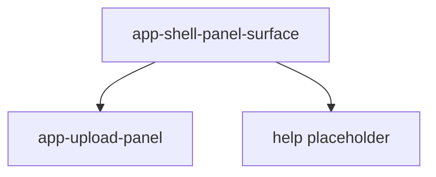

# Panel surface

## What It Is

One frosted panel in the panel column. This window has two ids: `upload` and `help`.

## What It Looks Like

`@include shell-box`, the same mixin as a control container. A title row and a projected body. Help has a placeholder body until a help product exists. Upload projects `UploadPanelComponent` and does not use `app-upload-shell`.

## Where It Lives

- **Parent:** `app-shell-panel-column`, one instance per open panel.
- **Appears when:** that panel id is open.

## Actions

| # | User Action | System Response | Triggers |
| --- | --- | --- | --- |
| 1 | Clicks the surface close control | `ShellLayoutService.close(id)` | panel closes |
| 2 | Uses the upload body | Existing upload behavior | `UploadPanelComponent` |

## Component Hierarchy

```text
app-shell-panel-surface
├── header
│   ├── title
│   └── close button
└── body
    ├── app-upload-panel [id upload]
    └── placeholder [id help]
```

## Data

| Source | Contract | Operation |
| --- | --- | --- |
| Input `panelId` | `'upload' \| 'help'` | Read |
| `I18nService` | title key | Read |

## State

| Name | Type | Default | Effect |
| --- | --- | --- | --- |
| `panelId` | input | required | Which body mounts |

Open/closed is owned by `ShellLayoutService`, not this surface.

## File Map

| File | Purpose |
| --- | --- |
| `layout/shell/shell-panel-surface.component.ts` | Body switch <!-- planned --> |
| `layout/shell/shell-panel-surface.component.html` | Header and body <!-- planned --> |
| `layout/shell/shell-panel-surface.component.scss` | `shell-box` <!-- planned --> |

## Wiring

The workspace pane Upload tab is not a second host for this body. Upload has one home: this surface.



## Visual Behavior Contract

| Behavior | Visual Geometry Owner | Stacking Context Owner | Interaction Hit-Area Owner | Selector(s) | Layer | Test Oracle |
| --- | --- | --- | --- | --- | --- | --- |
| Panel box | `app-shell-panel-surface` | `app-shell-panel-surface` | close button and body | `:host` | content `0` | `shell-box` |
| Body | projected component | surface | projected controls | body | content `0` | upload panel visible |

## Acceptance Criteria

- [ ] `upload` renders `UploadPanelComponent` and not `app-upload-shell`.
- [ ] `help` renders a placeholder and does not invent a help flow.
- [ ] Close calls `close(panelId)` once.
- [ ] Title copy uses `t(key, fallback)`.
