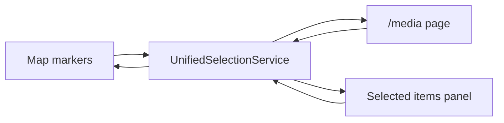
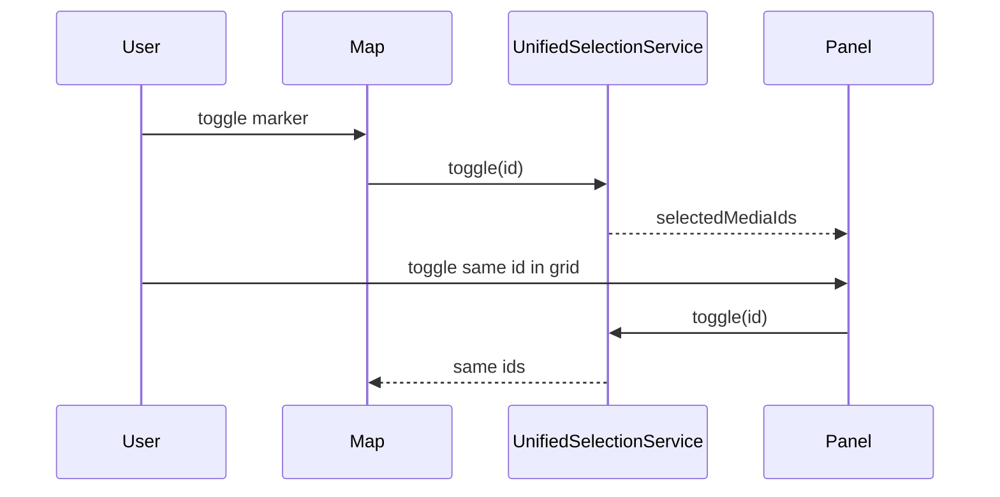

# Unified selection (grid shell)

> **Owner decision:** [STUDY-015 §14.7](../../../study/015-shell-grid-layout-change-plan.md)  
> **Change class:** Sensitive — deletes independent workspace selection state.  
> **Consumers:** map shell, `/media`, share panel (`share`).

## What It Is

One application-wide media selection store. Map markers, the media page, and the selected items panel are **views** on the same `selectedMediaIds` set. Users cannot add a second, workspace-only selection on top of map/media selection.

## What It Looks Like

No dedicated UI. Effects are visible on:

- Map marker selected styling
- `/media` page tile selection
- Selected items panel grid + toolbar Deselect all

## Where It Lives

- **Code:** `apps/web/src/app/core/unified-selection/` (new module; symmetry spec required before merge).
- **Replaces:** workspace-local selection toggles that diverge from map/media when `shellGridLayout` is on.
- **Interim adapter:** `WorkspacePaneObserverAdapter` remains until migration completes; facade delegates to unified selection when flag on.

## Actions

| # | User action | System response |
| --- | --- | --- |
| 1 | Toggle tile on map | Updates global set; panel grid reflects same ids |
| 2 | Toggle tile on `/media` | Same set |
| 3 | Toggle tile in selected items panel | Same set (not a copy) |
| 4 | Deselect all on the toolbar | Empties the global set |
| 5 | Clear selection | Empties global set everywhere |
| 6 | Delete selected media | Removes ids from set after delete |
| 7 | Route leave | Scope may change; ids persist unless context reset rules say otherwise |

### Forbidden (grid shell on)

| Action | Why |
| --- | --- |
| Workspace-only selection namespace | Owner Q2 — double selection removed |
| Panel grid selection diverging from map | Mirror contract broken |

## Component Hierarchy

```text
UnifiedSelectionService (facade)
├── unified-selection.store.ts      signal Set<string>
├── unified-selection.types.ts      scope + events
└── adapters/
    ├── map-selection.bridge.ts     map marker ↔ store
    └── media-page-selection.bridge.ts
```

## Data

| Field | Type | Notes |
| --- | --- | --- |
| `selectedMediaIds` | `ReadonlySet<string>` | Single source of truth |
| `scopeMediaIds` | `ReadonlySet<string> \| null` | Optional filter for grid display (marker cluster, project context) |



## State

| Name | Transitions | Terminal |
| --- | --- | --- |
| `selection` | add/remove ids, clear, replace from share token | empty set is valid rest state |

**Idempotency:** `select(id)` when already selected is a no-op. `deselect(id)` when not selected is a no-op.

## File Map

| File | Purpose |
| --- | --- |
| `docs/specs/service/unified-selection/unified-selection.md` | Service symmetry spec (create with module) |
| `core/unified-selection/unified-selection.service.ts` | Facade |
| `core/unified-selection/unified-selection.service.spec.ts` | Red-test-first mirror contract |

## Wiring



## Acceptance Criteria

- [ ] Red test fails before implementation: panel can select id not on map when flag on.
- [ ] Green after: one shared store; panel toggle updates map styling.
- [ ] Share-link restore sets global selection, opens `share` panel.
- [ ] `shellGridLayout` off: legacy dual-path allowed until PR 7 deletes it.
- [ ] Service spec + types mirror `docs/specs/service/unified-selection/`.
