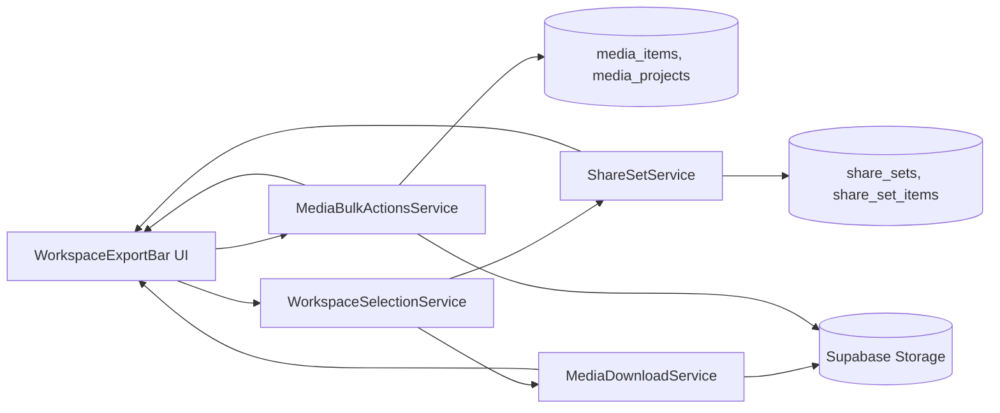
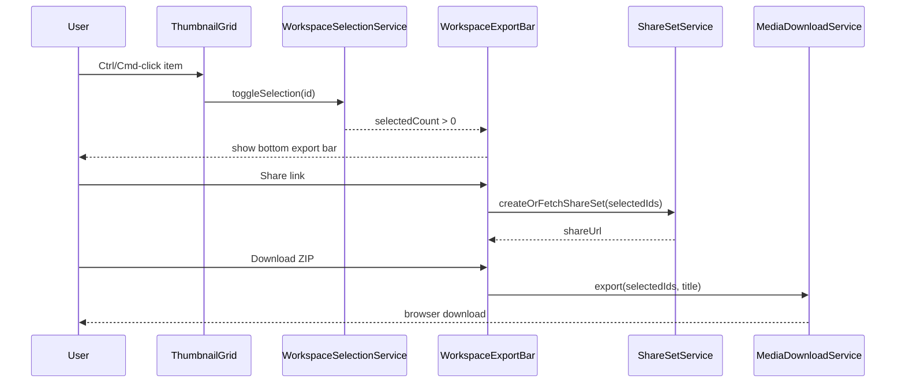

# Workspace Actions Bar

> **Service contracts:** [upload-manager](../../service/media-upload-service/upload-manager.md), [upload-manager-pipeline](../../service/media-upload-service/upload-manager-pipeline.md)
> **Use cases:** [use-cases/workspace-export.md](../../../use-cases/workspace-export.md)

## What It Is

Selection bar at the bottom of the Workspace Pane when at least one item is selected: scope, curation (project, address, delete), and export (share, copy, ZIP). **ws_footer_multi** in the action-context-matrix; primary first, export next, delete last.

## What It Looks Like

The bar is anchored to the bottom edge of the Workspace Pane content area and spans full pane width. Height is 3.5rem (56px) minimum touch target, with horizontal padding 0.75rem (12px) and control gap 0.5rem. Background uses `--color-bg-elevated`, top border `1px` in `--color-border-subtle`, and a soft shadow token used by elevated overlays. It enters with a vertical translate and opacity transition from `docs/design/motion.md` timing tokens. Primary actions are left-to-right: selection controls, count summary, curation actions, then export actions.

Each media card in the thumbnail grid shows a quiet checkbox affordance at top-left on hover/focus, and always-visible when selected. On desktop, multi-select follows common patterns: checkbox click, Ctrl-click on Windows/Linux, Cmd-click on macOS; Shift-range selection is optional but reserved in state model.

## Where It Lives

- **Route**: `/`
- **Parent**: `WorkspacePaneComponent` content stack in `apps/web/src/app/shared/workspace-pane/workspace-pane.component.ts`
- **Appears when**: `selectedMediaIds.size > 0` in workspace selection scope

## Actions & Interactions

| #   | User Action                                           | System Response                                                                   | Triggers                            |
| --- | ----------------------------------------------------- | --------------------------------------------------------------------------------- | ----------------------------------- |
| 1   | Hovers media tile                                     | Reveals top-left checkbox affordance                                              | Pointer hover/focus                 |
| 2   | Clicks checkbox                                       | Toggles selection state for media ID                                              | `selectedMediaIds` update           |
| 3   | Ctrl/Cmd + clicks media tile                          | Toggles selection without entering detail view                                    | Modifier + click handler            |
| 4   | Selects first item                                    | Export bar animates in from bottom                                                | `selectedMediaIds.size` from 0 to 1 |
| 5   | Clicks `Select all`                                   | Selects all currently scoped items (filtered/grouped result set, not whole DB)    | `selectAllInScope()`                |
| 6   | Clicks `Select none`                                  | Clears selection, bar animates out                                                | `clearSelection()`                  |
| 7   | Clicks `Assign project`                               | Opens project picker dialog scoped to current organization                        | `addToProjectDialogOpen = true`     |
| 8   | Confirms add to existing project                      | Upserts project memberships for all selected media IDs                            | `bulkAddToProject(ids, projectId)`  |
| 9   | Clicks `Change address`                               | Opens bulk address editor with preview count                                      | `changeAddressDialogOpen = true`    |
| 10  | Confirms address change                               | Updates selected media rows with normalized address value                         | `bulkChangeAddress(ids, address)`   |
| 11  | Clicks `Delete`                                       | Opens destructive confirmation with selected count                                | `deleteDialogOpen = true`           |
| 12  | Confirms deletion                                     | Deletes selected media rows and related storage references, then clears selection | `bulkDeleteMedia(ids)`              |
| 13  | Clicks `Share link`                                   | Opens Share Dialog with count and visibility summary                              | `shareDialogOpen = true`            |
| 14  | Confirms link generation                              | Creates or fetches stable share-set token mapped to normalized selected IDs       | `createShareSetToken(ids)`          |
| 15  | Clicks `Copy link` (`Link kopieren` in de locale)     | Writes resolved URL to clipboard and shows toast                                  | `navigator.clipboard.writeText`     |
| 16  | Clicks `Share` on supported device                    | Invokes native share sheet with URL/title/text                                    | `navigator.share`                   |
| 17  | Clicks `Download ZIP`                                 | Opens Download Dialog with prefilled filename/title                               | `downloadDialogOpen = true`         |
| 18  | Confirms ZIP download                                 | Fetches binaries, packages ZIP, starts browser download                           | `startZipExport()`                  |
| 19  | Edits filename/title                                  | Validates and normalizes safe filename                                            | `exportTitle` validation            |
| 20  | Presses `Ctrl/Cmd + A` while workspace has focus      | Selects all items in current scope                                                | keyboard selection shortcut         |
| 21  | Presses `Escape` while export bar is active           | Clears selection and closes bar                                                   | keyboard cancel shortcut            |
| 22  | Changes sorting/filtering/grouping while items chosen | Keeps selected IDs by identity; selected count includes hidden-but-selected IDs   | resilient selection state           |
| 23  | Opens shared link URL                                 | Resolves token to exact media ID set and renders same set in workspace context    | token resolve flow                  |
| 24  | Opens shared link from unauthorized org               | Shows access denied state; no media payload returned                              | RLS + org checks                    |
| 25  | Opens expired shared link                             | Shows expired-link state with retry/request guidance                              | token TTL validation                |
| 26  | Export encounters partial fetch failures              | Shows recoverable error with retry and "download available only" fallback         | ZIP error path                      |

## Component Hierarchy

```
WorkspacePane
├── ActiveSelectionView
│   └── ThumbnailGrid
│       └── MediaCard × N
│           └── SelectionCheckbox [top-left, quiet on hover]
├── [selectedMediaIds.size > 0] WorkspaceExportBar ← `.ui-container` bottom action surface
│   ├── SelectionActions
│   │   ├── Button: Select none
│   │   └── Button: Select all
│   ├── SelectionSummary
│   │   └── Label: "X selected"
│   ├── CurationActions
│   │   ├── Button: Assign project
│   │   ├── Button: Change address
│   │   └── Button: Delete (danger)
│   ├── ExportActions
│   │   ├── Button: Share link
│   │   ├── Button: Copy link
│   │   └── Button: Download ZIP
│   └── [mobile+supported] Button: Native Share
├── [addToProjectDialogOpen] AddToProjectDialog
│   ├── ProjectSearch
│   ├── ProjectList
│   └── Confirm/CancelButtons
├── [changeAddressDialogOpen] ChangeAddressDialog
│   ├── AddressInput
│   ├── SelectionScopeSummary
│   └── Confirm/CancelButtons
├── [deleteDialogOpen] DeleteSelectionDialog
│   ├── WarningCopy
│   ├── SelectionScopeSummary
│   └── Confirm/CancelButtons
├── [shareDialogOpen] ShareSelectionDialog
│   ├── ScopeSummary
│   ├── LinkField
│   ├── CopyButton
│   └── Generate/RegenerateButton
└── [downloadDialogOpen] DownloadSelectionDialog
    ├── TitleInput
    ├── DefaultNameHint
    ├── ProgressRow [during zip generation]
    └── Confirm/CancelButtons
```

## Data Requirements

### Data Flow (Mermaid)



### Schema / Query Notes

| Field / Artifact      | Source                                      | Type            | Notes                                                      |
| --------------------- | ------------------------------------------- | --------------- | ---------------------------------------------------------- |
| Selected IDs          | `WorkspaceSelectionService`                 | `Set<string>`   | Canonical identity source for export actions               |
| Selection scope IDs   | `WorkspaceViewService.groupedSections()`    | `string[]`      | Used by `Select all` for current filtered/grouped scope    |
| Project membership    | `MediaBulkActionsService.bulkAddToProject`  | mutation result | Upserts selected IDs into `media_projects` for a project   |
| Address field update  | `MediaBulkActionsService.bulkChangeAddress` | mutation result | Updates selected media address fields in one batch         |
| Bulk delete mutation  | `MediaBulkActionsService.bulkDeleteMedia`   | mutation result | Deletes selected media records with storage cleanup        |
| Share token           | `ShareSetService`                           | `string`        | URL-safe token, high entropy, deterministic mapping policy |
| Share-set fingerprint | Backend function                            | `string`        | Hash of sorted media IDs + org context for dedup/lookup    |
| Share-set rows        | `share_sets`, `share_set_items`             | relational rows | New schema to persist stable shared groups                 |
| Export title default  | `ProjectService` + media metadata           | `string`        | Project name or heuristic `bestLabel + yyyy-mm-dd`         |
| ZIP blob              | `MediaDownloadService`                      | `Blob`          | Mixed media archive download                               |

Share-set SQL, RLS, RPC stubs, and ER diagram (after Schema notes table): **[workspace-actions-bar.sql-contracts.supplement.md](./workspace-actions-bar.sql-contracts.supplement.md)**.


## State

| Name                      | Type                                                                    | Default              | Controls                                         |
| ------------------------- | ----------------------------------------------------------------------- | -------------------- | ------------------------------------------------ |
| `selectedMediaIds`        | `WritableSignal<Set<string>>`                                           | empty set            | Current selection identity set                   |
| `lastAnchorId`            | `WritableSignal<string \| null>`                                        | `null`               | Optional anchor for future Shift-range selection |
| `exportBarVisible`        | `Signal<boolean>`                                                       | `false`              | Derived from `selectedMediaIds.size > 0`         |
| `addToProjectDialogOpen`  | `WritableSignal<boolean>`                                               | `false`              | Add-to-project dialog visibility                 |
| `changeAddressDialogOpen` | `WritableSignal<boolean>`                                               | `false`              | Change-address dialog visibility                 |
| `deleteDialogOpen`        | `WritableSignal<boolean>`                                               | `false`              | Delete confirmation dialog visibility            |
| `bulkActionStatus`        | `WritableSignal<'idle' \| 'running' \| 'error'>`                        | `'idle'`             | Batch curation action lifecycle state            |
| `busyBulkAction`          | `WritableSignal<'add-project' \| 'change-address' \| 'delete' \| null>` | `null`               | Prevents duplicate destructive/slow actions      |
| `shareDialogOpen`         | `WritableSignal<boolean>`                                               | `false`              | Share dialog visibility                          |
| `downloadDialogOpen`      | `WritableSignal<boolean>`                                               | `false`              | Download dialog visibility                       |
| `shareUrl`                | `WritableSignal<string \| null>`                                        | `null`               | Generated/loaded share URL                       |
| `isGeneratingShareLink`   | `WritableSignal<boolean>`                                               | `false`              | Share link generation in progress                |
| `exportTitle`             | `WritableSignal<string>`                                                | `''`                 | User-editable ZIP title                          |
| `zipProgress`             | `WritableSignal<number>`                                                | `0`                  | ZIP generation progress percent                  |
| `zipStatus`               | `WritableSignal<'idle' \| 'running' \| 'done' \| 'error'>`              | `'idle'`             | ZIP export lifecycle state                       |
| `selectionSourceScope`    | `WritableSignal<'active-selection' \| 'saved-group'>`                   | `'active-selection'` | Which workspace context defines `Select all`     |

## Settings

- **Export & Sharing**: default share-link expiration, allow token reuse vs forced regeneration, and whether native-share action is enabled on supported devices.
- **Selection Bulk Actions**: default delete confirmation behavior, whether address-change requires non-empty validation, and which project targets are shown first (recent vs alphabetical).

## File Map

| File                                                                                     | Purpose                                                      |
| ---------------------------------------------------------------------------------------- | ------------------------------------------------------------ |
| `apps/web/src/app/shared/workspace-pane/workspace-pane-footer/workspace-pane-footer.component.ts`   | Bottom action bar component                                  |
| `apps/web/src/app/shared/workspace-pane/workspace-pane-footer/workspace-pane-footer.component.html` | Template for selection, export, and inline dialogs                    |
| `apps/web/src/app/shared/workspace-pane/workspace-pane-footer/workspace-pane-footer.component.scss` | Bar layout, transitions, responsive behavior                 |
| `apps/web/src/app/shared/project-select-dialog/project-select-dialog.component.ts`       | Project picker dialog (assign project)                      |
| `apps/web/src/app/shared/text-input-dialog/text-input-dialog.component.ts`              | Text input dialog (bulk address change)                      |
| `apps/web/src/app/features/map/map-shell/map-shell.component.ts`                                          | Host wiring for `?share` URL token resolve and pane opening  |
| `apps/web/src/app/core/workspace-selection/workspace-selection.service.ts`                                                    | Selection state, toggles, select all/none, keyboard handling |
| `apps/web/src/app/core/workspace-view/workspace-view.service.ts`                                                         | Raw workspace media list updates after bulk actions           |
| `apps/web/src/app/core/supabase/supabase.service.ts`                                                                     | Supabase client (bulk delete and other mutations)            |
| `apps/web/src/app/core/media-location-update/media-location-update.service.ts`                                              | Batch address/location updates from geocoding                  |
| `apps/web/src/app/core/share-set/share-set.service.ts`                                                              | Create/resolve share-set tokens via Supabase                 |
| `apps/web/src/app/core/media-download/media-download.service.ts`                                          | Fetch signed URLs/files, build ZIP blob, trigger download    |
| `supabase/migrations/20260318090000_share_sets.sql`                                      | `share_sets` + `share_set_items` tables, indexes, RLS, RPC   |
| `docs/use-cases/workspace-export.md`                                                     | Behavioral scenarios and validation checklist                |
| `docs/specs/service/media-upload-service/upload-manager.md`                                | Upload manager facade contract           |

## Wiring

### Wiring Flow (Mermaid)



- `WorkspaceExportBarComponent` is rendered inside `WorkspacePaneComponent` below workspace content, using a sticky-bottom container.
- `WorkspaceSelectionService` is the single source of truth for selected IDs and shortcut handling.
- `WorkspaceViewService` provides current scope IDs for deterministic `Select all` behavior.
- `ShareSetService` uses Supabase APIs through service abstraction; components never call Supabase directly.
- Shared links are resolved from `?share` in `MapShellComponent`, then hydrated into workspace data and selection state.
- `MediaDownloadService` resolves signed file URLs and assembles ZIP in browser before download trigger.

## Acceptance Criteria

- [x] Hovering a media card reveals a top-left selection checkbox without shifting layout.
- [x] Checkbox click toggles selection state and never opens detail view.
- [x] Ctrl-click (Windows/Linux) and Cmd-click (macOS) toggle selection on media cards.
- [ ] First selection opens export bar with transition; zero selection closes it.
- [x] Export bar always includes `Select none` and `Select all` actions.
- [ ] Export bar includes `Assign project`, `Change address`, and `Delete` actions for selected media.
- [ ] `Assign project` applies to every currently selected ID and reports per-item failures non-destructively.
- [ ] `Change address` updates every selected media row and refreshes both grid labels and marker tooltip/address surfaces.
- [ ] `Delete` requires explicit confirmation and removes all selected media while clearing stale selection IDs.
- [ ] `Select all` targets current workspace scope (active filters/grouping/tab), not entire dataset.
- [ ] Selection survives sort, filter, grouping, and fullscreen transitions.
- [x] Share link creation returns a stable tokenized URL for the selected set.
- [x] Opening a valid share URL reproduces the same media set ordering and membership.
- [x] Share URL access is denied outside organization boundaries via RLS/policy checks.
- [ ] Download dialog pre-fills title with project name when single-project scope is detected.
- [ ] Download dialog pre-fills `bestLabel + date` for ad-hoc or mixed-project selections.
- [x] ZIP export includes mixed media items (photos, PDFs, and supported files) and starts a browser download.
- [x] Copy link uses Clipboard API in secure contexts and shows success/error feedback.
- [x] Native share action uses Web Share API only when feature support and activation constraints are met.

