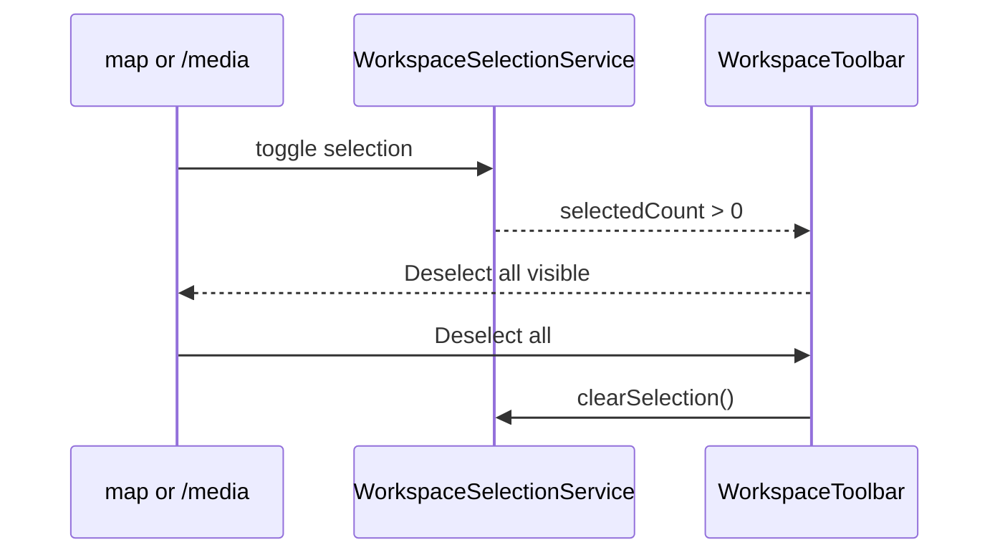

# Workspace Actions Bar

> **Current contract:** this bar is not mounted. The selected-items surface mirrors canvas selection. Its only selection control is the quiet **Deselect all** button on [workspace-toolbar.md](./workspace-toolbar.md).
>
> **Panel:** [selected-items-panel.md](../shell/selected-items-panel.md)
>
> **Retired component contract:** [workspace-pane-footer.md](../../component/workspace/workspace-pane-footer.md)

## What It Is

The old bottom bar (select all, select none, share, copy, ZIP, bulk delete) is retired. Selecting media is the canvas's job (map and `/media`). The selected-items surface shows that selection. It does not add a second one and it does not export from a footer.

## What It Looks Like

No bottom action row. No selection count in a footer. No labeled ZIP button.

When `selectedCount > 0`, the workspace toolbar shows one quiet control: `hlmBtn` `variant="ghost"` `size="xs"`, icon `deselect`, label **Deselect all**. It hides when the selection is empty.

Share, copy, and ZIP stay on the thumbnail context menu (`ws_grid_thumbnail`), not on this bar.

## Where It Lives

- **Deselect control:** `apps/web/src/app/shared/workspace-pane/toolbar/workspace-toolbar/`
- **Parent:** selected-items toolbar inside the workspace pane today, and inside the download panel once [selected-items-panel.md](../shell/selected-items-panel.md) is mounted
- **Not mounted:** `app-workspace-pane-footer` (files removed)

## Actions

| # | User action | System response | Triggers |
| --- | --- | --- | --- |
| 1 | Selects media on the canvas | Selected-items grid mirrors those ids | `WorkspaceSelectionService` |
| 2 | Clicks **Deselect all** | Clears the canvas selection. The button hides | `clearSelection()` |
| 3 | Uses thumbnail context menu | Share, copy, or ZIP for the current selection | `ws_grid_thumbnail` |
| 4 | Looks for a bottom export bar | None | — |

## Component Hierarchy

```text
Selected items surface
├── app-workspace-toolbar
│   └── [selectedCount > 0] Deselect all (ghost xs)
└── app-workspace-selected-items-grid
    └── thumbnail context menu (share, copy, ZIP)
```

## Data

| Artifact | Source | Role |
| --- | --- | --- |
| `selectedMediaIds` | `WorkspaceSelectionService` | The one selection the canvas and this surface share |
| Deselect | `clearSelection()` | Empties that set |

## State

| Name | Type | Default | Controls |
| --- | --- | --- | --- |
| `selectedCount` | `Signal<number>` | `0` | Deselect button visibility |

## File Map

| File | Purpose |
| --- | --- |
| `apps/web/src/app/shared/workspace-pane/toolbar/workspace-toolbar/workspace-toolbar.component.ts` | Quiet **Deselect all** |
| `docs/specs/ui/workspace/workspace-toolbar.md` | Toolbar contract |
| `docs/specs/ui/shell/selected-items-panel.md` | Panel that will host the same toolbar |

## Wiring


```mermaid
sequenceDiagram
  participant Canvas as map or /media
  participant Sel as WorkspaceSelectionService
  participant Toolbar as WorkspaceToolbar
  Canvas->>Sel: toggle selection
  Sel-->>Toolbar: selectedCount > 0
  Toolbar-->>Canvas: Deselect all visible
  Canvas->>Toolbar: Deselect all
  Toolbar->>Sel: clearSelection()
```

- There is no `WorkspaceExportBarComponent`.
- `selectAllInScope()` is not a control on this surface.

## Acceptance Criteria

- [x] No bottom export bar on the selected-items tab.
- [x] **Deselect all** is a ghost `xs` button on the toolbar and is visible only while `selectedCount > 0`.
- [x] **Deselect all** calls `clearSelection()`.
- [ ] Download panel body mounts this toolbar (still a placeholder). See [selected-items-panel.md](../shell/selected-items-panel.md).
