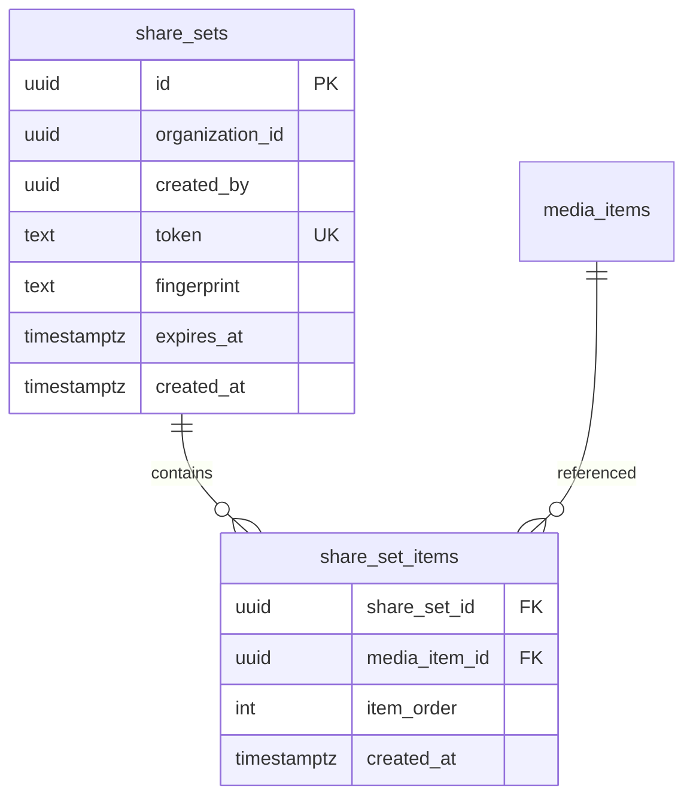

# workspace actions bar.sql contracts.supplement

> Parent: [`workspace-actions-bar.md`](./workspace-actions-bar.md)

### SQL Contract (Share Sets)

```sql
-- share_sets: one logical shared selection
CREATE TABLE public.share_sets (
  id uuid PRIMARY KEY DEFAULT gen_random_uuid(),
  organization_id uuid NOT NULL REFERENCES public.organizations(id) ON DELETE CASCADE,
  created_by uuid REFERENCES auth.users(id) ON DELETE SET NULL,
  token_hash text NOT NULL UNIQUE,
  token_prefix text NOT NULL,
  fingerprint text NOT NULL,
  expires_at timestamptz,
  revoked_at timestamptz,
  created_at timestamptz NOT NULL DEFAULT now()
);

CREATE UNIQUE INDEX idx_share_sets_org_fingerprint_active
  ON public.share_sets (organization_id, fingerprint)
  WHERE revoked_at IS NULL;

CREATE INDEX idx_share_sets_lookup_active
  ON public.share_sets (organization_id, token_hash)
  WHERE revoked_at IS NULL;

-- share_set_items: explicit ordered membership for deterministic rendering
CREATE TABLE public.share_set_items (
  share_set_id uuid NOT NULL REFERENCES public.share_sets(id) ON DELETE CASCADE,
  media_item_id uuid NOT NULL REFERENCES public.media_items(id) ON DELETE CASCADE,
  item_order int NOT NULL,
  created_at timestamptz NOT NULL DEFAULT now(),
  PRIMARY KEY (share_set_id, media_item_id)
);

CREATE INDEX idx_share_set_items_share_order
  ON public.share_set_items (share_set_id, item_order);
```

### RLS Contract (Share Sets)

```sql
ALTER TABLE public.share_sets ENABLE ROW LEVEL SECURITY;
ALTER TABLE public.share_set_items ENABLE ROW LEVEL SECURITY;

-- Org-scoped read for authenticated members.
CREATE POLICY share_sets_select_org
  ON public.share_sets
  FOR SELECT
  TO authenticated
  USING (
    organization_id = public.user_org_id()
    AND revoked_at IS NULL
    AND (expires_at IS NULL OR expires_at > now())
  );

-- Create only within own org, creator tied to auth.uid().
CREATE POLICY share_sets_insert_own_org
  ON public.share_sets
  FOR INSERT
  TO authenticated
  WITH CHECK (
    organization_id = public.user_org_id()
    AND created_by = auth.uid()
    AND NOT public.is_viewer()
  );

-- Revoke/delete only by creator or admin inside org.
CREATE POLICY share_sets_update_owner_or_admin
  ON public.share_sets
  FOR UPDATE
  TO authenticated
  USING (organization_id = public.user_org_id() AND (created_by = auth.uid() OR public.is_admin()))
  WITH CHECK (organization_id = public.user_org_id());

CREATE POLICY share_sets_delete_owner_or_admin
  ON public.share_sets
  FOR DELETE
  TO authenticated
  USING (organization_id = public.user_org_id() AND (created_by = auth.uid() OR public.is_admin()));

-- Item table inherits access from parent share_set.
CREATE POLICY share_set_items_select_via_parent
  ON public.share_set_items
  FOR SELECT
  TO authenticated
  USING (
    EXISTS (
      SELECT 1
      FROM public.share_sets s
      WHERE s.id = share_set_id
        AND s.organization_id = public.user_org_id()
        AND s.revoked_at IS NULL
        AND (s.expires_at IS NULL OR s.expires_at > now())
    )
  );

CREATE POLICY share_set_items_write_owner_or_admin
  ON public.share_set_items
  FOR ALL
  TO authenticated
  USING (
    EXISTS (
      SELECT 1
      FROM public.share_sets s
      WHERE s.id = share_set_id
        AND s.organization_id = public.user_org_id()
        AND (s.created_by = auth.uid() OR public.is_admin())
    )
  )
  WITH CHECK (
    EXISTS (
      SELECT 1
      FROM public.share_sets s
      WHERE s.id = share_set_id
        AND s.organization_id = public.user_org_id()
        AND (s.created_by = auth.uid() OR public.is_admin())
    )
  );
```

### RPC Contract

```sql
-- create_or_reuse_share_set(p_image_ids uuid[], p_expires_at timestamptz)
-- returns: token, share_set_id, expires_at
-- behavior:
-- 1) sort ids, derive fingerprint
-- 2) reuse active set for same org+fingerprint or create new row
-- 3) upsert ordered members in share_set_items

-- resolve_share_set(p_token text)
-- returns: share_set_id, media_item_id, item_order
-- behavior:
-- 1) hash incoming token and look up token_hash
-- 2) enforce org, revoked_at, expires_at checks
-- 3) return ordered ids for deterministic UI rendering
```

### Data Model (Mermaid)


