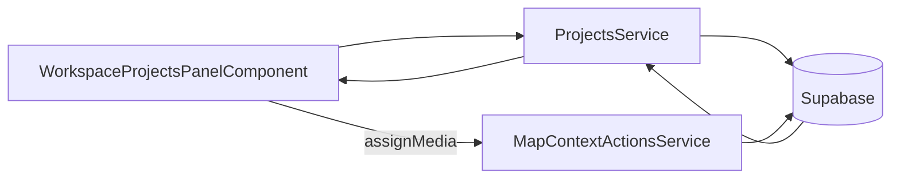

# Workspace Pane — Projects Tab

> **Parent spec:** [`workspace-pane.md`](./workspace-pane.md)
> **Related specs:** [`docs/specs/page/projects-page.md`](../../page/projects-page.md), [`docs/specs/service/projects/projects-service.md`](../../service/projects/projects-service.md)

## What It Is

A third permanent tab in the Workspace Pane (alongside **Media** and **Upload**) that exposes a compact project manager directly in the pane. It lets users:

- Browse and search the organization's projects
- Create a new project (inline draft flow, no modal)
- View a selected project's details (media count, color, location, last activity)
- Drag media items or cluster selections from the **Media** tab or from the map into a project

The Projects tab is persistent across all authenticated routes (same lifecycle as Upload tab).

## Tab Rename (Required)

The existing **Selected Items** tab MUST be renamed to **Media** before the Projects tab ships:

| Before | After |
|--------|-------|
| `brnTabsTrigger="selected-items"` label: "Selected Items" | label: "Media" (trigger key unchanged: `selected-items`) |

The `brnTabsTrigger` key `"selected-items"` and the internal `WorkspacePaneTab` union value `'selected-items'` remain unchanged — only the visible label changes. This avoids breaking any persisted tab state or adapter guards.

## Tab Order

Left → right: **Upload** · **Media** · **Projects**

```
[Upload] [Media] [Projects]
```

Current order (Selected Items · Upload) MUST be reversed and Projects appended.

## What It Looks Like

A compact panel with three internal states:

### State A — Project List (default)

- Sticky search input at top (filters project names client-side)
- Vertically scrolling list of project rows:
  - Color chip · Project name · Media count badge
  - Click → enters **State B** (project detail)
  - Right-click / long-press → context menu with **"Open in Projects page"** action (navigates to `/projects` with that project focused)
- "New project" inline row at list bottom (icon + label); click → enters **State C**
- Active projects only by default; **"Show archived"** toggle at list bottom reveals archived rows (muted treatment) when activated

### State B — Project Detail

- Back arrow → returns to list
- Project name (editable inline)
- Color chip (tappable → opens color picker anchored to chip)
- Stats row: media count, last activity
- Drag target zone: "Drop media here to assign to project" — accepts `DragTransferPayload` (see Drag Contract below)
- "Archive" / "Restore" / "Delete" quick actions (same guard as project-card)

### State C — New Project (inline draft)

- Appears as an extra row in the list below the "New project" trigger
- Text input (auto-focused) for the project name
- Enter → creates project via `ProjectsService.createProject(name)`, inserts at top of list, enters **State B**
- Escape → discards draft, returns to **State A**
- No dialog, no modal — inline creation only

## Where It Lives

- **Tab trigger:** `WorkspacePaneComponent` template (`workspace-pane.component.html`)
- **Panel component:** `WorkspaceProjectsPanelComponent` (new) at `apps/web/src/app/shared/workspace-pane/projects-panel/workspace-projects-panel.component.ts`
- **Data service:** `ProjectsService` (existing — no new adapter needed for list/create)
- **Drag wiring:** `DragTransferService` (or equivalent, see Drag Contract)
- **Tab type:** `WorkspacePaneTab` union extended to `'selected-items' | 'upload' | 'projects'`

## Component Hierarchy

```text
WorkspacePaneComponent
└── [activeTab === 'projects'] WorkspaceProjectsPanelComponent
    ├── SearchInputComponent (or inline input)
    ├── [state=list] ProjectsPanelListComponent
    │   ├── ProjectsPanelRowComponent × N  (color chip · name · count)
    │   └── NewProjectRowComponent          (inline draft trigger)
    ├── [state=detail] ProjectsPanelDetailComponent
    │   ├── BackButton
    │   ├── ProjectNameEditor
    │   ├── ProjectColorChip (opens picker)
    │   ├── ProjectStatsBadges
    │   └── ProjectDropZone
    └── [state=new-draft] NewProjectDraftRow (inside list, focused)
```

## State

| Name | Type | Default | Controls |
|------|------|---------|----------|
| `panelState` | `'list' \| 'detail' \| 'new-draft'` | `'list'` | Internal to `WorkspaceProjectsPanelComponent` |
| `searchTerm` | `string` | `''` | Filters visible project rows client-side |
| `openProjectId` | `string \| null` | `null` | Which project is shown in detail state |
| `draftName` | `string` | `''` | Inline new-project input value |
| `draftBusy` | `boolean` | `false` | Prevents double-submit on Enter |
| `projects` | `ProjectListItem[]` | `[]` | Loaded from `ProjectsService.loadProjects()` on tab activation |
| `loading` | `boolean` | `false` | Skeleton rows while loading |

**Persistence:** `panelState` and `openProjectId` reset to `list` / `null` on tab deactivation (switching to another tab or navigating away). Project list is cached in the panel for the session; refresh triggered on next tab activation.

## Drag Contract

Media items and cluster selections can be dragged from the **Media** tab or from the map into the **Project Detail** drop zone.

| Source | Payload type | Drop target | Effect |
|--------|-------------|-------------|--------|
| Selected media in pane grid | `string[]` (media IDs) | `ProjectDropZone` | `MapContextActionsService.assignImagesToProject(ids, projectId)` |
| Cluster marker (map) | `string[]` (resolved cluster media IDs) | `ProjectDropZone` | Same |

- Drop zone is only active in **State B** (detail view).
- Drop zone shows a tinted overlay with "Drop to assign" copy while dragging over it.
- On successful drop: toast "X items added to project"; media count badge updates.
- On failed drop: toast error (reuse existing error handling from `MapContextActionsService`).
- **Drag tech: HTML5 drag events** (not CDK). Pane grid items set `draggable="true"` and emit media IDs via `dragstart` `dataTransfer`. Drop zone handles `dragover`/`drop` events and reads the payload.

## Data Flow



- Project list: `ProjectsService.loadProjects()` — existing method, no new query.
- Create: `ProjectsService.createProject(name: string): Promise<ProjectListItem | null>` — **new method** (does not exist yet). Must be added to `ProjectsService` before panel implementation. Internally: insert row with provided name in one Supabase call (replaces `createDraftProject()` + `renameProject()` two-call pattern). The existing `createDraftProject()` remains for the `/projects` page flow.
- Rename: `ProjectsService.renameProject(id, name)` — existing.
- Color: `ProjectsService.setProjectColor(id, key)` — existing.
- Archive/Restore/Delete: existing methods.
- Media assignment (drag drop): `MapContextActionsService.assignImagesToProject(ids, projectId)`.

## Type Changes Required

```ts
// workspace-pane-host.port.ts — extend union
export type WorkspacePaneTab = 'selected-items' | 'upload' | 'projects';
```

```ts
// workspace-pane.component.ts — extend tab guard
onBrnTabsChange(tab: string | undefined): void {
  if (tab === 'selected-items' || tab === 'upload' || tab === 'projects') {
    this.setActiveTab(tab);
  }
}
```

All consumers that switch/guard on `WorkspacePaneTab` must be updated (search for `'selected-items' | 'upload'` and `activeTab`).

## File Map

| File | Change |
|------|--------|
| `apps/web/src/app/core/workspace-pane/workspace-pane-host.port.ts` | Extend `WorkspacePaneTab` to include `'projects'` |
| `apps/web/src/app/shared/workspace-pane/shell/workspace-pane.component.ts` | Add `'projects'` guard in `onBrnTabsChange`; import panel component |
| `apps/web/src/app/shared/workspace-pane/shell/workspace-pane.component.html` | Rename "Selected Items" → "Media"; reorder to Upload · Media · Projects; add Projects tab panel |
| `apps/web/src/app/shared/workspace-pane/projects-panel/workspace-projects-panel.component.ts` | New — panel state machine, project list, create flow |
| `apps/web/src/app/shared/workspace-pane/projects-panel/workspace-projects-panel.component.html` | New — list / detail / draft states |
| `apps/web/src/app/shared/workspace-pane/projects-panel/workspace-projects-panel.component.scss` | New — compact row geometry, drop zone overlay |
| `apps/web/src/app/layout/authenticated-app.routes.ts` | No change — tab is pane-level, not route-level |
| `docs/i18n/translation-workbench.csv` | Add keys: `workspace.pane.tab.projects`, `workspace.pane.tab.media` (if label changes), `workspace.projects.panel.*` |

## Acceptance Criteria

- [ ] Tab label "Selected Items" becomes "Media" (`brnTabsTrigger` key unchanged).
- [ ] Tab order is Upload · Media · Projects (left → right).
- [ ] Projects tab is visible on all authenticated routes.
- [ ] Projects tab shows a scrollable list of projects with color chip, name, and media count.
- [ ] Search input filters the list client-side without a round-trip.
- [ ] Clicking a project row enters detail view with back navigation.
- [ ] "New project" inline row creates a project without opening a dialog or modal.
- [ ] Pressing Enter in the name input creates the project and enters detail view.
- [ ] Pressing Escape in the name input discards the draft.
- [ ] Detail view shows: name (editable), color chip (opens picker), media count, last activity.
- [ ] Drop zone in detail view accepts HTML5 drag events carrying media IDs from the pane grid or map cluster.
- [ ] Successful drop shows a success toast; failed drop shows an error toast.
- [ ] Archived projects are hidden from list by default; "Show archived" toggle at list bottom reveals them.
- [ ] Project rows have a "Open in Projects page" context action that navigates to `/projects` with that project focused.
- [ ] `ProjectsService.createProject(name)` method exists and creates a project with the provided name in one Supabase call.
- [ ] `WorkspacePaneTab` type union includes `'projects'` and all consumers compile without type errors.
- [ ] All new UI strings are registered in `translation-workbench.csv` with EN/DE/IT.

## Decisions (Locked)

| # | Question | Decision |
|---|----------|----------|
| 1 | Drag source tech | **HTML5 drag events** — `draggable`, `dragstart`/`dragover`/`drop`. No CDK. |
| 2 | Panel create flow | **New `createProject(name)`** method on `ProjectsService` — single Supabase insert with the provided name. Existing `createDraftProject()` unchanged. |
| 3 | Archived projects in list | **Hidden by default**. "Show archived" toggle at list bottom. Archived rows shown muted when toggle active. |
| 4 | Panel + `/projects` route interaction | **Independent**. Panel does not affect route navigation. Project rows expose a **"Open in Projects page"** right-click/context action that navigates to `/projects` with that project focused. |
