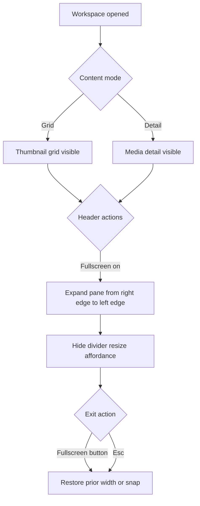
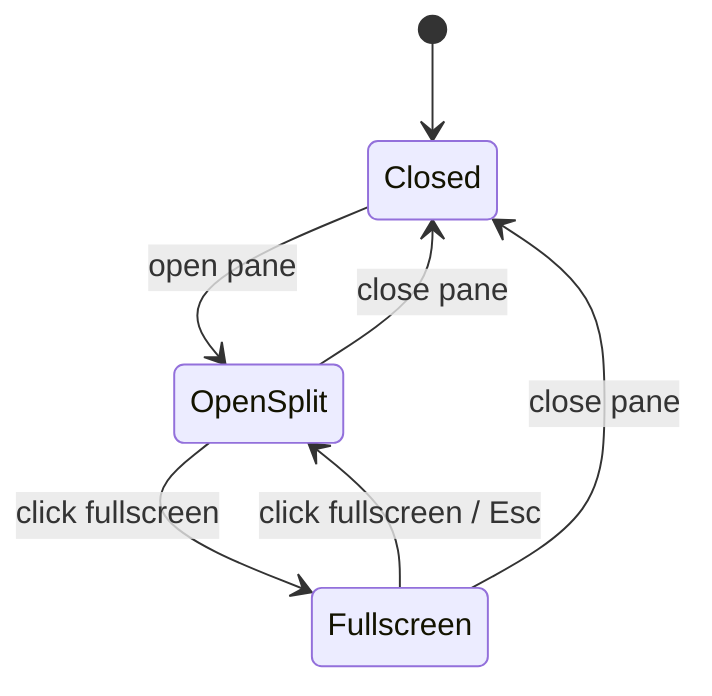
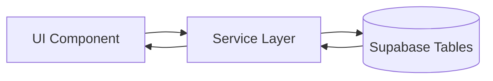
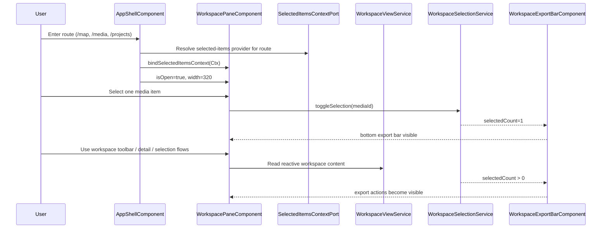
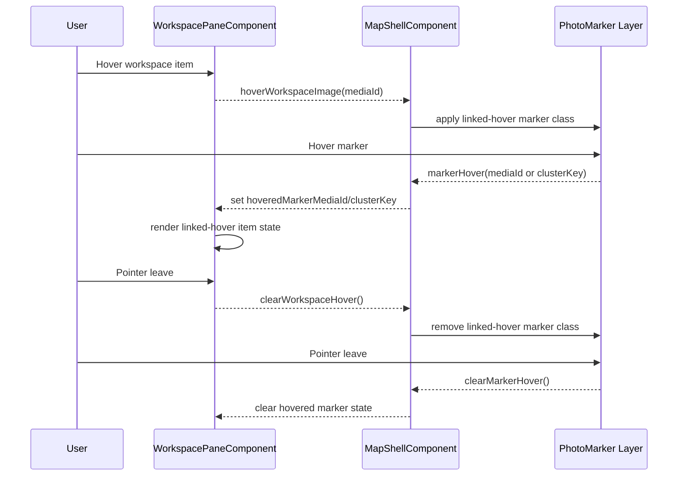

# Workspace Pane

## What It Is

The workspace pane is a cross-page, AppShell-owned panel for selected-items context and upload operations.
It persists across route changes and exposes two tabs: `selected-items` (context-bound) and `upload` (global queue visibility).
Current detail/grid behavior remains map-compatible while the same contract is reused by `/media`, `/projects`, and future routes.
Media preview/detail rendering inside the pane uses the same shared `PhotoLoadService` cache namespace as map markers and `/media` page consumers.

## What It Looks Like

**Desktop:** right-side pane rendered by the App Shell layout (not map-specific). It uses the shared `.ui-container` shell with `--color-bg-surface`, full-height column layout, and an internal switch between item-grid mode and media-detail mode.

The pane shows `PaneHeaderComponent`, then either `MediaDetailViewComponent` or `WorkspaceToolbarComponent` plus `ItemGridComponent` with projected domain items. When one or more media items are selected, `WorkspaceFooterComponent` appears at the bottom.

**Planned but not primary implemented structure:** mobile bottom-sheet snapping and fullscreen workspace mode remain product intent, but are not the main implemented behavior today.

## Where It Lives

- **Parent**: `AppShellComponent` template (NOT page-specific)
- **Position**: Right side of main content area, always visible (unless user closes it)
- **Scope**: Seitenübergreifend — persists across route navigation (`/map`, `/media`, `/projects`, etc.)
- **Lifespan**: Survives page unmount/remount; upload queue never interrupted
- **Pages it appears on**: ALL pages that render into MainContentArea

## Actions

| #       | User Action                                              | System Response                                                                                                                                                         | Triggers                                                 |
| ------- | -------------------------------------------------------- | ----------------------------------------------------------------------------------------------------------------------------------------------------------------------- | -------------------------------------------------------- |
| 1       | Clicks a single media marker on map                      | Workspace pane opens with media detail view for that marker; thumbnail grid loads in background                                                                         | `workspacePaneOpen` → true, `detailMediaId` set          |
| 1b      | Clicks a cluster marker on map                           | Workspace pane opens showing thumbnail grid with all media items in the cluster; any open detail view is dismissed (`detailMediaId` → null)                             | `workspacePaneOpen` → true, `detailMediaId` → null       |
| **NEW** | **Clicks "Upload" tab button**                           | **Tab switches to Upload; UploadPanelComponent fully visible; all upload jobs/lanes visible**                                                                           | **`activeTab` → `'upload'`**                             |
| **NEW** | **Clicks "Selected Items" tab button**                   | **Tab switches to Selected Items; grid or page-specific content visible (workspace grid on /map, media grid on /media, etc.)**                                          | **`activeTab` → `'selected-items'`**                     |
| **NEW** | **Navigates from /map → /media**                         | **Pane stays open, "Selected Items" tab active, content switches to media grid for /media; "Upload" tab preserves all jobs in queue**                                   | **Route change, no pane close, upload context survives** |
| **NEW** | **Navigates from /media → /map**                         | **Pane stays open on globally persisted tab; selected-items content rebinds to map context only if selected-items tab is active; upload queue continues in background** | **Route change, no pane close, context rebind hook**     |
| **NEW** | **Opens pane detail for media already loaded elsewhere** | **Detail/media item renderers reuse existing shared cache entry (marker/detail/grid) before any background tier refresh**                                               | **Shared `PhotoLoadService` cache hit**                  |
| **NEW** | **Hovers an upload row in Upload tab**                   | **Selection checkbox appears on that row without changing compact row geometry**                                                                                        | **`activeTab === 'upload'` + hover/focus state**         |
| **NEW** | **Checks one or more upload rows**                       | **Upload footer toolbar appears with count and bulk actions (`retry`, `download`, `remove`, `clear`)**                                                                  | **`selectedUploadJobIds.size > 0`**                      |
| **NEW** | **Clicks bulk `retry` in Upload tab**                    | **Retries only selected retryable jobs and keeps non-retryable rows unchanged**                                                                                         | **`UploadManagerService.retryJob()` per selected row**   |
| **NEW** | **Clicks bulk `download` in Upload tab**                 | **Downloads selected uploaded items when every selected row is downloadable**                                                                                           | **signed URL path from upload item context**             |
| **NEW** | **Clicks bulk `remove` in Upload tab**                   | **Cancels selected active uploads and dismisses selected terminal uploads**                                                                                             | **`cancelJob` or `dismissJob` per selected row**         |
| **NEW** | **Clicks bulk `clear` in Upload tab**                    | **Clears upload-row selection while preserving queue state**                                                                                                            | **`selectedUploadJobIds.clear()`**                       |
| **NEW** | **Uses Upload-tab selection in compact map overlay**     | **Not available; compact overlay remains menu-first without row checkboxes**                                                                                            | **`embeddedInPane === false`**                           |
| 2       | Drags the Drag Divider                                   | Resizes workspace pane width                                                                                                                                            | Parent shell layout change                               |
| 3       | Clicks close button                                      | Workspace pane slides out (can be reopened from any page)                                                                                                               | `workspacePaneOpen` → false                              |
| 4       | Swipes down on bottom sheet handle (mobile)              | Snaps to lower position or closes                                                                                                                                       | Snap point logic                                         |
| 5       | Swipes up on bottom sheet handle (mobile)                | Snaps to higher position                                                                                                                                                | Snap point logic                                         |
| 6       | Clicks a thumbnail in the grid                           | Media Detail View replaces grid, back arrow to return                                                                                                                   | Detail view state                                        |
| 7       | Updates workspace toolbar controls                       | Workspace view re-groups, re-sorts, or re-filters current raw media items                                                                                               | `WorkspaceViewService` reactive recompute                |
| 8       | Clicks pane-header close button                          | Workspace pane emits `closed` to parent shell                                                                                                                           | `closed` output                                          |
| 10      | Selects one or more media items                          | Workspace Actions Bar animates in at pane bottom                                                                                                                        | `selectedMediaIds.size > 0`                              |
| 11      | Clears last selected item                                | Workspace Actions Bar animates out                                                                                                                                      | `selectedMediaIds.size === 0`                            |
| 12      | Uses export bar actions                                  | Opens curation/share/download flows for selected media                                                                                                                  | Workspace export wiring                                  |
| 15      | Hovers media item in workspace list/grid                 | Matching map marker receives linked-hover highlight; if marker is already selected, linked-hover is applied as extra emphasis layer                                     | `hoveredWorkspaceMediaId`                                |
| 16      | Hovers marker on map                                     | Matching workspace media item receives linked-hover highlight state                                                                                                     | `hoveredMarkerMediaId` / cluster hover payload           |
| 17      | Leaves hover (either side)                               | Linked-hover highlight is removed on both sides; persistent selection state remains unchanged                                                                           | hover clear events                                       |

### Interaction Flowchart



### Fullscreen State



## Component Hierarchy

**STRICT PRIMITIVE REQUIREMENT:** The Workspace Pane architecture must explicitly use `src/styles/primitives/container.scss`. The root element MUST be a `.ui-container`. Content areas (grid items, lists, export bar) MUST rely on `.ui-item` where row-based layouts are needed. No custom flex/grid wrapper `div`s should be generated; use standard `ng-content` slot projection for headers, footers, and standard dropdowns to keep the DOM flat.

```text
WorkspacePane                              ← `.ui-container` right panel rendered by `WorkspacePaneComponent`
├── PaneHeaderComponent                    ← standard slot projection
├── TabSelectorComponent                  ← standard segmented switch primitive
└── ContentArea @switch(activeTab)        ← flat routing container
    ├── [activeTab === 'selected-items'] SelectedItemsContentComponent
    │   └── Page-specific content
    │       ├── [/map route] WorkspaceToolbarComponent + ItemGridComponent + MediaItemComponent
    │       ├── [/media route] ItemGridComponent + MediaItemComponent (media grid for this page)
    │       └── [/projects route] ProjectSelectionGrid / etc.
    │
    └── [activeTab === 'upload'] UploadTabComponent
        └── UploadPanelComponent (1:1 embed, uses its own .ui-container primitive)
            ├── Drop Zone
            ├── Lane Tab Selector
        ├── Upload Job List
        ├── [row hover/focus] RowSelectionCheckbox
        └── [selection > 0] UploadSelectionFooter (`app-pane-footer`)
          ├── SelectedCount
          ├── RetrySelectionAction
          ├── DownloadSelectionAction
          ├── RemoveSelectionAction (cancel active, dismiss terminal)
          └── ClearSelectionAction

[In both tabs]
├── [detailMediaId set] MediaDetailViewComponent (overlay on top, full-pane modal)
└── [selectionService.selectedCount() > 0] WorkspaceExportBarComponent (slot-based footer)
```

### Bottom Sheet (mobile variant)

```
BottomSheet                                ← fixed bottom, full width
├── DragHandle                             ← 40×4px pill at top center
├── [minimized] GroupNamePreview           ← tab name + media count
└── [half/full] same children as WorkspacePane above
```

## Data

### Data Flow (Mermaid)



| Field               | Source                                                   | Type                             |
| ------------------- | -------------------------------------------------------- | -------------------------------- |
| Cluster media IDs   | Viewport query cluster cell lookup via `SupabaseService` | `string[]` from `media_items.id` |
| Cluster thumbnails  | Supabase Storage signed URLs (batch-loaded)              | `string[]` (URLs)                |
| Cluster media count | Cluster marker `count` field from viewport query         | `number`                         |

## State

| Name                      | Type                                      | Default            | Controls                                                                                                         |
| ------------------------- | ----------------------------------------- | ------------------ | ---------------------------------------------------------------------------------------------------------------- |
| `isOpen`                  | `boolean`                                 | `true`             | Pane visibility in parent shell (now defaults to open since it's persistent)                                     |
| `activeTab`               | `'selected-items' \| 'upload'`            | `'selected-items'` | NEW: Which tab is currently visible (persists within session)                                                    |
| `width`                   | `number`                                  | `320`              | Desktop pane width in parent shell                                                                               |
| `detailMediaId`           | `string \| null`                          | `null`             | If set, show detail view instead of grid                                                                         |
| `activeClusterMediaIds`   | `string[] \| null`                        | `null`             | When set, Active Selection tab is populated with these cluster media IDs; cleared on pane close or new selection |
| `mobileSnapPoint`         | `'minimized' \| 'half' \| 'full'`         | `'minimized'`      | Planned mobile bottom-sheet position                                                                             |
| `isFullscreen`            | `boolean`                                 | `false`            | Planned fullscreen workspace mode                                                                                |
| `restoreWidth`            | `number \| null`                          | `null`             | Planned restore width after fullscreen                                                                           |
| `restoreSnapPoint`        | `'minimized' \| 'half' \| 'full' \| null` | `null`             | Planned restore snap point after fullscreen                                                                      |
| `selectedMediaIds`        | `Set<string>`                             | empty set          | Current media selection that drives Workspace Actions Bar visibility and actions                                 |
| `selectedUploadJobIds`    | `Set<string>`                             | empty set          | Upload-tab multi-selection state for workspace-only bulk actions                                                 |
| `hoveredWorkspaceMediaId` | `string \| null`                          | `null`             | Current workspace item under pointer for map-linked hover highlight                                              |
| `hoveredMarkerMediaId`    | `string \| null`                          | `null`             | Current map marker media reference mirrored into workspace linked-hover                                          |
| `hoveredMarkerClusterKey` | `string \| null`                          | `null`             | Current hovered cluster marker key used to highlight all matching workspace items                                |

## Module Interfaces (Schnittstellen)

### Input/Output Contract

```ts
export type WorkspacePaneTab = "selected-items" | "upload";
export type WorkspacePageContextKey = "map" | "media" | "projects";

export interface SelectedItemsContextPort {
  contextKey: WorkspacePageContextKey;
  selectedMediaIds$: Signal<Set<string>>;
  requestOpenDetail: (mediaId: string) => void;
  requestSetHover: (mediaId: string | null) => void;
}

export interface WorkspacePaneHostPort {
  isOpen$: Signal<boolean>;
  activeTab$: Signal<WorkspacePaneTab>;
  setActiveTab: (tab: WorkspacePaneTab) => void;
  bindSelectedItemsContext: (context: SelectedItemsContextPort) => void;
  unbindSelectedItemsContext: () => void;
}
```

### Contract Invariants

- `activeTab$` is the only writable tab state source for the pane; route-level mirrors are read-only observers.
- `bindSelectedItemsContext` must be preceded by `unbindSelectedItemsContext` when changing routes.
- Upload tab state is global/persistent; selected-items context is route-bound and replaceable.
- Cleanup must be idempotent: repeated detach/destroy calls do not produce duplicate subscriptions.

### Observer/Hooks Contract

| Hook                        | Owner           | Input         | Output                                     | Cleanup                       |
| --------------------------- | --------------- | ------------- | ------------------------------------------ | ----------------------------- |
| `onRouteEnter(contextKey)`  | app shell host  | route key     | bind page context to selected-items tab    | unbind previous context first |
| `onRouteLeave(contextKey)`  | app shell host  | route key     | detach context, keep global tab state      | clear transient hover only    |
| `onUploadJobsChanged(jobs)` | upload observer | `UploadJob[]` | update upload lane state, counts, progress | unsubscribe in pane destroy   |
| `onContextRebind()`         | app shell host  | none          | unbind previous + bind new context         | must be atomic                |
| `onPaneDestroyed()`         | pane            | none          | release all observer subscriptions         | must be idempotent            |

## File Map

| File                                                                 | Purpose                                                                  |
| -------------------------------------------------------------------- | ------------------------------------------------------------------------ |
| `features/map/workspace-pane/workspace-pane.component.ts`            | Main pane component                                                      |
| `features/map/workspace-pane/workspace-pane.component.html`          | Template                                                                 |
| `features/map/workspace-pane/workspace-pane.component.scss`          | Desktop pane styles                                                      |
| `core/workspace-pane-context.port.ts`                                | Selected-items provider contract per route context                       |
| `core/workspace-pane-host.port.ts`                                   | Host ownership contract for pane lifecycle and tab state                 |
| `core/workspace-pane-observer.adapter.ts`                            | Route/upload observer lifecycle orchestration                            |
| `features/map/workspace-pane/drag-divider/drag-divider.component.ts` | Resize handle (see [drag-divider spec](../../component/drag-divider.md)) |
| `features/map/workspace-pane/pane-header.component.ts`               | Header actions and title surface                                         |
| `core/workspace-selection.service.ts`                                | Selection state used by export bar visibility/actions                    |

## Wiring

### Wiring Flow (Mermaid)



### Hover Link Flow (Map ↔ Workspace)



- Mounted by `AppShellComponent`, independent from page route components
- Receives selected-items context via `SelectedItemsContextPort`
- Emits pane-level events to shell host through `WorkspacePaneHostPort`
- Uses `WorkspaceViewService` for current media scope and `WorkspaceSelectionService` for selection/export state

## Acceptance Criteria

- [x] Desktop pane is implemented as `WorkspacePaneComponent`
- [ ] **NEW:** Pane is mounted by `AppShellComponent` (not page-specific, seitenübergreifend)
- [ ] **NEW:** Pane persists across all route changes (`/map` → `/media` → `/projects` → etc.)
- [ ] **NEW:** Tab selector visible at top of pane with two buttons: "Selected Items" | "Upload"
- [ ] **NEW:** "Selected Items" tab displays context-aware content (workspace grid on `/map`, media grid on `/media`, etc.)
- [ ] **NEW:** Selected-items grid on `/map` uses `ItemGridComponent` as the runtime grid container (not `ThumbnailGridComponent`).
- [ ] **NEW:** Workspace pane selected-items runtime wiring contains no active `app-thumbnail-grid` path after migration cutover.
- [ ] **NEW:** Workspace selected-items migration is executed as one top-level cutover (no long-lived intermediate `app-thumbnail-grid` host runtime).
- [ ] **NEW:** "Upload" tab displays UploadPanelComponent 1:1 (same on every page)
- [ ] **NEW:** Switching tabs preserves both tab state and page content
- [ ] **NEW:** Navigating to different page rebinds selected-items context while preserving global tab state
- [ ] **NEW:** Pane detail and selected-items media rendering use the same shared cache namespace as map markers and `/media` grid.
- [ ] **NEW:** Uploads continue in background when "Selected Items" tab is active
- [ ] **NEW:** Uploads not cancelled when navigating away from current page
- [ ] **NEW:** Upload tab supports row-hover checkbox reveal for workspace-only multi-select
- [ ] **NEW:** Upload selection footer appears only when at least one upload row is selected
- [ ] **NEW:** Upload footer exposes bulk actions for retry, download, remove, and clear selection
- [ ] **NEW:** Upload bulk remove action uses split routing: `cancelJob` for active rows, `dismissJob` for terminal rows
- [ ] **NEW:** Compact map-overlay upload panel keeps row menu-first behavior and does not render multi-select checkboxes
- [x] Desktop: resizable via Drag Divider (280–640px range)
- [x] Desktop shell uses `.ui-container` for shared panel geometry
- [ ] Mobile: bottom sheet with 3 snap points (64px, 50vh, 100vh)
- [ ] Mobile: drag handle works for snapping
- [x] Map stays interactive when pane is open
- [x] Close button hides the pane
- [x] Content switches between thumbnail grid and media detail
- [ ] Group Tab Bar is mounted as part of the workspace-pane contract where group tabs are active
- [ ] Header includes fullscreen button at top-right
- [ ] Fullscreen mode expands workspace pane right→left until it spans full content width and disables divider drag while active
- [ ] Exiting fullscreen restores prior desktop width or mobile snap point
- [ ] `Esc` exits fullscreen before other pane-level escape behavior
- [x] Workspace Actions Bar appears whenever at least one media item is selected
- [x] Workspace Actions Bar hides when selection count returns to zero
- [ ] Selection and export state persist through fullscreen toggle transitions
- [ ] Hovering a workspace item applies linked-hover marker highlight on the map
- [ ] Hovering a marker applies linked-hover item highlight in the workspace list/grid
- [ ] Linked-hover is additive to selected state (selected + extra emphasis can coexist)
- [ ] Clearing hover removes linked-hover only; selected state remains intact
- [ ] Cluster click opens pane with Active Selection tab active
- [ ] Active Selection tab shows all media items that belong to the clicked cluster
- [ ] Pane header shows media count when cluster content is loaded (e.g., "12 items")
- [x] Map does NOT zoom or re-center when a cluster is clicked
- [x] Closing the pane clears `activeClusterMediaIds`
- [ ] Thumbnails for large clusters (> 50 media items) load progressively as the user scrolls
- [ ] Single source of truth for tab state (`activeTab`) with no duplicate state key
- [ ] In/out contracts documented for route context provider and pane host
- [ ] Observer hooks define subscription lifecycle and cleanup semantics
- [ ] Route context swap is atomic (`unbindSelectedItemsContext` before `bindSelectedItemsContext`) with no transient double-bind.
- [ ] Upload tab persistence and selected-items route-binding responsibilities are explicitly separated in host wiring.
- [ ] Base structural layout rigidly uses `.ui-container` without custom utility wrappers.
- [ ] All repeated rows or standard content strips use `.ui-item` class.
- [ ] Tab switching relies on standard segmented components; prevents excessive DOM nesting.
