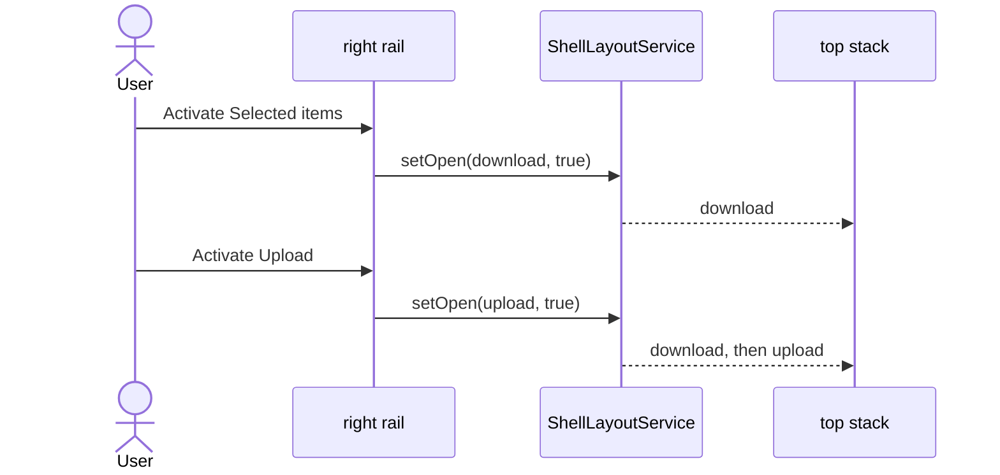
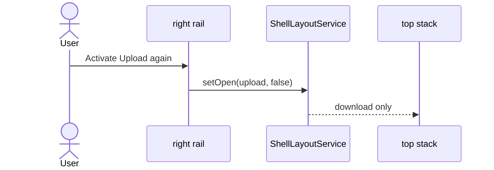

# Panel stacks — interaction scenarios

> **Contracts:** [shell-layout](../specs/service/shell-layout/shell-layout.md) owns who is open. [shell-panel-column](../specs/ui/shell/shell-panel-column.md) owns how those open ids sit in the column.
> **Related:** [shell-panel-surface](../specs/ui/shell/shell-panel-surface.md), [shell-control-area](../specs/ui/shell/shell-control-area.md), [selected-items-panel](../specs/ui/shell/selected-items-panel.md), [shell-panel-resize](../specs/ui/shell/shell-panel-resize.md)

Top-stack ids are `upload`, `download` (Selected items), and `shared-media`. Bottom-stack ids are `tips` and `help`. A stack is a list. Opening one id does not close another.

## PS-1: Upload while Selected items is open

Context: Selected items is open. The user opens Upload from the right rail.

Expected:

- Both rail options stay pressed.
- Both surfaces stay mounted in the top stack, gap `var(--spacing-3)`.
- Selected items stays at the head, because it opened first (`order`).
- Upload does not replace Selected items.

## PS-2: Help while Tips is open

Context: Tips is open. The user opens Help.

Expected:

- Both stay mounted in the bottom stack, Tips first.
- Neither moves into the top stack.

## PS-3: Close one of two

Context: Upload and Selected items are both open. The user activates Upload again, or clicks Upload's collapse control.

Expected:

- Upload unmounts. Its rail option is released.
- Selected items stays open and pressed.
- The same rule applies to the collapse control: `close` affects that id only.

## PS-4: One panel in a stack

Context: Only Upload is open.

Expected:

- The top stack has no `data-multi`.
- The surface may grow up to the stack height and scroll inside its body.
- A filled top stack ends on the canvas bottom.
- Tips alone sits at the column foot, with empty space above.

## PS-5: Two panels do not fit

Context: Upload and Selected items are both open, and their heights together exceed the top stack.

Expected:

- The top stack has `data-multi` and `overflow: auto`.
- Each surface keeps a height greater than zero. Neither uses `max-height: 100%`.
- Scrolling the top stack reveals the surface that does not fit in the visible slice.
- There is no divider between Upload and Selected items.

## PS-6: Both stacks overflow

Context: Upload is open and Help is open, and their natural heights together exceed the column.

Expected:

- The stack divider appears between the top stack and the bottom stack.
- It does not appear between two surfaces in the same stack.
- When both stacks fit, there is no divider. Help sits at the column foot.

## PS-7: A third top panel

Context: Upload and Selected items are open. The user opens Shared media.

Expected:

- All three stay in the top stack, in open order.
- Opening Shared media does not close Upload or Selected items.

## PS-8: Last panel closes

Context: One panel is open. The user closes it.

Expected:

- The panel column contributes no width.
- The canvas keeps a single gap to the right rail.
