# Map Context Menu — Use Cases & Interaction Scenarios

> **Element spec:** [element-specs/component/map-context-menu.md](../element-specs/component/map-context-menu.md)
> **Related specs:** [map-secondary-click-system](../element-specs/map-secondary-click-system.md), [radius-selection](../element-specs/component/radius-selection.md), [photo-marker-context-menu](../element-specs/media-marker/media-marker-context-menu.md), [workspace-pane](../element-specs/workspace/workspace-pane.md), [upload-panel](../element-specs/component/upload-panel.md)

---

## MCM-1: Open Context Menu on Empty Map

**Context:** User wants map-local actions at an exact point without changing zoom or leaving map focus.

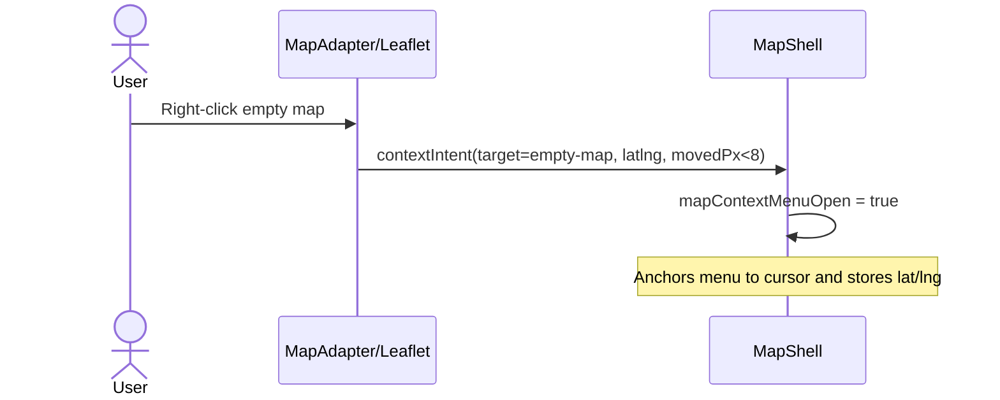

**Expected result:**

- Menu opens at pointer anchor.
- Stored coordinates are available for all actions.

---

## MCM-1b: Second Right-Click Opens Native Browser Menu

**Context:** User wants browser-native actions after inspecting app-specific map actions.

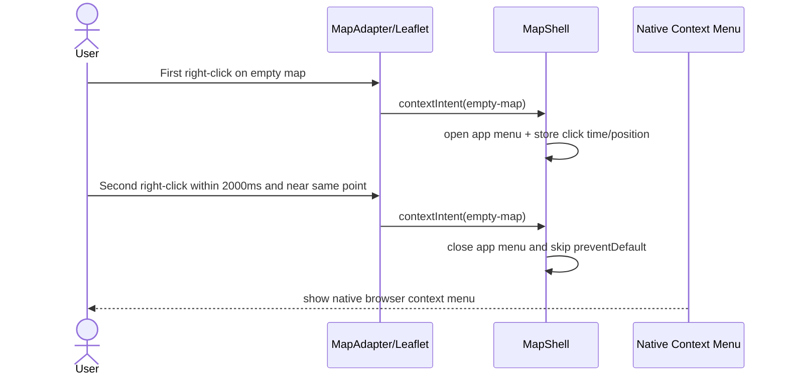

**Expected result:**

- Native browser context menu is reachable without modifier keys.
- If time/distance threshold is missed, behavior falls back to app menu.

---

## MCM-2: Media Marker Hier Erstellen -> Open Workspace Draft

**Context:** User uses right-click action to create a new media marker at a chosen location and upload media immediately.

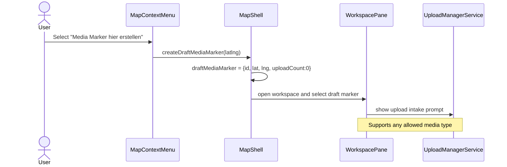

**Expected result:**

- Draft marker is visible on map immediately.
- Workspace opens directly in upload-ready state for the draft marker.

---

## MCM-3: Cancel Empty Draft -> Remove Marker

**Context:** User opens draft marker workflow but decides not to upload anything and left-clicks elsewhere.

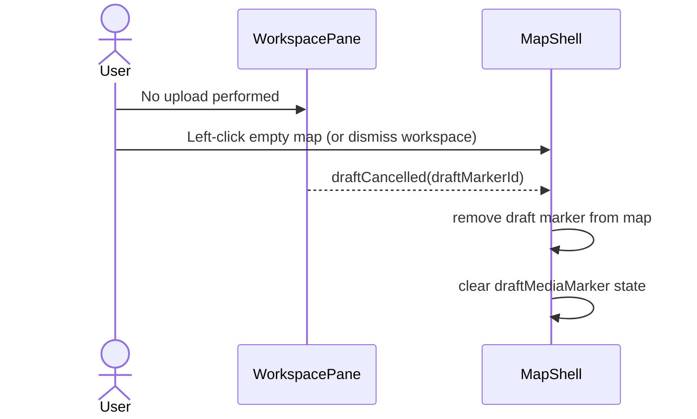

**Expected result:**

- Workspace draft session closes.
- Empty marker disappears immediately.
- No persistent media item is created.

---

## MCM-4: Upload in Draft -> Persist Marker

**Context:** User uploads at least one file from the opened draft workflow.

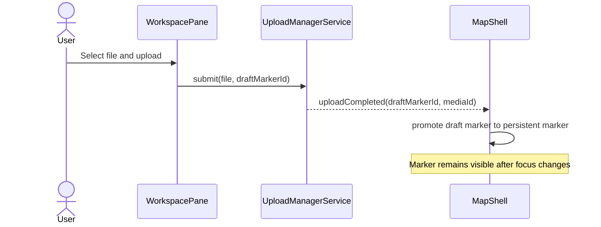

**Expected result:**

- Marker remains on map as persistent media marker.
- Workspace can stay open for additional edits/uploads.

---

## MCM-5: Hierhin Zoomen (Hausnaehe)

**Context:** User wants immediate house-level inspection around the clicked coordinate.

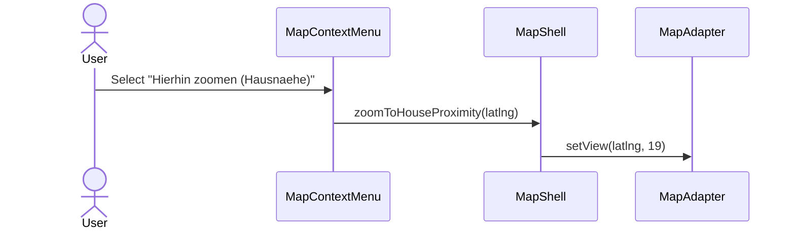

**Expected result:**

- Map centers at clicked point.
- Zoom level reaches building-level context.

---

## MCM-6: Hierhin Zoomen (Strassennaehe)

**Context:** User needs surrounding street context, not maximal zoom.

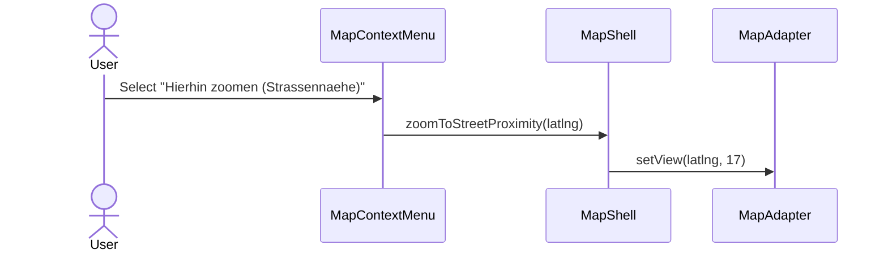

**Expected result:**

- Map centers at clicked point.
- Zoom level reaches street-level context.

---

## MCM-7: Adresse Kopieren

**Context:** User needs a human-readable location string for reporting or messaging.

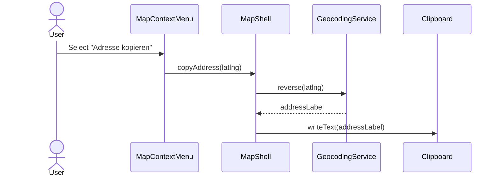

**Expected result:**

- Address is reverse-geocoded and copied.
- User gets success feedback (toast).

---

## MCM-8: GPS Kopieren

**Context:** User needs precise coordinates for technical sharing.

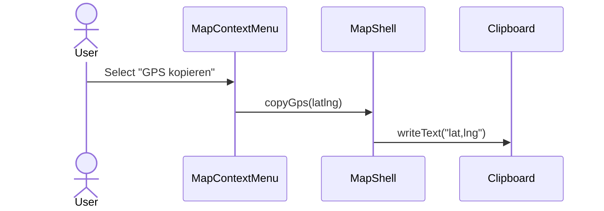

**Expected result:**

- Coordinates are copied in `lat,lng` format.
- User gets success feedback (toast).

---

## MCM-9: In Google Maps Oeffnen

**Context:** User wants external navigation or quick sharing in Google Maps.

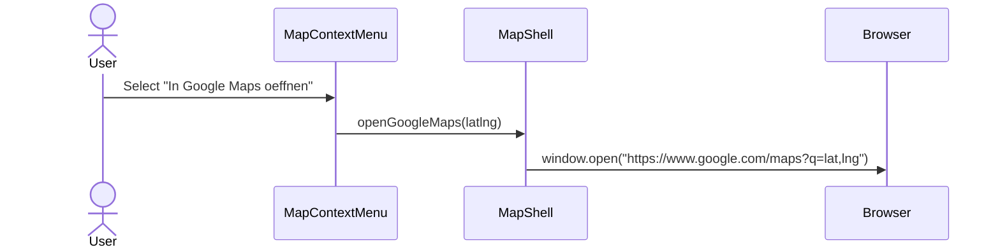

**Expected result:**

- New browser tab opens at clicked coordinates in Google Maps.

---

## MCM-10: Gesture Arbitration With Radius Selection

**Context:** User starts right-click then drags to begin radius selection instead of menu action.

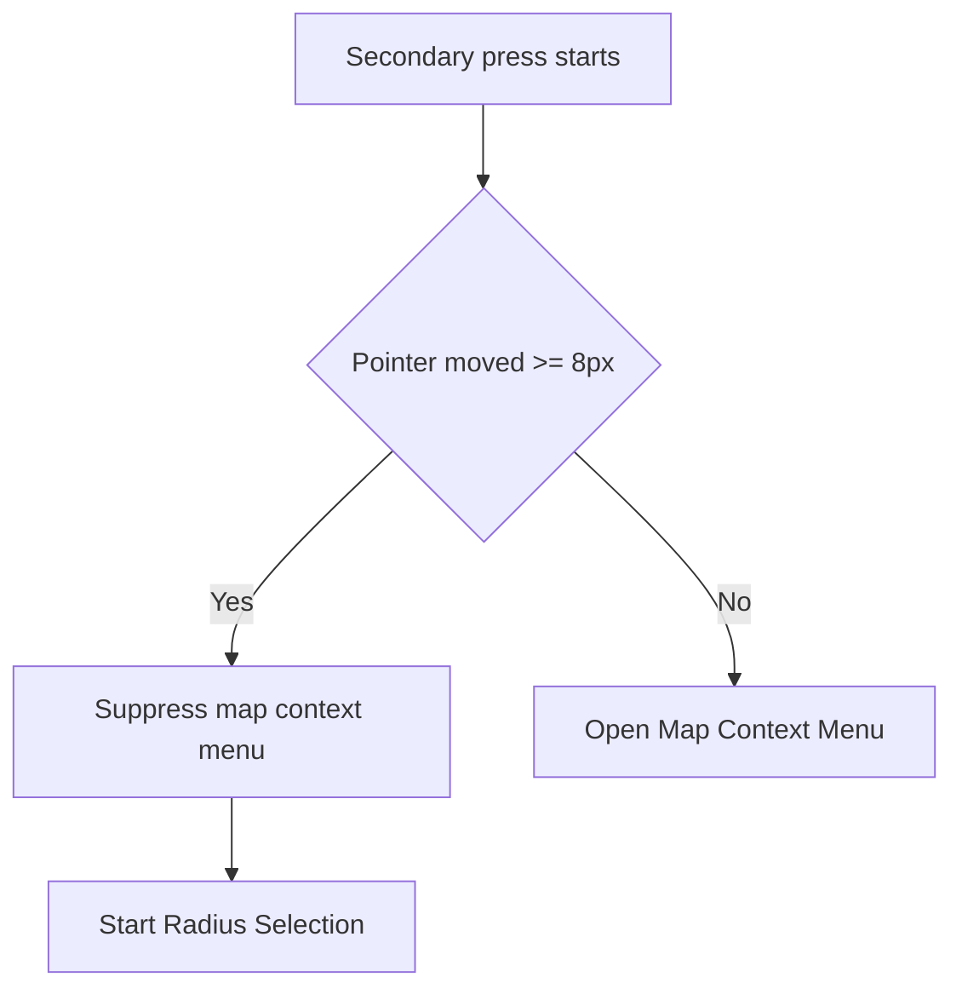

**Expected result:**

- No menu flash during radius drag.
- Drag gesture has priority once threshold is crossed.

---

## MCM-11: Edge And Corner Behavior

**Context:** User right-clicks near viewport boundaries.

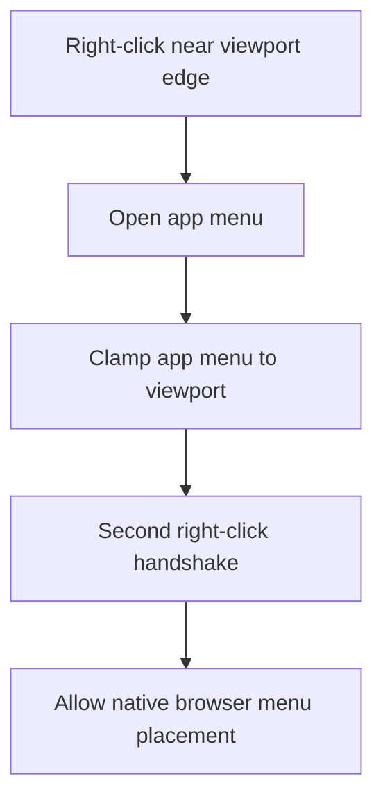

**Expected result:**

- App menu remains visible via normal viewport clamping.
- Native browser menu placement is left to browser behavior.

---

## MCM-12: Active Radius — Right-Click Inside Opens Project Actions

**Context:** User has an active radius and wants to assign the selected set to projects quickly.

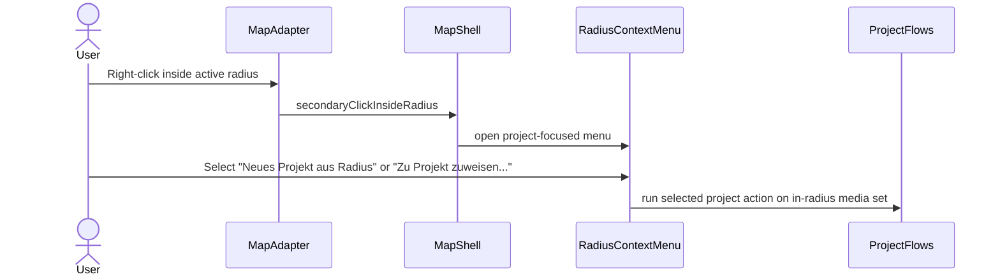

**Expected result:**

- Radius-specific menu opens (not map context menu).
- Project actions operate on current in-radius result set.

---

## MCM-13: Active Radius — Outside Right-Click Closes Radius

**Context:** User wants to quickly dismiss spatial selection.

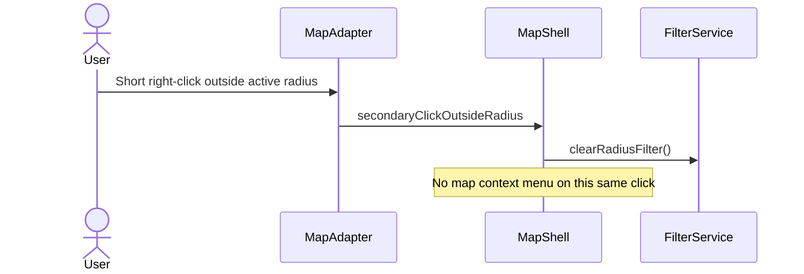

**Expected result:**

- Radius closes immediately.
- First outside-click is a dismiss gesture, not a menu-open gesture.

---

## Acceptance Checklist

- [ ] Right-click on empty map opens context menu.
- [ ] Second right-click handshake opens native browser menu.
- [ ] "Media Marker hier erstellen" opens workspace draft flow.
- [ ] Left-click/dismiss with zero uploads removes draft marker.
- [ ] Successful upload promotes draft to persistent marker.
- [ ] "Hierhin zoomen (Hausnaehe)" zooms to building-level context.
- [ ] "Hierhin zoomen (Strassennaehe)" zooms to street-level context.
- [ ] "Adresse kopieren" resolves + copies human-readable address.
- [ ] "GPS kopieren" copies lat/lng coordinates.
- [ ] "In Google Maps oeffnen" opens external map tab at clicked point.
- [ ] Secondary-click drag above threshold starts radius selection instead of menu.
- [ ] Edge/corner right-click keeps app menu visible and does not require browser-menu-specific placement logic.
- [ ] With active radius, right-click inside radius opens project-focused radius actions.
- [ ] With active radius, short right-click outside radius closes radius and does not open map menu on same click.
