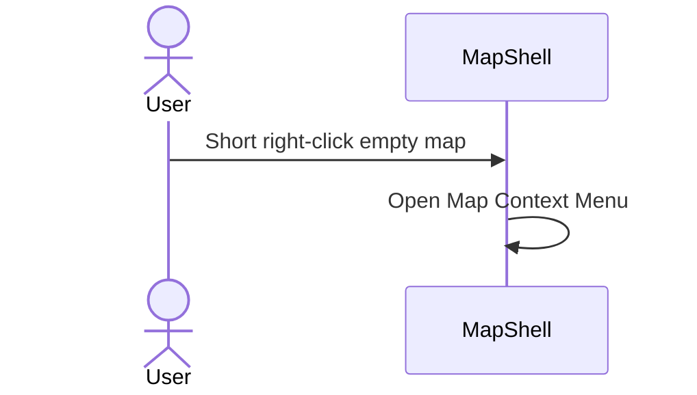
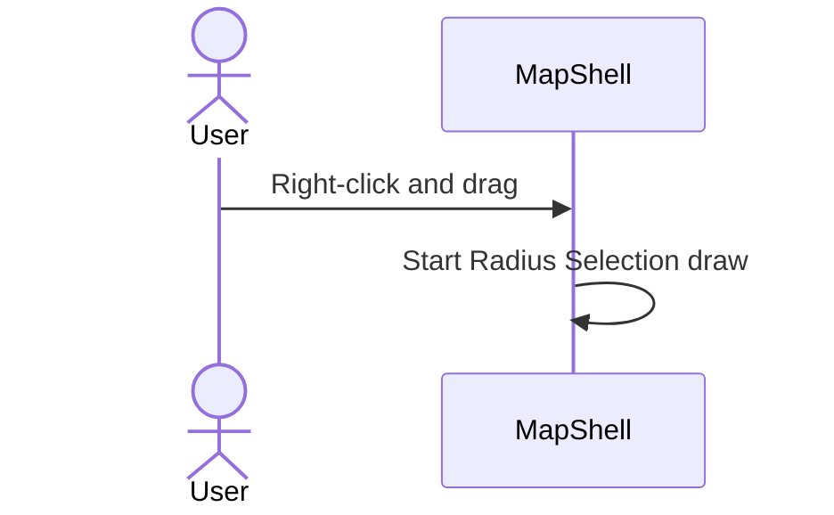
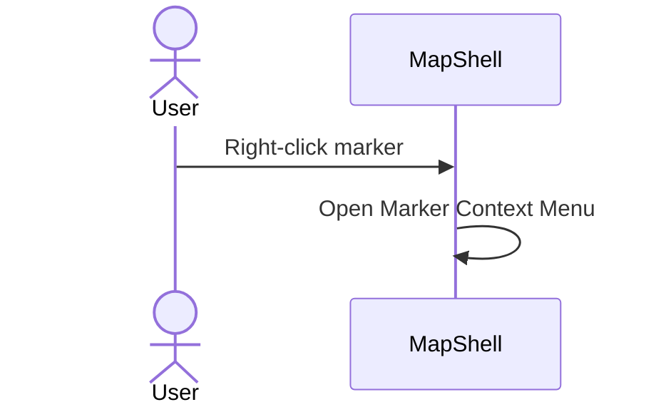
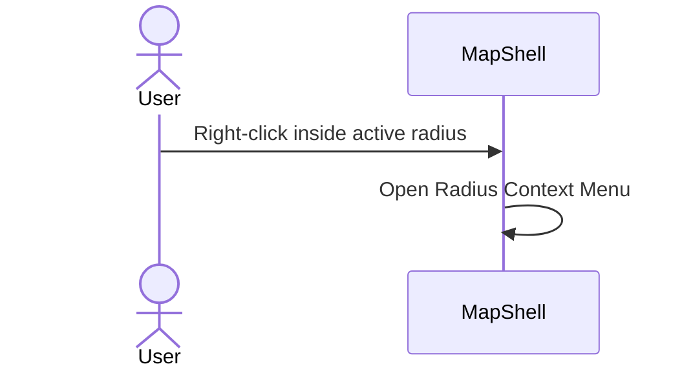
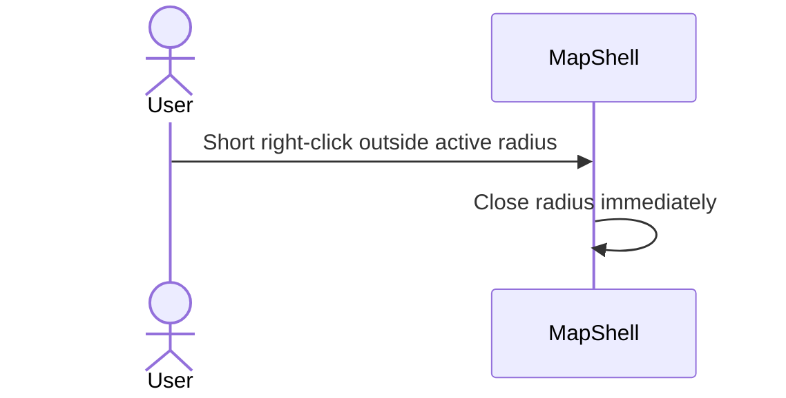
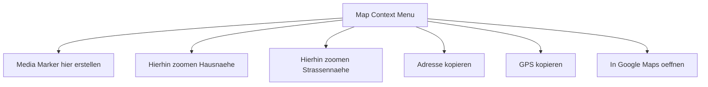
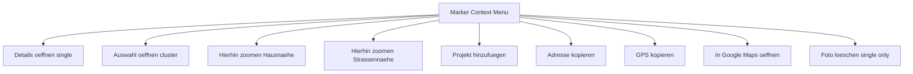
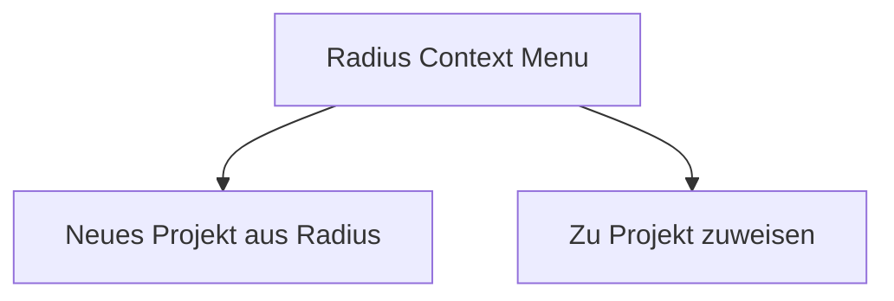

# Map Secondary-Click System — Use Cases

> **Element spec:** [element-specs/map-secondary-click-system.md](../element-specs/map-secondary-click-system.md)

---

## SCS-1: Empty Map Short Right-Click

Expected:

- Map menu opens.

---

## SCS-2: Empty Map Right-Drag

Expected:

- Radius draw starts, no map menu flash.

---

## SCS-3: Marker Right-Click

Expected:

- Marker menu opens, map menu suppressed.

---

## SCS-4: Right-Click Inside Active Radius

Expected:

- Radius menu opens (project-first actions).

---

## SCS-5: Right-Click Outside Active Radius

Expected:

- Radius closes.
- No map menu on same click.

---

## SCS-6: Map Menu Option Set

Expected:

- All selected options are present.

---

## SCS-7: Marker Menu Option Set

Expected:

- Single/cluster gating is correct.

---

## SCS-8: Radius Menu Option Set

Expected:

- Radius menu keeps both project actions.

---

## Checklist

- [ ] Precedence path is implemented exactly.
- [ ] Map, marker, and radius menus are all documented in one system spec.
- [ ] Radius context menu is explicitly present and not removed.
