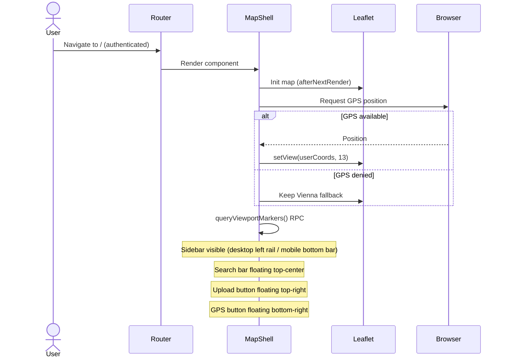
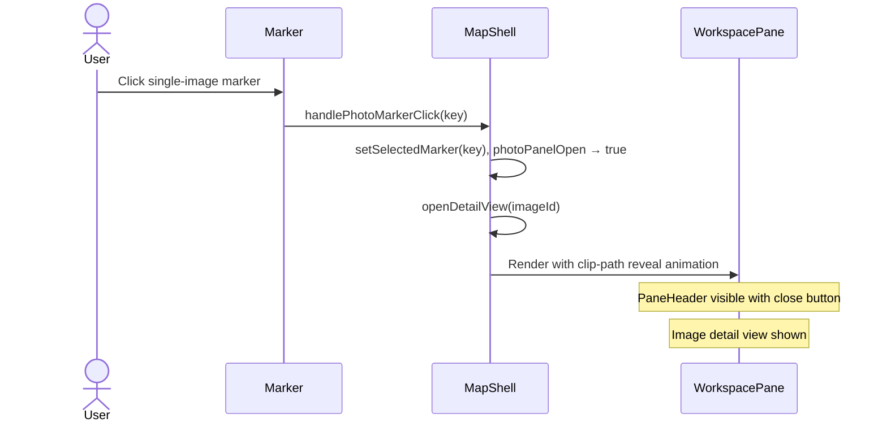
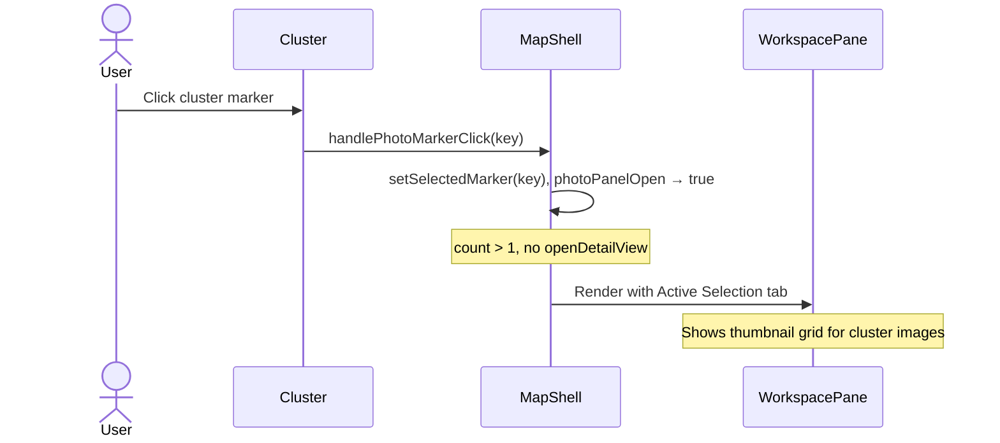
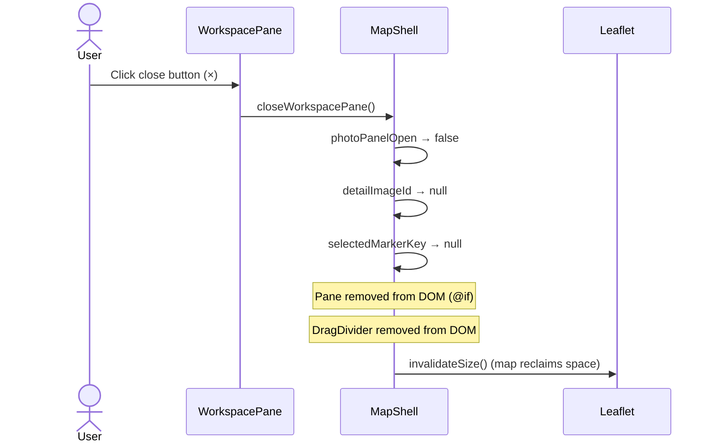
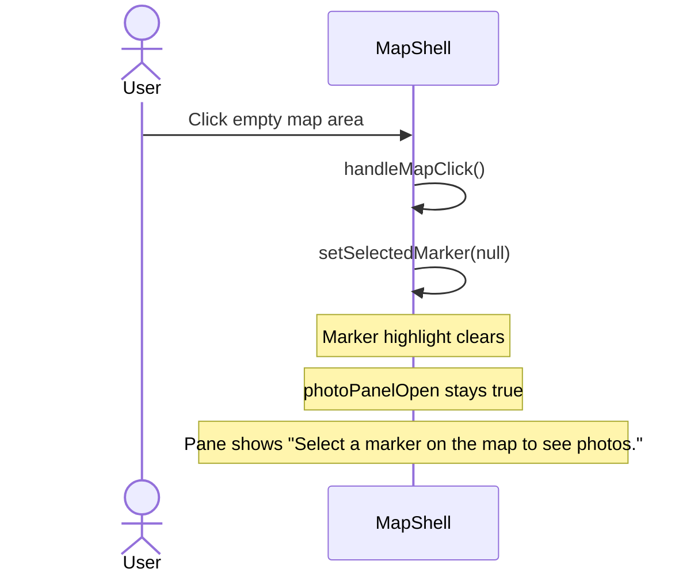
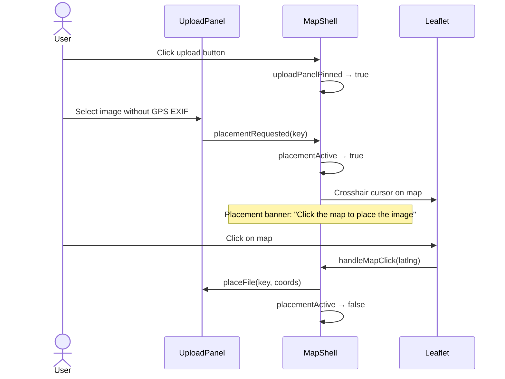
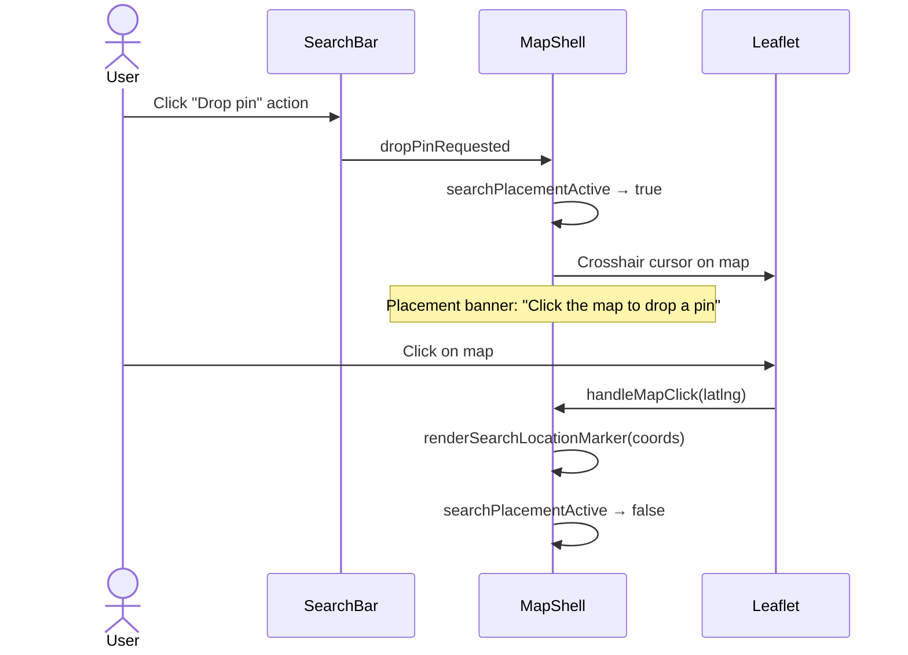

# Map Shell — Interaction Scenarios

> **Element spec:** [specs/page/map-page.md](../specs/page/map-page.md)
> **Contracts:** [map-page spec](../specs/page/map-page.md), [workspace-pane](../specs/ui/workspace/workspace-pane.md)
> **Product use cases:** [UC1](README.md#uc1--technician-on-site-view-history), [UC2](README.md#uc2--clerk-preparing-a-quote), [UC3](README.md#uc3--upload-and-correct-a-new-image)
> **Related specs:** [workspace-pane](../specs/ui/workspace/workspace-pane.md), [drag-divider](../specs/component/drag-divider.md), [search-bar](../specs/ui/search-bar/search-bar.md), [upload-button-zone](../specs/component/upload-button-zone.md), [photo-marker](../specs/ui/media-marker/media-marker.md), [image-detail-view](../specs/ui/media-detail/media-detail-view.md), [map-context-menu](../specs/component/map-context-menu.md)
> **Related use cases:** [map-context-menu](map-context-menu.md)

---

## IS-1: Initial Map Load (spec Actions #1)

**Product context:** Every UC begins here. The technician (UC1) or clerk (UC2) sees the map immediately after login.

**Expected state after:**

- `placementActive` = false
- `searchPlacementActive` = false
- `uploadPanelOpen` = false
- `photoPanelOpen` = false (Workspace Pane closed; **interim:** signal on `MapShellComponent` — see [Workspace Pane visibility](#workspace-pane-visibility-canonical-vs-interim))
- Map renders with markers from viewport query

---

## IS-2: Open Workspace Pane via Marker Click (spec Actions #3)

**Product context:** UC1 step 6 (tap marker), UC2 step 6 (browse markers).
**Related:** [photo-marker spec](../specs/ui/media-marker/media-marker.md) §Cluster Click, [workspace-pane spec](../specs/ui/workspace/workspace-pane.md) §1/§1b

**For cluster markers:**

---

## IS-3: Close Workspace Pane (spec Actions #6)

**Product context:** User is done reviewing; wants to return to map-only view.
**Related:** [workspace-pane spec](../specs/ui/workspace/workspace-pane.md) §3

**Expected state after:**

- `photoPanelOpen` = false (same as Workspace Pane closed; **target** rename `workspacePaneOpen` on layout host per [symbol rename backlog](../backlog/media-photo-symbol-rename-roadmap.md))
- `detailImageId` = null
- `selectedMarkerKey` = null

---

## IS-4: Click Empty Map While Pane Open (spec Actions #7)

**Product context:** User clicks a blank area on the map. Deselects the marker but keeps the pane open for continued browsing.

---

## IS-5: Upload and Placement Mode (spec Actions #4, #5)

**Product context:** UC3 — upload a new image, place it if no EXIF GPS.
**Related:** [upload-button-zone spec](../specs/component/upload-button-zone.md)

### Search pin-drop variant (spec Actions #5):

---

## IS-6: Browser Resize — Responsive Reflow (spec Actions #2)

**Product context:** Technician switches orientation on tablet, or clerk resizes browser window.

| Breakpoint | Sidebar                     | Workspace Pane           | Upload |
| ---------- | --------------------------- | ------------------------ | ------ |
| ≥ 768px    | Left rail (floating, icons) | Right panel with divider | FAB    |
| < 768px    | Bottom tab bar (full width) | Bottom sheet (40vh)      | FAB    |

No JS needed — CSS media queries handle the reflow. `NavComponent` handles sidebar transformation independently.

---

## Workspace Pane visibility (canonical vs interim)

**Canonical:** The **authenticated layout host** owns the horizontal split and mounts **Workspace Pane** alongside route content. See [workspace-pane § Layout host](../specs/ui/workspace/workspace-pane.md#layout-host-canonical).

**Interim:** The pane DOM is still mounted under **`MapShellComponent`** on map and settings routes until the layout hoist matches that contract. See [workspace-pane § Interim implementation](../specs/ui/workspace/workspace-pane.md#interim-implementation-until-layout-hoist).

**Symbols:** Product language is **Workspace Pane** / **media item**. The shipped visibility signal is **`photoPanelOpen`** on `MapShellComponent` today; a post-hoist rename (e.g. `workspacePaneOpen` on the layout host) is deferred — [workspace-pane § Terminology](../specs/ui/workspace/workspace-pane.md#terminology-symbols-and-product-language), [media-photo-symbol-rename-roadmap](../backlog/media-photo-symbol-rename-roadmap.md).

Sequence diagrams above use **`photoPanelOpen`** to match current TypeScript.
