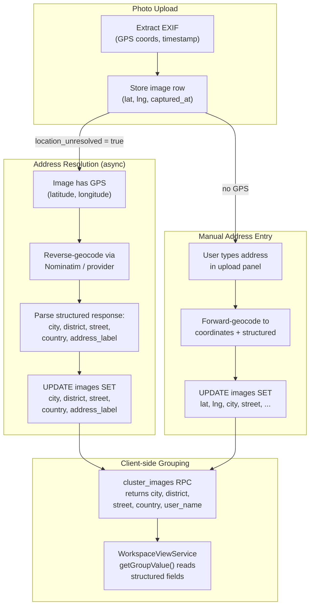
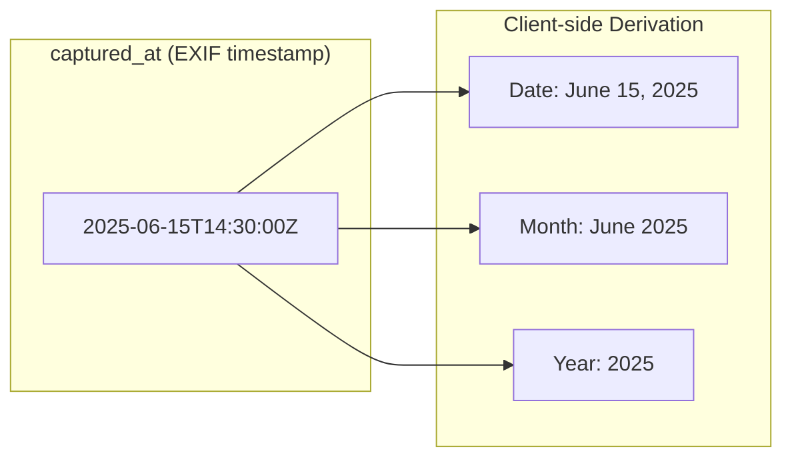
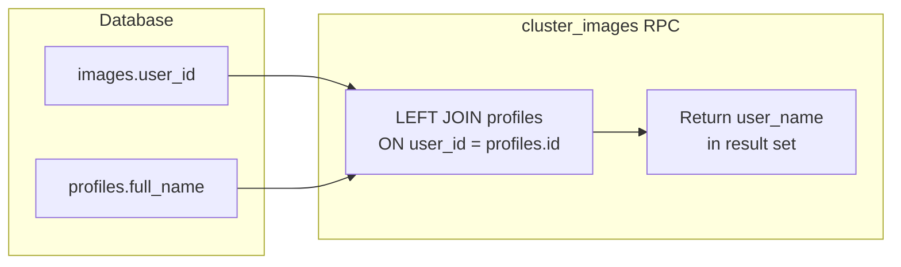
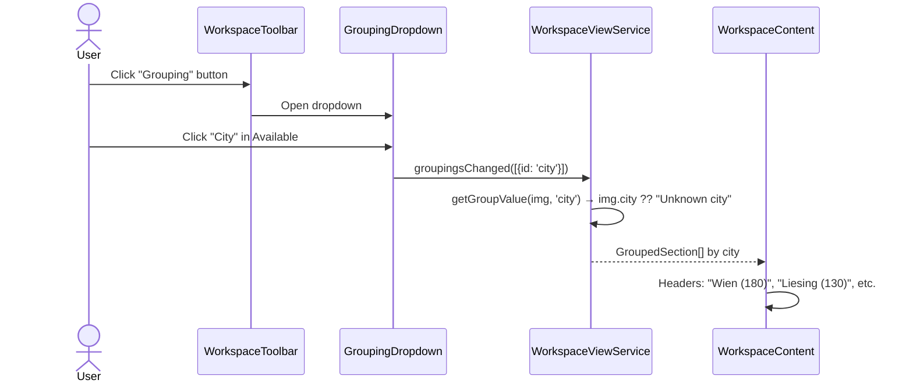
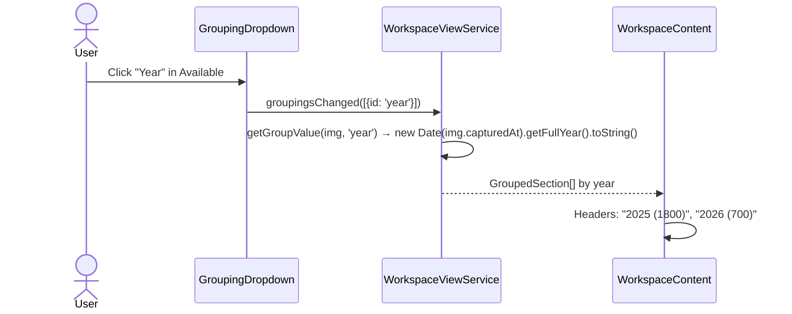
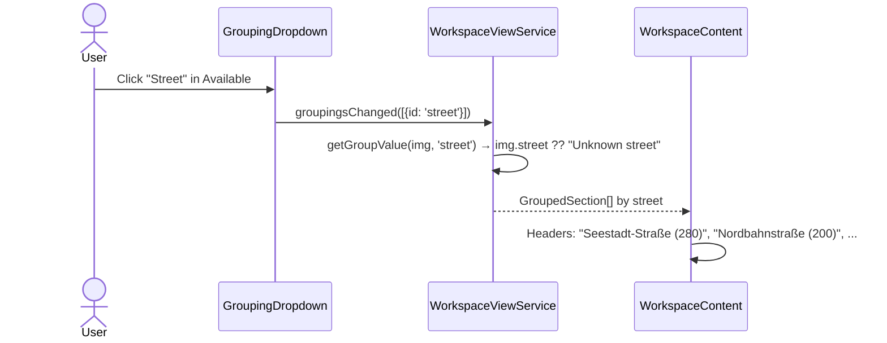
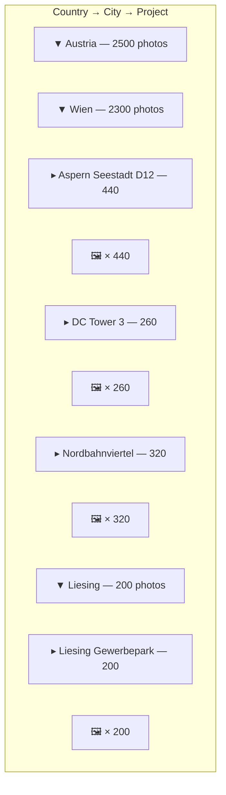
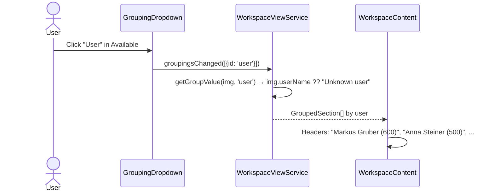
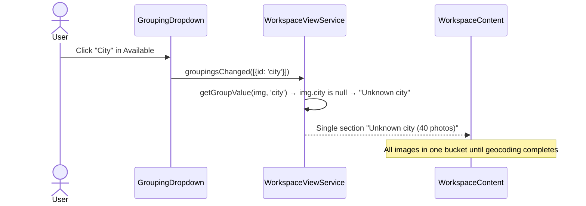

# Photo Grouping — Data Sources & Derivation

> **Related specs:** [grouping-dropdown](../element-specs/grouping-dropdown.md), [workspace-view-system](../element-specs/workspace-view-system.md), [workspace-toolbar](../element-specs/workspace-toolbar.md)
> **Related use cases:** [workspace-view WV-4, WV-5](workspace-view.md)

---

## Overview

Photos can be grouped by various properties. Some properties are stored directly on each image row, some are derived from other fields at query time or on the client, and some require external resolution (reverse geocoding). This document maps every grouping property to its data source, derivation logic, and fallback behaviour.

---

## Grouping Property Matrix

| Property     | DB Column(s)              | Source                     | Derivation                                      | Fallback Label       |
| ------------ | ------------------------- | -------------------------- | ----------------------------------------------- | -------------------- |
| **Date**     | `captured_at`             | EXIF extraction at upload  | `toLocaleDateString(full)`                      | `"Unknown date"`     |
| **Year**     | `captured_at`             | EXIF extraction at upload  | `getFullYear()`                                 | `"Unknown year"`     |
| **Month**    | `captured_at`             | EXIF extraction at upload  | `toLocaleDateString(year+month)` → "March 2026" | `"Unknown month"`    |
| **Project**  | `project_id` → `projects` | User assignment at upload  | JOIN project name                               | `"No project"`       |
| **City**     | `city`                    | Reverse geocoding from GPS | Stored directly after address resolution        | `"Unknown city"`     |
| **Country**  | `country`                 | Reverse geocoding from GPS | Stored directly after address resolution        | `"Unknown country"`  |
| **Street**   | `street`                  | Reverse geocoding from GPS | Stored directly after address resolution        | `"Unknown street"`   |
| **District** | `district`                | Reverse geocoding from GPS | Stored directly after address resolution        | `"Unknown district"` |
| **Address**  | `address_label`           | Reverse geocoding / manual | Full human-readable label                       | `"Unknown address"`  |
| **User**     | `user_id` → `profiles`    | Auth at upload             | JOIN profile full_name                          | `"Unknown user"`     |

---

## Data Flow: How Address Fields Get Populated

---

## Data Flow: Date-Derived Groupings

No extra DB columns needed — `captured_at` is parsed on the client into date, month, or year labels.

---

## Data Flow: User Grouping

The `cluster_images` RPC joins `profiles` to return the uploader's name alongside each image.

---

## Use Cases

### UC-G1: Grouping by City (address already resolved)

**Precondition:** Images have been reverse-geocoded; `city` column is populated.

### UC-G2: Grouping by Year

**Precondition:** Images have `captured_at` timestamps from EXIF.

### UC-G3: Grouping by Street

**Precondition:** Images have been reverse-geocoded; `street` column is populated.

### UC-G4: Multi-level — Country → City → Project

### UC-G5: Grouping by User

### UC-G6: Address Fields Not Yet Resolved

**Precondition:** Fresh upload, reverse geocoding hasn't run yet.

---

## Address Resolution Strategies

| Trigger              | Method                   | Fields Populated                                                                  |
| -------------------- | ------------------------ | --------------------------------------------------------------------------------- |
| After upload (async) | Reverse geocode GPS→addr | `address_label`, `city`, `district`, `street`, `country`                          |
| Manual address entry | Forward geocode addr→GPS | `address_label`, `city`, `district`, `street`, `country`, `latitude`, `longitude` |
| Marker correction    | Reverse geocode new GPS  | Updates all address fields for new location                                       |
| Folder import        | Forward geocode filename | All address fields + coordinates                                                  |

All strategies ultimately populate the same structured columns on the `images` table.
