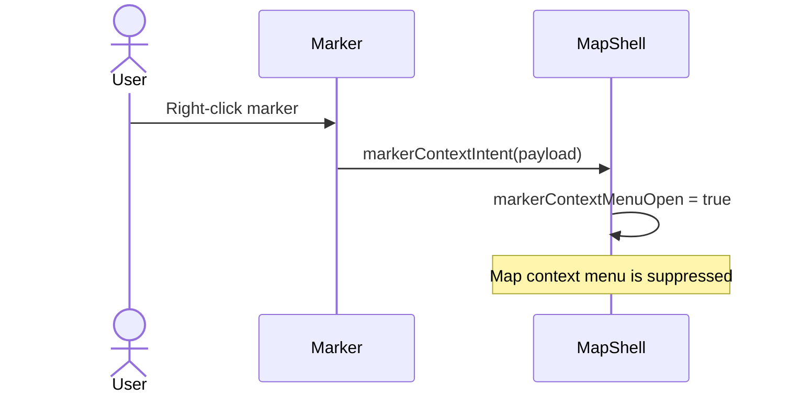
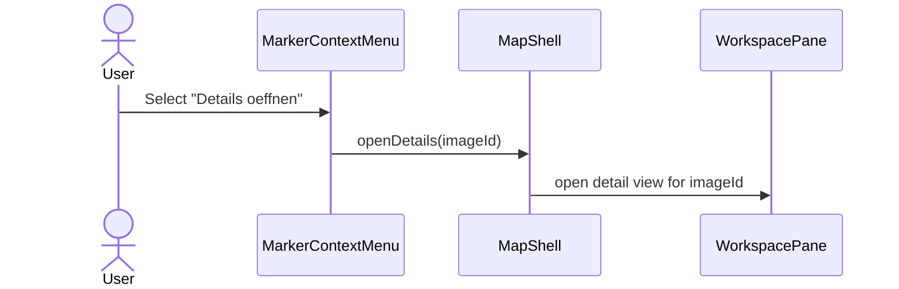
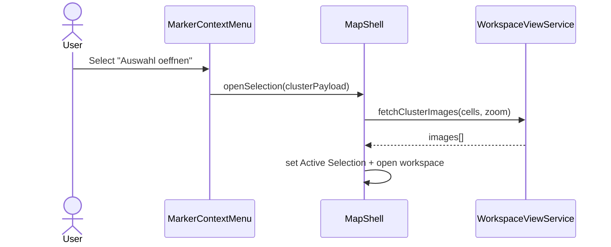
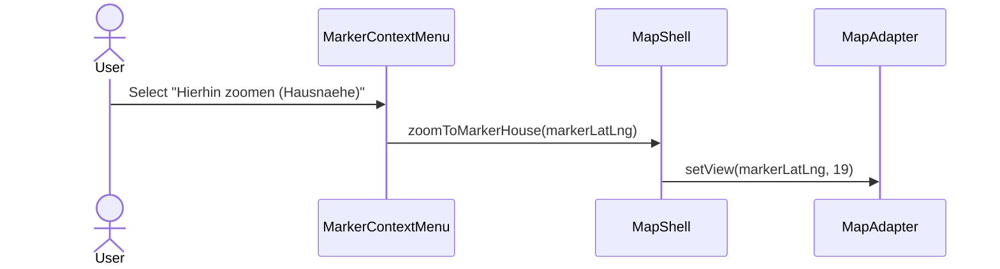
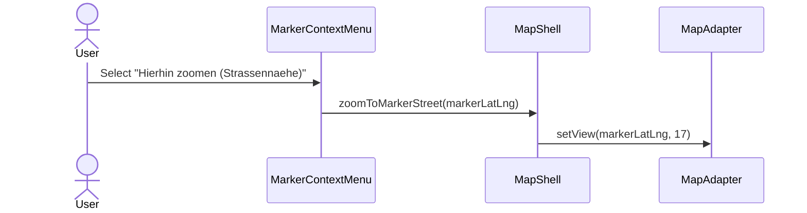
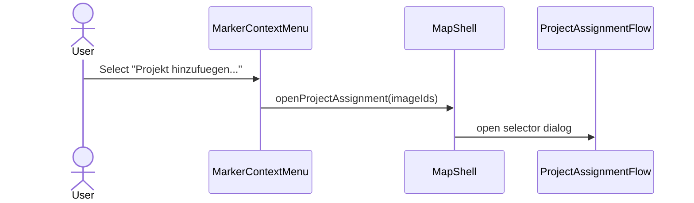
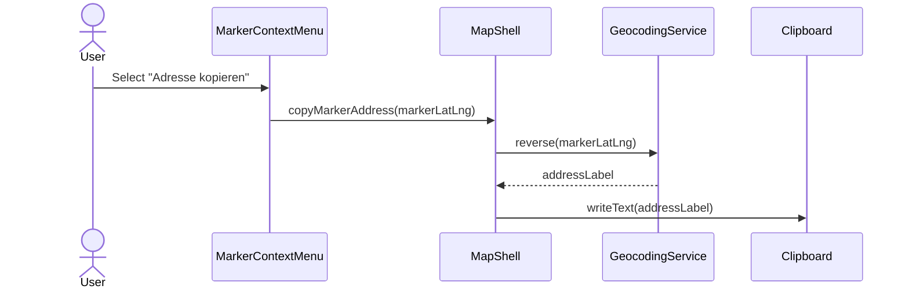
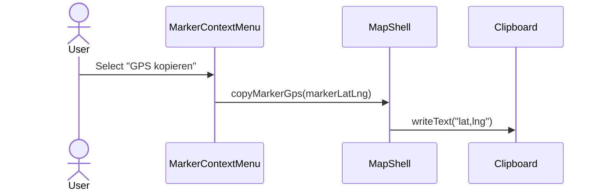
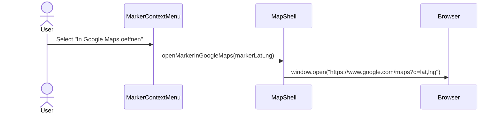
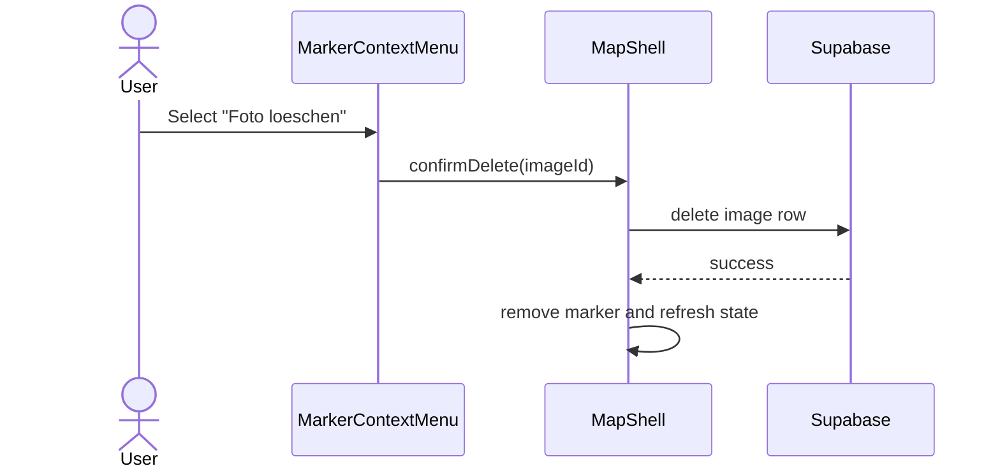

# Photo Marker Context Menu — Use Cases & Interaction Scenarios

> **Element spec:** [element-specs/photo-marker-context-menu.md](../element-specs/photo-marker-context-menu.md)
> **Related specs:** [map-secondary-click-system](../element-specs/map-secondary-click-system.md), [map-context-menu](../element-specs/map-context-menu.md), [radius-selection](../element-specs/radius-selection.md), [workspace-pane](../element-specs/workspace-pane.md), [projects-dropdown](../element-specs/projects-dropdown.md)

---

## PMC-1: Open Marker Context Menu

**Context:** User right-clicks or long-presses a photo marker.

**Expected result:**

- Marker menu opens at marker anchor.
- Actions are filtered by marker type (`single` / `cluster`).

---

## PMC-2: Details Oeffnen (Single)

**Context:** User wants full metadata editing for one marker image.

**Expected result:**

- Workspace opens/focuses detail view of selected image.

---

## PMC-3: Auswahl Oeffnen (Cluster)

**Context:** User wants all media at clustered marker position.

**Expected result:**

- Active Selection is populated with cluster media.

---

## PMC-4: Hierhin Zoomen (Hausnaehe)

**Context:** User needs close inspection of exact marker location.

**Expected result:**

- Map centers marker and zooms to building-level context.

---

## PMC-5: Hierhin Zoomen (Strassennaehe)

**Context:** User needs broader neighborhood context around marker.

**Expected result:**

- Map centers marker and zooms to street-level context.

---

## PMC-6: Projekt Hinzufuegen

**Context:** User wants to assign marker media to one or more projects.

**Expected result:**

- Project assignment UI opens for relevant marker media.

---

## PMC-7: Adresse Kopieren

**Context:** User needs marker address for communication/documents.

**Expected result:**

- Human-readable address is copied to clipboard.

---

## PMC-8: GPS Kopieren

**Context:** User needs exact coordinates for technical handoff.

**Expected result:**

- Marker coordinates are copied in `lat,lng` format.

---

## PMC-9: In Google Maps Oeffnen

**Context:** User wants navigation/external map workflow.

**Expected result:**

- New browser tab opens with Google Maps marker location.

---

## PMC-10: Foto Loeschen (Single Only)

**Context:** User removes wrong/obsolete single-marker photo.

**Expected result:**

- Photo is deleted after confirmation.
- Marker updates immediately.

---

## Acceptance Checklist

- [ ] Marker right-click opens marker context menu, not map context menu.
- [ ] Single marker shows `Details oeffnen`; cluster marker shows `Auswahl oeffnen`.
- [ ] `Hierhin zoomen (Hausnaehe)` uses building-level zoom.
- [ ] `Hierhin zoomen (Strassennaehe)` uses street-level zoom.
- [ ] `Projekt hinzufuegen...` opens project assignment flow.
- [ ] `Adresse kopieren` resolves + copies marker address.
- [ ] `GPS kopieren` copies marker coordinates.
- [ ] `In Google Maps oeffnen` opens external map tab.
- [ ] `Foto loeschen` appears only for single markers and requires confirmation.
