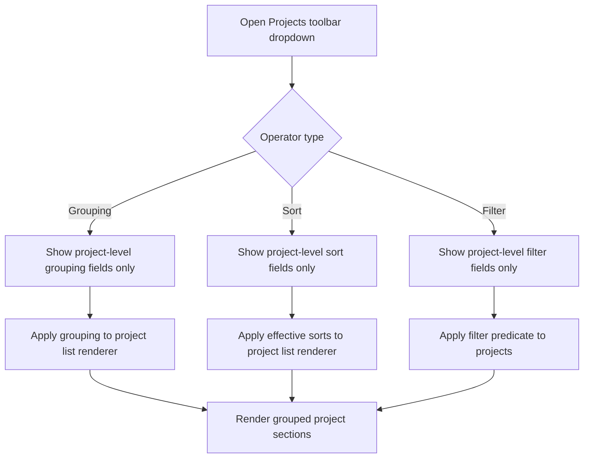
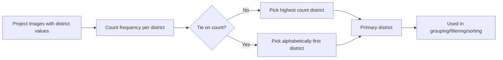

# Projects Page Grouping/Filter/Sort — Use Cases

> Related specs: [projects-page](../element-specs/projects-page.md), [grouping-dropdown](../element-specs/component/grouping-dropdown.md), [filter-dropdown](../element-specs/component/filter-dropdown.md), [sort-dropdown](../element-specs/component/sort-dropdown.md)

## Scope

This document defines behavior for grouping, filtering, and sorting controls on the Projects page.
The controls must use the same interaction model as the Workspace Pane controls, but operate on a project-level data model.

Projects page operators are intentionally scoped to project-level fields. Image-level-only fields (for example `date-captured`, `distance`, `project`) are not valid in Projects grouping/sorting/filtering menus.

Allowed project-level operator fields:

- Grouping: `status`, `primary-district`, `primary-city`, `color-key`
- Sorting: `name`, `updated-at`, `last-activity`, `image-count`, `status`, `primary-district`, `primary-city`
- Filtering: `status`, `name`, `updated-at`, `last-activity`, `image-count`, `primary-district`, `primary-city`, `color-key`

## Scenario Index

| ID     | Scenario                                                |
| ------ | ------------------------------------------------------- |
| PGS-1  | Open Grouping and see property registry entries         |
| PGS-2  | Add one grouping property                               |
| PGS-3  | Add multiple grouping properties                        |
| PGS-4  | Reorder grouping properties via drag and drop           |
| PGS-5  | Remove one grouping property                            |
| PGS-6  | Reset all grouping properties                           |
| PGS-7  | Open Filter and see operator set by property type       |
| PGS-8  | Text filter operators match Workspace Pane              |
| PGS-9  | Number filter operators match Workspace Pane            |
| PGS-10 | Date filter operators match Workspace Pane              |
| PGS-11 | Combine AND/OR filter rules                             |
| PGS-12 | Remove one filter rule                                  |
| PGS-13 | Sort by grouping property                               |
| PGS-14 | Multi-sort with primary and secondary sort              |
| PGS-15 | Reset sort to default                                   |
| PGS-16 | Group by primary district and sort by primary district  |
| PGS-17 | Group by status and then by primary district            |
| PGS-18 | Filter by primary district and keep grouping stable     |
| PGS-19 | Keep selections after closing/reopening dropdown        |
| PGS-20 | Keep state after switching list/cards view              |
| PGS-21 | Keep state after opening/closing project workspace pane |
| PGS-22 | Keep state after route refresh with persisted settings  |
| PGS-23 | Empty results state for strict filters                  |
| PGS-24 | Fast typing in filter search does not break ordering    |
| PGS-25 | Projects list renders explicit group headers            |

---

## PGS-1: Open Grouping And See Property Registry Entries

1. User clicks Grouping.
2. System opens Grouping dropdown.
3. System shows the Projects operator profile fields only.

Expected:

- Grouping dropdown lists project-level properties only (`status`, `primary-district`, `primary-city`, `color-key`).
- List/Cards is not shown as grouping content.

## PGS-2: Add One Grouping Property

1. User selects one property in Grouping.
2. Property moves to active grouping list.

Expected:

- Grouping active indicator appears.
- Results are grouped by that property.

## PGS-3: Add Multiple Grouping Properties

1. User adds property A and property B.
2. Grouping hierarchy becomes A -> B.

Expected:

- Group headers render in nested order.
- Group order follows active grouping order.

## PGS-4: Reorder Grouping Properties Via Drag And Drop

1. User drags property B above A.
2. Group order updates immediately.

Expected:

- New hierarchy is B -> A.
- Order is preserved after dropdown close/reopen.

## PGS-5: Remove One Grouping Property

1. User deactivates one active grouping row.
2. Property returns to available list.

Expected:

- Grouping hierarchy updates without page reload.

## PGS-6: Reset All Grouping Properties

1. User clicks reset in Grouping dropdown.

Expected:

- Active grouping becomes empty.
- Available list contains all groupable properties.

## PGS-7: Open Filter And See Operator Set By Property Type

1. User opens Filter dropdown.
2. User picks property type text, number, and date.

Expected:

- Operators change according to property type.
- Operator behavior matches Workspace Pane interaction model (same UI contract), but options are restricted to project-level fields.

## PGS-8: Text Filter Operators Match Workspace Pane

For text properties, available operators are:

- contains
- equals
- is
- is not
- before
- after

Expected:

- Same labels and behavior as Workspace Pane.

## PGS-9: Number Filter Operators Match Workspace Pane

For number properties, available operators are:

- =
- ≠
- >
- <
- ≥
- ≤

Expected:

- Same labels and behavior as Workspace Pane.

## PGS-10: Date Filter Operators Match Workspace Pane

For date properties, available operators are:

- is
- is not
- before
- after

Expected:

- Same labels and behavior as Workspace Pane.

## PGS-11: Combine AND/OR Filter Rules

1. User adds multiple rules.
2. User toggles conjunction between AND and OR.

Expected:

- Conjunction state is applied correctly.
- Result set updates accordingly.

## PGS-12: Remove One Filter Rule

1. User removes one rule using close action.

Expected:

- Remaining rules stay intact.
- Filtered results recompute correctly.

## PGS-13: Sort By Grouping Property

1. User activates grouping property X.
2. User opens Sort and sets X ascending/descending.

Expected:

- Sort recognizes grouping property and applies direction.
- Ordering inside grouped sections is deterministic.

## PGS-14: Multi-Sort With Primary And Secondary Sort

1. User activates sort by district then by project name.

Expected:

- Primary and secondary sorting are both applied.
- Ties in primary are resolved by secondary.

## PGS-15: Reset Sort To Default

1. User clicks reset in Sort dropdown.

Expected:

- Sort reverts to default order.
- Active sort indicator updates.

## PGS-16: Group By District And Sort By District

1. User opens Grouping and activates Primary district.
2. User opens Sort and sets Primary district ascending.

Expected:

- Projects are grouped by primary district buckets.
- Primary district buckets are sorted ascending.
- Grouping is deterministic even when a project has images in multiple districts.

## PGS-17: Group By Status And Then By Primary District

1. User adds Status then Primary district in Grouping.

Expected:

- Two-level grouping appears: Status -> Primary district.
- Changing order to Primary district -> Status changes rendered hierarchy.

## PGS-18: Filter By Primary District Value And Keep Grouping Stable

1. User groups by Primary district.
2. User filters Primary district contains "Wien".

Expected:

- Only matching primary district groups remain.
- Existing grouping order remains unchanged.

## PGS-19: Keep Selections After Closing/Reopening Dropdown

1. User sets grouping/filter/sort.
2. User closes and reopens each dropdown.

Expected:

- All choices persist in session state.

## PGS-20: Keep State After Switching List/Cards View

1. User sets grouping/filter/sort.
2. User switches between List and Cards.

Expected:

- Grouping/filter/sort state remains unchanged.

## PGS-21: Keep State After Opening/Closing Project Workspace Pane

1. User sets grouping/filter/sort.
2. User opens a project workspace pane.
3. User closes workspace pane.

Expected:

- Grouping/filter/sort remains unchanged.

## PGS-22: Keep State After Route Refresh With Persisted Settings

1. User configures grouping/filter/sort.
2. User refreshes page or returns later.

Expected:

- Persisted settings are restored according to settings policy.

## PGS-23: Empty Results State For Strict Filters

1. User sets filters producing zero matches.

Expected:

- Empty state appears.
- Current grouping/filter/sort chips remain visible and editable.

## PGS-24: Fast Typing In Filter Search Does Not Break Ordering

1. User quickly types in filter text fields.
2. User changes sort while typing.

Expected:

- No visual flicker or unstable ordering.
- Final state matches last user inputs.

## PGS-25: Projects List Renders Explicit Group Headers

1. User activates one or more grouping fields.
2. User views list mode.

Expected:

- The projects list renders explicit group header rows (for example "Active", "Archived", "Wien 22").
- Projects are rendered inside their matching group section.
- When grouping is cleared, list returns to a flat projects list.

---

## Operator Domain Contract

## Location Semantics (Primary District/City)

---

## Acceptance Matrix

- Grouping dropdown uses project-level operator profile: yes
- Filter dropdown operators follow Workspace interaction model: yes
- Sort dropdown behavior follows Workspace interaction model: yes
- Primary district grouping + primary district sorting supported: yes
- Multi-level grouping and multi-sort supported: yes
- Grouped list renders explicit group headers: yes
- State persistence rules defined: yes
