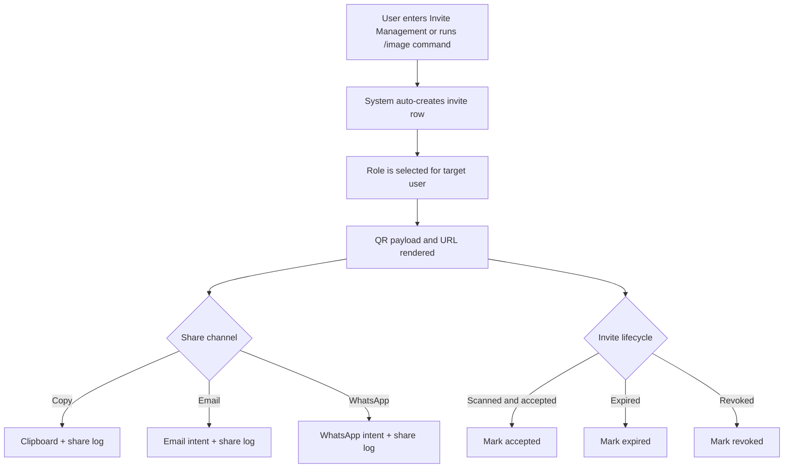
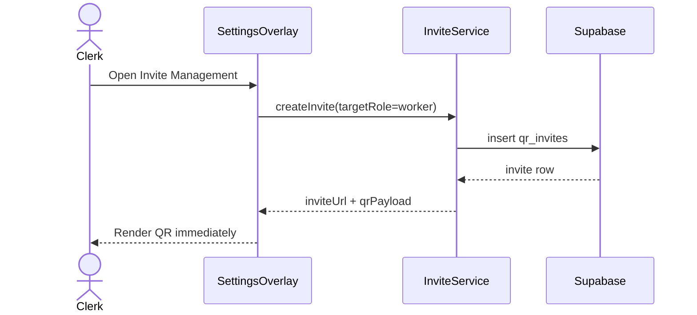
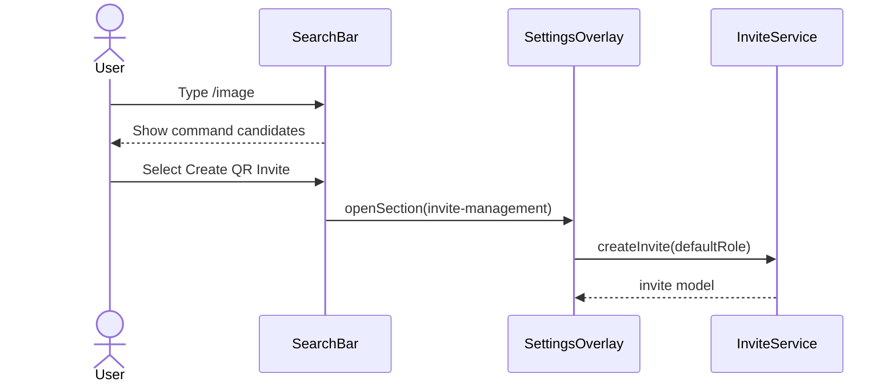
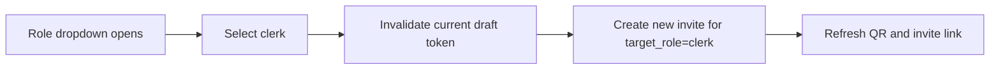
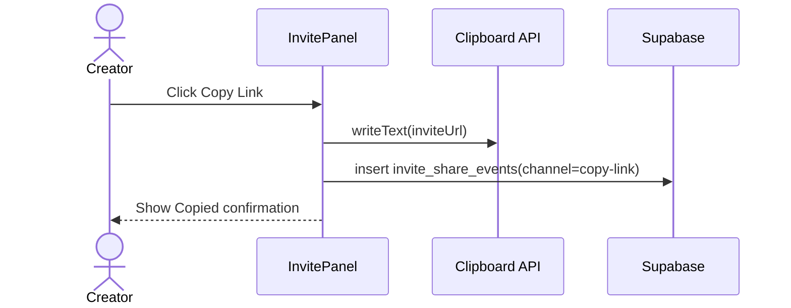
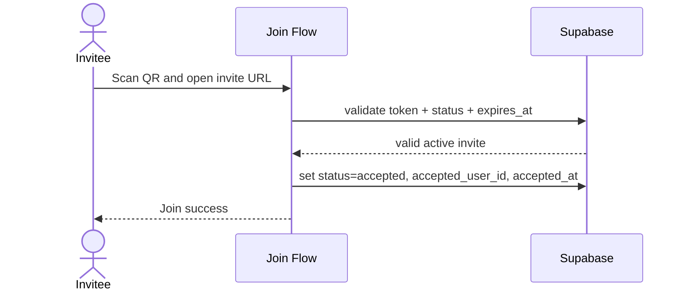
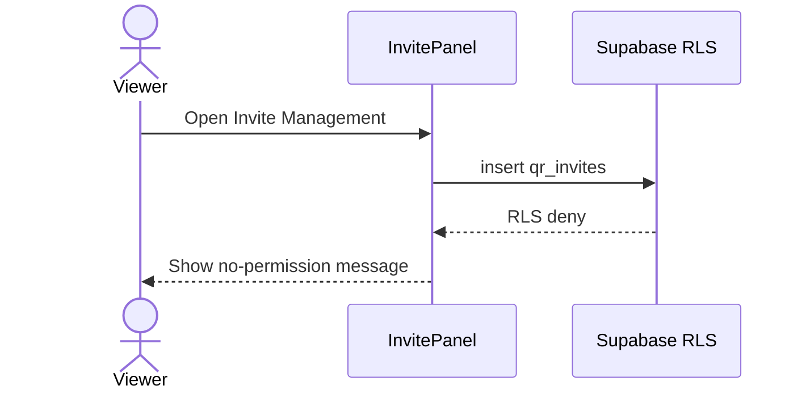

# QR Invite Flow - Use Cases and Interaction Scenarios

> Element spec: [element-specs/qr-invite-flow.md](../element-specs/qr-invite-flow.md)
> Related specs: [element-specs/settings-overlay.md](../element-specs/settings-overlay/settings-overlay.md), [element-specs/search-bar.md](../element-specs/search-bar/search-bar.md)

## Overview

These use cases define the invite creation and sharing workflow that starts from Settings or command-mode search (`/image`).

Focus areas:

- auto-generation of QR invite when Invite Management opens
- role preselection (`clerk` or `worker`) at invite creation time
- multi-channel sharing (`copy`, `email`, `whatsapp`)
- permission-safe behavior with RLS-backed enforcement

### High-Level Flow (Mermaid)

## UC-1: Open Invite Management and Auto-Generate QR

Context: A clerk opens Invite Management in settings and expects instant QR generation.

Expected:

- No extra click is needed to generate the first QR.
- Status starts as `active`.
- Expiration timestamp is visible.

## UC-2: Launch from Search Command `/image`

Context: User types `/image` and chooses `Create QR Invite`.

Expected:

- Command jumps directly into Invite Management.
- Same generation logic as settings entry is used.

## UC-3: Select Role Clerk Before Sharing

Context: Creator needs a clerk invite.

Expected:

- Role change regenerates invite payload.
- UI clearly shows the selected target role.

## UC-4: Select Role Worker Before Sharing

Context: Creator needs a worker invite.

Expected:

- Selecting `worker` generates a worker-scoped invite.
- Newly generated QR replaces the previous QR.
- Old token cannot be accepted anymore.

## UC-5: Share Invite via Copy Link

Context: Creator copies invite URL and sends manually.

Expected:

- Clipboard receives full invite URL.
- Share event is logged with `copy-link`.

## UC-6: Share Invite via Email

Context: Creator sends invite through email client.

Expected:

- Email share opens mail intent with invite URL.
- Share event is logged with `email`.
- Failure to open email app shows non-blocking fallback text.

## UC-7: Share Invite via WhatsApp

Context: Creator sends invite through WhatsApp.

Expected:

- WhatsApp deep link opens with invite URL payload.
- Share event is logged with `whatsapp`.
- If WhatsApp is unavailable, UI offers copy-link fallback.

## UC-8: Invitee Scans QR and Accepts

Context: Target user scans QR and completes registration/join.

Expected:

- Invite can be accepted exactly once.
- Accepted invite state is persisted.

## UC-9: Expired Invite Cannot Be Accepted

Context: Invitee scans a QR after expiry time.

Expected:

- Validation fails with `expired` state.
- No user role is assigned from expired invite.
- UI suggests requesting a new invite.

## UC-10: Permission Deny for Unauthorized Creator

Context: Viewer (or out-of-org actor) tries to create invite.

Expected:

- RLS blocks unauthorized insert.
- UI displays clear permission feedback.
- No orphan invite row is created.

## Acceptance Checklist for This Use-Case Set

- [ ] Covers both entry points: settings and `/image` command.
- [ ] Covers role preselection for `clerk` and `worker`.
- [ ] Covers three share channels and logging.
- [ ] Covers accept, expire, and revoke lifecycle outcomes.
- [ ] Covers RLS deny behavior for unauthorized creators.

