# Upload Manager — Use Cases & Interaction Scenarios

> **Element spec:** [element-specs/upload-manager.md](../element-specs/upload-manager/upload-manager.md)
> **Related specs:** [upload-panel](../element-specs/upload-panel.md), [upload-button-zone](../element-specs/upload-button-zone.md), [image-detail-view](../element-specs/media-detail/media-detail-view.md), [photo-marker](../element-specs/media-marker/media-marker.md)
> **Services:** `UploadManagerService`, `UploadService`, `GeocodingService`, `AddressResolverService`

---

## Overview

The Upload Manager is a singleton service that orchestrates the full image ingestion pipeline. These use cases cover every way uploads are triggered, how they survive navigation, and how failures are handled.

### Pipeline Summary

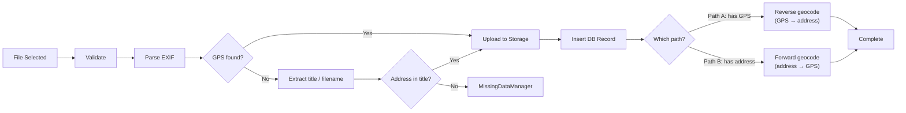
```mermaid
flowchart LR
  A["File Selected"] --> B["Validate"]
  B --> C["Parse EXIF"]
  C --> D{"GPS found?"}
  D -- Yes --> E["Upload to Storage"]
  D -- No --> F["Extract title / filename"]
  F --> G{"Address in title?"}
  G -- Yes --> E
  G -- No --> H["MissingDataManager"]
  E --> I["Insert DB Record"]
  I --> J{"Which path?"}
  J -- "Path A: has GPS" --> K["Reverse geocode\n(GPS → address)"]
  J -- "Path B: has address" --> L["Forward geocode\n(address → GPS)"]
  K --> M["Complete"]
  L --> M
```

---

## UM-1: Upload from Upload Panel (Happy Path)

**Context:** Technician on the map screen clicks "Upload from Computer", selects a geotagged JPEG. The photo has GPS EXIF data. Everything succeeds.

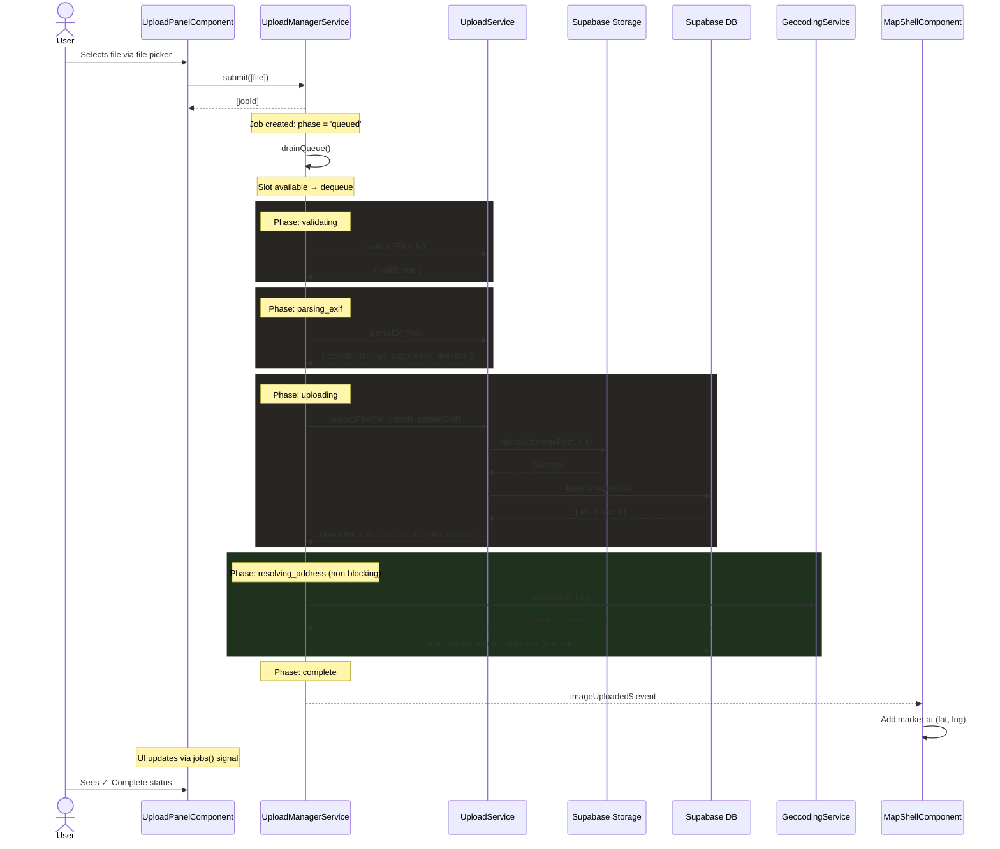
```mermaid
sequenceDiagram
  actor User
  participant Panel as UploadPanelComponent
  participant Manager as UploadManagerService
  participant Upload as UploadService
  participant Storage as Supabase Storage
  participant DB as Supabase DB
  participant Geocoding as GeocodingService
  participant MapShell as MapShellComponent

  User->>Panel: Selects file via file picker
  Panel->>Manager: submit([file])
  Manager-->>Panel: [jobId]
  Note over Manager: Job created: phase = 'queued'

  Manager->>Manager: drainQueue()
  Note over Manager: Slot available → dequeue

  rect rgb(40, 38, 35)
    Note over Manager: Phase: validating
    Manager->>Upload: validateFile(file)
    Upload-->>Manager: { valid: true }
  end

  rect rgb(40, 38, 35)
    Note over Manager: Phase: parsing_exif
    Manager->>Upload: parseExif(file)
    Upload-->>Manager: { coords: {lat, lng}, capturedAt, direction }
  end

  rect rgb(40, 38, 35)
    Note over Manager: Phase: uploading
    Manager->>Upload: uploadFile(file, coords, parsedExif)
    Upload->>Storage: upload(storagePath, file)
    Storage-->>Upload: Success
    Upload->>DB: insert images row
    DB-->>Upload: { id: imageId }
    Upload-->>Manager: UploadSuccess { id, storagePath, coords }
  end

  rect rgb(30, 50, 30)
    Note over Manager: Phase: resolving_address (non-blocking)
    Manager->>Geocoding: reverse(lat, lng)
    Geocoding-->>Manager: { city, street, country, … }
    Manager->>DB: bulk_update_image_addresses(imageId, …)
  end

  Note over Manager: Phase: complete
  Manager-->>MapShell: imageUploaded$ event
  MapShell->>MapShell: Add marker at (lat, lng)
  Note over Panel: UI updates via jobs() signal

  User->>Panel: Sees ✓ Complete status
```

**Expected state after:**

- Job phase = `complete`
- New marker visible on map
- Address fields populated in DB
- Job visible in panel until dismissed

---

## UM-2: Upload Continues After Navigation (Core Feature)

**Context:** User is in the Image Detail View, clicks "Upload related photo", selects a file, then immediately navigates back to the map. The upload must complete in the background.

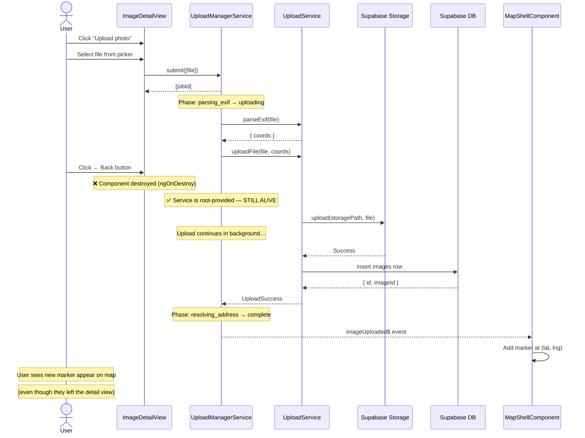
```mermaid
sequenceDiagram
  actor User
  participant DetailView as ImageDetailView
  participant Manager as UploadManagerService
  participant Upload as UploadService
  participant Storage as Supabase Storage
  participant DB as Supabase DB
  participant MapShell as MapShellComponent

  User->>DetailView: Click "Upload photo"
  User->>DetailView: Select file from picker
  DetailView->>Manager: submit([file])
  Manager-->>DetailView: [jobId]

  Note over Manager: Phase: parsing_exif → uploading
  Manager->>Upload: parseExif(file)
  Upload-->>Manager: { coords }
  Manager->>Upload: uploadFile(file, coords)

  User->>DetailView: Click ← Back button
  Note over DetailView: ❌ Component destroyed (ngOnDestroy)
  Note over Manager: ✅ Service is root-provided — STILL ALIVE

  Upload->>Storage: upload(storagePath, file)
  Note over Manager: Upload continues in background…
  Storage-->>Upload: Success

  Upload->>DB: insert images row
  DB-->>Upload: { id: imageId }
  Upload-->>Manager: UploadSuccess

  Note over Manager: Phase: resolving_address → complete
  Manager-->>MapShell: imageUploaded$ event
  MapShell->>MapShell: Add marker at (lat, lng)

  Note over User: User sees new marker appear on map
  Note over User: (even though they left the detail view)
```

**Key invariant:** The `UploadManagerService` is `providedIn: 'root'`. The Angular injector keeps it alive for the entire app session. Component destruction does not affect it.

---

## UM-3: No GPS — Address Extracted from Filename (Path B)

**Context:** User uploads a photo named `Burgstraße_7_facade.jpg` that has no GPS EXIF data. The manager extracts "Burgstraße 7" from the filename, uploads the file with the address, then forward-geocodes the address to get coordinates.

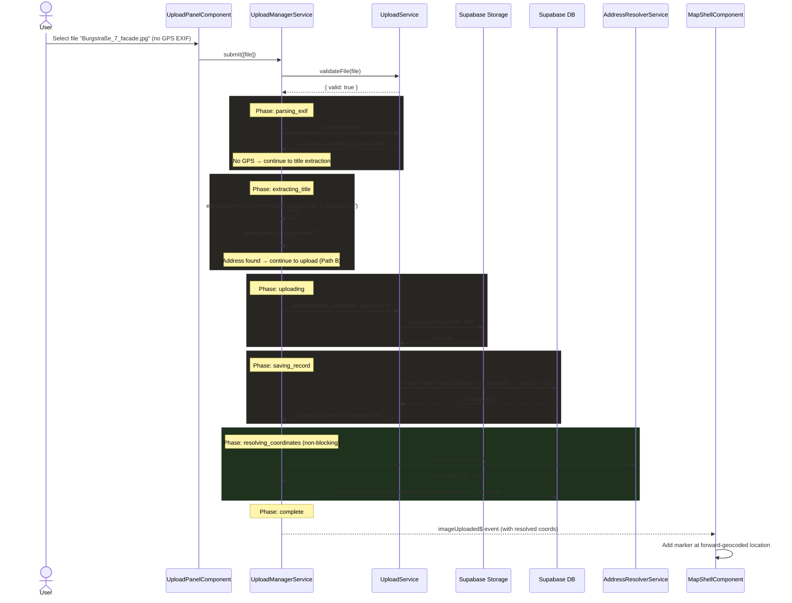
```mermaid
sequenceDiagram
  actor User
  participant Panel as UploadPanelComponent
  participant Manager as UploadManagerService
  participant Upload as UploadService
  participant Storage as Supabase Storage
  participant DB as Supabase DB
  participant Resolver as AddressResolverService
  participant MapShell as MapShellComponent

  User->>Panel: Select file "Burgstraße_7_facade.jpg" (no GPS EXIF)
  Panel->>Manager: submit([file])

  Manager->>Upload: validateFile(file)
  Upload-->>Manager: { valid: true }

  rect rgb(40, 38, 35)
    Note over Manager: Phase: parsing_exif
    Manager->>Upload: parseExif(file)
    Upload-->>Manager: { coords: undefined, capturedAt }
    Note over Manager: No GPS → continue to title extraction
  end

  rect rgb(40, 38, 35)
    Note over Manager: Phase: extracting_title
    Manager->>Manager: extractAddressFromFilename("Burgstraße_7_facade.jpg")
    Manager-->>Manager: titleAddress = "Burgstraße 7"
    Note over Manager: Address found → continue to upload (Path B)
  end

  rect rgb(40, 38, 35)
    Note over Manager: Phase: uploading
    Manager->>Upload: uploadFile(file, undefined, parsedExif)
    Upload->>Storage: upload(storagePath, file)
    Storage-->>Upload: Success
  end

  rect rgb(40, 38, 35)
    Note over Manager: Phase: saving_record
    Upload->>DB: insert images row (address = "Burgstraße 7", lat/lon = null)
    DB-->>Upload: { id: imageId }
    Upload-->>Manager: UploadSuccess { id, storagePath }
  end

  rect rgb(30, 50, 30)
    Note over Manager: Phase: resolving_coordinates (non-blocking)
    Manager->>Resolver: resolve("Burgstraße 7")
    Resolver-->>Manager: { lat: 48.208, lng: 16.372 }
    Manager->>DB: UPDATE images SET latitude, longitude WHERE id = imageId
  end

  Note over Manager: Phase: complete
  Manager-->>MapShell: imageUploaded$ event (with resolved coords)
  MapShell->>MapShell: Add marker at forward-geocoded location
```

**Expected state after:**

- Job phase = `complete`
- DB record has `address_label` = "Burgstraße 7" (from filename)
- DB record has `latitude` / `longitude` from forward geocoding
- `exif_latitude` / `exif_longitude` = null (no EXIF GPS)
- Marker appears on map at geocoded coordinates

---

## UM-3b: No GPS, No Address — Missing Data (Path C)

**Context:** User uploads `IMG_20260311_143022.jpg` — no GPS EXIF and the filename contains no recognizable address. The job is parked and handed to the MissingDataManager.

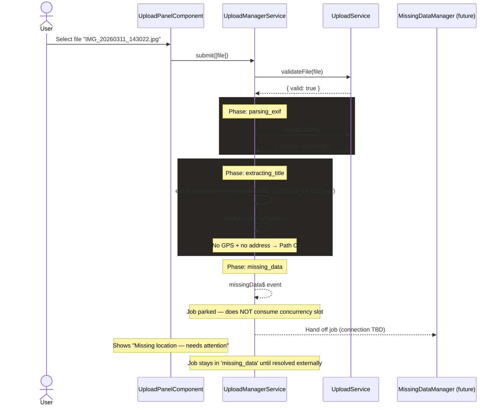
```mermaid
sequenceDiagram
  actor User
  participant Panel as UploadPanelComponent
  participant Manager as UploadManagerService
  participant Upload as UploadService
  participant MissingData as MissingDataManager (future)

  User->>Panel: Select file "IMG_20260311_143022.jpg"
  Panel->>Manager: submit([file])

  Manager->>Upload: validateFile(file)
  Upload-->>Manager: { valid: true }

  rect rgb(40, 38, 35)
    Note over Manager: Phase: parsing_exif
    Manager->>Upload: parseExif(file)
    Upload-->>Manager: { coords: undefined }
  end

  rect rgb(40, 38, 35)
    Note over Manager: Phase: extracting_title
    Manager->>Manager: extractAddressFromFilename("IMG_20260311_143022.jpg")
    Manager-->>Manager: titleAddress = undefined
    Note over Manager: No GPS + no address → Path C
  end

  Note over Manager: Phase: missing_data
  Manager-->>Manager: missingData$ event
  Note over Manager: Job parked — does NOT consume concurrency slot
  Manager-->>MissingData: Hand off job (connection TBD)

  Note over Panel: Shows "Missing location — needs attention"
  Note over Manager: Job stays in 'missing_data' until resolved externally
```

**Expected state after:**

- Job phase = `missing_data`
- File is NOT uploaded yet (no storage or DB write)
- MissingDataManager (future) will handle resolution (manual coords, manual address, etc.)
- Job does not block other uploads

---

## UM-4: Multiple Concurrent Uploads with Queuing

**Context:** User drag-and-drops 7 photos onto the upload panel. Only 3 upload simultaneously; the rest wait in queue.

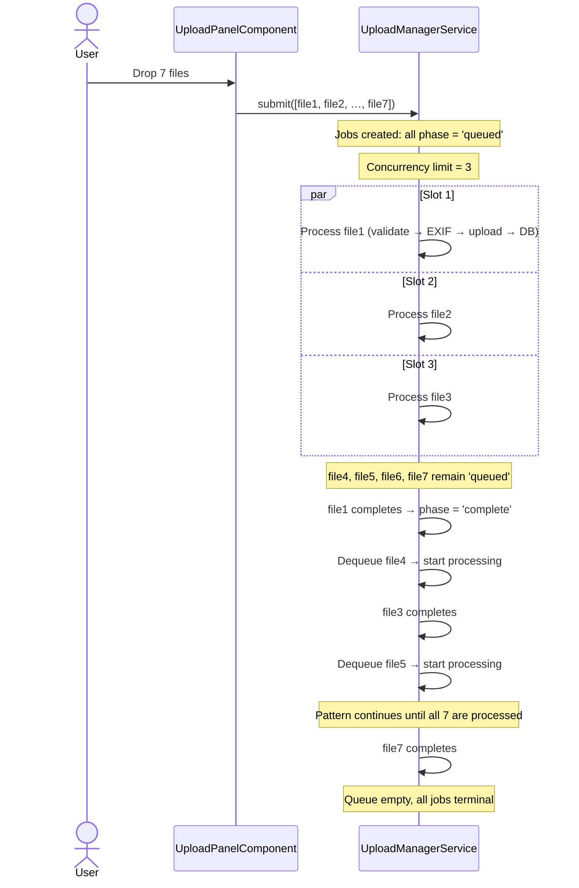
```mermaid
sequenceDiagram
  actor User
  participant Panel as UploadPanelComponent
  participant Manager as UploadManagerService

  User->>Panel: Drop 7 files
  Panel->>Manager: submit([file1, file2, …, file7])

  Note over Manager: Jobs created: all phase = 'queued'
  Note over Manager: Concurrency limit = 3

  par Slot 1
    Manager->>Manager: Process file1 (validate → EXIF → upload → DB)
  and Slot 2
    Manager->>Manager: Process file2
  and Slot 3
    Manager->>Manager: Process file3
  end

  Note over Manager: file4, file5, file6, file7 remain 'queued'

  Manager->>Manager: file1 completes → phase = 'complete'
  Manager->>Manager: Dequeue file4 → start processing

  Manager->>Manager: file3 completes
  Manager->>Manager: Dequeue file5 → start processing

  Note over Manager: Pattern continues until all 7 are processed

  Manager->>Manager: file7 completes
  Note over Manager: Queue empty, all jobs terminal
```

### Queue State Over Time

```mermaid
gantt
  title Upload Queue Timeline (7 files, 3 concurrent)
  dateFormat X
  axisFormat %s

  section Slot 1
  file1 :active, f1, 0, 3
  file4 :active, f4, 3, 6
  file7 :active, f7, 6, 9

  section Slot 2
  file2 :active, f2, 0, 4
  file5 :active, f5, 4, 7

  section Slot 3
  file3 :active, f3, 0, 3
  file6 :active, f6, 3, 7
```

---

## UM-5: Upload Failure — Storage Error + Retry

**Context:** Network hiccup causes the Supabase Storage upload to fail. User retries after reconnecting.

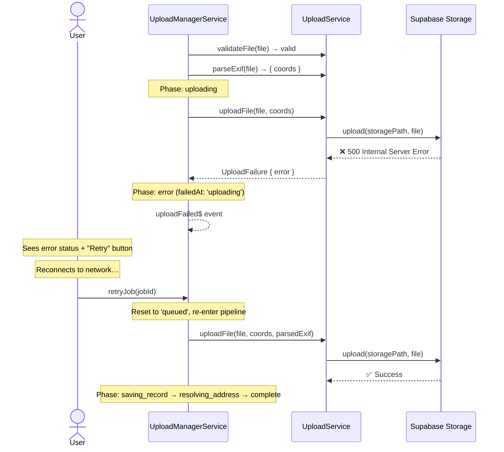
```mermaid
sequenceDiagram
  actor User
  participant Manager as UploadManagerService
  participant Upload as UploadService
  participant Storage as Supabase Storage

  Manager->>Upload: validateFile(file) → valid
  Manager->>Upload: parseExif(file) → { coords }

  Note over Manager: Phase: uploading
  Manager->>Upload: uploadFile(file, coords)
  Upload->>Storage: upload(storagePath, file)
  Storage-->>Upload: ❌ 500 Internal Server Error

  Upload-->>Manager: UploadFailure { error }

  Note over Manager: Phase: error (failedAt: 'uploading')
  Manager-->>Manager: uploadFailed$ event

  Note over User: Sees error status + "Retry" button
  Note over User: Reconnects to network…

  User->>Manager: retryJob(jobId)
  Note over Manager: Reset to 'queued', re-enter pipeline

  Manager->>Upload: uploadFile(file, coords, parsedExif)
  Upload->>Storage: upload(storagePath, file)
  Storage-->>Upload: ✅ Success

  Note over Manager: Phase: saving_record → resolving_address → complete
```

---

## UM-6: Upload Failure — DB Insert + Orphan Cleanup

**Context:** Storage upload succeeds but the DB insert fails. The manager cleans up the orphaned file in storage.

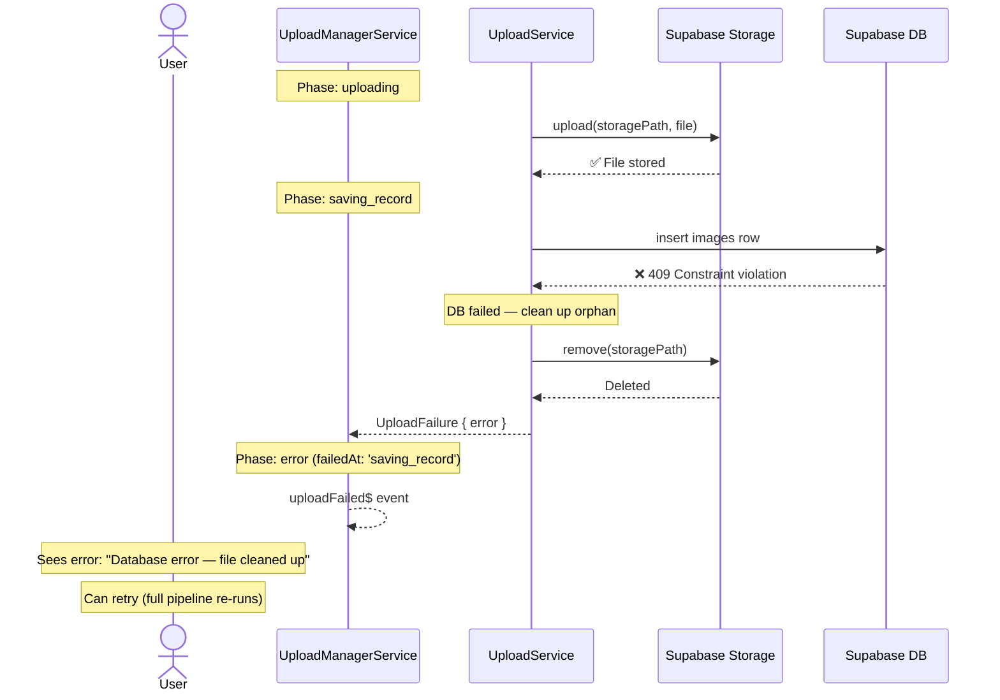
```mermaid
sequenceDiagram
  actor User
  participant Manager as UploadManagerService
  participant Upload as UploadService
  participant Storage as Supabase Storage
  participant DB as Supabase DB

  Note over Manager: Phase: uploading
  Upload->>Storage: upload(storagePath, file)
  Storage-->>Upload: ✅ File stored

  Note over Manager: Phase: saving_record
  Upload->>DB: insert images row
  DB-->>Upload: ❌ 409 Constraint violation

  Note over Upload: DB failed — clean up orphan
  Upload->>Storage: remove(storagePath)
  Storage-->>Upload: Deleted

  Upload-->>Manager: UploadFailure { error }
  Note over Manager: Phase: error (failedAt: 'saving_record')
  Manager-->>Manager: uploadFailed$ event

  Note over User: Sees error: "Database error — file cleaned up"
  Note over User: Can retry (full pipeline re-runs)
```

---

## UM-7: Address Resolution — Silent Failure (Path A)

**Context:** Photo uploaded successfully with GPS. Nominatim reverse geocoding fails (rate limit, timeout, etc.). The record is already saved — address stays null.

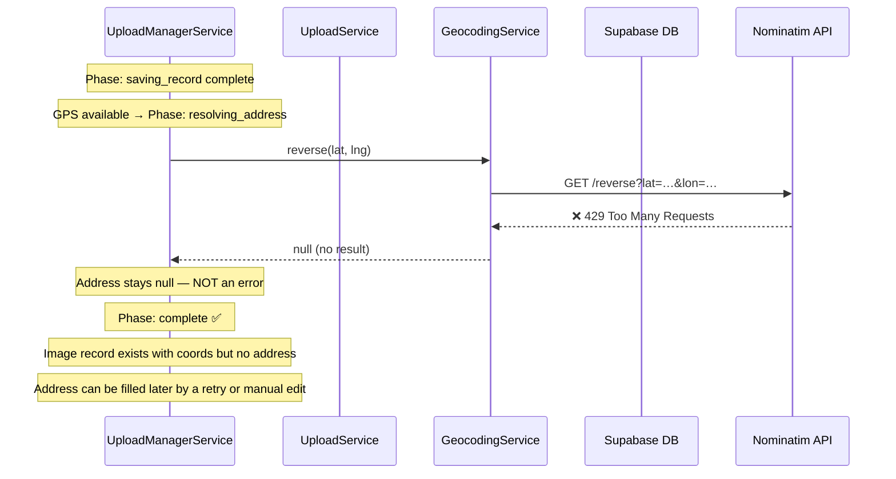
```mermaid
sequenceDiagram
  participant Manager as UploadManagerService
  participant Upload as UploadService
  participant Geocoding as GeocodingService
  participant DB as Supabase DB
  participant Nominatim as Nominatim API

  Note over Manager: Phase: saving_record complete
  Note over Manager: GPS available → Phase: resolving_address

  Manager->>Geocoding: reverse(lat, lng)
  Geocoding->>Nominatim: GET /reverse?lat=…&lon=…
  Nominatim-->>Geocoding: ❌ 429 Too Many Requests

  Geocoding-->>Manager: null (no result)
  Note over Manager: Address stays null — NOT an error

  Note over Manager: Phase: complete ✅
  Note over Manager: Image record exists with coords but no address
  Note over Manager: Address can be filled later by a retry or manual edit
```

---

## UM-7b: Coordinate Resolution — Silent Failure (Path B)

**Context:** Photo uploaded with address from filename but no GPS. Forward geocoding fails. The record is already saved — coordinates stay null, but the address is preserved.

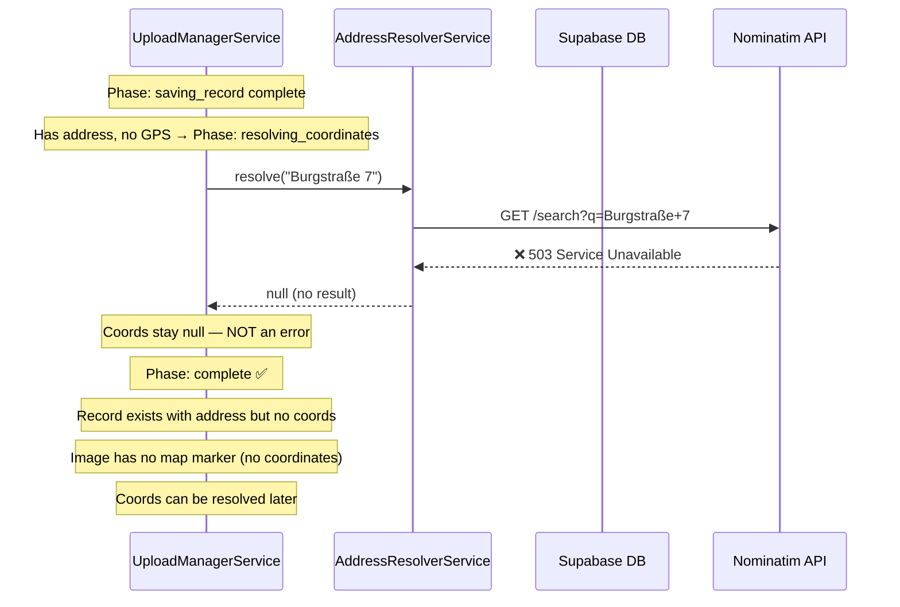
```mermaid
sequenceDiagram
  participant Manager as UploadManagerService
  participant Resolver as AddressResolverService
  participant DB as Supabase DB
  participant Nominatim as Nominatim API

  Note over Manager: Phase: saving_record complete
  Note over Manager: Has address, no GPS → Phase: resolving_coordinates

  Manager->>Resolver: resolve("Burgstraße 7")
  Resolver->>Nominatim: GET /search?q=Burgstraße+7
  Nominatim-->>Resolver: ❌ 503 Service Unavailable

  Resolver-->>Manager: null (no result)
  Note over Manager: Coords stay null — NOT an error

  Note over Manager: Phase: complete ✅
  Note over Manager: Record exists with address but no coords
  Note over Manager: Image has no map marker (no coordinates)
  Note over Manager: Coords can be resolved later
```

**Expected state after:**

- Job phase = `complete`
- DB record has `address_label` = "Burgstraße 7"
- DB record has `latitude` / `longitude` = null
- No map marker (no coords to place it)
- Not an error — the record is valid, just incomplete

---

## UM-8: Page Reload During Upload

**Context:** User refreshes the browser while an upload is in progress. All in-flight work is lost.

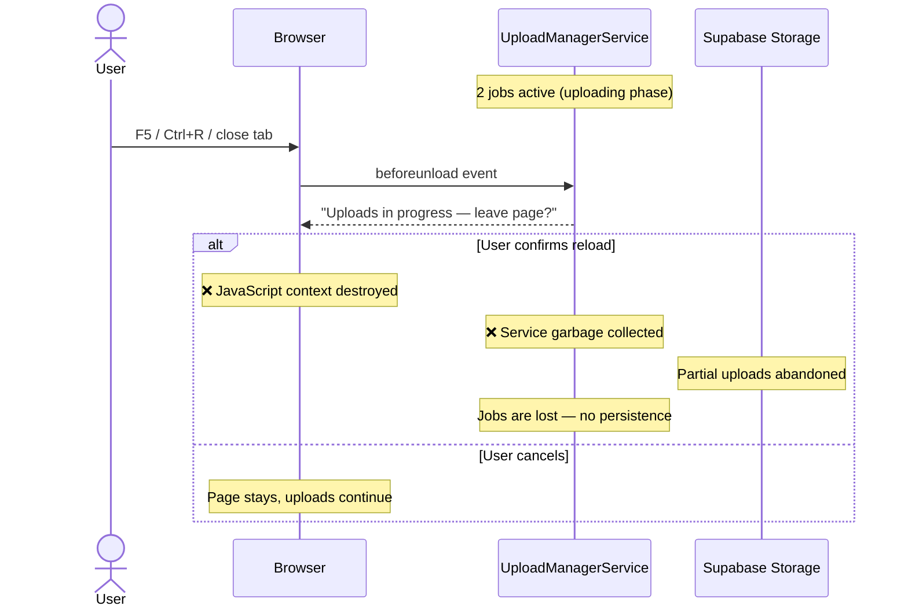
```mermaid
sequenceDiagram
  actor User
  participant Browser
  participant Manager as UploadManagerService
  participant Storage as Supabase Storage

  Note over Manager: 2 jobs active (uploading phase)

  User->>Browser: F5 / Ctrl+R / close tab
  Browser->>Manager: beforeunload event
  Manager-->>Browser: "Uploads in progress — leave page?"

  alt User confirms reload
    Note over Browser: ❌ JavaScript context destroyed
    Note over Manager: ❌ Service garbage collected
    Note over Storage: Partial uploads abandoned
    Note over Manager: Jobs are lost — no persistence
  else User cancels
    Note over Browser: Page stays, uploads continue
  end
```

**Design decision:** Upload state is NOT persisted to localStorage or IndexedDB. Rationale:

- Partial uploads in Supabase Storage cannot be resumed (no resumable upload API)
- The File object is not serializable
- Simplicity: restarting uploads is cheap; partial-resume logic is complex and fragile

---

## UM-9: Logout During Active Uploads

**Context:** User logs out while uploads are running. The manager cancels everything — upload data belongs to the authenticated user.

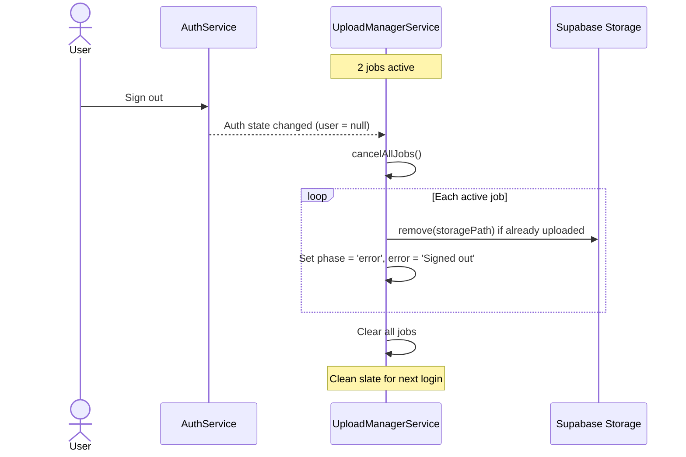
```mermaid
sequenceDiagram
  actor User
  participant Auth as AuthService
  participant Manager as UploadManagerService
  participant Storage as Supabase Storage

  Note over Manager: 2 jobs active

  User->>Auth: Sign out
  Auth-->>Manager: Auth state changed (user = null)

  Manager->>Manager: cancelAllJobs()

  loop Each active job
    Manager->>Storage: remove(storagePath) if already uploaded
    Manager->>Manager: Set phase = 'error', error = 'Signed out'
  end

  Manager->>Manager: Clear all jobs
  Note over Manager: Clean slate for next login
```

---

## UM-10: Global Progress Indicator

**Context:** User submits an upload from the upload panel, then navigates to a different page. A persistent progress indicator remains visible.

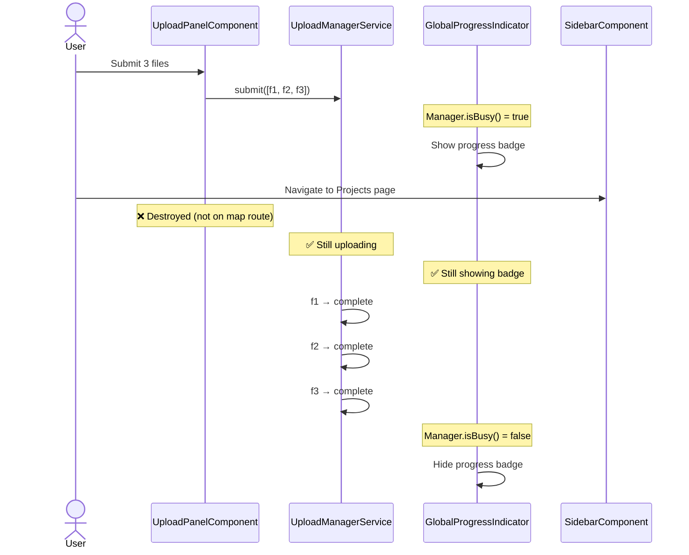
```mermaid
sequenceDiagram
  actor User
  participant Panel as UploadPanelComponent
  participant Manager as UploadManagerService
  participant Indicator as GlobalProgressIndicator
  participant Sidebar as SidebarComponent

  User->>Panel: Submit 3 files
  Panel->>Manager: submit([f1, f2, f3])

  Note over Indicator: Manager.isBusy() = true
  Indicator->>Indicator: Show progress badge

  User->>Sidebar: Navigate to Projects page
  Note over Panel: ❌ Destroyed (not on map route)
  Note over Manager: ✅ Still uploading
  Note over Indicator: ✅ Still showing badge

  Manager->>Manager: f1 → complete
  Manager->>Manager: f2 → complete
  Manager->>Manager: f3 → complete

  Note over Indicator: Manager.isBusy() = false
  Indicator->>Indicator: Hide progress badge
```

### Global Indicator States

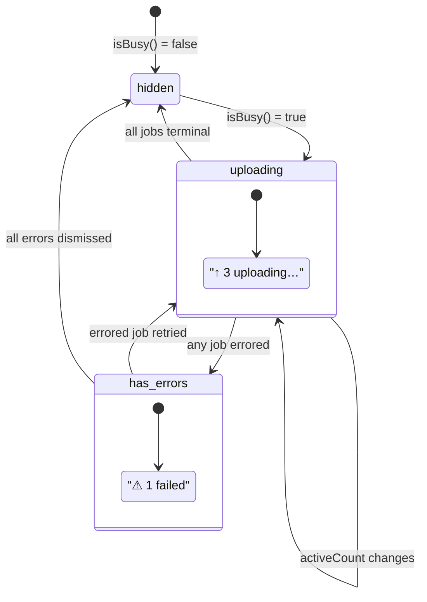
```mermaid
stateDiagram-v2
  [*] --> hidden : isBusy() = false

  hidden --> uploading : isBusy() = true
  uploading --> uploading : activeCount changes
  uploading --> has_errors : any job errored
  uploading --> hidden : all jobs terminal

  has_errors --> uploading : errored job retried
  has_errors --> hidden : all errors dismissed

  state uploading {
    [*] --> showing_count
    showing_count : "↑ 3 uploading…"
  }

  state has_errors {
    [*] --> showing_error_count
    showing_error_count : "⚠ 1 failed"
  }
```

---

## UM-11: Upload from Multiple Entry Points Simultaneously

**Context:** User has the upload panel open and submits 2 files. While those are uploading, they open an image detail view and submit another file from there. All three are managed by the same queue.

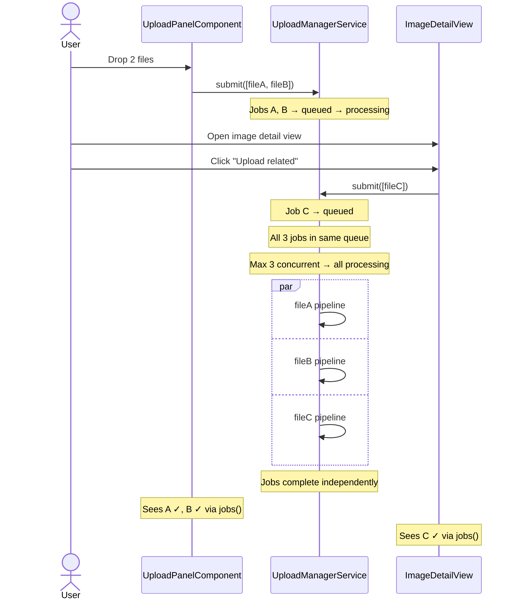
```mermaid
sequenceDiagram
  actor User
  participant Panel as UploadPanelComponent
  participant Manager as UploadManagerService
  participant Detail as ImageDetailView

  User->>Panel: Drop 2 files
  Panel->>Manager: submit([fileA, fileB])
  Note over Manager: Jobs A, B → queued → processing

  User->>Detail: Open image detail view
  User->>Detail: Click "Upload related"
  Detail->>Manager: submit([fileC])
  Note over Manager: Job C → queued

  Note over Manager: All 3 jobs in same queue
  Note over Manager: Max 3 concurrent → all processing

  par
    Manager->>Manager: fileA pipeline
  and
    Manager->>Manager: fileB pipeline
  and
    Manager->>Manager: fileC pipeline
  end

  Note over Manager: Jobs complete independently
  Note over Panel: Sees A ✓, B ✓ via jobs()
  Note over Detail: Sees C ✓ via jobs()
```

---

## UM-12: `beforeunload` Warning

**Context:** Browser `beforeunload` event fires when there are active uploads. The manager prevents accidental data loss.

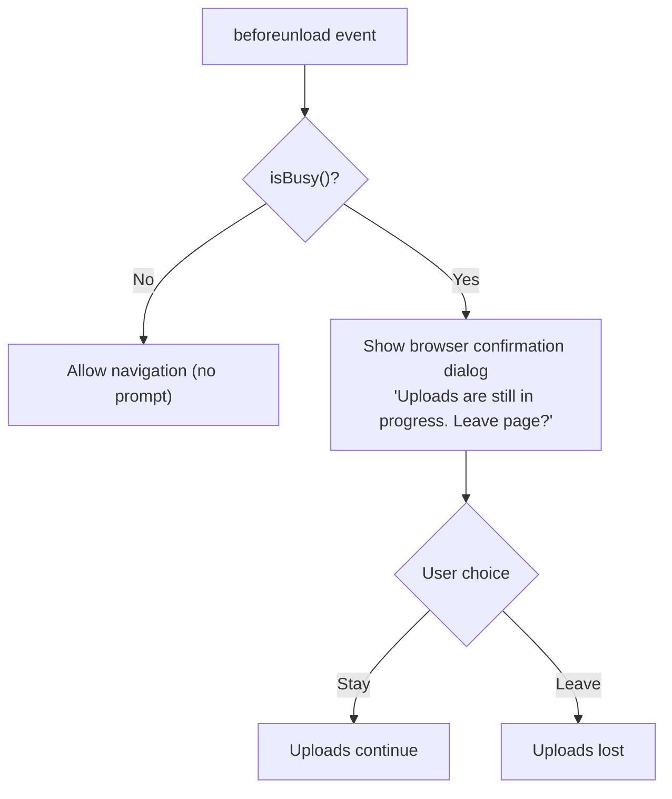
```mermaid
flowchart TD
  A["beforeunload event"] --> B{"isBusy()?"}
  B -- No --> C["Allow navigation (no prompt)"]
  B -- Yes --> D["Show browser confirmation dialog<br/>'Uploads are still in progress. Leave page?'"]
  D --> E{"User choice"}
  E -- Stay --> F["Uploads continue"]
  E -- Leave --> G["Uploads lost"]
```

---

## Cross-Cutting Concerns

### Phase-to-Status-Label Mapping

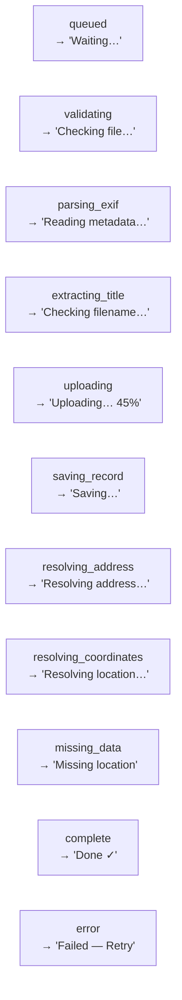
```mermaid
flowchart LR
  queued["queued<br/>→ 'Waiting…'"]
  validating["validating<br/>→ 'Checking file…'"]
  parsing["parsing_exif<br/>→ 'Reading metadata…'"]
  extracting["extracting_title<br/>→ 'Checking filename…'"]
  uploading["uploading<br/>→ 'Uploading… 45%'"]
  saving["saving_record<br/>→ 'Saving…'"]
  resolving_addr["resolving_address<br/>→ 'Resolving address…'"]
  resolving_coords["resolving_coordinates<br/>→ 'Resolving location…'"]
  missing["missing_data<br/>→ 'Missing location'"]
  complete["complete<br/>→ 'Done ✓'"]
  error["error<br/>→ 'Failed — Retry'"]
```

### Error Classification

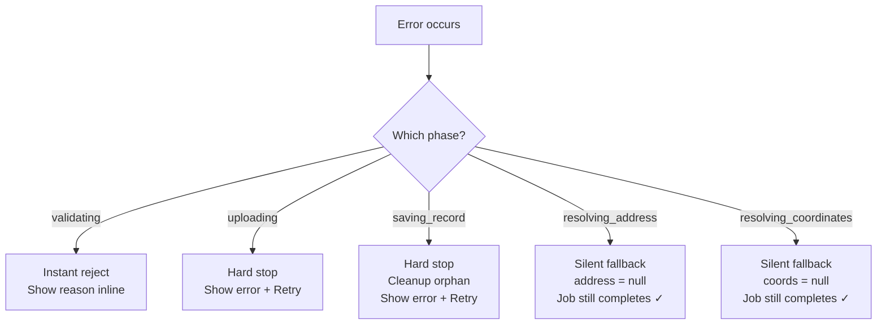
```mermaid
flowchart TD
  E["Error occurs"] --> F{"Which phase?"}
  F -- "validating" --> G["Instant reject<br/>Show reason inline"]
  F -- "uploading" --> H["Hard stop<br/>Show error + Retry"]
  F -- "saving_record" --> I["Hard stop<br/>Cleanup orphan<br/>Show error + Retry"]
  F -- "resolving_address" --> J["Silent fallback<br/>address = null<br/>Job still completes ✓"]
  F -- "resolving_coordinates" --> K["Silent fallback<br/>coords = null<br/>Job still completes ✓"]
```
