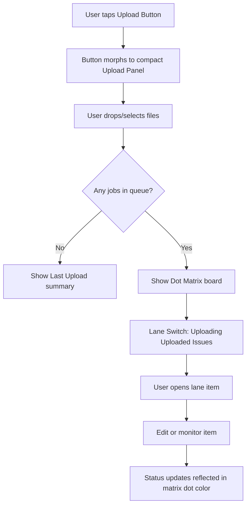
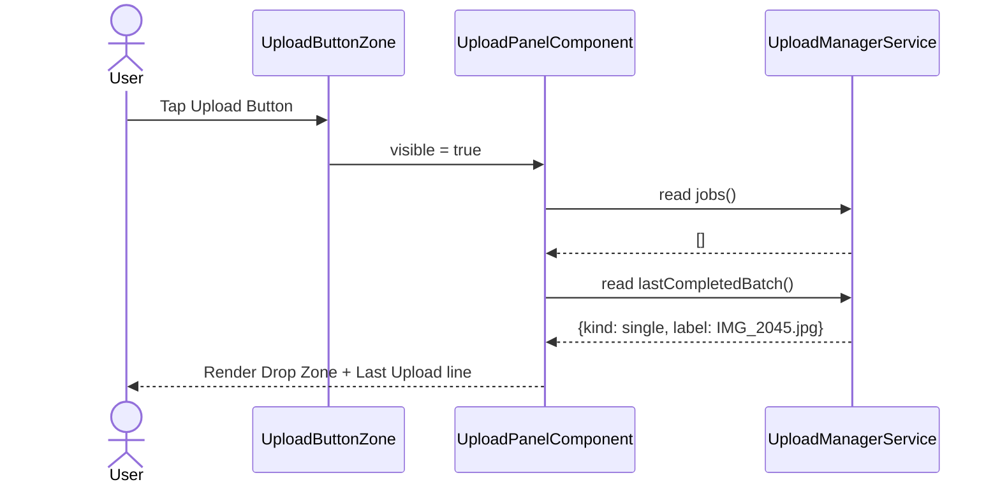
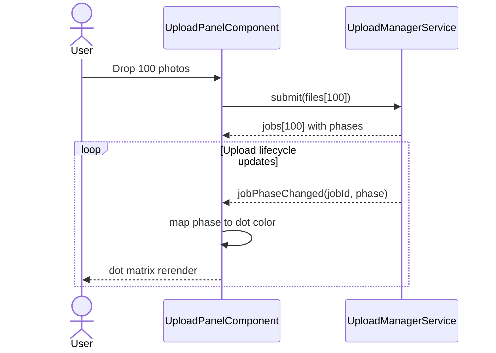
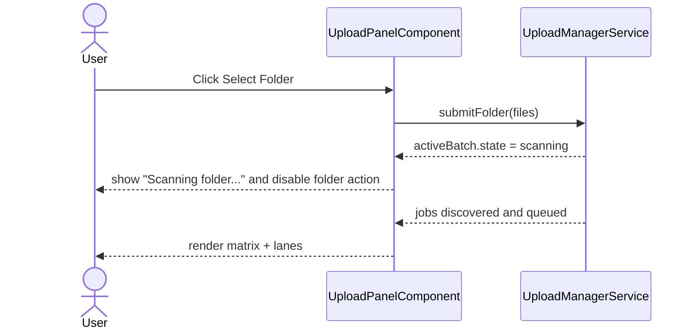
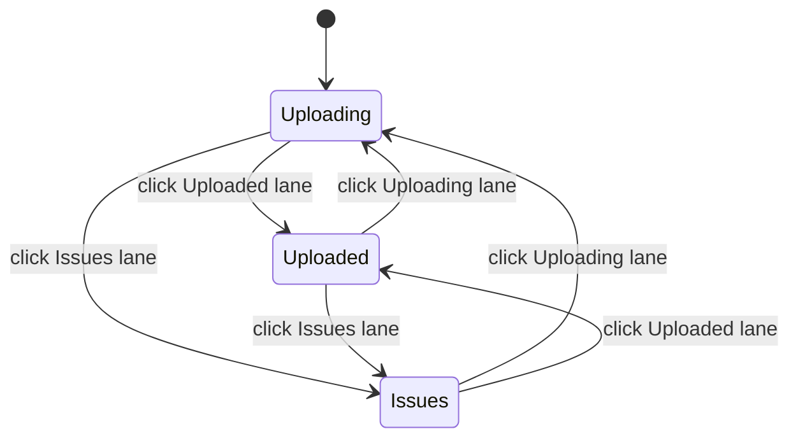
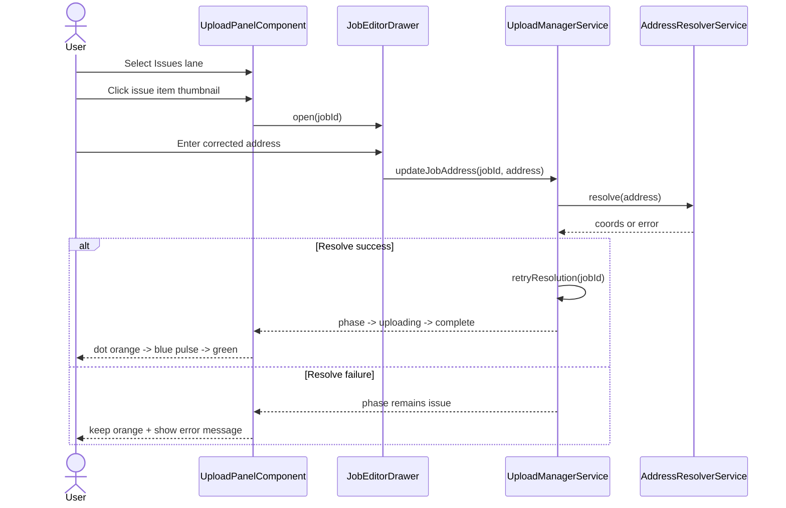
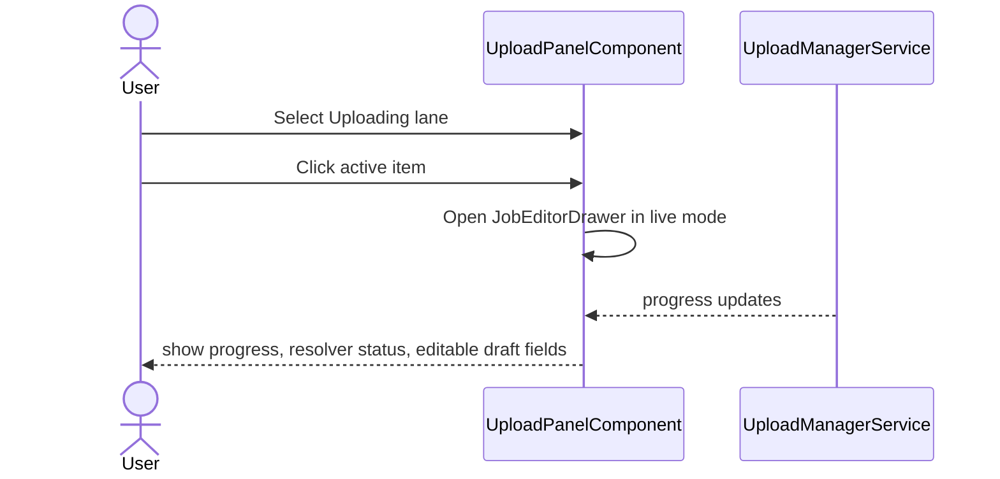
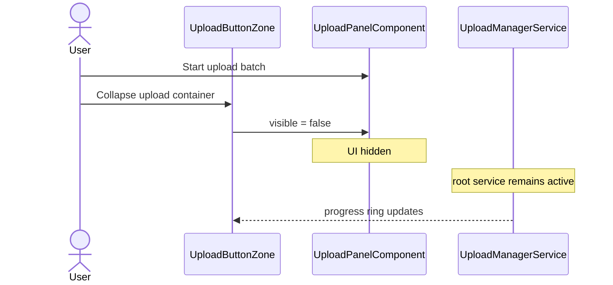
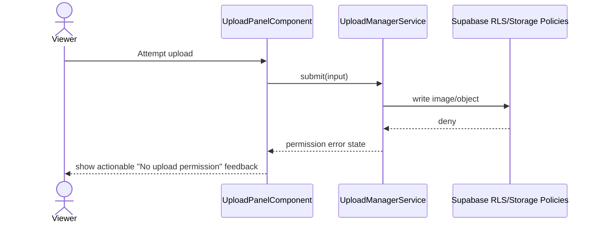

# Upload Panel — Use Cases and Interaction Scenarios

> Element spec: [element-specs/component/upload-panel.md](../element-specs/component/upload-panel.md)
> Related specs: [upload-button-zone](../element-specs/component/upload-button-zone.md), [upload-manager](../element-specs/upload-manager/upload-manager.md)

## Overview

These use cases define the compact upload container behavior opened from the map Upload Button. They focus on:

- Drop Zone-first upload interaction
- Last Upload fallback when nothing is queued
- Dot matrix progress board for per-photo status
- Lane-based triage (`Uploading`, `Uploaded`, `Issues`)
- Correction workflow for problematic uploads

### High-Level Flow (Mermaid)

## UP-1: Open Panel and Show Last Upload (No Active Queue)

Context: User has no current uploads. They tap upload on map and expect a compact panel with previous result context.

Expected:

- Panel opens as compact container, not a separate large dialog.
- Drop Zone is shown at the top.
- Last Upload row appears below Drop Zone.
- For single-file last upload, row shows the actual filename.

## UP-2: Batch Upload Dot Matrix (100 Photos)

Context: User uploads a large batch. They need a dense visual overview that shows per-photo progress state.

Dot color mapping:

- `queued/parsing/hashing`: gray (`--color-bg-muted`)
- `uploading`: blue and pulsing (`--color-primary`)
- `complete`: green (`--color-success`)
- `error/missing_data`: orange (`--color-warning`)

Expected:

- Matrix appears under Drop Zone as soon as queue exists.
- Matrix supports at least 10 by 10 layout for first 100 dots.
- Uploading dots pulse while in-flight.
- Color transitions happen per dot without layout shuffle.

## UP-2b: Folder Intake with Scan Feedback

Context: User selects a folder to enqueue many images at once and needs clear scanning feedback.

Expected:

- Folder action appears only when support is available.
- Scanning feedback is visible while folder parsing is in progress.
- Discovered files are pushed into the same queue lifecycle as dropped/picked files.

## UP-3: Lane Switch Triage (Uploading, Uploaded, Issues)

Context: User needs to inspect different subsets without scanning the whole matrix manually.

Expected:

- Segmented switch has exactly three lanes: `Uploading`, `Uploaded`, `Issues`.
- Lane selection filters the item gallery/list below the switch.
- Each lane shows only matching jobs.

## UP-4: Fixing an Issue Item (Address/GPS Resolution Problem)

Context: A photo failed due to address resolution or missing location metadata. User opens the issue and fixes it.

Expected:

- Issue item opens an editor/drawer.
- User can adjust address and retry.
- Success updates both item lane and matrix color.
- Failure keeps the item in `Issues` with feedback.

## UP-5: Open Uploading Item While In Flight

Context: User clicks an active upload to inspect status and optionally update editable metadata draft.

Expected:

- Uploading item opens live details without canceling upload.
- Progress values continue updating while drawer is open.
- If job transitions to complete, lane membership updates automatically.

## UP-6: Close Panel While Upload Continues

Context: User starts uploads and collapses panel to continue map work.

Expected:

- Closing panel does not cancel in-flight jobs.
- Upload button still reflects aggregate progress.
- Reopening panel restores current matrix and lane state from service data.

## UP-7: Role Security Enforcement (Viewer Deny)

Context: Viewer role attempts upload action from drop zone, picker, folder, or capture path.

Expected:

- Viewer writes are denied by backend policies in every intake mode.
- UI reports permission failure clearly without exposing sensitive internals.
- No partial image row/object is left behind after deny.

## Acceptance Checklist for This Use-Case Set

- [ ] Covers idle state with last-upload fallback
- [ ] Covers single-file and batch behavior
- [ ] Covers per-dot status semantics and pulse behavior
- [ ] Covers 3-lane triage interaction
- [ ] Covers issue correction loop
- [ ] Covers background continuation after panel close
- [ ] Covers folder-scan intake behavior
- [ ] Covers camera/capture path
- [ ] Covers viewer deny security behavior
